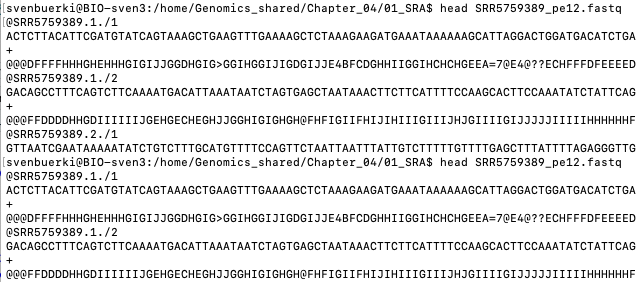

```{js logo-js, echo=FALSE}
$(document).ready(function() {
  $('#header').parent().prepend('<div id=\"logo\"></div>');
  $('#header').css('margin-right', '120px')
});
```

```{r packages, echo=FALSE, warning=FALSE, include=FALSE}
library(knitr)
library(rmarkdown)
library(bookdown)
#library(distill)
library(knitcitations)
library(formatR)
library(devtools)
library(kfigr)
library(dplyr)
library(kableExtra)
library(tufte)

#Generate BibTex citation file for all R packages used to produce report
knitr::write_bib(.packages(), file = 'packages.bib')
```

# How many reads are in a `fastq` file?

The number of reads in `fastq` files are often provided in the scientific literature and used to e.g. estimate genome coverage pre- and post- data cleaning. The instructor is tasking each group to develop a pseudo-code aiming at counting the number of reads in any `fastq` files. 

We will then discuss your ideas and solutions and implement those into either an `R` or `sh` script, which will be applied to your own data analyzed in [Chapter 4](Chapters.html). 

To help you design your pseudo-code, a screenshot of the `SRR5759389_pe12.fastq` (= file used in Chapter 4) `fastq` file is available in Figure \@ref(fig:fastq). This information was obtained by using the `head` command applied to  `SRR5759389_pe12.fastq` (see Figure \@ref(fig:fastq)).


```{r fastq, echo=FALSE, fig.align="center", fig.cap="Screenshot of SRR5759389_pe12.fastq showing the formatting of reads.", fig.show="asis", out.width = '80%'}

```

```{bash eval=F, echo=F}
#N lines in file
nlines=$(wc -l SRR5759389_pe12.fastq | awk '{ print $1 }')
#N reads in file
expr $nlines / 4

#N bp sequenced
expr $nlines / 4 \* 90
```

