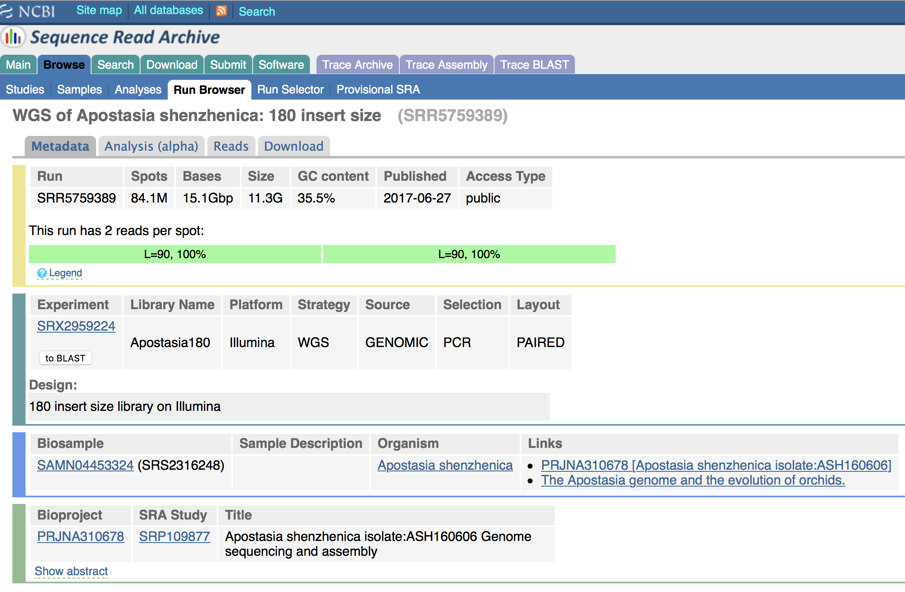
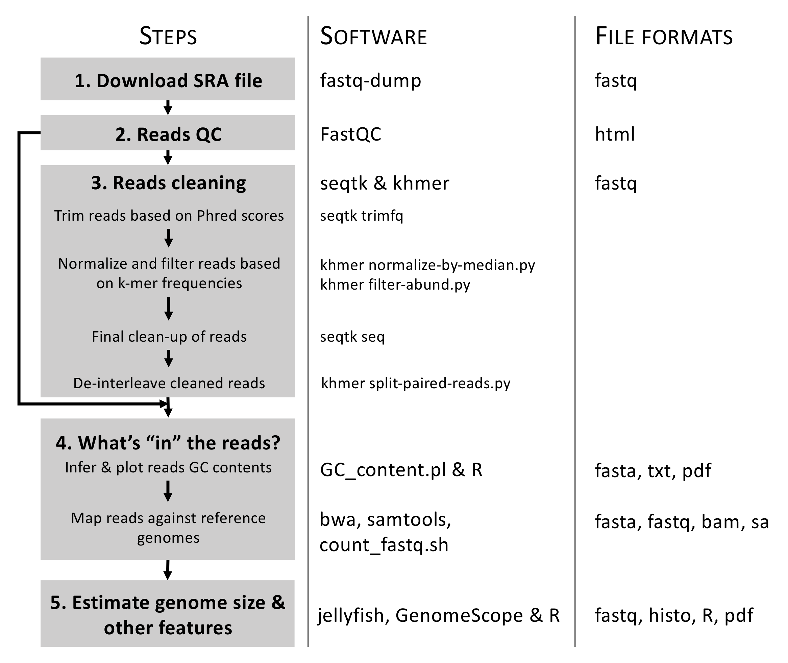
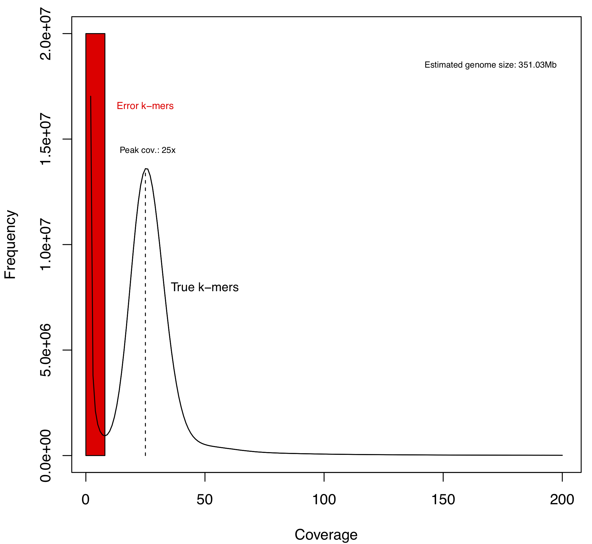
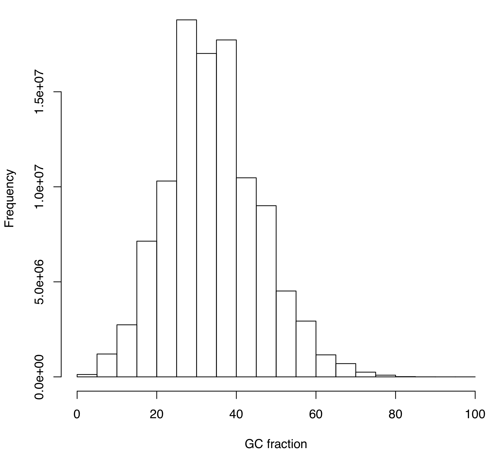
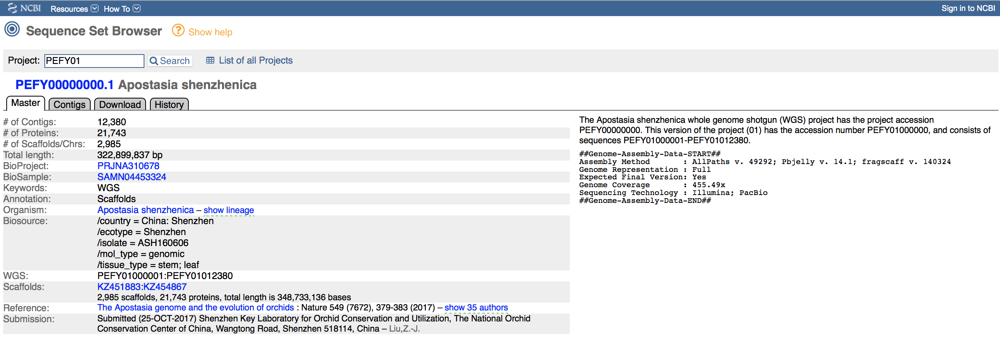
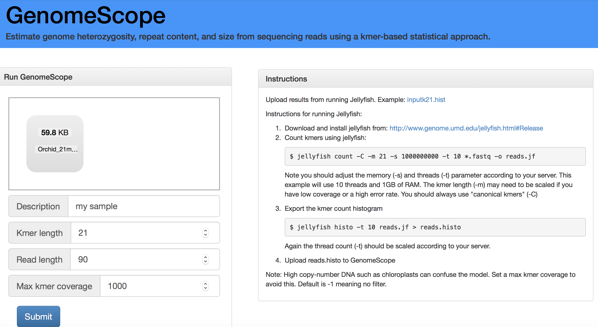
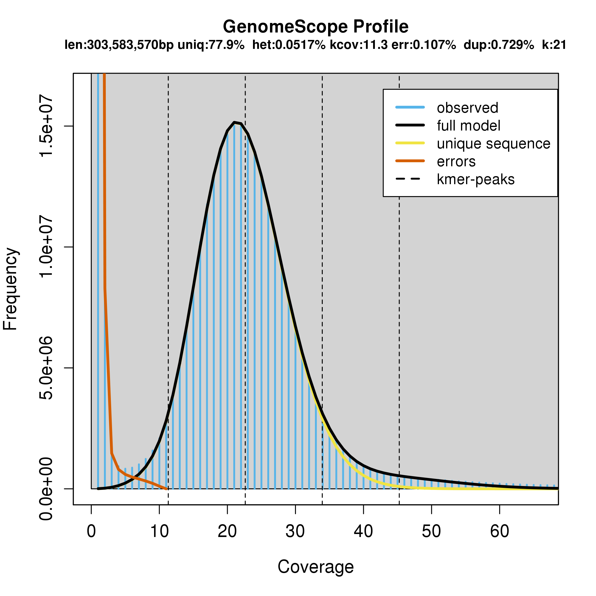

```{js logo-js, echo=FALSE}
$(document).ready(function() {
  $('#header').parent().prepend('<div id=\"logo\"></div>');
  $('#header').css('margin-right', '120px')
});
```

# Introduction

This webpage contains information related to the chapters covered in the Genomics & Bioinformatics course at BSU. The instructor will provide links to download the presentations as well as tutorials to complete in-class exercises (see e.g. [Chapter 4](#Chap4)).

# Syllabus

The presentation slides (in `pdf` format) of the Syllabus can be downloaded <a href="Lectures/Chapter_00_Syllabus_Spring2022.pdf" target="_blank">here</a>.

# Chapter 1

This chapter provides the theoretical background information (incl. definitions; see [Lexicon](Lexicon.html)) necessary to support material taught in this course. We will review information on DNA and RNA that are important for genomic projects, especially to support genome sequencing, assembly and annotation.

## Learning outcomes

The key learning outcomes of this chapter are:

-   Understand the differences between "Genetics" and "Genomics".
-   Know the basic dogma that DNA is transcribed to RNA, which is translated to protein. This will be especially important for the [Lab. report](Mining_draft_genome.html).
-   Appreciate the diversity of genome organization in organelles, prokaryotes and eukaryotes.
-   Appreciate that organelle genomes have forged eukaryotic chromosomes and that this has to be accounted for in designing genome assembly projects.
-   Appreciate that eukaryotic genomes contain extensive repetitive regions of several different kinds.
-   Appreciate the diversity of published genomes and their differences in the level of completeness.
-   Understand the importance of computer science and bioinformatics in producing the raw sequence data and assembly genomes.
-   Understand the challenges in sequencing a genome.

## Download presentation

The presentation slides (in `pdf` format) of Chapter 1 can be downloaded <a href="Lectures/Chapter_01_Spring2022.pdf" target="_blank">here</a>.

# Chapter 2

This chapter focuses on learning about next-generation sequencing and students will have to produce individual mini-reports on a sequencing technology (see [below](#minrep1)).

## Learning outcomes

-   Learn the next-generation sequencing (NGS) jargon underpinning genome assembly and annotation.
-   Understand the general principle of genome sequencing (wet-lab) and assembly (bioinformatics workflow).
-   Be familiar and know the limitations of the following NGS platforms:
    -   Illumina.
    -   PacBio.
    -   Oxford Nanopore.
-   Be accustomed to handle NGS data output, especially FASTA and FASTQ files.
-   Learn protocols to quantify the quality of the nucleobases generated by NGS platforms using Phred quality score.

## Resources

- **An Overview of Next-Generation Sequencing**: This [webpage](https://www.technologynetworks.com/genomics/articles/an-overview-of-next-generation-sequencing-346532) contains information related to next-generation sequencing. 

## Download presentation

The presentation slides (in `pdf` format) of Chapter 2 can be downloaded <a href="Lectures/Chapter_02_Spring2022.pdf" target="_blank">here</a>.

## Mini-report 1 {#minrep1}

As part of this chapter, students are tasked to to produce individual mini-reports on the following sequencing platforms and their associated technologies:

- **Sequencing platform 1:** Illumina.
- **Sequencing platform 2:** PacBio.
- **Sequencing platform 3:** Oxford Nanopore.

More details on this assignment is available [here](https://svenbuerki.github.io/Genomics-Bioinformatics/Mini_reports.html#mini1).

# Chapter 3

## Learning outcomes

-   Understand the importance of computer science and bioinformatics in:
    -   Producing raw data.
    -   Creating databases in molecular biology.
    -   Archiving and careful curation of the data.
    -   Distributing them via the Internet.
    -   Creating information-retrieval tools to allow effective mining of the data for research application.
-   Gain knowledge on major molecular biology databases, which are key to the assembly and annotation of genomes:
    -   Nucleic acid sequences databases.
    -   Protein sequences databases.
    -   Gene ontology databases.
    -   Metabolic pathways databases.
    -   Specialized annotated genome portals.
-   Learn protocols to query genomic information and remotely download files from GenBank. 

## Resources

- **NCBI BioProject Help Book**: This [book](https://www.ncbi.nlm.nih.gov/books/NBK54364/) provides definitions of terms associated to submitted data to NCBI.

## Download presentation

The presentation slides (in `pdf` format) of Chapter 3 can be downloaded <a href="Lectures/Chapter_03_Spring2022.pdf" target="_blank">here</a>.

## Mini-report 2 -- Molecular biology databases {#mini2}

To have a full overview of available molecular biology databases and assess their contributions to genome annotation, students are tasked to produce individual mini-reports on the following molecular databases:

- **Molecular database 1:** Protein sequences databases.
- **Molecular database 2:** Gene ontology databases.
- **Molecular database 3:** Metabolic pathways databases.

More details on this assignment is available [here](https://svenbuerki.github.io/Genomics-Bioinformatics/Mini_reports.html#mini2).

# Chapter 4 {#Chap4}

## Objectives

In this chapter, we aim at training students in producing a draft nuclear genome for a non-model organism using Illumina data.

The whole-genome shotgun (WGS) sequencing dataset published by @Zhang2017 on the orchid species *Apostasia shenzhenica* is used as case-study. This dataset provides an opportunity to gain firsthand experience in analyzing NGS data. @Zhang2017 have also produced RNA-Seq data, which were used in their study to support genome annotation. @Zhang2017 is available in our shared [Google Drive](https://drive.google.com/file/d/1S1FWnEmxBC3_Ghl40S5GhcTVecQ2X4qd/view?usp=sharing).

The chapter is subdivided into three parts:

- [**PART 1:**](#PART1) Preparing/cleaning Illumina reads for *de novo* nuclear genome assembly and inferring genome size and complexity.
- [**PART 2:**](#PART2) *De novo* genome assembly.
- **PART 3:** Validation of draft genome. 

Before you start working on Chapter 4, please make sure that you have completed the tutorials available [here](Tutorials.html).

## Download presentations

The two presentations (in `pdf` format) associated to material presented in Chapter 4 can be downloaded here:

- <a href="Lectures/Chapter_04_Spring2022.pdf" target="_blank">Overview of *de novo* genome assembly procedure</a>.
- <a href="Lectures/Chapter_04_Orchid_Genome_presentation.pdf" target="_blank">Presentation of orchid dataset,  sequencing approach and results</a>.

## Presenting the NGS data

Details on the WGS PE Illumina library studied here are provided in Figure \@ref(fig:SRA). The SRA accession number is [SRR5759389](https://trace.ncbi.nlm.nih.gov/Traces/sra/?run=SRR5759389) and the most important information to know about this data are that the fragments insert-size of the library is 180 bp and that the length of each PE read is 90 bp. Note that the authors have performed a round of PCR amplification during their library preparation. This step is know to potentially introduce errors in reads, which could be identified by performing k-mer analyses.

The number of bases shown in Figure \@ref(fig:SRA) was inferred as follows: $\text{N bases} = \text{N. spots * reads length (bp)}$. In this example, $\text{N bases} = 84.1e6 * 180 (90 + 90) = 15.1e9bp = 15.1Gbp$. 

You can also obtain a rough estimate of haploid genome coverage (x) by using the following equation: $\text{Raw haploid genome coverage (x)} = \text{N bases / Genome size (haploid)}$. In this example, $\text{Raw haploid genome coverage (x)} = 15.1e9 / 471.0e6 = 32x$. The estimation of haploid genome size was taken from @Zhang2017.

```{r SRA, echo=FALSE, fig.align="center", fig.cap="Details on the WGS library (SRA accession number: SRR5759389) used in this tutorial. ", fig.show="asis", out.width = '100%'}

```

## Write your own scripts

As you go along this document and perform analyses, please COPY ALL COMMAND LINES into an `.Rmd` document saved in a folder entitled `Report/` (create this folder in your working directory; see below). Remember to comment your script (using \#s). This will greatly help you in repeating your analyses or using parts of your code to create new scripts. Enjoy scripting!

## Files location

Files for this chapter are deposited on each group Linux computer under the following path, which is shared between all the users on the computer: `/home/Genomics_shared/Chapter_04/`.

There are three folders in this project:

- `01_SRA/`: This folder contains the `SRA` file (`SRR5759389_pe12.fastq`) downloaded from the `SRA` database. This file is very large, >35GB!
- `02_Kmers_analyses/`: This folder contains the structure that will be used for this tutorial. Each student will have to copy this folder onto the account prior to starting the analyses.
- `03_Output_files/`: This folder contains all the outputs files. Students can look at these files to help solve potential coding issues.

## PART 1 {#PART1}

### Analytical workflow

The overarching objective of this tutorial is to gain theoretical and bioinformatics knowledge on the steps required to prepare PE Illumina reads for *de novo* nuclear genome assembly as well as infer genome size and complexity (see Figure \@ref(fig:part1)).

```{r part1, echo=FALSE, fig.align="center", fig.cap="Workflow applied to assemble and annotate a genome for non-model organisms. Steps associated to PART 1 are highlighted in grey.", fig.show="asis", out.width = '80%'}
knitr::include_graphics("Images/Chapter_4_Part1_steps_covered.png")
```

The five main steps associated to the objectives of PART 1 are as follows (see Figure \@ref(fig:part1workflow)):  

- **Step 1:** Download SRA file containing raw WGS data and simultaneously convert it into an interleaved PE `fasqt` format file. This latter format (where both reads are paired and combined into one file) is the input for most bioinformatic programs.
- **Step 2:** Infer reads Quality Checks (QCs) using standard statistics implemented in `FastQC` [@FastQC].
- **Step 3:** Perform reads cleaning based on Phread scores and k-mer frequencies.
- **Step 4:** What's "in" the reads? This will be done in two phases as follows:
    - Infer and plot clean reads GC contents to assess potential contamination patterns.
    - Map clean reads against reference genomes to assess the proportions of reads belonging to either nuclear or chloroplast genomes.
- **Step 5:** Estimate genome size and complexity (especially looking at repetitive elements and heterozygosity rate) using k-mer frequencies.

```{r part1workflow, echo=FALSE, fig.align="center", fig.cap="Overview of the analytical workflow applied here to prepare/clean Illumina reads for genome assembly and inferring genome size and complexity. Details on associated bioinformatic tools (here software) and file formats are also provided.", fig.show="asis", out.width = '100%'}

```

### Getting ready!

Before starting coding, each student has to copy the `02_Kmers_analyses/` folder located in `/home/Genomics_shared/Chapter_04` in their `~/Documents/` folder.

To do that, please execute the following commands in a `Terminal` window:
```{bash eval=F, echo=T}
#Navigate to /home/Genomics_shared/Chapter_04
cd /home/Genomics_shared/Chapter_04

#Copy all files in 02_Kmers_analyses/ in ~/Documents/
cp -r 02_Kmers_analyses/ ~/Documents/

#Navigate to ~/Documents/02_Kmers_analyses/ to start the analyses
cd ~/Documents/02_Kmers_analyses/
```

The instructor encourages you to explore the content of `02_Kmers_analyses/` using the UNIX command `ls -al`. In the tutorial, the instructor will only refer to the name of the folder containing information about the analyses and not provide their full paths. 

### Bioinformatic tools

Although all the bioinformatic tools (software) necessary to complete this tutorial are already installed on your Linux computers, URLs to their repositories (incl. documentations) are provided below together with details on their publications (when available). Software are sorted by steps in our analytical workflow (see Figure \@ref(fig:part1workflow)):

- **Step 1:** `fastq-dump`: https://www.ncbi.nlm.nih.gov/sra/docs/toolkitsoft/.
- **Step 2:** `FastQC` [@FastQC]: https://www.bioinformatics.babraham.ac.uk/projects/fastqc/.
- **Step 3:** 
    - `seqtk`: https://github.com/lh3/seqtk.
    - `khmer` [@khmer2015]: https://github.com/dib-lab/khmer.
- **Step 4:**
    - `bwa` [@bwa2009]: http://bio-bwa.sourceforge.net.
    - `samtools`[@samtools2009]: http://samtools.sourceforge.net.
- **Step 5:** 
    - `jellyfish` [@Jellyfish2011]: http://www.genome.umd.edu/jellyfish.html.
    - `GenomeScope` [@genomescope]: http://qb.cshl.edu/genomescope/.

The `R` software is also used in steps 4 and 5. You can find more details on this software in the [Syllabus](index.html) and [Mini-Report](Mini_reports.html) webpages.

### Step 1: Download SRA file

The SRA format (containing raw NGS data) can be quite difficult to play with. Here, we aim at downloading the WGS data, split PE reads, but store both reads (R1 and R2) in the same file using the interleaved format (Figure \@ref(fig:part1workflow)). This format is very convenient and is the entry point for most reads cleaning programs. This task can be done by using `fastq-dump` from the [SRA Toolkit](https://trace.ncbi.nlm.nih.gov/Traces/sra/sra.cgi?view=software).

**!!! DON'T EXECUTE THIS CODE !!!** 

> The command to download the SRA file is available below, but please don't execute it since the file weighs >35GB and it takes a LONG time to download.

Before starting, open a Terminal and navigate to the `/home/Genomics_shared/Chapter_04/01_SRA` folder using the `cd` command. This folder contains the `SRA` file (`SRR5759389_pe12.fastq`) that we will be using in this tutorial. You could download it by executing the following command:

```{bash eval = F}
#Download PE reads (properly edited) in interleave format using SRA Toolkit
fastq-dump --split-files --defline-seq '@$ac.$si.$sg/$ri' --defline-qual '+' -Z SRR5759389 	> SRR5759389_pe12.fastq
```

### Step 2: Reads QCs {#Step2}

The program `FastQC` is used to obtain preliminary information about the Illumina library (see Figure \@ref(fig:SRA)). To run this program navigate to the `FastQC/` folder using `cd` and execute the following command:

```{bash eval = F}
#Reads QCs with FastQC 
./FastQC_program/fastqc -o ~/Documents/02_Kmers_analyses/FastQC/ /home/Genomics_shared/Chapter_04/01_SRA/SRR5759389_pe12.fastq 
```

This analysis generates the `SRR5759389_pe12_fastqc.html` output file. We will have a group discussion to inspect this file and draw general conclusions on the quality of the raw data. This step will have to be repeated after completion of the step3 (reads cleaning) to confirm that our reads trimming and cleaning procedure was successful. To inspect this file click [here](Data/SRR5759389_pe12_fastqc.html).

#### Using `scp` to copy file from Linux 2 your computer

**WARNING:** This protocol works only on UNIX OS (Mac, Linux).

You can use the `scp` command to copy `SRR5759389_pe12_fastqc.html` or any other file to your local computer. This can be done as follows:

1. Open a `Terminal` window on your computer.

2. Type this command line:
```{bash echo=T, eval=F}
#General syntax
scp USER@IP:PATH_ON_REMOTE_COMPUTER PATH_ON_YOUR_COMPUTER

#Example:
# To copy SRR5759389_pe12_fastqc.html on my computer from bio_11 user do:
scp bio_11@132.178.142.214:~/Documents/02_Kmers_analyses/FastQC/SRR5759389_pe12_fastqc.html .
```

### Step 3: Reads cleaning {#Step3}

This step is at the core of our analytical workflow. It is paramount to conduct thorough reads cleaning when assembling a nuclear genome due to the very nature of this genome (i.e. repetitive elements, heterozygosity, recombination, etc...). In this case, aim at minimizing the effect of PCR errors, which could jeopardize our assembly by creating false polymorphism. In addition, *de novo* genome assembly is computing intensive and by properly cleaning reads we will dramatically decrease RAM requirements.

#### Approach applied here to clean reads

Reads will be cleaned/trimmed based on (see Figure \@ref(fig:part1workflow)):

- Phred quality scores (33) to conduct a first round of trimming.
- K-mer frequencies (k=21) to:
    - Normalize high coverage reads (higher than 100x) based on median reads coverage.
    - Filter low abundance reads (where PCR errors will most likely take place).
- A final round of cleaning by removing low quality bases, short sequences, and non-paired reads.

Finally, we will format the clean data for *de novo* genome assembly, which will be conducted using `SOAPdenovo2` [@Luo2012].

#### What is a k-mer?

A `k-mer` is a substring of length $k$ in a string of DNA bases. For a given sequence of length $L$,  and a k-mer size of $k$, the total k-mer’s possible ($n$) will be given by $(L-k) + 1$. For instance, in a sequence of length of 9 ($L$), and a k-mer length of 2 ($k$), the number of k-mer’s generated will be: $n = (9-2) + 1 = 8$.

> All eight 2-mers of the sequence "AATTGGCCG" are:
> AA, AT, TT, TG, GG, GC, CC, CG

In most studies, the authors provide an estimate of sequencing coverage prior to assembly [e.g. 73 fold in the case of the giant panda genome, @Li2009], but the real coverage distribution will be influenced by factors including DNA quality, library preparation and local GC content. On average, you might expect most of the genome (especially the single/low copy genes) to be covered between 20 and 70x. One way of rapidly examining the coverage distribution before assembling a reference genome is to chop your cleaned sequence reads into short "k-mers" of 21 nucleotides, and count how often you get each possible k-mer. By doing so, you will find out that:

- Many sequences are extremely rare (e.g., once). These are likely to be PCR errors that appeared during library preparation or sequencing, or could be rare somatic mutations). Such sequences can confuse assembly software; eliminating them can decrease subsequent memory and CPU requirements.
- Other sequences may exist at 10,000x coverage. These could be pathogens or repetitive elements. Often, there is no benefit to retaining all copies of such sequences because the assembly software will be confused by them; while retaining a small proportion such reads could significantly reduce CPU, memory and space requirements.

Please find below the plot of k-mer frequencies inferred from the trimmed library studied here (`SRR5759389`), which suggests that the haploid genome of *Apostasia shenzhenica* is sequenced at ca. 25x (Figure \@ref(fig:kmerstrimmed)). The methodology used to infer this graph is explained in Step 4.

```{r kmerstrimmed, echo=FALSE, fig.align="center", fig.cap="Distribution of 21-mer frequencies based on the trimmed library with insert fragment size of 180 bp. Given only one peak in the k-mer distribution, we predict that the *Apostasia shenzhenica* genome has limited heterozygosity or in other words, that this genome is inbred.", fig.show="asis", out.width = '100%'}

```

#### K-mer graph and PCR effect {#kmers}

The peak around 25 in Figure \@ref(fig:kmerstrimmed) is the coverage with the highest number of different 21-mers. This means that there are $1.4e^7$ unique 21-mers (frequency) that have been observed 25 times (coverage). The normal-like distribution is due to the fact that the sequencing did not provide a perfect coverage of the whole genome. Some regions have less coverage, whereas others have a little more coverage, but the average coverage depth is around 25.

The large number of unique k-mers ($1.7e^7$) that have a frequency of 1 (right left side of the graph; Figure \@ref(fig:kmerstrimmed)) is most likely due to PCR errors. Please find below an example explaining how PCR errors impact on the k-mer procedure.

All 3-mers of the sequence "AATTGGCCG" are:

- AAT, ATT, TTG, TGG, GGC, GCC, CCG


Now, let's consider that the 4th letter (`T`) in the sequence above is replaced with a `C` to simulate a PCR error. In this context, all 3-mers of this sequence "AAT**C**GGCCG" are:

- AAT, **ATC**, **TCG**, **CGG**, GGC, GCC, CCG. 

The k-mers in bold are the incorrect 3-mers that are now unique and end up at the beginning of the graph in Figure \@ref(fig:kmerstrimmed).

Overall, the **general rule** is that for a given sequence, **a single PCR error will result in $k$ unique and incorrect k-mers**.

#### Trim reads based on Phred quality scores

Let's start the cleaning of our interleaved PE reads by trimming reads using Phred scores (33) as implemented in `seqtk`. Before executing the commands below, `cd` to the `khmer/` folder:

```{bash, eval = F}
#Trim reads based on Phred scores (default of 33)
seqtk trimfq /home/Genomics_shared/Chapter_04/01_SRA/SRR5759389_pe12.fastq > SRR5759389_pe12.trimmed.fastq
```

Using Phred scores to clean our data is not going to deal with PCR errors and potential effects of high repeated DNA sequences on the *de novo* assembly. Below, we will use information on k-mer distributions to address these issues and clean our dataset accordingly.

#### Normalize high coverage reads, remove PCR errors and low quality reads

In the next commands, `khmer` [@khmer2015] will be used to:

1. Normalize high coverage reads (>100x) based on median coverage (to optimize RAM requirements for *de novo* genome assembly).
2. Filter low abundance reads (most likely PCR errors). 
3. Final clean-up of reads to remove low quality bases, short sequences, and non-paired reads

To conduct these analyses, run the following commands in the Terminal:

```{bash, eval = F}
#1. Normalize high coverage reads (>100x) based on median reads coverage using k-mer frequencies
khmer normalize-by-median.py -p --ksize 21 -C 100 -M 1e9 -s kmer.counts -o SRR5759389_pe12.max100.trimmed.fastq SRR5759389_pe12.trimmed.fastq
```

```{bash, eval = F}
#2. Filter low abundance reads based on k-mer frequencies to minimize PCR errors
khmer filter-abund.py -V kmer.counts -o SRR5759389_pe12.max100.trimmed.norare.fastq SRR5759389_pe12.max100.trimmed.fastq
```

```{bash, eval = F}
#3. Final clean-up of reads (remove low quality bases, short sequences, and non-paired reads)
seqtk seq -q 10 -N -L 80 SRR5759389_pe12.max100.trimmed.norare.fastq | seqtk dropse > SRR5759389_pe12.max100.trimmed.norare.noshort.fastq
```

#### Prepare data for  *de novo* genome assembly

In this last section, our cleaned reads are prepared for the *de novo* genome assembly analysis conducted in `SOAPdenovo2` [@Luo2012] (done in [PART 2](#PART2)). This is achieved by using `khmer` and renaming files using `mv` as follows:

```{bash, eval = F}
#De-interleave filtered reads (to be ready for de novo assembly in SOAPdenovo2)
khmer split-paired-reads.py SRR5759389_pe12.max100.trimmed.norare.noshort.fastq

#Rename output reads to something more human-friendly
mv SRR5759389_pe12.max100.trimmed.norare.noshort.fastq.1 SRR5759389.pe1.clean.fastq
mv SRR5759389_pe12.max100.trimmed.norare.noshort.fastq.2 SRR5759389.pe2.clean.fastq
```

#### Reads QCs on cleaned reads

Use `FastQC` to validate the reads cleaning conducted above. Please see [Step 2](#Step2) for more details on the methodology. 

### Step 4: What's "in" the reads?

Before conducting the *de novo* genome assembly (using the cleaned reads produced in [Step 3](#Step3), it is paramount to assess whether the data are contaminated and also to provide a first estimate of proportions of reads belonging to either nuclear or plastid genomes. To investigate these topics, the instructor proposes that we assess i) potential contamination by inferring reads GC contents and ii) map the clean reads against nuclear and chloroplast genome assemblies to assess proportions of reads belonging to either genomes in our library.

#### Reads GC contents

The GC content of a sequence library can provide evidence of contamination or the presence of sequence from multiple organisms (since most organisms have specific GC profiles). A GC plot inferred from a non-contaminated library would display a smooth, unimodal distribution. The existence of shoulders, or in more extreme cases a bimodal distribution, could be indicative of the presence of sequence reads from  an organism with a different GC content, which is most likely a contaminant (see Figure \@ref(fig:part1workflow)). 

Here we infer GC contents for all clean reads using the perl script `GC_content.pl`. This script requires reads to be in `fasta` format. We will then start by converting our `fastq` file into `fasta` by using `seqtk`. Data are available in the `GC_content/` folder. Please see below for the commands to be executed:

```{bash, eval = F}
#Convert fastq to fasta
seqtk seq -a ~/Documents/02_Kmers_analyses/khmer/	 SRR5759389_pe12.max100.trimmed.norare.noshort.fastq > SRR5759389_pe12.max100.trimmed.norare.noshort.fasta
```

**PLEASE DON'T EXECUTE THE COMMAND BELOW!** It takes few hours to calculate reads GC contents. Use the output of this command `gc_out.txt` (weighing ca. 5GB), which is available in the `GC_content/` folder to carry on our analyses. 

```{bash, eval = F}
#Infer GC content using fasta file as input (this can take a long time)
./GC_content.pl SRR5759389_pe12.max100.trimmed.norare.noshort.fasta > gc_out.txt
```

The next command extracts the column containing the GC content per read from `gc_out.txt` (located in `GC_content/`). Since the file is very big, we use the BASH command `awk` to extract this information instead of `R`.

```{bash, eval = F}
#Extract reads GC contents (the file is big and can't be processed easily)
awk '{print$2}' gc_out.txt > gc_simple.txt
```

The last part of the analysis will be executed in `R` where we will load the data and create a histogram to look at the distribution of reads GC contents.

```{r, eval = F}
###~~~
#Infer GC content per reads
###~~~
#Load the data in R
gc_frac <- read.table('gc_simple.txt', header=T)

#Create pdf to save output of hist
pdf("GC_content_hist.pdf")
#Do the histogram of GC content 
hist(as.numeric(gc_frac[,1]), main="Histogram of GC content per reads", xlab="GC fraction")
#Close pdf file
dev.off()
```

The histogram displaying the distribution of GC values based on cleaned reads is provided in Figure \@ref(fig:GC).

```{r GC, echo=FALSE, fig.align="center", fig.cap="Histogram of GC values inferred from the cleaned library of reads (SRR5759389). See text for more details.", fig.show="asis", out.width = '80%'}

```

##### Question

> To your knowledge, based on data presented in Figure \@ref(fig:GC), is the SRR5759389 library contaminated with alien DNA?

#### Mapping reads against reference genomes

Here we aim at assessing the proportions of reads in the clean library belonging to either nuclear or chloroplast genomes by mapping our clean reads against two reference genomes using `bwa` [@bwa2009] and `samtools` [@samtools2009].  Data are available in `Map_reads/`.

##### Mapping reads against the nuclear genome

The nuclear genome of *Apostasia shenzhenica* published by @Zhang2017 is not listed in the NCBI database as "Genome", but rather as "Assembly". Please see Figure \@ref(fig:NuclearNCBI) for more details on the genome. This file (a compressed FASTA) is already available in your folder, but you could download it as follows:

```{bash, echo=T, eval=F}
#Get Fasta files for genomes of reference
#PEFY01 nuclear genome of Apostasia 
wget ftp://ftp.ncbi.nlm.nih.gov/sra/wgs_aux/PE/FY/PEFY01/PEFY01.1.fsa_nt.gz
```

```{r NuclearNCBI, echo=FALSE, fig.align="center", fig.cap="Screen shot of the NCBI website showing details about the accession containing the nuclear genome assembly of *Apostasia shenzhenica* under the accession PEFY01.", fig.show="asis", out.width = '100%'}

```

Please go through the commands below to map your clean reads against the reference nuclear genome assembly:

```{bash eval=F, echo=T}
#Mapping clean reads against reference genome using bwa and converting into human readable format using samtools

#Before starting, you have to create an index for your reference genome to allow efficient mapping
bwa index -a bwtsw PEFY01.1.fsa_nt.gz
bwa mem -t 20 PEFY01.1.fsa_nt.gz ~/Documents/02_Kmers_analyses/khmer/SRR5759389_pe12.max100.trimmed.norare.noshort.fastq | samtools view -buS - | samtools sort - -o PEFY01_map_pe.sorted.bam 
samtools index PEFY01_map_pe.sorted.bam
```

We will be devoting time to decipher these commands during our Lab sessions. For now, here is a short description of `bwa` from the [manual](http://bio-bwa.sourceforge.net/bwa.shtml):

> BWA is a software package for mapping low-divergent sequences against a large reference genome, such as the human genome. It consists of three algorithms: BWA-backtrack, BWA-SW and BWA-MEM. The first algorithm is designed for Illumina sequence reads up to 100bp, while the rest two for longer sequences ranged from 70bp to 1Mbp. BWA-MEM and BWA-SW share similar features such as long-read support and split alignment, but BWA-MEM, which is the latest, is generally recommended for high-quality queries as it is faster and more accurate. BWA-MEM also has better performance than BWA-backtrack for 70-100bp Illumina reads.

##### Mapping reads against the chloroplast genome

The chloroplast genome of *Apostasia shenzhenica* was not published. To assess the proportion of chloroplastic reads in our Illumina cleaned reads, we will use the chloroplast genome of a sister species, *A. wallichii [@Niu2017], which is available on the NCBI website under the accession number `LC199394`. This file (in FASTA) is already available in your folder and you do not have to download it.

Please execute the commands below to map the clean reads against the reference chloroplast genome of the sister species: 

```{bash eval= F, echo=T}
#Mapping reads against the chloropolast genome of a sister species
# following the same approach as with the nuclear genome
bwa index -a bwtsw LC199394.fasta
bwa mem -t 20 LC199394.fasta ~/Documents/02_Kmers_analyses/khmer/	SRR5759389_pe12.max100.trimmed.norare.noshort.fastq | samtools view -buS - | 
	samtools sort - -o LC199394_map_pe.sorted.bam
samtools index LC199394_map_pe.sorted.bam
```

##### Counting reads belonging to either nuclear or plastid genomes

We have now all the information at hand to count how many reads are matching with either nuclear or chloroplast genomes (and infer proportions). Remember that it is just a very preliminary assessment, which aims at assessing the quality of the library and its suitability for *de novo* genome assembly.

To reach this goal, we will start by counting the total number of cleaned reads using `count_fastq.sh` as follows:

```{bash eval=F, echo=T}
#Count the tot. number of clean reads
./count_fastq.sh ~/Documents/02_Kmers_analyses/khmer/SRR5759389_pe12.max100.trimmed.norare.noshort.fastq
```

Now, we will use `samtools` to count how many unique reads mapped the reference genomes:

```{bash echo=T, eval=F}
#How many unique reads mapped the nuclear genome
samtools view -F 0x904 -c PEFY01_map_pe.sorted.bam

#How many unique reads mapped the chloroplast genome
samtools view -F 0x904 -c LC199394_map_pe.sorted.bam
```

##### Question

> What are the proportions of nuclear and chloroplast reads in your library as well as potential contaminants?

> Based on your previous answer, is this library suitable to assemble the nuclear genome of *Apostasia shenzhenica*? 

### Step 5: Estimate genome size and other genomic features using k-mer frequencies

In this section, data on [k-mer](#kmers) frequencies are used to estimate nuclear genome size and tease apart the proportion of the genome associated with low copy genes (also referred to as unique sequences) and repetitive DNA. The `JELLYFISH` [@Jellyfish2011] program is a tool for fast, memory-efficient counting of k-mers in DNA. `JELLYFISH` is a command-line program that reads FASTA and multi-FASTA files containing DNA sequences and it outputs k-mer counts in an binary format (which can easily be translated into a human-readable text). We will be using the apporach implemented in `JELLYFISH` to estimate the genome size and complexity of the *Apostasia shenzhenica* nuclear genome based on the Illumina data.   

#### Estimate genome size

Here, we are using `JELLYFISH` to generate countings of 21-mers based on the cleaned Illumina reads. We will subsequently input the output of this program into `R` to estimate the genome size based on k-mer frequencies. The data are available in `Jellyfish/`.  

```{bash eval=F, echo=T}
 #Run jellyfish to obtain k-mer counts and frequencies (based on trimmed, normalized and filtered reads)
jellyfish count -t 30 -C -m 21 -s 5G -o 	Orchid_21mer_SRR5759389_pe12_max100.trimmed.norare ~/Documents/02_Kmers_analyses/khmer/SRR5759389_pe12.max100.trimmed.norare.noshort.fastq

jellyfish histo -o Orchid_21mer_SRR5759389_pe12_max100.trimmed.norare.histo Orchid_21mer_SRR5759389_pe12_max100.trimmed.norare
```

Once the analyses are completed, please open an `R` session (in e.g. `RStudio`) and execute the following command to estimate the haploid (1x) genome size. Here, genome size is estimate as follows:

```{r echo=T, eval=F}
#Genome size (N) is equal to:
N = Total numbers of k-mers / Peak of coverage (here ca. 22x)
N = Area under the curve / Peak of coverage
```

The `R` script to infer the genome size of *Apostasia shenzhenica* based on the data generated by `JELLYFISH` is presented below:

```{r Rcode, echo=F}
#This code loads the code in the target file
knitr::read_chunk("Data/R_scripts/Chapter_4_QC_Jellyfish.R")
```
<!--- 
Print the R code in Chapter_4_QC_Jellyfish.R
by calling a specially tag in the file
See https://bookdown.org/yihui/rmarkdown-cookbook/read-chunk.html
-->
```{r, JellyFishR, echo=T, eval=F}
```

##### Questions

> What is the haploid genome size of *Apostasia shenzhenica*?

> How does this genome size estimation compare with the one conducted based on reads that were only trimmed provided in Figure \@ref(fig:kmerstrimmed)?

> Finally, are the latter two estimations close to the 349 Mb provided in @Zhang2017?

#### Use GenomeScope to estimate heterozygosity, unique genes, repetitive DNA and PCR errors

Finally, the last step of our preliminary analyses prior to *de novo* genome assembly is aimed at estimating heterozygosity, unique genes, repetitive DNA and PCR errors. These analyses are conducted by using the approach implemented in the online tool `GenomeScope` [@genomescope]. The authors of this program developed an equation to model the shape and size of the k-mer graph by using four negative binomial peaks which shape and size are determined by % heterozygosity, % PCR duplication, and % PCR Error. 

##### Let's run the analysis 

Open a web browser and navigate to the GenomeScope website (http://qb.cshl.edu/genomescope/). Once on the website, upload `Orchid_21mer_SRR5759389_pe12_max100.trimmed.norare.histo` by dragging your file onto the small window and set the analysis as provided in Figure \@ref(fig:GenScope1).

```{r GenScope1, echo=FALSE, fig.align="center", fig.cap="Screen shot of the GenomeScope portal to help you setting your analysis.", fig.show="asis", out.width = '100%'}

```

##### Interpreting results of GenomeScope

The output of `GenomeScope` is displayed in Figure \@ref(fig:GenScope2). The program outputs two plots and the only difference between those is that the the second plot is using a log transformation for the axes. This transformation allows better teasing apart the different elements studied here. The big peak at 25 in the graph above is in fact the homozygous portions of the genome that account for the identical 21-mers from both strands of the DNA (haploid genome mostly composed of single-copy genes). The dotted line corresponds to the predicted center of that peak. The absence of a shoulder to the left of the peak suggests that this genome has a very low level of heterozygosity. The red line on the left corresponds to PCR errors. Finally, the proportion of unique sequences, which would correspond to low-copy genes is depicted by the yellow line and the amount of repetitive DNA is estimated by comparing the "space" between the black and yellow lines (on the right side of the graph). 

```{r GenScope2, echo=FALSE, fig.align="center", fig.cap="Output of the GenomeScope analysis.", fig.show="asis", out.width = '80%'}

```

## PART 2 {#PART2}

### Objective

The overarching objective of PART 2 is to gain theoretical and bioinformatics knowledge on the steps required to **perform a *de novo* genome assembly based on cleaned Illumina reads**. The procedure applied to assess and validate the quality of the genome assembly will also be covered in PART 3. 

### Presenting the data and their location {#dataPART2}

PART 2 will be using the output files of the PART 1 [reads cleaning step](#Step3), which are deposited in `~/Documents/Kmers_analyses/khmer/` and named as follows:

- `SRR5759389.pe1.clean.fastq`
- `SRR5759389.pe2.clean.fastq`

### Analytical workflow

To achieve our overarching objective, our next classes will be divided into two steps:

- **Step 1:** Set-up and perform a *de novo* genome assembly based on cleaned paired-end (PE) Illumina reads using `SOAPdenovo2` [@Luo2012].
- **Step 2:** Provide theoretical knowledge on *de novo* genome assembly methods by focusing on de Bruijn graphs.

### Step 1: Perform *de novo* genome assembly analysis

#### Specific objective

Here, students will be learning the procedure to set-up and perform a *de novo* genome assembly using cleaned PE Illumina reads as implemented in `SOAPdenovo2` [@Luo2012]. The analysis will be conducted on the output files obtained after cleaning reads based on Phred scores and k-mer distributions (see section \@ref(dataPART2) for more details on the input files).

`SOAPdenovo2` is the updated version of the program that was used by @Li2009 to assemble the nuclear genome of the giant panda. The draft nuclear genome of *Apostasia shenzhenica* was not inferred with this latter program, but with `ALLPATHS-LG` [@Gnerre1513]. The draft assembly was obtained based on multiple Illumina short-reads libraries exhibiting different insert-sizes [see @Zhang2017]. The authors have conducted a final round of gap closures to polish their assembly based on PacBio long-reads. It will therefore be interesting to compare our assembly based on one Illumina library with the one obtained by @Zhang2017 inferred uisng a combination of short and long read data. Further information justifying using `SOAPdenovo2` instead of `ALLPATHS-LG` are provided below. 

#### Background on `SOAPdenovo2`

`SOAPdenovo2` [@Luo2012] is a short-read genome assembler, which was especially developed to handle Illumina reads and to build `de novo` draft assemblies for human-sized genomes. This program creates new opportunities for building reference sequences and carrying out accurate analyses of unexplored genomes in a cost effective way. As stated above, `SOAPdenovo2` aims for large eukaryote genomes, but it also works well on bacteria and fungi genomes. It runs on 64-bit Linux system with a minimum of 5GB of physical memory. For big genomes like human (3.2Gbp), about 150GB of memory are required. 

In our case, we have estimated the haploid genome size of *Apostasia shenzhenica* to be around 340Mbp in our previous tutorial. This latter evidence therefore suggests that \verb|SOAPdenovo2| is adapted to assemble a draft genome for this species of orchid. 

#### Structure of `SOAPdenovo2`

This program is made up of six modules handling:

1. Read error correction.
2. de Bruijn graph construction.
3. Contig assembly.
4. Paired-end reads mapping.
5. Scaffold construction.
6. Gap closure.

Please read @Luo2012 for more details on the approach implemented in `SOAPdenovo2`.

#### Why are we using SOAPdenovo2 to assemble this genome?

Once reads are fully cleaned and ready for **de novo** assembly, one of the main questions that you will ask yourself is: What **de novo** program should I use to assemble my genome? Or in other words, which program best fit my data?

Most researchers working on Illumina short-reads are using either `SOAPdenovo2` or `ALLPATHS-LG` to assemble nuclear genomes of eukaryote species. Please find below a short comparison of both programs:

- Unlike `SOAPdenovo2`, `ALLPATHS‐-LG` requires high sequence coverage of the genome in order to compensate for the shortness of the Illumina reads. The precise coverage required depends on the length and quality of the paired reads, but typically is of the order 100x or above. This is raw read coverage, before any error correction or filtering.
- Unlike `SOAPdenovo2`, `ALLPATHS‐-LG` requires a minimum of 2 paired-end libraries -- one short and one long. The short library average separation size must be slightly less than twice the read size, such that the reads from a pair will likely overlap – for example, for 100 base reads the insert size should be 180 bases. The distribution of sizes should be as small as possible, with a standard deviation of less than 20%. The long library insert size should be approximately 3000 bases long and can have a larger size distribution. Additional optional longer insert libraries can be used to help disambiguate larger repeat structures and may be generated at lower coverage. 

Overall, because we estimated in the previous tutorial that this library provided a coverage depth of ca. 25x for the haploid genome and that we only have one paired-end library, `SOAPdenovo2` therefore best fits our data.

#### Running `SOAPdenovo2` analysis

Running a `SOAPdenovo2` analysis is a three steps process:

- **Step 1:** Create a folder and copy the de-interleaved cleaned paired-end 'fastq' files.
- **Step 2:** Create a `SOAPdenovo2` configuration file providing settings for the analysis.
- **Step 3:** Run the *de novo* genome assembly analysis.

##### Step 1
	
Use the `mkdir` command to create a new folder entitled `SOAPdenovo/` in `~/Documents/02_Kmers_analyses/` as follows:

```{bash eval=F, echo=T}
mkdir SOAPdenovo2
```

Copy the paired-end cleaned reads files (i.e. input files for the *de novo* analysis) in `SOAPdenovo2/` using the `cp` command as follows:

```{bash eval=F, echo=T}
#Copy the split pe files in SOAPdenovo2
cp ~/Documents/02_Kmers_analyses/khmer/output/SRR5759389.pe* ~/Documents/02_Kmers_analyses/SOAPdenovo2/
```

##### Step 2

`SOAPdenovo2` requires a configuration file to run the analysis. Please create a file entitled `soap_config.txt` deposited in `SOAPdenovo2/` using `vim`. Fill the latter file with the information provided below to set-up the analysis:

```{bash eval=F, echo=T}
max_rd_len=90          # maximal read length
[LIB]            # One [LIB] section per library
avg_ins=180             # average insert size
reverse_seq=0           # if sequence needs to be reversed
asm_flags=3             # use for contig building and subsequent scaffolding
rank=1                  # in which order the reads are used while scaffolding
q1=SRR5759389.pe1.clean.fastq
q2=SRR5759389.pe2.clean.fastq
```

To better understand the settings contained in this file, comments have been provided to explain each parameter. The last 2 lines contain the names of the input files. This is a very simple analysis based only on one paired-end Illumina library (`[LIB]`).

##### Step 3
	
Once the input and configuration files are sorted, just type the following command in your terminal to start the analysis:

```{bash eval=F, echo=T}
#Run the de novo analysis
soapdenovo2-63mer all -s soap_config.txt -K 63 -R -p 16 -o SRR5759239_assembly
```

Here, `SOAPdenovo2` works with a k-mer size of 63 (`-K`). The analysis will be performed on 16 threads (or CPUs) (`-p`) and the program will save the output files under `SRR5759239_assembly` as shown by the `-o` argument.
	  
The analysis will run for SEVERAL HOURS. Please log out from your sessions, but DON'T SWITCH OFF COMPUTERS.	 

# References