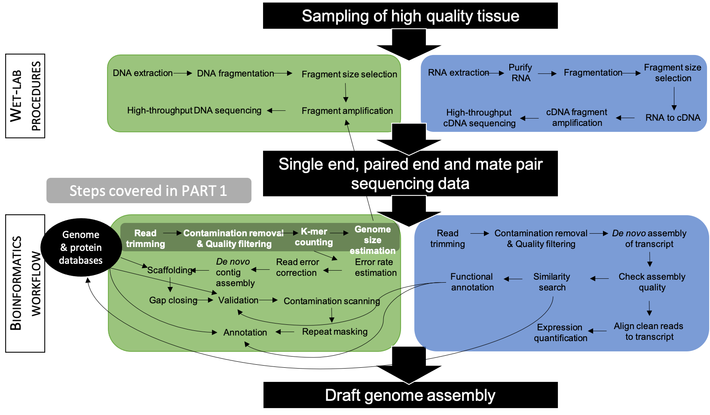
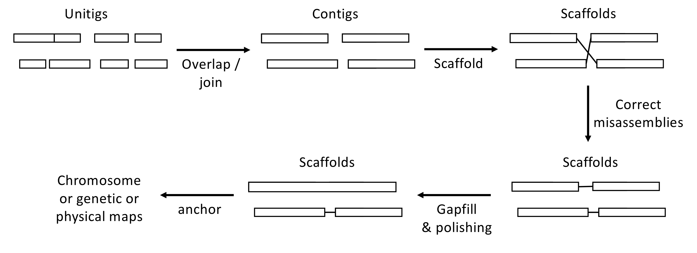
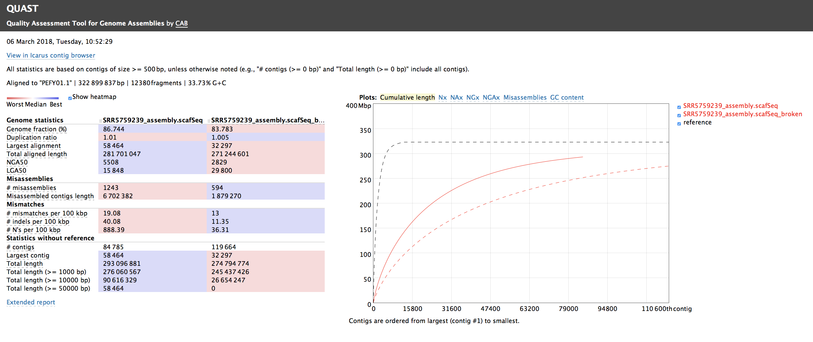
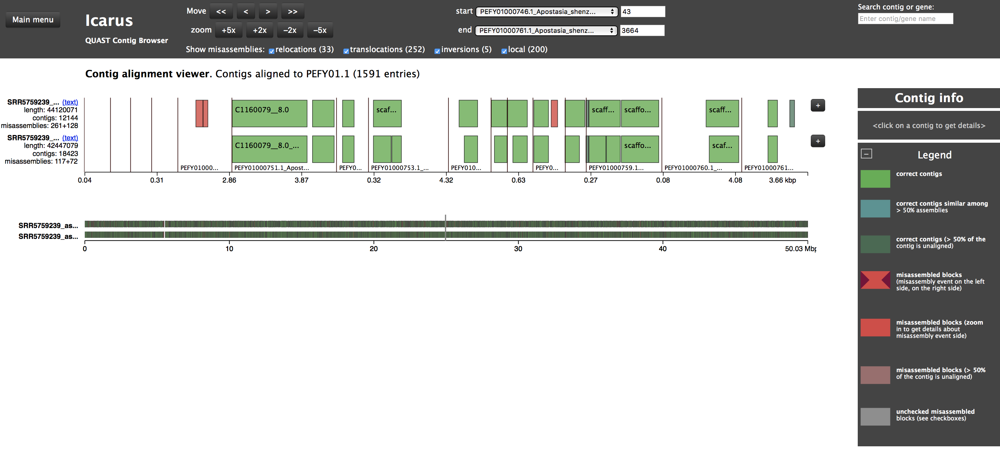

```{js logo-js, echo=FALSE}
$(document).ready(function() {
  $('#header').parent().prepend('<div id=\"logo\"></div>');
  $('#header').css('margin-right', '120px')
});
```

```{r packages, echo=FALSE, warning=FALSE, include=FALSE, cache = FALSE}
###~~~
# 1. Define required packages
###~~~
pkg <- c(
  "knitr", "rmarkdown", "bookdown", "formattable", "kableExtra",
  "dplyr", "magrittr", "prettydoc", "htmltools", "knitcitations",
  "bibtex", "devtools", "kfigr", "data.tree", "DT", "DiagrammeR",
  "rticles", "klippy"
)

###~~~
# 2. Set CRAN mirror (prevents contrib.url error)
###~~~
options(repos = c(CRAN = "https://cloud.r-project.org"))

###~~~
# 3. Install missing packages (optional)
# NOTE: Only run manually once, not every time you knit!
###~~~
new.pkg <- pkg[!(pkg %in% installed.packages()[, "Package"])]
if(length(new.pkg) > 0){
  message("Installing missing package(s): ", paste(new.pkg, collapse = ", "))
  install.packages(new.pkg, dependencies = TRUE)
} else {
  message("All packages are already installed!")
}

###~~~
# 4. Load all packages
###~~~
sapply(pkg, require, character.only = TRUE)

###~~~
# 5. Generate BibTeX file for all loaded packages
###~~~
knitr::write_bib(.packages(), file = 'packages.bib')
```

```{r setup, include = FALSE, cache = FALSE, message = FALSE}
# Chunk options: see http://yihui.name/knitr/options/ ###

## Text results
#opts_chunk$set(echo = TRUE, warning = TRUE, message = TRUE, include = TRUE)

## Code decoration
opts_chunk$set(tidy = TRUE, tidy.opts = list(blank = FALSE, width.cutoff = 60), highlight = TRUE)

## Caching code
#opts_chunk$set(cache = 2, cache.path = "cache/")

## Plots
#opts_chunk$set(fig.path = "Figures_MS/", dev=c('pdf', 'png'), dpi = 300)

## Locate figures as close as possible to requested position (=code)
knitr::opts_chunk$set(fig.pos = 'H')

# Read bibtex file
refs <- bibtex::read.bib("References.bib")
```

<!-- THIS code adds a copy/paste button to copy code -->
```{r klippy-code, echo=FALSE, results='asis'}
# Enable klippy button
if (requireNamespace("klippy", quietly = TRUE)) klippy::klippy(position = c("top", "right"))
```

<!-- THIS CODE CHUNK is used for pdf viewing -->

```{r embendpdf, echo = F, results='hide'}
embed_pdf <- function(pdf_path, unique_id) {
  cat(glue::glue('
<div style="text-align: center;">
  <iframe id="pdfFrame{unique_id}" allowfullscreen src="{pdf_path}" width="100%" height="600px" style="border:none;">
    <p>Your browser does not support PDFs. <a href="{pdf_path}">Download the PDF</a>.</p>
  </iframe>
</div>
  '))
}
```

# Introduction

This webpage contains materials associated with the chapters covered in **BIOL 497/597 – Genomics & Bioinformatics**, a course taught at BSU. In addition to this content, the instructor provides PDF presentations and hands-on tutorials designed to support in-class exercises (see, for example, [Chapter 4](#Chap4)).

<hr style="border: 1.5px solid #999; margin: 2em 0;">

# Syllabus

The syllabus can be accessed [here](https://svenbuerki.github.io/Genomics-Bioinformatics/index.html).

<hr style="border: 1.5px solid #999; margin: 2em 0;">

# Chapter 1

## Goal

The ***goal*** of this chapter is to establish the foundational genomics concepts required for the remainder of the course. Students will develop a shared theoretical framework—including key definitions (see [Lexicon](Lexicon.html))—that underpins genome sequencing, assembly, and annotation workflows. Emphasis is placed on the structure, organization, and function of DNA and RNA as they directly inform the design and interpretation of genomic research projects.

---

## Chapter Structure

The [learning outcomes](#chap1lernout) of this chapter will be addressed through a combination of a [lecture](#teachmatchap1), which introduces core genomics concepts and definitions, and an in-class [group activity](#genomediveristy) focused on exploring genome diversity and variation in assembly completeness.

---

## Learning Outcomes {#chap1lernout}

The key learning outcomes of this chapter are:

- Understand the differences between *genetics* and *genomics*.
- Understand the central dogma: DNA is transcribed into RNA, which is translated into protein.
  + This will be especially important for the [Lab. report](Mining_draft_genome.html).
- Appreciate the diversity of genome organization in organelles, prokaryotes, and eukaryotes [e.g., @Saitou2013].
- Understand how organelle genomes have contributed to the evolution of eukaryotic chromosomes and how this impacts genome assembly project design [e.g., @Timmis2004].
- Appreciate that eukaryotic genomes contain extensive and diverse repetitive regions.
- Appreciate the diversity of published genomes and variation in their levels of completeness.
  + This topic will be further investigated in a [group activity](#genomediveristy)
- Understand the importance of computer science and bioinformatics in generating raw sequencing data and assembling genomes.
- Understand the major challenges associated with sequencing and assembling genomes.

---

## Resources 

This chapter is mostly based on the following resources:

- @aransay_field_2016 - **Sequencing strategy**
- @Asaf2016 - **Synonymous vs. non-synonymous substitutions**
- @Bradnam2013 - **De novo genome assembly contest**
- @Doležel2007 - **Flow cytometry**
- @Ellestad2022Plants - **SNPs in Vanilla**
- @GREENBERG201397 - **Alternative splicing**
- @Hu2021 - **SNPs in Corn**
- @Liao2023 - **Repeats in human genome**
- @Melton2021 - **Paralogs in sagebrush**
- @Melton2022 - **Sagebrush genome and repeats**
- @Nurk2022 - **The complete sequence of a human genome**
- @OHMAN2001125 - **RNA editing**
- @Pellicer2010 - **Plant genome size**
- @Rice2013 - **Plant mitochondrial genome evolution**
- @Sen2011 - **Chloroplast genome function and evolution**
- @Timmis2004 - **Evolution of chloroplast genomes (gene trafficking)**

---

## Lecture {#teachmatchap1}

The presentation associated with this class is available here:

```{r echo = F, results='asis'}
embed_pdf("Lectures/Chapter_01_Spring.pdf", "1")
```

---

## 🤝 Group Activity: Exploring Genome Diversity and Completeness {#genomediveristy}

### Learning Outcome

Students **appreciate the diversity of published genomes and the variation in their levels of completeness** by exploring and comparing genome assemblies available in the NCBI database.

---

### Activity Overview

In this **1 hour and 40 minutes** in-class group activity, students work in small groups to explore, compare, and critically evaluate genome assemblies from different organisms using NCBI resources.

The ***objective*** is to recognize how genome completeness varies across taxa and sequencing strategies, and to reflect on the biological and technical factors that influence genome assembly quality.

---

### Materials

- [NCBI – National Center for Biotechnology Information](https://www.ncbi.nlm.nih.gov)  
- [NCBI – Genome Database](https://www.ncbi.nlm.nih.gov/datasets/genome/)  
- [Lexicon](https://svenbuerki.github.io/Genomics-Bioinformatics/Lexicon.html)  
- [Lecture Material](#teachmatchap1) (from slide 56 onward)

---

### Activity Structure <span style="color:gray;">(1 hour 40 minutes)</span>

#### Context and Setup (15 minutes)

As discussed in lecture:

- Published genomes vary widely in their level of completeness and overall quality.
- Genome assembly quality is influenced by biological features (e.g., genome size, repetitive content, ploidy) as well as technical factors (e.g., sequencing technology, sequencing depth).
- The goal of this activity is to critically evaluate real genomic data rather than to label genomes as “good” or “bad.”

During this time, key assembly metrics (e.g., assembly level, N50, scaffold vs. contig) are reviewed, and students clarify expectations and terminology before group work begins.

---

#### Group Exploration (35 minutes)

Students will work in groups of **3–4**. Each group should include at least one graduate student to help guide the discussion.

Each group selects **two organisms** representing different biological categories (e.g., model vs. non-model organisms, prokaryotes vs. eukaryotes).

**Suggested organism pairings include:**

- [*Homo sapiens*](https://www.ncbi.nlm.nih.gov/datasets/genome/GCF_000001405.40/) vs. [*Artemisia tridentata*](https://www.ncbi.nlm.nih.gov/datasets/genome/GCA_023558565.1/) 
- [*Arabidopsis thaliana*](https://www.ncbi.nlm.nih.gov/datasets/genome/GCF_000001735.4/) vs. a non-model plant species  
- [*Escherichia coli*](https://www.ncbi.nlm.nih.gov/datasets/genome/GCF_000005845.2/) vs. a eukaryotic genome

For each organism, groups navigate to the [**NCBI Genome**](https://www.ncbi.nlm.nih.gov/datasets/genome/) page and record the following information:

- Assembly level (Complete Genome, Chromosome, Scaffold, or Contig)  
- Genome size  
- Number of scaffolds or contigs  
- N50 value (if available)  
- Sequencing technology (if reported)  
- Year of release  
- Annotation status (e.g., RefSeq, GenBank only)  

Groups are encouraged to explore multiple assemblies for the same organism (when available) to observe how assembly quality has changed over time.

<div class="info">
  <p><strong>💡 Information</strong></p>
  <ul>
    <li>Use this activity to become familiar with genomics terminology by consulting the <a href="https://svenbuerki.github.io/Genomics-Bioinformatics/Lexicon.html">Lexicon</a> and other reliable resources as needed.</li>
  </ul>
</div>

Throughout this phase, questions, comparisons, and observations naturally emerge within and across groups.

---

#### Group Discussion and Synthesis (30 minutes)

Within each group, students discuss the following questions:

- How do the two genomes differ in terms of **size, completeness, and assembly quality**?  
  - Consider metrics or features that indicate completeness, such as the number of scaffolds/contigs, N50, and presence of core genes.  
- What **biological factors** (e.g., genome size, repetitive content, ploidy) might explain differences in genome completeness or assembly quality?  
- What **technical, historical, or funding-related factors** (e.g., sequencing technology, coverage, date of publication) might explain these differences?  
- Which genome would you **trust more for downstream analyses**, and why?  
  - Identify the evidence supporting your choice.  
- How might your **criteria for evaluating genome completeness** influence the biological conclusions you could draw from these assemblies?

<div class="info">
  <p><strong>💡 Tip:</strong> Focus on evidence from assembly metrics and consider both biological and technical contexts. Use this discussion to practice critical evaluation of genomic data.</p>
</div>

Each group identifies **two key observations** they find most informative or surprising and prepares to share them with the class.

---

#### Whole-Class Debrief (20 minutes)

Groups share their key observations with the class.

As a class, students collectively highlight and discuss:

- Common patterns observed across taxa,
- Differences between model and non-model organisms,
- The impact of sequencing technology and assembly strategy on genome completeness,
- Questions or concerns that arise when evaluating genome quality for downstream analyses.

Key points raised by the class are recorded and revisited in later chapters on genome assembly and annotation, reinforcing how early evaluation of genome quality shapes genomic research decisions.

<hr style="border: 1.5px solid #999; margin: 2em 0;">

# Chapter 2

## Goal

The ***goal*** of this chapter is to provide students with a conceptual understanding of next-generation sequencing (NGS) technologies, including their underlying principles and practical applications. Students will apply this knowledge by independently researching a sequencing platform and synthesizing their findings in an individual mini-report (see [Mini-Report 1](#minrep1)).

---

## Chapter Structure

The [learning outcomes](#chap2lernout) of this chapter are addressed through a combination of a [lecture](#teachmatchap2), which introduces next-generation sequencing technologies, and a [group activity](#grpactivitychap2) that develops genomics terminology and critical reading skills by analyzing a publication on the giant panda genome. Finally, the lecture will also provide key concepts for [Mini-Report 1](#minrep1).

---

## Learning Outcomes {#chap2lernout}

- Learn the terminology associated with next-generation sequencing (NGS) that underpins genome assembly and annotation (see [Lexicon](https://svenbuerki.github.io/Genomics-Bioinformatics/Lexicon.html)).
- Understand the general principles of genome sequencing (wet-lab) and genome assembly (bioinformatics workflows).
- Be familiar with the major NGS platforms and their limitations (see [Mini-Report 1](#minrep1)):
  - Illumina  
  - PacBio  
  - Oxford Nanopore
- Become proficient in handling NGS data outputs, particularly FASTA and FASTQ files.
- Learn how to assess nucleotide quality using Phred quality scores.
- Become familiar with reading the genomics literature (see [Group Activity](#grpactivitychap2)).

---

## Resources 

### Publications

This chapter is mostly based on the following resources:

- @HEATHER20161 - **The sequence of sequencers: The history of sequencing DNA**
- @Ignatov2019 - **Fragmenting DNA for NGS sequencing**
- @Li2009 - **Giant Panda genome paper**
- @Marx2023 - **Long-read sequencing**
- @Nurk2022 - **The complete sequence of a human genome**
- @Satam2023 - **Next-Generation Sequencing technology: current trends and advancements**
- @WATSON1953 - **Structure for Deoxyribose Nucleic Acid**

<div class="info">
  <p><strong>💡 Note</strong></p>
  <ul>
    <li>These publications will be very helpful to complete [Mini-Report 1](#minrep1).</li>
  </ul>
</div>

### Web resources

The following resources are helpful to complete [Mini-Report 1](#minrep1) and support reading scientific publications ([Journal Club](#jc1)):

- [**BSU Sequencing Core**](https://www.boisestate.edu/sequencing-core/). Our University is offering a suite of genomics services and they have an Illumina NextSeq 1000 instrument.
- [**Overview of Next-Generation Sequencing technologies**](https://www.technologynetworks.com/genomics/articles/an-overview-of-next-generation-sequencing-346532)
- [**Phred quality score**](https://en.wikipedia.org/wiki/Phred_quality_score)
- [**The Human Genome Project**](https://www.genome.gov/human-genome-project)
- [**How to read a scientific paper**](https://www.science.org/content/article/how-read-scientific-paper)
- [**How to (seriously) read a scientific paper**](https://www.science.org/content/article/how-seriously-read-scientific-paper)

---

## Lecture {#teachmatchap2}

The presentation associated with this class is available here:

```{r echo = F, results='asis'}
embed_pdf("Lectures/Chapter_02_Spring.pdf", "2")
```

---

## 🤝 Group Activity: Reading the Giant Panda Genome Paper {#grpactivitychap2}

### Paper

- @Li2009 – **Giant Panda genome paper**  
  + *Nature* 463: 311–317. DOI: [10.1038/nature08696](https://doi.org/10.1038/nature08696)  
- Available on [Google Drive](https://drive.google.com/drive/folders/1-Fkz0NnlqqeSq5DbSeDGn43xbturaPnu?usp=sharing)

---

### Learning Outcome

Students **develop skills in reading and critically evaluating genomics publications** by analyzing a real genome assembly study.

---

### Activity Overview

In this **1 hour and 40 minutes** in-class activity, students work in groups of **3–4** to explore the giant panda genome paper (each group includes at least one graduate student to help guide the discussion). The goal is to:

- Interpret genome assembly metrics  
- Evaluate technical and biological conclusions  
- Connect genomic data to scientific reasoning  
- Practice evidence-based discussion and group synthesis

---

### Materials

- Full text of the giant panda genome paper  
- Instructor presentation summarizing the publication and initiating discussion: [Journal Club: Giant Panda](Lectures/Journal_Club_Giant_panda.pdf)  
- [NCBI Genome Database](https://www.ncbi.nlm.nih.gov/datasets/genome/) (optional reference)  
- [Lexicon](https://svenbuerki.github.io/Genomics-Bioinformatics/Lexicon.html)

---

### Activity Structure <span style="color:gray;">(1 hour 40 minutes)</span>

#### Context and Setup (15 minutes)

- Review key assembly metrics introduced in lecture (e.g., scaffolds, N50, assembly completeness).  
- Discuss the importance of evaluating both **technical methods** and **biological conclusions** when reading genomics papers.  
- Clarify expectations for group work, including collaborative note-taking and critical discussion.  

---

#### Group Reading and Annotation (30 minutes)

- Groups read the paper, focusing on methods, results, and figures.  
- Annotate the text or take notes on terms, methods, metrics, or claims that are unclear.  
- Use the **Lexicon** to clarify unfamiliar genomics terminology (e.g., N50, scaffolds, assembly completeness).  
- Identify sections where assembly methods influence biological interpretations.

---

#### Guided Group Questions (30 minutes)

Each group collaboratively answers the following questions:

1. **Research Motivation:** What biological or evolutionary questions drive this genome project? Why is it significant?  
2. **Sequencing Strategy:** Which sequencing technologies are used? What limitations or biases might they introduce?  
3. **Assembly Quality:** How do the authors evaluate assembly completeness and quality? Which metrics are most informative?  
4. **Biological Insights:** What conclusions do the authors draw (e.g., diet, metabolism, evolution)? How strong is the evidence?  
5. **Reproducibility and Critique:** What information allows others to reproduce the study? How could modern methods improve it?

**Tip:** Assign one or two questions to each group member to analyze deeply, then share answers within the group to build consensus.

---

#### Group Synthesis and Preparation for Class Discussion (15 minutes)

- Groups identify **two or three key insights** or **critical questions** they want to share with the class.  
- Prepare a short summary (bullet points or figure highlights) to support discussion.  
- Focus on evidence-based reasoning and how assembly metrics relate to biological conclusions.

---

#### Whole-Class Debrief and Discussion (20 minutes)

- Groups present their key insights or critical questions to the class.  
- Class collectively identifies:  
  - Patterns in assembly quality and completeness  
  - Connections between technical methods and biological conclusions  
  - Strengths and limitations of the study  
  - Lessons for reading and evaluating genomics publications  

<div class="info">
<p><strong>💡 Tip:</strong> Treat figures and tables as primary evidence. Focus on interpreting data rather than relying on narrative text. Discuss observations collaboratively, highlighting multiple perspectives.</p>
</div>

---

## Mini-Report 1 {#minrep1}

As part of this chapter, students are tasked to to produce individual mini-reports on the following sequencing platforms and their associated technologies:

- **Sequencing platform 1:** Illumina.
- **Sequencing platform 2:** PacBio.
- **Sequencing platform 3:** Oxford Nanopore.

More details on this assignment is available [here](https://svenbuerki.github.io/Genomics-Bioinformatics/Mini_reports.html#mini1).

<div class="disclaimer">
  <p><strong>💡 Disclaimer</strong></p>
  <ul>
    <li><strong>Warning:</strong> For this assignment, students are not allowed to use AI to complete their work.</li>
    <li><strong>Questions or concerns:</strong> If you need assistance, please contact the instructor at <a href="mailto:svenbuerki@boisestate.edu">svenbuerki@boisestate.edu</a>.</li>
  </ul>
</div>

<hr style="border: 1.5px solid #999; margin: 2em 0;">

# Chapter 3 {#chapter3}

## Learning outcomes

-   Understand the importance of computer science and bioinformatics in:
    -   Producing raw data.
    -   Creating databases in molecular biology.
    -   Archiving and careful curation of the data.
    -   Distributing data via the Internet.
    -   Creating information-retrieval tools to allow effective mining of the data for research application.
-   Gain knowledge on major molecular biology databases, which are key to the assembly and annotation of genomes:
    -   Nucleic acid sequences databases.
    -   Protein sequences databases.
    -   Gene ontology databases.
    -   Metabolic pathways databases.
    -   Specialized annotated genome portals.
-   Present protocols to query genomic information and remotely download files from GenBank (this topic will be further investigated in [Mini-Report 3](Mini_reports.html) and [Chapter 4](#Chap4)). 

## Publications

This chapter is mostly based on the following resources:

- @GenBankP - **GenBank**
- @UniProt2014 - **Protein sequence databases**
- @GO2020 - **Gene ontology database**
- @KEGG2022 - **Metabolic pathways databases** 

## Web resources

- [**International Nucleotide Sequence Database Collaboration**](https://www.insdc.org/)
- [**NCBI**](https://www.ncbi.nlm.nih.gov/) - National Center for Biotechnology Information
- **NCBI BioProject Help Book**: This [book](https://www.ncbi.nlm.nih.gov/books/NBK54364/) provides definitions of terms associated to submitted data to NCBI.

## Download presentation

The presentation slides (in `pdf` format) of Chapter 3 can be downloaded <a href="Lectures/Chapter_03_Spring.pdf" target="_blank">here</a>.

## Data availability

To support reproducibility, research institutions, funders and publishers are requiring scientists to support their research by 

1. submitting genomic data to accredited data repositories such as NCBI where data can be freely accessed
2. providing data availability statements in publications pointing to their data

To provide more insights into these practices here is an example of [data policy](https://academic.oup.com/g3journal/pages/data-policy) from the *G3* journal and a [data availability statement](https://academic.oup.com/g3journal/article/12/7/jkac122/6585877?searchresult=1#365097953) from the sagebrush genome [@Melton2022].  

## Exercises

Here the goal is to get familiar with NCBI by doing the following exercises:

1. Navigate to [NCBI](https://www.ncbi.nlm.nih.gov/) and start getting familiar with its structure and available databases.
2. Questions associated with the sagebrush (*Artemisia tridentata*; Asteraceae) genome published by @Melton2022:
    - What is the BioProject accession number?
    - How many SRA experiments were produced?
    - What type of sequencing was used to generate the SRA data?
    - How much data in Gbases and Tbytes was generated for this project?
    - What level is the genome assembly at?
    - What is the genome size (in Gb)?
    - What is the genome coverage?
    - What assembly method was used to produce the assembly?
3. Use @Li2009 and NCBI to determine how many genomes are available for the Giant panda and how they compare?
4. Search your favorite organism in the Taxonomy database and determine what type of genomic data are available and if an assembly or genome exist for it.

## Mini-report 2 -- Molecular biology databases {#mini2}

To have a full overview of available molecular biology databases and assess their contributions to genome annotation, students are tasked to produce individual mini-reports on the following molecular databases:

- **Molecular database 1:** Protein sequences databases [e.g., @UniProt2014].
- **Molecular database 2:** Gene ontology databases [e.g., @GO2020].
- **Molecular database 3:** Metabolic pathways databases [e.g., @KEGG2022].

More details on this assignment is available [here](https://svenbuerki.github.io/Genomics-Bioinformatics/Mini_reports.html#mini2).

# Chapter 4 {#Chap4}

## Bioinformatics toolkit for genomics

Before getting into conducting bioinformatics analyses to *de novo* assemble a draft nuclear genome, we will devote time to learn computing procedures. Please click [here](Tutorials.html) to access this material. 

## Aim and objectives

In this chapter, we **aim at training students in producing a draft nuclear genome for a non-model organism using Illumina data**.

The whole-genome shotgun (WGS) sequencing dataset published by @Zhang2017 on the orchid species *Apostasia shenzhenica* is used as case-study. This dataset provides an opportunity to gain firsthand experience in analyzing NGS data. @Zhang2017 have also produced RNA-Seq data, which were used in their study to support genome annotation. @Zhang2017 is available in our shared [Google Drive](https://drive.google.com/file/d/1S1FWnEmxBC3_Ghl40S5GhcTVecQ2X4qd/view?usp=sharing).

The chapter is subdivided into three parts:

- [**PART 1:**](#PART1) Preparing/cleaning Illumina reads for *de novo* nuclear genome assembly and inferring genome size and complexity.
- [**PART 2:**](#PART2) *De novo* genome assembly.
- [**PART 3:**](#PART3) Validation of the draft genome. 

Before you start working on Chapter 4, please make sure that you have completed the tutorials available [here](Tutorials.html).

## Download presentations

The two presentations (in `pdf` format) associated to material presented in Chapter 4 can be downloaded here:

- <a href="Lectures/Chapter_04_Spring.pdf" target="_blank">Overview of *de novo* genome assembly procedure</a>.
- <a href="Lectures/Chapter_04_Orchid_Genome_presentation.pdf" target="_blank">Presentation of orchid dataset,  sequencing approach and results</a>.

## Presenting the NGS data

Details on the WGS PE Illumina library studied here are provided in Figure \@ref(fig:SRA). The SRA accession number is [SRR5759389](https://trace.ncbi.nlm.nih.gov/Traces/sra/?run=SRR5759389) and the most important information to know about this data are that the fragments insert-size of the library is 180 bp and that the length of each PE read is 90 bp. Note that the authors have performed a round of PCR amplification during their library preparation. This step is know to potentially introduce errors in reads, which could be identified by performing k-mer analyses.

The number of bases shown in Figure \@ref(fig:SRA) was inferred as follows: $\text{N bases} = \text{N. spots * reads length (bp)}$. In this example, $\text{N bases} = 84.1e6 * 180 (90 + 90) = 15.1e9bp = 15.1Gbp$. 

You can also obtain a rough estimate of haploid genome coverage (x) by using the following equation: $\text{Raw haploid genome coverage (x)} = \text{N bases / Genome size (haploid)}$. In this example, $\text{Raw haploid genome coverage (x)} = 15.1e9 / 471.0e6 = 32x$. The estimation of haploid genome size was taken from @Zhang2017.

```{r SRA, echo=FALSE, fig.align="center", fig.cap="Details on the WGS library (SRA accession number: SRR5759389) used in this tutorial. ", fig.show="asis", out.width = '100%'}
knitr::include_graphics("Images/SRR5759389_details.png")
```

## Write your own scripts

As you go along this document and perform analyses, please COPY ALL COMMAND LINES into an `.Rmd` document saved in a folder entitled `Report/` (create this folder in your working directory; see below). Remember to comment your script (using \#s). This will greatly help you in repeating your analyses or using parts of your code to create new scripts. Enjoy scripting!

## Files location

Files for this chapter are deposited on each group Linux computer under the following path, which is shared between all the users on the computer: `/home/Genomics_shared/Chapter_04/`.

There are three folders in this project:

- `01_SRA/`: This folder contains the `SRA` file (`SRR5759389_pe12.fastq`) downloaded from the `SRA` database. This file is very large, >35GB!
- `02_Kmers_analyses/`: This folder contains the structure that will be used for this tutorial. Each student will have to copy this folder onto the account prior to starting the analyses.
- `03_Output_files/`: This folder contains all the outputs files. Students can look at these files to help solve potential coding issues.

## Software (incl. connecting off campus)

To support remotely connecting to the Linux computers and retrieving files (from the Linux computer to your personal computer), please make sure that you have installed the following software on your personal computer before pursing with this tutorial:

- [Putty](https://www.putty.org/): This software will be required to remotely connect to the Linux computers if you have a Windows OS.
- [FileZilla](https://filezilla-project.org/download.php?type=client): This software will be useful to exchange files from the Linux computer to your personal computer. 

If you are **working from outside of the University network** (= off campus) on your personal computer (e.g., you are not connect to the eduroam WiFi), then you will need to use the BSU VPN (**V**irtual **P**rivate **N**etwork) to connect to the BSU secured network prior to remotely connecting to your Linux computer account (using `ssh` protocol as taught in class; see [Tutorials](https://svenbuerki.github.io/Genomics-Bioinformatics/Tutorials.html)). 

The **BSU VPN software and instructions** are available at this URL: https://www.boisestate.edu/oit-network/vpn-services/

## PART 1: QCs, read cleaning and genome size {#PART1}

### Analytical workflow

The overarching objective of this tutorial is to gain theoretical and bioinformatics knowledge on the steps required to prepare PE Illumina reads for *de novo* nuclear genome assembly as well as infer genome size and complexity (see Figure \@ref(fig:part1)).

```{r part1, echo=FALSE, fig.align="center", fig.cap="Workflow applied to assemble and annotate a genome for non-model organisms. Steps associated to PART 1 are highlighted in grey.", fig.show="asis", out.width = '80%'}

```

The five main steps associated to the objectives of PART 1 are as follows (see Figure \@ref(fig:part1workflow)):  

- **Step 1:** Download SRA file containing raw WGS data and simultaneously convert it into an interleaved PE `fasqt` format file. This latter format (where both reads are paired and combined into one file) is the input for most bioinformatic programs.
- **Step 2:** Infer reads Quality Checks (QCs) using standard statistics implemented in `FastQC` [@FastQC].
- **Step 3:** Perform reads cleaning based on Phread scores and k-mer frequencies.
- **Step 4:** What's "in" the reads? This will be done in two phases as follows:
    - Infer and plot clean reads GC contents to assess potential contamination patterns.
    - Map clean reads against reference genomes to assess the proportions of reads belonging to either nuclear or chloroplast genomes.
- **Step 5:** Estimate genome size and complexity (especially looking at repetitive elements and heterozygosity rate) using k-mer frequencies.

```{r part1workflow, echo=FALSE, fig.align="center", fig.cap="Overview of the analytical workflow applied here to prepare/clean Illumina reads for genome assembly and inferring genome size and complexity. Details on associated bioinformatic tools (here software) and file formats are also provided.", fig.show="asis", out.width = '100%'}

```

### Copy the Project to your account

Before starting coding, each student has to copy the `02_Kmers_analyses/` folder project located in `/home/Genomics_shared/Chapter_04` in their `~/Documents/` folder.

To do that, please execute the following commands in a `Terminal` window:

1. Remotely connect to your computer account using `ssh`

2. Start a new `tmux` session and rename it `Part1`

3. Execute the code below to copy the data on your account:

```{bash eval=F, echo=T}
#Navigate to /home/Genomics_shared/Chapter_04
cd /home/Genomics_shared/Chapter_04

#Copy all files in 02_Kmers_analyses/ in ~/Documents/ (This takes ca. 10 minutes to complete)
cp -r 02_Kmers_analyses/ ~/Documents/

#Navigate to ~/Documents/02_Kmers_analyses/ to start the analyses
cd ~/Documents/02_Kmers_analyses/
```

#### Questions

Use this [resource](Tutorials.html) to:

> Which command can be applied to list the content of `02_Kmers_analyses/`?

> What is in `02_Kmers_analyses/`?

> How much space this folder takes on your computer?  

### Bioinformatic tools

Although all the bioinformatic tools (software) necessary to complete this tutorial are already installed on your Linux computers, URLs to their repositories (incl. documentations) are provided below together with details on their publications (when available). Software are sorted by steps in our analytical workflow (see Figure \@ref(fig:part1workflow)):

- **Step 1:** `fastq-dump`: https://www.ncbi.nlm.nih.gov/sra/docs/toolkitsoft/.
- **Step 2:** `FastQC` [@FastQC]: https://www.bioinformatics.babraham.ac.uk/projects/fastqc/.
- **Step 3:** 
    - `seqtk`: https://github.com/lh3/seqtk.
    - `khmer` [@khmer2015]: https://github.com/dib-lab/khmer.
- **Step 4:**
    - `bwa` [@bwa2009]: http://bio-bwa.sourceforge.net.
    - `samtools`[@samtools2009]: http://samtools.sourceforge.net.
- **Step 5:** 
    - `jellyfish` [@Jellyfish2011]: http://www.genome.umd.edu/jellyfish.html.
    - `GenomeScope` [@genomescope]: http://qb.cshl.edu/genomescope/.

If you are remotely connecting to the Linux computers please **install [FileZilla](https://filezilla-project.org/) to support file transfer**. Please see section \@ref(sftp) for more details on how to set up remote connection for transferring files. Finally, the `R` software is also used in steps 4 and 5. You can find more details on this software in the [Syllabus](index.html) and [Mini-Report](Mini_reports.html) webpages.

### Step 1: Download SRA file

The SRA format (containing raw NGS data) can be quite difficult to play with. Here, we aim at downloading the WGS data, split PE reads, but store both reads (R1 and R2) in the same file using the interleaved format (Figure \@ref(fig:part1workflow)). This format is very convenient and is the entry point for most reads cleaning programs. This task can be done by using `fastq-dump` from the [SRA Toolkit](https://trace.ncbi.nlm.nih.gov/Traces/sra/sra.cgi?view=software).

**!!! DON'T EXECUTE THIS CODE !!!** 

> The command to download the SRA file is available below, but please **don't execute the command since the file weighs >35GB and it takes a LONG time to download**.

```{bash eval = F}
#Download PE reads (properly edited) in interleave format using SRA Toolkit
# !! DON'T EXECUTE THIS COMMAND !!
fastq-dump --split-files --defline-seq '@$ac.$si.$sg/$ri' --defline-qual '+' -Z SRR5759389 	> SRR5759389_pe12.fastq
```

#### Questions

Open a Terminal, connect to your `Part1` `tmux` session and navigate to the `/home/Genomics_shared/Chapter_04/01_SRA` folder using the `cd` command. This folder contains the `SRA` file (`SRR5759389_pe12.fastq`) that we will be using in this tutorial. 

Use this [resource](Tutorials.html) to:

> Identify a command to show the first 10 lines of `SRR5759389_pe12.fastq`

> What is the format of `SRR5759389_pe12.fastq` and why do you reach this conclusion?

### Step 2: Reads QCs {#Step2}

#### Theoretical background

To determine the quality of the raw Illumina data, we are conducting analyses to evaluate the following criteria: 

- Basic Statistics
    + Total # of sequences
    + Sequence length
    + %GC
- Per base sequence quality
    + Quality scores across all bases
- Per sequence quality scores
    + Quality score distribution across all sequences
- Per base sequence content
    + Sequence content across all bases
- Per sequence GC content
    + GC distribution over all sequences
- Per base N content
    + N content across all bases
- Sequence Length Distribution
    + Distribution of sequence lengths over all sequences
- Sequence Duplication Levels
    + Percent of sequences remaining if deduplicated 70.44% 
- Overrepresented sequences
    + No overrepresented sequences
- Adapter Content
    + Percent adapter

By intersecting results provided by these analyses, we can determine best-practices to conduct reads cleaning (incl. removal of contaminants) and determine whether our Illumina data are suitable for genomic analyses.   
 
#### Bioinformatics

The program `FastQC` is used to obtain preliminary information about the raw Illumina data (see Figure \@ref(fig:SRA)). To perform this analysis do the following:

1. Attach to your Part1 `tmux` session
2. Navigate to `~/Documents/02_Kmers_analyses/FastQC` using `cd`
3. Type to following command:
  - **Input:** `01_SRA/SRR5759389_pe12.fastq`
  - **Output:** `SRR5759389_pe12_fastqc.html`
```{bash eval = F}
#Reads QCs with FastQC 
./FastQC_program/fastqc -o ~/Documents/02_Kmers_analyses/FastQC/ /home/Genomics_shared/Chapter_04/01_SRA/SRR5759389_pe12.fastq 
```

This step will have to be repeated after completion of the step3 (reads cleaning) to confirm that our reads trimming and cleaning procedure was successful. To inspect `SRR5759389_pe12_fastqc.html` click [here](Data/SRR5759389_pe12_fastqc.html).

#### Question

In small groups, inspect the output file and answer the following question: 

> What conclusions can you draw on the quality of the raw data based on the FastQC analysis?

**Note:** Go over each category outputted by the `FastQC` analyses and determine why these metrics were inferred and how they help you drawing conclusions on your data.

### File transferring

At this stage, you will need to transfer `SRR5759389_pe12_fastqc.html` on your local computer to be able to inspect the results. This can be done using i) the `scp` protocol (but it only works on Unix-based operating systems) or ii) the `sftp` protocol as implemented in FileZilla (this works on all operating systems). 

#### `scp` protocol

**WARNING:** This protocol works only on UNIX OS (Mac, Linux).

You can use the `scp` (**S**ecure **C**opy **P**rotocol) command to copy `SRR5759389_pe12_fastqc.html` or any other file to your local computer. This can be done as follows:

1. Open a `Terminal` window on your computer and navigate (using `cd`) where you want to store the target file.

2. Type this command line:
```{bash echo=T, eval=F}
#General syntax
scp USER@IP:PATH_ON_REMOTE_COMPUTER PATH_ON_YOUR_COMPUTER

#Example:
# To copy SRR5759389_pe12_fastqc.html on my computer from bio_11 user do:
scp bio_11@132.178.142.214:~/Documents/02_Kmers_analyses/FastQC/SRR5759389_pe12_fastqc.html .
```

#### `sftp` protocol {#sftp}

`sftp` is a **S**SH **F**ile **T**ransfer **P**rotocol that can be used to support file exchange between remote computers and your personal computer. This protocol is implemented in FileZilla and other free software. 

To copy the output of the `FastQC` analysis on your computer do the following:

Open FileZilla on your personal computer and establish remote connection with Linux computer as shown in Figure \@ref(fig:FileZilla). Once the connection is established:

1. Navigate where the target file (`SRR5759389_pe12_fastqc.html`) is located on the remote computer and select it.
2. Identify where the target file needs to be saved on your personal computer.
3. Copy the file on your personal computer by dragging the target file from the remote to the local location.

```{r FileZilla, echo=FALSE, fig.align="center", fig.cap="Snapshot of FileZilla program used to transfer files between computers.", fig.show="asis", out.width = '80%'}
knitr::include_graphics("Images/FileZilla_snapshot.png")
```

This protocol will have to be replicated at different stages of this tutorial.

### Step 3: Reads cleaning {#Step3}

This step is at the core of our analytical workflow. It is paramount to conduct thorough reads cleaning when assembling a nuclear genome due to the very nature of this genome (i.e. repetitive elements, heterozygosity, recombination, etc...). In this case, aim at minimizing the effect of PCR errors, which could jeopardize our assembly by creating false polymorphism. In addition, *de novo* genome assembly is computing intensive and by properly cleaning reads we will dramatically decrease RAM requirements.

#### Approach applied here to clean reads

Reads will be cleaned/trimmed based on (see Figure \@ref(fig:part1workflow)):

- Phred quality scores (33) to conduct a first round of trimming.
- K-mer frequencies (k=21) to:
    - Normalize high coverage reads (higher than 100x) based on median reads coverage.
    - Filter low abundance reads (where PCR errors will most likely take place).
- A final round of cleaning by removing low quality bases, short sequences, and non-paired reads.

Finally, we will format the clean data for *de novo* genome assembly, which will be conducted using `SOAPdenovo2` [@Luo2012].

#### Theoritical background

##### What is a k-mer?

A `k-mer` is a substring of length $k$ in a string of DNA bases. For a given sequence of length $L$,  and a k-mer size of $k$, the total k-mer’s possible ($n$) will be given by $(L-k) + 1$. For instance, in a sequence of length of 9 ($L$), and a k-mer length of 2 ($k$), the number of k-mer’s generated will be: $n = (9-2) + 1 = 8$.

> All eight 2-mers of the sequence "AATTGGCCG" are:
> AA, AT, TT, TG, GG, GC, CC, CG

In most studies, the authors provide an estimate of sequencing coverage prior to assembly [e.g. 73 fold in the case of the giant panda genome, @Li2009], but the real coverage distribution will be influenced by factors including DNA quality, library preparation and local GC content. On average, you might expect most of the genome (especially the single/low copy genes) to be covered between 20 and 70x. One way of rapidly examining the coverage distribution before assembling a reference genome is to chop your cleaned sequence reads into short "k-mers" of 21 nucleotides, and count how often you get each possible k-mer. By doing so, you will find out that:

- Many sequences are extremely rare (e.g., once). These are likely to be PCR errors that appeared during library preparation or sequencing, or could be rare somatic mutations). Such sequences can confuse assembly software; eliminating them can decrease subsequent memory and CPU requirements.
- Other sequences may exist at 10,000x coverage. These could be pathogens or repetitive elements. Often, there is no benefit to retaining all copies of such sequences because the assembly software will be confused by them; while retaining a small proportion such reads could significantly reduce CPU, memory and space requirements.

Please find below the plot of k-mer frequencies inferred from the trimmed library studied here (`SRR5759389`), which suggests that the haploid genome of *Apostasia shenzhenica* is sequenced at ca. 25x (Figure \@ref(fig:kmerstrimmed)). The methodology used to infer this graph is explained in Step 4.

```{r kmerstrimmed, echo=FALSE, fig.align="center", fig.cap="Distribution of 21-mer frequencies based on the trimmed library with insert fragment size of 180 bp. Given only one peak in the k-mer distribution, we predict that the *Apostasia shenzhenica* genome has limited heterozygosity or in other words, that this genome is inbred.", fig.show="asis", out.width = '100%'}
knitr::include_graphics("Images/GenomeSize_trimmed.png")
```

##### K-mer graph and PCR effect {#kmers}

The peak around 25 in Figure \@ref(fig:kmerstrimmed) is the coverage with the highest number of different 21-mers. This means that there are $1.4e^7$ unique 21-mers (frequency) that have been observed 25 times (coverage). The normal-like distribution is due to the fact that the sequencing did not provide a perfect coverage of the whole genome. Some regions have less coverage, whereas others have a little more coverage, but the average coverage depth is around 25.

The large number of unique k-mers ($1.7e^7$) that have a frequency of 1 (right left side of the graph; Figure \@ref(fig:kmerstrimmed)) is most likely due to PCR errors. Please find below an example explaining how PCR errors impact on the k-mer procedure.

All 3-mers of the sequence "AATTGGCCG" are:

- AAT, ATT, TTG, TGG, GGC, GCC, CCG


Now, let's consider that the 4th letter (`T`) in the sequence above is replaced with a `C` to simulate a PCR error. In this context, all 3-mers of this sequence "AAT**C**GGCCG" are:

- AAT, **ATC**, **TCG**, **CGG**, GGC, GCC, CCG. 

The k-mers in bold are the incorrect 3-mers that are now unique and end up at the beginning of the graph in Figure \@ref(fig:kmerstrimmed).

Overall, the **general rule** is that for a given sequence, **a single PCR error will result in $k$ unique and incorrect k-mers**.

#### Bioinformatics

Please follow the approach below to:

- Trim reads based on Phred quality scores
- Normalize high coverage reads, remove PCR errors and low quality reads
- Remove intermediate files
- Prepare data for  *de novo* genome assembly
- Reads QCs on cleaned reads

**Note:** Perform the analyses in your `tmux` session entitled `Part1`.

##### Trim reads based on Phred quality scores

Let's start the cleaning of our interleaved PE reads by trimming reads using Phred scores (33) as implemented in `seqtk`. 

Before executing the commands below do the following:

1. Attach to your Part1 `tmux` session
2. Navigate to `~/Documents/02_Kmers_analyses/khmer` using `cd`
3. Type to following command:
  - **Input:** `SRR5759389_pe12.fastq`
  - **Output:** `SRR5759389_pe12.trimmed.fastq`
```{bash, eval = F}
#Trim reads based on Phred scores (default of 33)
# --> This code uses the raw Illumina data deposited on our shared folder
seqtk trimfq /home/Genomics_shared/Chapter_04/01_SRA/SRR5759389_pe12.fastq > SRR5759389_pe12.trimmed.fastq
```

Using Phred scores to clean our data is not going to deal with PCR errors and potential effects of high repeated DNA sequences on the *de novo* assembly. Below, we will use information on k-mer distributions to address these issues and clean our dataset accordingly.

##### Normalize high coverage reads and filter low abundance reads based on k-mer frequencies

In the next commands, `khmer` [@khmer2015] will be used to:

1. Normalize high coverage reads (>100x) based on median coverage (to optimize RAM requirements for *de novo* genome assembly).
2. Filter low abundance reads (most likely PCR errors). 
3. Final clean-up of reads to remove low quality bases, short sequences, and non-paired reads

To conduct these analyses, run the following commands in your Part1 `tmux` session (you should be in `~/Documents/02_Kmers_analyses/khmer`):

1.  Normalize high coverage reads (>100x) based on median reads coverage using k-mer frequencies
  - **Input:** `SRR5759389_pe12.trimmed.fastq`
  - **Output:** `SRR5759389_pe12.max100.trimmed.fastq`
```{bash, eval = F}
# Normalize high coverage reads (>100x)
khmer normalize-by-median.py -p --ksize 21 -C 100 -M 1e9 -s kmer.counts -o SRR5759389_pe12.max100.trimmed.fastq SRR5759389_pe12.trimmed.fastq
```

2. Filter low abundance reads based on k-mer frequencies to minimize PCR errors
  - **Input:** `SRR5759389_pe12.max100.trimmed.fastq`
  - **Output:** `SRR5759389_pe12.max100.trimmed.norare.fastq`
```{bash, eval = F}
# Filter low abundance reads based on k-mer frequencies to minimize PCR errors
khmer filter-abund.py -V kmer.counts -o SRR5759389_pe12.max100.trimmed.norare.fastq SRR5759389_pe12.max100.trimmed.fastq
```

##### Final clean-up of reads

Final clean-up of reads to remove low quality bases, short sequences, and non-paired reads

  - **Input:** `SRR5759389_pe12.max100.trimmed.norare.fastq`
  - **Output:** `SRR5759389_pe12.max100.trimmed.norare.noshort.fastq`
```{bash, eval = F}
# Final clean-up of reads (remove low quality bases, short sequences, and non-paired reads)
seqtk seq -q 10 -N -L 80 SRR5759389_pe12.max100.trimmed.norare.fastq | seqtk dropse > SRR5759389_pe12.max100.trimmed.norare.noshort.fastq
```

##### Remove intermediate files 

To save disk space and avoid cluttering the computer (with redundant information), please remove the following intermediate files as follows uisng the `rm` command:

```{bash, eval = F}
#Removing intermediate, temporary files to save disk space
rm SRR5759389_pe12.max100.trimmed.fastq
rm SRR5759389_pe12.max100.trimmed.norare.fastq
```

--> Each of the file that you discarded is >30G of data!

##### Prepare data for  *de novo* genome assembly {#prepreads}

In this last section, our cleaned reads are prepared for the *de novo* genome assembly analysis conducted in `SOAPdenovo2` [@Luo2012] (done in [PART 2](#PART2)). This is achieved by using `khmer` to de-interleave reads and rename files using `mv` as follows:

1. De-interleave filtered reads (to be ready for *de novo* assembly in SOAPdenovo2)
  - **Input:** `SRR5759389_pe12.max100.trimmed.norare.noshort.fastq`
  - **Output:** 
    + R1: `SRR5759389_pe12.max100.trimmed.norare.noshort.fastq.1` 
    + R2: `SRR5759389_pe12.max100.trimmed.norare.noshort.fastq.2`
```{bash, eval = F}
# De-interleave filtered reads
khmer split-paired-reads.py SRR5759389_pe12.max100.trimmed.norare.noshort.fastq
```

2. Rename output reads to something more human-friendly
  - **Input:** 
    + R1: `SRR5759389_pe12.max100.trimmed.norare.noshort.fastq.1` 
    + R2: `SRR5759389_pe12.max100.trimmed.norare.noshort.fastq.2`
  - **Output:** 
    + R1: `SRR5759389.pe1.clean.fastq` 
    + R2: `SRR5759389.pe2.clean.fastq`
```{bash, eval = F}
#Rename output reads
mv SRR5759389_pe12.max100.trimmed.norare.noshort.fastq.1 SRR5759389.pe1.clean.fastq
mv SRR5759389_pe12.max100.trimmed.norare.noshort.fastq.2 SRR5759389.pe2.clean.fastq
```

--> These final files are the input files for the *de novo* analysis. 

##### Reads QCs on cleaned reads

Use `FastQC` to validate the reads cleaning conducted above. Please see [Step 2](#Step2) for more details on the methodology. 

### Step 4: What's "in" the reads?

After inspecting the output of the reads QC analyses, we discovered that our Illumina library contained two [distinct sequence content patterns](#Step2). This evidence together with the nature of the organism that we are studying allowed us to **hypothesize** that our data were enriched in plastid (or chloroplast) DNA over nuclear DNA. In this context, we **predict** that the 32x sequencing nuclear genome coverage inferred based on the raw data could be significantly lower. To test our hypothesis and determine the actual sequencing coverage of the nuclear genome, it is paramount to:

- Determine whether the data are contaminated
- Provide an estimate of the proportions of reads belonging to either nuclear or chloroplast genomes. 

#### Analytical workflow

To investigate these topics, the instructor proposes that we conduct the following analyses:

1. [Determine potential library contamination by inferring reads GC contents](#GCcounts)
2. [Map clean reads against a reference nuclear genome](#mapnrDNA)
3. [Map clean reads against a reference chloroplast genome](#mapcpDNA)
4. [Determine proportion of clean reads belonging to either genomes in our library](#countReads)

#### Input data

All the analyses from this step rely on `SRR5759389_pe12.max100.trimmed.norare.noshort.fastq`. If you have not been able to generate the latter file, please copy it from our shared hard drive space into your `khmer/` folder. The path is as follows:

```{bash, eval = F}
## SRR5759389_pe12.max100.trimmed.norare.noshort.fastq
# can be found at this path
/home/Genomics_shared/Chapter_04/02_Kmers_analyses/khmer/instructor_files
```

#### Group work

Students are divided into 3-4 small groups. Each group work as a team to conduct the analyses and answer questions. Prior to assigning tasks, the group has to work on a workflow describing the analyses (input/output), used software (and arguments) and carefully reading the material prior to running jobs in secured `tmux` sessions. 

#### Reads GC contents {#GCcounts}

The GC content of a sequence library can provide evidence of contamination or the presence of sequence from multiple organisms (since most organisms have specific GC profiles). A GC plot inferred from a non-contaminated library would display a smooth, uni-modal distribution. The existence of shoulders, or in more extreme cases a bi-modal distribution, could be indicative of the presence of sequence reads from  an organism with a different GC content, which is most likely a contaminant (see Figure \@ref(fig:part1workflow)). 

##### Bioinformatics

Here we infer GC contents for all clean reads using the perl script `GC_content.pl`. This script requires reads to be in `fasta` format. We will then start by converting our `fastq` file into `fasta` by using `seqtk`. Data are available in the `~/Documents/02_Kmers_analyses/GC_content/` folder. Please see below for the commands to be executed:

1. Convert clean reads from `fastq` to `fasta`

- **Input:** `SRR5759389_pe12.max100.trimmed.norare.noshort.fastq`
- **Output:** `SRR5759389_pe12.max100.trimmed.norare.noshort.fasta`

```{bash, eval = F}
#Convert fastq to fasta
seqtk seq -a ~/Documents/02_Kmers_analyses/khmer/SRR5759389_pe12.max100.trimmed.norare.noshort.fastq > SRR5759389_pe12.max100.trimmed.norare.noshort.fasta
```

2. Infer GC content of all cleaned reads in `fasta` format

- **Input:** `SRR5759389_pe12.max100.trimmed.norare.noshort.fasta`
- **Output:** `gc_out.txt` --> Don't execute command and just use this file for next analyses


**PLEASE DON'T EXECUTE THE COMMAND BELOW!** It takes few hours to calculate reads GC contents. Use the output of this command `gc_out.txt` (weighing ca. 5GB), which is available in the `GC_content/` folder to carry on our analyses. 

```{bash, eval = F}
#Infer GC content using fasta file as input (this can take a long time)
./GC_content.pl SRR5759389_pe12.max100.trimmed.norare.noshort.fasta > gc_out.txt
```

3. Mine reads GC content in large file

- **Input:** `gc_out.txt`
- **Output:** `gc_simple.txt`

The next command extracts the column containing the GC content per read from `gc_out.txt` (located in `GC_content/`). Since the file is very big, we use the BASH command `awk` to extract this information instead of `R`.

```{bash, eval = F}
#Extract reads GC contents (the file is big and can't be processed easily)
awk '{print$2}' gc_out.txt > gc_simple.txt
```

4. Infer histogram of GC contents in cleaned library

- **Input:** `gc_simple.txt`
- **Output:** `GC_content_hist.pdf`

The last part of the analysis will be executed in `R` where we will load the data and create a histogram to look at the distribution of reads GC contents.

```{r, eval = F}
###~~~
#Infer GC content per reads
###~~~
#Load the data in R
gc_frac <- read.table('gc_simple.txt', header=T)

#Create pdf to save output of hist
pdf("GC_content_hist.pdf")
#Do the histogram of GC content 
hist(as.numeric(gc_frac[,1]), main="Histogram of GC content per reads", xlab="GC fraction")
#Close pdf file
dev.off()
```

The histogram displaying the distribution of GC values based on cleaned reads is provided in Figure \@ref(fig:GC).

```{r GC, echo=FALSE, fig.align="center", fig.cap="Histogram of GC values inferred from the cleaned library of reads (SRR5759389). See text for more details.", fig.show="asis", out.width = '80%'}
knitr::include_graphics("Images/GC_content_hist.png")
```

##### Question

> To your knowledge, based on data presented in Figure \@ref(fig:GC), is the SRR5759389 library contaminated with alien DNA?

#### Mapping reads against reference genomes

Here we aim at assessing the proportions of reads in the clean library belonging to either nuclear or chloroplast genomes by mapping our clean reads against two reference genomes using `bwa` [@bwa2009] and `samtools` [@samtools2009].  Data are available in `Map_reads/`.

##### Mapping reads against the nuclear genome {#mapnrDNA}

The nuclear genome of *Apostasia shenzhenica* published by @Zhang2017 is not listed in the NCBI database as "Genome", but rather as "Assembly" (see BioProject [PRJNA310678](https://www.ncbi.nlm.nih.gov/bioproject/?term=PRJNA310678)). Please see Figure \@ref(fig:NuclearNCBI) for more details on the genome. This file (a compressed FASTA) is already available in your folder, but you could download it as follows:

```{bash, echo=T, eval=F}
#Get Fasta files for genomes of reference
#PEFY01 nuclear genome of Apostasia 
wget ftp://ftp.ncbi.nlm.nih.gov/sra/wgs_aux/PE/FY/PEFY01/PEFY01.1.fsa_nt.gz
```

```{r NuclearNCBI, echo=FALSE, fig.align="center", fig.cap="Screen shot of the NCBI website showing details about the accession containing the nuclear genome assembly of *Apostasia shenzhenica* under the accession PEFY01.", fig.show="asis", out.width = '100%'}
knitr::include_graphics("Images/Nuclear_genome_assembly.png")
```

##### Bioinformatics

Please go through the commands below to map your clean reads against the reference nuclear genome assembly:

1. Map `fastq` cleaned reads to nuclear reference genome assembly (in `fasta`) using `bowtie`

- **Input:** `SRR5759389_pe12.max100.trimmed.norare.noshort.fastq` and `PEFY01.1.fsa_nt.gz`
- **Output:** `PEFY01_map_pe.sorted.bam`
  * This file will be used as input for counting reads

```{bash eval=F, echo=T}
#Mapping clean reads against reference genome using bwa and converting into human readable format using samtools

#Before starting, you have to create an index for your reference genome to allow efficient mapping
bwa index -a bwtsw PEFY01.1.fsa_nt.gz
bwa mem -t 20 PEFY01.1.fsa_nt.gz ~/Documents/02_Kmers_analyses/khmer/SRR5759389_pe12.max100.trimmed.norare.noshort.fastq | samtools view -buS - | samtools sort - -o PEFY01_map_pe.sorted.bam 
samtools index PEFY01_map_pe.sorted.bam
```

We will be devoting time to decipher these commands during our Lab sessions. For now, here is a short description of `bwa` from the [manual](http://bio-bwa.sourceforge.net/bwa.shtml):

> BWA is a software package for mapping low-divergent sequences against a large reference genome, such as the human genome. It consists of three algorithms: BWA-backtrack, BWA-SW and BWA-MEM. The first algorithm is designed for Illumina sequence reads up to 100bp, while the rest two for longer sequences ranged from 70bp to 1Mbp. BWA-MEM and BWA-SW share similar features such as long-read support and split alignment, but BWA-MEM, which is the latest, is generally recommended for high-quality queries as it is faster and more accurate. BWA-MEM also has better performance than BWA-backtrack for 70-100bp Illumina reads.

##### Mapping reads against the chloroplast genome {#mapcpDNA}

The chloroplast genome of *Apostasia shenzhenica* was not published. To assess the proportion of chloroplastic reads in our Illumina cleaned reads, we will use the chloroplast genome of a sister species, *A. wallichii* [@Niu2017], which is available on the NCBI website under the accession number `LC199394`. This file (in FASTA) is already available in your folder and you do not have to download it.

##### Bioinformatics

Please execute the commands below to map the clean reads against the reference chloroplast genome of the sister species: 

1. Map `fastq` cleaned reads to chloroplast genome assembly (in `fasta`) using `bowtie`

- **Input:** `SRR5759389_pe12.max100.trimmed.norare.noshort.fastq` and `LC199394.fasta`
- **Output:** `LC199394_map_pe.sorted.bam` 
    * This file will be used as input for counting reads

```{bash eval= F, echo=T}
#Mapping reads against the chloropolast genome of a sister species
# following the same approach as with the nuclear genome
bwa index -a bwtsw LC199394.fasta
bwa mem -t 20 LC199394.fasta ~/Documents/02_Kmers_analyses/khmer/SRR5759389_pe12.max100.trimmed.norare.noshort.fastq | samtools view -buS - | samtools sort - -o LC199394_map_pe.sorted.bam
samtools index LC199394_map_pe.sorted.bam
```

##### Counting reads belonging to nuclear and chloroplast genomes {#countReads}

We have now all the information at hand to count how many reads are matching with either nuclear or chloroplast genomes (and infer proportions). Remember that it is just a very preliminary assessment, which aims at assessing the quality of the library and its suitability for *de novo* genome assembly.

##### Bioinformatics

1. Count the total number of cleaned reads using `count_fastq.sh`

- **Input:** `SRR5759389_pe12.max100.trimmed.norare.noshort.fastq`
- **Output:** A number echoed on the screen.

```{bash eval=F, echo=T}
#Count the total number of clean reads
./count_fastq.sh ~/Documents/02_Kmers_analyses/khmer/SRR5759389_pe12.max100.trimmed.norare.noshort.fastq
```

2. Count the number of cleaned reads mapping to each genome

- **Input:** `PEFY01_map_pe.sorted.bam` and `LC199394_map_pe.sorted.bam`
- **Output:** Two numbers (one per command) echoed on the screen.

Now, we will use `samtools` to count how many unique reads mapped the reference genomes:

```{bash echo=T, eval=F}
#How many unique reads mapped the nuclear genome
samtools view -F 0x904 -c PEFY01_map_pe.sorted.bam

#How many unique reads mapped the chloroplast genome
samtools view -F 0x904 -c LC199394_map_pe.sorted.bam
```

3. Infer the proportion of cleaned reads belonging to each genome

The instructor let you work on code to determine these values.

##### Questions

> What are the proportions of nuclear and chloroplast reads in your library as well as potential contaminants?

> Based on your previous answer, is this library suitable to assemble the nuclear genome of *Apostasia shenzhenica*? 

### Step 5: Estimate genome size and other genomic features

#### Aim

In this section, we aim at utilizing data on [k-mer](#kmers) frequencies to **estimate the nuclear genome size and tease apart the proportion of the genome associated with low copy genes** (also referred to as unique sequences) **and repetitive DNA**. 

#### Methodology

The `JELLYFISH` [@Jellyfish2011] program is a tool for fast, memory-efficient counting of k-mers in DNA sequences. `JELLYFISH` is a command-line program that reads FASTA and multi-FASTA files containing DNA sequences and it outputs k-mer counts in an binary format (which can easily be translated into a human-readable text). Finally, the output of `JELLYFISH` will be used to estimate the genome size and complexity of the *Apostasia shenzhenica* nuclear genome by using `R` and `GenomeScope` [@genomescope].

#### Group work

In this section, the `JELLYFISH` analysis has to be done in groups, but the rest of the analyses (in `R` and with `GenomeScope`) can be done individually.

#### Generate countings of k-mers

Here, we are using `JELLYFISH` to generate countings of 21-mers based on the cleaned Illumina reads (`SRR5759389_pe12.max100.trimmed.norare.noshort.fastq`). We will subsequently input the output of this program into `R` to estimate the genome size based on k-mer frequencies. 

The data are available in `Jellyfish/` and all analyses must be done in your `tmux` Part1 session.  

- **Input:** `SRR5759389_pe12.max100.trimmed.norare.noshort.fastq`
- **Output:** `Orchid_21mer_SRR5759389_pe12_max100.trimmed.norare.histo`

**Note:** This job uses 30 CPUs (or Central Processing Units) to infer k-mers and it would be best to work in groups to execute these tasks.

```{bash eval=F, echo=T}
# 1. Navigate to the right folder (Jellyfish/) using cd

# 2. Run jellyfish to obtain k-mer counts and frequencies (based on trimmed, normalized and filtered reads)
jellyfish count -t 30 -C -m 21 -s 5G -o Orchid_21mer_SRR5759389_pe12_max100.trimmed.norare ~/Documents/02_Kmers_analyses/khmer/SRR5759389_pe12.max100.trimmed.norare.noshort.fastq

jellyfish histo -o Orchid_21mer_SRR5759389_pe12_max100.trimmed.norare.histo Orchid_21mer_SRR5759389_pe12_max100.trimmed.norare
```

**Note:** To ensure that everybody can run the rest of the analyses on their own, copy `Orchid_21mer_SRR5759389_pe12_max100.trimmed.norare.histo` into the shared folder at this path:

- `/home/Genomics_shared/Chapter_04/02_Kmers_analyses/`

Each member of the group will then copy this file over to their account (at the right path) to pursue the analyses.

#### Infer genome size with `R`

Once the `JELLYFISH` analysis is completed, please open an `R` session and execute the following command to estimate the haploid (1x) genome size. Here, genome size is estimate as follows:

```{r echo=T, eval=F}
#Genome size (N) is equal to:
N = Total numbers of k-mers / Peak of coverage (here ca. 22x)
N = Area under the curve / Peak of coverage
```

The `R` script to infer the genome size of *Apostasia shenzhenica* based on the data generated by `JELLYFISH` is presented below:

```{r Rcode, echo=F}
#This code loads the code in the target file
knitr::read_chunk("Data/R_scripts/Chapter_4_QC_Jellyfish.R")
```
<!--- 
Print the R code in Chapter_4_QC_Jellyfish.R
by calling a specially tag in the file
See https://bookdown.org/yihui/rmarkdown-cookbook/read-chunk.html
-->
```{r, JellyFishR, echo=T, eval=F}
```

#### Transfer files onto your personnal computer

Please use `FileZilla` or the `sftp` protocol (if you have a UNIX-based OS) to transfer `GenomeSize.pdf` and `Orchid_21mer_SRR5759389_pe12_max100.trimmed.norare.histo` onto your personal computer. The latter file will be required to conduct the `GenomeScope` analysis (see below).

#### Questions

> What is the haploid genome size of *Apostasia shenzhenica*?

> How does this genome size estimation compare with the one conducted based on reads that were only trimmed provided in Figure \@ref(fig:kmerstrimmed)?

> Finally, are the latter two estimations close to the 349 Mb provided in @Zhang2017?

#### Use GenomeScope to estimate heterozygosity, unique genes, repetitive DNA and PCR errors

##### Aim

Finally, the last step of our preliminary analyses prior to *de novo* genome assembly aims at **estimating heterozygosity, unique genes, repetitive DNA and PCR errors**. These analyses are conducted by using the approach implemented in the online tool `GenomeScope` [@genomescope]. The authors of this program developed an equation to model the shape and size of the k-mer graph by using four negative binomial peaks which shape and size are determined by % heterozygosity, % PCR duplication, and % PCR Error. 

##### Bioinformatics 

Open a web browser and navigate to the GenomeScope website (http://qb.cshl.edu/genomescope/). Once on the website, upload `Orchid_21mer_SRR5759389_pe12_max100.trimmed.norare.histo` by dragging your file onto the small window and set the analysis as provided in Figure \@ref(fig:GenScope1).

```{r GenScope1, echo=FALSE, fig.align="center", fig.cap="Screen shot of the GenomeScope portal to help you setting your analysis.", fig.show="asis", out.width = '100%'}
knitr::include_graphics("Images/Screen.png")
```

##### Interpreting results of GenomeScope

The output of `GenomeScope` is displayed in Figure \@ref(fig:GenScope2). The program outputs two plots and the only difference between those is that the the second plot is using a log transformation for the axes. This transformation allows better teasing apart the different elements studied here. The big peak at 25 in the graph above is in fact the diploid homozygous (i.e., AA) portions of the genome that account for the identical 21-mers from both strands of the DNA (haploid genome mostly composed of single-copy genes). The dotted line corresponds to the predicted center of that peak. The absence of a shoulder to the left of the peak suggests that this genome has a very low level of heterozygosity (i.e., AB). The red line on the left corresponds to PCR errors. Finally, the proportion of unique sequences, which would correspond to low-copy genes is depicted by the yellow line and the amount of repetitive DNA is estimated by comparing the "space" between the black and yellow lines (on the right side of the graph). 

Please see this [tutorial](https://bioinformaticsworkbook.org/dataAnalysis/GenomeAssembly/genomescope.html#gsc.tab=0) for more information on the model implemented in `GenomeScope` and interpretation of the results.

```{r GenScope2, echo=FALSE, fig.align="center", fig.cap="Output of the GenomeScope analysis.", fig.show="asis", out.width = '80%'}

```

#### Questions

> How do estimations of genome size differ between R and GenomeScope?

> What is the level of genomic heterozygosity of *Apostasia shenzhenica*?

> Is the genome of *Apostasia shenzhenica* enriched in repeats?

## PART 2: *De novo* genome assembly {#PART2}

### Objective

The overarching objective of PART 2 is to gain theoretical and bioinformatics knowledge on the steps required to **perform a *de novo* genome assembly based on cleaned Illumina reads**. The procedure applied to assess and validate the quality of the genome assembly will also be covered in PART 3. 

### Presenting the data and their location {#dataPART2}

PART 2 will be using the output files of the PART 1 [reads cleaning step](#Step3), which are deposited in `~/Documents/02_Kmers_analyses/khmer/` and named as follows:

- `SRR5759389.pe1.clean.fastq`
- `SRR5759389.pe2.clean.fastq`

**WARNING:** You have to complete section \@ref(prepreads) before starting this section.

### Analytical workflow

To achieve our overarching objective, our next classes will be divided into two steps:

- **Step 1:** Set-up and perform a *de novo* genome assembly based on cleaned paired-end (PE) Illumina reads using `SOAPdenovo2` [@Luo2012].
- **Step 2:** Provide theoretical knowledge on *de novo* genome assembly methods by focusing on de Bruijn graphs.

### Step 1: Perform *de novo* genome assembly analysis

#### Specific objective

Here, students will be learning the procedure to set-up and perform a *de novo* genome assembly using cleaned PE Illumina reads as implemented in `SOAPdenovo2` [@Luo2012]. The analysis will be conducted on the output files obtained after cleaning reads based on Phred scores and k-mer distributions (see section \@ref(dataPART2) for more details on the input files).

`SOAPdenovo2` is the updated version of the program that was used by @Li2009 to assemble the nuclear genome of the giant panda. The draft nuclear genome of *Apostasia shenzhenica* was not inferred with this latter program, but with `ALLPATHS-LG` [@Gnerre1513]. The draft assembly was obtained based on multiple Illumina short-reads libraries exhibiting different insert-sizes [see @Zhang2017]. The authors have conducted a final round of gap closures to polish their assembly based on PacBio long-reads. It will therefore be interesting to compare our assembly based on one Illumina library with the one obtained by @Zhang2017 inferred uisng a combination of short and long read data. Further information justifying using `SOAPdenovo2` instead of `ALLPATHS-LG` are provided below. 

#### Background on `SOAPdenovo2`

`SOAPdenovo2` [@Luo2012] is a short-read genome assembler, which was especially developed to handle Illumina reads and to build `de novo` draft assemblies for human-sized genomes. This program creates new opportunities for building reference sequences and carrying out accurate analyses of unexplored genomes in a cost effective way. As stated above, `SOAPdenovo2` aims for large eukaryote genomes, but it also works well on bacteria and fungi genomes. It runs on 64-bit Linux system with a minimum of 5GB of physical memory. For big genomes like human (3.2Gbp), about 150GB of memory are required. 

In our case, we have estimated the haploid genome size of *Apostasia shenzhenica* to be around 340Mbp in our previous tutorial. This latter evidence therefore suggests that \verb|SOAPdenovo2| is adapted to assemble a draft genome for this species of orchid. 

#### Structure of `SOAPdenovo2`

This program is made up of six modules handling:

1. Read error correction.
2. de Bruijn graph construction.
3. Contig assembly.
4. Paired-end reads mapping.
5. Scaffold construction.
6. Gap closure.

Please read @Luo2012 for more details on the approach implemented in `SOAPdenovo2`.

#### Why are we using SOAPdenovo2 to assemble this genome?

Once reads are fully cleaned and ready for **de novo** assembly, one of the main questions that you will ask yourself is: What **de novo** program should I use to assemble my genome? Or in other words, which program best fit my data?

Most researchers working on Illumina short-reads are using either `SOAPdenovo2` or `ALLPATHS-LG` to assemble nuclear genomes of eukaryote species. Please find below a short comparison of both programs:

- Unlike `SOAPdenovo2`, `ALLPATHS‐-LG` requires high sequence coverage of the genome in order to compensate for the shortness of the Illumina reads. The precise coverage required depends on the length and quality of the paired reads, but typically is of the order 100x or above. This is raw read coverage, before any error correction or filtering.
- Unlike `SOAPdenovo2`, `ALLPATHS‐-LG` requires a minimum of 2 paired-end libraries -- one short and one long. The short library average separation size must be slightly less than twice the read size, such that the reads from a pair will likely overlap – for example, for 100 base reads the insert size should be 180 bases. The distribution of sizes should be as small as possible, with a standard deviation of less than 20%. The long library insert size should be approximately 3000 bases long and can have a larger size distribution. Additional optional longer insert libraries can be used to help disambiguate larger repeat structures and may be generated at lower coverage. 

Overall, because we estimated in the previous tutorial that this library provided a coverage depth of ca. 25x for the haploid genome and that we only have one paired-end library, `SOAPdenovo2` therefore best fits our data.

#### Running `SOAPdenovo2` analysis

Running a `SOAPdenovo2` analysis is a three steps process:

- **Step 1:** Create a folder and move the de-interleaved cleaned paired-end 'fastq' files.
- **Step 2:** Create a `SOAPdenovo2` configuration file providing settings for the analysis.
- **Step 3:** Run the *de novo* genome assembly analysis.

**Run the code in a `tmux` session!**

##### Step 1
	
Use the `mkdir` command to create a new folder entitled `SOAPdenovo/` in `~/Documents/02_Kmers_analyses/` as follows:

```{bash eval=F, echo=T}
mkdir SOAPdenovo2
```

Move the paired-end cleaned reads files (i.e. input files for the *de novo* analysis) in `SOAPdenovo2/` using the `mv` command as follows:

```{bash eval=F, echo=T}
#Move the split pe files in SOAPdenovo2
# WARNING: You have to be in the SOAPdenovo2 folder
mv ../khmer/SRR5759389.pe* .
```

##### Step 2

`SOAPdenovo2` requires a configuration file to run the analysis. 

Please create a file entitled `soap_config.txt` deposited in `SOAPdenovo2/` using `vim`.

1. Type the following command in the terminal, which will create the new file and open a `vim` session:  
```{bash, eval = F, echo = T}
vim soap_config.txt
```

2. Type `Shift` and `I` on your keyboard to enter into `INSERT` mode.

3. Copy and paste the text below in the `vim` session:
```{bash eval=F, echo=T}
max_rd_len=90          # maximal read length
[LIB]            # One [LIB] section per library
avg_ins=180             # average insert size
reverse_seq=0           # if sequence needs to be reversed
asm_flags=3             # use for contig building and subsequent scaffolding
rank=1                  # in which order the reads are used while scaffolding
q1=SRR5759389.pe1.clean.fastq
q2=SRR5759389.pe2.clean.fastq
```

To better understand the settings contained in this file, comments have been provided to explain each parameter. The last 2 lines contain the names of the input files. This is a very simple analysis based only on one paired-end Illumina library (`[LIB]`).

4. Hit `Esc` on your keyboard to quit the `INSERT` mode and type `:wq!` to save the document and exit  from `vim`.

##### Step 3
	
Once the input and configuration files are sorted, just type the following command in your terminal to start the analysis:

```{bash eval=F, echo=T}
#Run the de novo analysis
soapdenovo2-63mer all -s soap_config.txt -K 63 -R -p 5 -o SRR5759389_assembly
```

Here, `SOAPdenovo2` works with a k-mer size of 63 (`-K`). The analysis will be performed on 5 threads (or CPUs) (`-p`) and the program will save the output files under `SRR5759239_assembly` as shown by the `-o` argument.
	  
The analysis will run for SEVERAL HOURS. Please log out from your sessions, but DON'T SWITCH OFF COMPUTERS.	 

The output file of the `SOAPdenovo2` analysis are presented in section \@ref(outputdenovo).

## PART 3: Validation of the draft genome {#PART3}

### Objective

In this part, students are learning how to use `QUAST` to **assess the quality of the *de novo* genome assembly** inferred in PART 2 using `SOAPdenovo2`. 

`QUAST` is used to validate the assembly (based on one PE Illumina library; `SRR5759389`) by comparing it with the assembly published by @Zhang2017 (available under the GenBank accession number: `PEFY01`). Such approach is especially **useful to assess the level of misassembly** (see Figure \@ref(fig:assemblyworkflow)). Please keep in mind that this assembly has only been inferred from one PE Illumina library.

```{r assemblyworkflow, echo=FALSE, fig.align="center", fig.cap="Overview of the assembly workflow. Here are few key definitions: Contig: A contiguous sequence of bases. Unitig: A type of contig for which there are no competing choices in terms of internal overlaps (they usually stop before a repeat sequence). Scaffold: A sequence of contigs separated by gaps (Ns). See PART 2 for more details.", fig.show="asis", out.width = '80%'}

```

### `SOAPdenovo2` assembly files {#outputdenovo}

The input of the `QUAST` analysis is the `fasta` assembly file produced by `SOAPdenovo2` containing scaffolds (see Figure \@ref(fig:assemblyworkflow)). This file is entitled `SRR5759389_assembly.scafSeq` and it is located in the `SOAPdenovo2/` folder (see PART 2 for more details).

#### Inspecting assembly files

Navigate to the file location and inspect `SRR5759389_assembly.scafSeq` by using the `head` command. It should be similar to the example provided below:

```{bash eval=F, echo=T}
>scaffold2  6.9
TATATATATTAGCATTAAATTAACTTTATTTTCATTCTTTCACAAAGCTCGAAACAAAGAT
ATCACCAAACAACTATGGCTTAGCAAACACATCATTTATACGAGAAATATTAACGATTTG
AGTGGTGTATGTAGGTTTATGTTCTGAAGTTAACTCGCCCTTTTTTTTTTTTTTCTTAAGT
ACTGATTNNNNNNNNNNNNNNNNNNNNNNNNNNNNNNNNNNNNNNNNTTCTTCTTCT
TCTAATCATAATATATGTGGTGCTTGCATTTGTGTGCCATGGTGTCACCCTCCCTTCTTG
CATTGGCCATTGACTCTACTCTTCCCCTCATCAGTGTCTTCCTGTTTAAATTGTAAACCA
```

You can also gather general statistics on your assembly (both at scaffold and contig levels) by consulting `SRR5759389_assembly.scafStatistics`. Please find below a print out of the content of this latter file:

```{bash echo=T, eval=F}
<-- Information for assembly Scaffold 'SRR5759389_assembly.scafSeq'.(cut_off_length < 100bp) -->

Size_includeN   319316154
Size_withoutN   316496824
Scaffold_Num    206180
Mean_Size       1548
Median_Size     339
Longest_Seq     58464
Shortest_Seq    100
Singleton_Num   148213
Average_length_of_break(N)_in_scaffold  13

Known_genome_size       NaN
Total_scaffold_length_as_percentage_of_known_genome_size        NaN

scaffolds>100   205022  99.44%
scaffolds>500   84690   41.08%
scaffolds>1K    60675   29.43%
scaffolds>10K   6062    2.94%
scaffolds>100K  0       0.00%
scaffolds>1M    0       0.00%

Nucleotide_A    105171893       32.94%
Nucleotide_C    54211428        16.98%
Nucleotide_G    53194169        16.66%
Nucleotide_T    103919334       32.54%
GapContent_N    2819330 0.88%
Non_ACGTN       0       0.00%
GC_Content      33.94%          (G+C)/(A+C+G+T)

N10     17086   1447
N20     12498   3661
N30     9573    6593
N40     7459    10380
N50     5728    15270
N60     4208    21769
N70     2902    30880
N80     1712    45089
N90     649     74738

NG50    NaN     NaN
N50_scaffold-NG50_scaffold_length_difference    NaN

<-- Information for assembly Contig 'SRR5759389_assembly.contig'.(cut_off_length < 100bp) -->

Size_includeN   323703442
Size_withoutN   323703442
Contig_Num      326278
Mean_Size       992
Median_Size     328
Longest_Seq     32360
Shortest_Seq    100

Contig>100      324883  99.57%
Contig>500      125875  38.58%
Contig>1K       81379   24.94%
Contig>10K      1818    0.56%
Contig>100K     0       0.00%
Contig>1M       0       0.00%

Nucleotide_A    108192955       33.42%
Nucleotide_C    55873838        17.26%
Nucleotide_G    54056600        16.70%
Nucleotide_T    105580049       32.62%
GapContent_N    0       0.00%
Non_ACGTN       0       0.00%
GC_Content      33.96%          (G+C)/(A+C+G+T)

N10     8835    2797
N20     6338    7177
N30     4798    13093
N40     3648    20857
N50     2743    31105
N60     1995    44959
N70     1350    64640
N80     786     95910
N90     342     158749

NG50    NaN     NaN
N50_contig-NG50_contig_length_difference        NaN

Number_of_contigs_in_scaffolds  178065
Number_of_contigs_not_in_scaffolds(Singleton)   148213
Average_number_of_contigs_per_scaffold  3.1
```

#### Questions

> Why do scaffold sequences contain Ns?

Use the workflow presented in Figure \@ref(fig:assemblyworkflow) to answer this question.

> What are the assembly length, N50 statistics and overall quality (i.e., how fragmented is the genome assembly) of the *de novo* assembly at contig and scaffold levels? 

> What proportion of the nuclear genome of *Apostasia shenzhenica* was assembled?

> Does the assembly contain only nuclear genomic data?

> Based on all the data at hand, what part of the genome could be annotated?

### Introduction to QUAST

`QUAST` stands for **QU**ality **AS**sessment **T**ool for genome assemblies [@QUAST]. The manual of this program is available here: http://quast.sourceforge.net/docs/manual.html
	
`QUAST` uses `MUMmer v3.23` [@Kurtz2004] to

  - align assemblies to a reference genome
  - provide metrics depending on alignments
  
Unlike other similar software, `QUAST` can also compute metrics that are useful for assessing assemblies of previously un-sequenced species (i.e. non model organisms). 

#### `QUAST` metrics

The metrics evaluated by `QUAST` can be subdivided into several groups as follows:

- **Contig sizes:** The following metrics (except for NGx) can be evaluated with or without a reference genome. 
  - No. of contigs: The total number of contigs in the assembly.
  - Largest contig: The length of the largest contig in the assembly.
  - Total length: The total number of bases in the assembly.
  - Nx (where  $0\leq x \leq 100$): The largest contig length, $L$, such that using contigs of length $\geq L$ accounts for at least $x$\% of the bases of the assembly.
  - NGx, Genome Nx: The contig length such that using equal or longer length contigs produces $x$\% of the length of the reference genome, rather than $x$\% of the assembly length.
  - N50: It is the length for which the collection of all contigs of that length or longer covers at least half an assembly.
  - NG50: It is the length for which the collection of all contigs of that length or longer covers at least half the reference genome. This metric is computed only if the reference genome is provided.
- **Misassemblies and structural variations:** The following metrics describe structural errors in the contigs (see Figure \@ref(fig:assemblyworkflow). `QUAST` can evaluate them only with respect to a known reference genome. If the reference genome exactly matches the dataset being assembled, differences may be attributed to misassemblies by the software or to sequencing errors, such as chimeric reads. Sometimes one uses a reference genome that is related to but different than the dataset being sequenced. In this case, the differences may still be misassemblies, but they may also be true structural variations, such as rearrangements, large indels, different repeat copy numbers and so forth.
  - No. of misassemblies: The number of misassemblies. A misassembly breakpoint is defined as a position in the assembled contigs where the left flanking sequence aligns over 1 kb away from the right flanking sequence on the reference, or they overlap by $> 1$ kb, or the flanking sequences align on opposite strands or different chromosomes.
  - No. of misassembled contigs: The number of contigs that contain misassembly breakpoints.
  - Misassembled contigs length: The total number of bases contained in all contigs that have one or more misassemblies.
  - No. of unaligned contigs: The number of contigs that have no alignment to the reference sequence.
  - No. of ambiguously mapped contigs: The number of contigs that have high-scoring reference alignments of equal quality in multiple locations on the reference genome.
  - In addition to these summary statistics, `QUAST` also generates reports with detailed information about each contig, including whether the contig is unaligned, ambiguously mapped, misassembled or correct.
- **Genome representation:** This section lists metrics evaluating genome representation in contigs. Most of these latter metrics require a reference genome.
  - Genome fraction (%): The total number of aligned bases in the reference, divided by the genome size. A base in the reference genome is counted as aligned if at least one contig has at least one alignment to this base. Contigs from repeat regions may map to multiple places, and thus may be counted multiple times in this quantity.
  - Duplication ratio: The total number of aligned bases in the assembly (i.e. total length minus unaligned contigs length), divided by the total number of aligned bases in the reference (see genome fraction metric above). If the assembly contains many contigs that cover the same regions of the reference, its duplication ratio may be much $>1$. This may occur due to overestimating repeat multiplicities and due to small overlaps between contigs, among other reasons.
  - GC (%): The total number of G and C nucleotides in the assembly, divided by the total length of the assembly. This metric can be computed without a reference genome.
  - No. of mismatches per 100 kb: The average number of mismatches per 100,000 aligned bases. `QUAST` also generates a more detailed report with the coordinates of mismatches. This metric does not distinguish between single-nucleotide polymorphisms, which are true differences in the assembled genome versus the reference genome, and single-nucleotide errors, which are due to errors in reads or errors in the assembly algorithm.
  - No. of indels per 100 kb: The average number of single nucleotide insertions or deletions per 100,000 aligned bases. A detailed report with coordinates of indels for all assemblies is also available.
- **Visualization:** `QUAST` presents a number of statistics in graphical form and supports `svg`, `png` and `pdf` formats. These plots are divided into several groups as follows:
  - Nx-like plots: These show the trends of Nx and NGx, metrics as $x$ varies. This is more informative than just using N50.
  - Cumulative plots: Contigs are ordered from largest to smallest (in number of bases) for all the types of cumulative plots considered. The cumulative length plot shows the number of bases in the first $x$ contigs, as $x$ varies from zero to the number of contigs.
  - GC content plots: These show the distribution of GC content in the contigs. The $x$ value shows the per cent of GC (from 0 to 100). The $y$ value shows the number of non-overlapping 100 bp windows whose GC content is $x$. This distribution is often Gaussian; however, if there are contaminants with a different GC content, there will often be a superposition of multiple Gaussians.
  - Contig alignment plots: These show alignment of contigs to the reference genome and the positions of misassemblies in these contigs. Colour coding indicates when block boundaries are shared by multiple assemblies, and to show misassembled blocks. 

### Computing a QUAST analysis

`QUAST` is written in `python` and can be run on Linux or MacOS. The assembly and reference genome files have to be in `fasta` formats (they can be compressed).  The output files are in `html` and `pdf` formats.

#### Fitting the QUAST analysis to our data and computers

In this section, we are reviewing our data and computational resources and learning the procedure to best-fit those to the options provided in the `QUAST` program:

- The `SOAPdenovo2` assembly is made of scaffolds and not contigs. This will have to be stated by using the `--scaffolds` option.
- The reference nuclear genome (`PEFY01.1.fsa_nt.gz`) is compressed. `QUAST` can handle compressed files, but not all software can.
- The reference genome is fragmented (i.e. there are still gaps). This will have to be stated by using the `--fragmented` option.
- `QUAST` can be run in parallel (i.e. simultaneously using multiple threads/CPUs to speed up the analysis). We will take advantage of the 32 cores of our computers and set the `--threads` option to 5 (to allow all students to run the analyses in parallel on the same computer). 

#### Setting-up the analysis

`QUAST` runs from a command line as follows:

```{bash eval=F, echo=T}
#General syntax
quast.py [options] <contig_file(s)>
```

**Options relevant to our data are as follows:**

- `-R <path>`: Reference genome file. Optional. Many metrics can't be evaluated without a reference. If this is omitted, `QUAST` will only report the metrics that can be evaluated without a reference.
- `--threads (or -t) <int>`: Maximum number of threads. The default value is 25% of all available CPUs but not less than 1. If `QUAST` fails to determine the number of CPUs, maximum threads number is set to 4.
- `--scaffolds (or -s)`: The assemblies are scaffolds (rather than contigs). `QUAST` will add split versions of assemblies to the comparison (named `<assembly_name>_broken`). Assemblies are split by continuous fragments of N's of length $\geq 10$. **This is especially important to assess the level of misassemblies constructed by the algorithm.**
- `--fragmented`: Reference genome is fragmented (e.g. a scaffold reference). `QUAST` will try to detect misassemblies caused by the fragmentation and mark them fake (will be excluded from `# misassemblies`).

If you want to get more information about options available in `QUAST`, please consult the [manual](http://quast.sourceforge.net/docs/manual.html). 

#### Bioinformatics

The command provided below will run a `QUAST` analysis on the `SOAPdenovo2` *de novo* assembly file using two **input files**:

  - `SRR5759389_assembly.scafSeq` as output of the *de novo* analysis
  - `PEFY01.1.fsa_nt.gz` as reference genome sequence
  
##### Step-by-step analysis

Before starting the `QUAST` analysis execute the following tasks:

1. Open a terminal window, connect to your `tmux` session, and navigate to `02_Kmers_analyses/`.
2. Check that the input files are in the following paths:
    - `PEFY01.1.fsa_nt.gz`: `~/Documents/02_Kmers_analyses/Map_reads/`
    - `SRR5759389_assembly.scafSeq`: `~/Documents/02_Kmers_analyses/SOAPdenovo2/`
3. Create a new folder entitled `QUAST/` using the `mkdir` command at the root of `02_Kmers_analyses/`.
4. Use the `cd` command to navigate to `QUAST/`.
5. Once you have completed all the tasks, execute the following command to run the `QUAST` analysis: 

```{bash eval=F, echo=T}
#Run QUAST on the SOAPdenovo2 assembly using the reference nuclear genome
quast.py -R ../Map_reads/PEFY01.1.fsa_nt.gz --threads 5 --scaffolds --fragmented ../SOAPdenovo2/SRR5759389_assembly.scafSeq
```

### `QUAST` output files

By default, the **output files** of the analysis will be saved in a folder named as follows:

```{bash eval=F, echo=T}
quast_results/results_<date_time>
```

In each folder, there will be a suite of output files, please find below the ones that are more relevant to our goals:

- `report.txt`: Assessment summary in plain text format.
- `report.html`: HTML version of the report with interactive plots inside.
- `report.pdf`: All plots combined with all tables (see Figure \@ref(fig:QUAST)).

```{r QUAST, echo=FALSE, fig.align="center", fig.cap="Screenshot of the report.html file showing the statistics and plots inferred by QUAST on the results of the SOAPdenovo2 assembly.", fig.show="asis", out.width = '80%'}

```

- `icarus.html`: Icarus main menu with links to interactive viewers. Icarus generates contig size viewer and one or more contig alignment viewers (if reference genome is provided). All Icarus viewers contain a legend with color scheme description (see Figure \@ref(fig:ICARUS)).

```{r ICARUS, echo=FALSE, fig.align="center", fig.cap="Screenshot of the icarus.html file showing the alignment of the SOAPdenovo2 de novo assembly against the reference genome.", fig.show="asis", out.width = '80%'}

```

#### Task and Questions

Do the following **tasks**:

1. Transfer [report.html](Data/PART3_QUAST_results/report.html) on your computer.
2. Inspect the statistics, plots and alignments (available by clicking on the `Icarus` tab; see Figure \@ref(fig:QUAST)).

**Questions**

> What is your overall assessment of the quality of the *de novo* assembly? 

To reach your conclusion, ask yourself the following questions: 

> Did `SOAPdenovo2` do a good job at assembling contigs into scaffolds?

> What could be the implication(s) of using scaffolds to conduct gene annotation? 

# References