```{js logo-js, echo=FALSE}
$(document).ready(function() {
  $('#header').parent().prepend('<div id=\"logo\"></div>');
  $('#header').css('margin-right', '120px')
});
```

# Introduction

To further gain expertise in the field of genomics, students are producing three mini-reports on the following topics:

- [**Mini-Report 1**](#mini1): Sequencing technologies (25 points; this task is related to Chapter 2).
- [**Mini-Report 2**](#mini2): Molecular biology databases (25 points; this task is related to Chapter 3).
- [**Mini-Report 3**](#mini3): Species identifications based on DNA barcoding and phylogenetic inference (50 points). This report provides students with an introduction to methods applied in the laboratory sessions and prepare them to analyze NGS data.

Time will be allocated in class to work on these mini-reports, but the instructor expects students to complete those on their own time.

<hr style="border: 1.5px solid #999; margin: 2em 0;">

# Mini-Report 1 -- Sequencing Platforms & Technologies {#mini1}

To gain a comprehensive understanding of current sequencing platforms, students are tasked with **producing individual mini-reports** on one of the following sequencing platforms and their associated technologies:

- **Sequencing platform 1:** Illumina  
- **Sequencing platform 2:** PacBio  
- **Sequencing platform 3:** Oxford Nanopore  

---

## Background Information

Each student has been assigned a sequencing platform to research (please see the [Google spreadsheet](https://docs.google.com/spreadsheets/d/1cRM1yasUfDa98ecyz_-RxUOw8cU4wkQx4O5Wxw3y4yU/edit?usp=sharing) for assignments).  

This **individual assignment is mandatory and will be graded**. Consider this task an opportunity to:  

- Consolidate your understanding of next-generation sequencing technologies  
- Practice writing concise and evidence-based scientific reports  

Time will be allocated in class on week 3 for students to work on their assignments.  

Reports are due on **February 6, 2026** and must be uploaded to the shared [Google Drive](https://drive.google.com/drive/folders/1BFZFJeR8tW8N7QLfngqIVbjqEkDuIyWj?usp=sharing) in the folder `Mini_Report_1`.  

<div class="info">
  <p><strong>💡 Tip:</strong> Focus on comparing sequencing technologies in terms of read length, accuracy, throughput, and typical applications. Use reliable sources and cite appropriately.</p>
</div>

---

## Structure of Mini-Reports {#structure}

To ensure consistency and clarity, please structure your mini-reports to cover the following aspects:

- **Introduction of the sequencing technology:** Include details on library preparation, DNA input requirements, and key principles.  
- **Overview of sequencing systems or platforms:** Describe the main systems available for your assigned technology.  
- **Research potential and applicability:** Explain how the platform can be applied in different research contexts.  
- **Additional information:** Include any relevant details such as cost, accessibility, technical support, or other practical considerations.

---

## Warning

For this assignment, students **must not use AI tools** to generate or complete their work.

---

## Reporting Format

- Maximum **two pages**, single-spaced  
- Font: **Arial 11 pt** or **Times New Roman 12 pt**  
- Margins: **1 inch** on all sides  

> Note: The two pages do **not** include a title page or the references section.

---

### Title Page

The title page should include:  

1. The **name of the sequencing platform** as the report title  
2. The **name of the student** submitting the report  

---

### References Section

Include a full list of all references cited in your report. Each reference must be properly cited in the text to support **transparency and reproducibility**.  

**Citing web resources:** When citing online materials, include the following information: author, title of the web page, URL, and date accessed. Example:

> Wetterstrand KA. DNA Sequencing Costs: Data from the NHGRI Genome Sequencing Program (GSP). Available at: www.genome.gov/sequencingcostsdata. Accessed 2023-01-16.

**Why citations matter:**  
- Citations give credit to individuals for the creative and intellectual work that you rely upon.  
- They allow readers to locate sources and help prevent plagiarism.  
- A citation can include the author’s name, year, journal title, DOI, or publisher information.  

**Citation style:**  
- Different citation styles exist (see Figure \@ref(fig:citationstyle))  
- Choose a style you prefer, but use **one consistent style** throughout your report.  
- Follow formatting rules for order, punctuation, and necessary information.  

```{r citationstyle, echo=FALSE, fig.cap="Example of citation styles for an article published in Plants.", out.width = '50%', fig.align='center'}
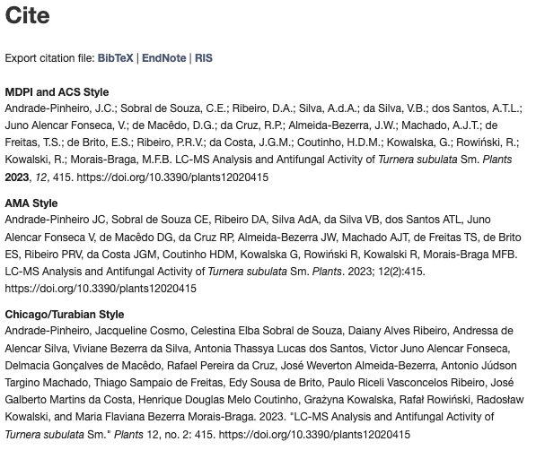
```

---

### Figures

Please keep in mind that **a figure can convey a lot more information than a long text**. Use figures effectively to illustrate comparisons or key points. Your reports should follow the structure presented in section \@ref(structure).

<div class="info">
  <p><strong>💡 Tip:</strong> Focus on presenting clear, concise, and accurate information. Use figures or tables if they help illustrate comparisons between sequencing platforms. Ensure your references are correctly cited and fully listed to support reproducibility.</p>
</div>

---

## Naming Your Document

**Please name your report following this pattern:**  
`SequencingPlatform_Surname`  

> Example: `Illumina_Smith.pdf`

---

## Resources

To support your work on this assignment, the instructor provides **PDF documents** for each sequencing platform. These resources serve as a starting point for understanding the technology and its applications.  

Additionally, students are encouraged to consult:  

- **Primary literature** (e.g., @Satam2023 for an NGS overview; @Marx2023 for long-read sequencing)  
- **Manufacturer websites** for up-to-date technical specifications  
- **Online training platforms** (e.g., EMBL-EBI NGS courses)  
- **Other reputable sources** including publications, Google Scholar, YouTube tutorials, and Wikipedia  

> **Important:** Always provide proper citations for any material you reference. You may choose your preferred citation style, but ensure it is applied consistently throughout your report. Refer to your favorite journals for examples.

---

### Selected Online References

- **An Overview of Next-Generation Sequencing**  
  <https://www.technologynetworks.com/genomics/articles/an-overview-of-next-generation-sequencing-346532>  
- **Illumina Official Website**  
  <https://www.illumina.com/>  
- **PacBio Official Website**  
  <https://www.pacb.com/>  
- **Oxford Nanopore Official Website**  
  <https://nanoporetech.com/>

<button class="btn btn-primary" data-toggle="collapse" data-target="#Illumina">Data on Illumina</button>
<div id="Illumina" class="collapse">    
<object data="Images/Seq_1_Illumina.pdf" width="750px" height="750px">
    <embed src="Images/Seq_1_Illumina.pdf">
    </embed>
</object>
</div>

<button class="btn btn-primary" data-toggle="collapse" data-target="#PacBio">Data on PacBio</button>
<div id="PacBio" class="collapse">    
<object data="Images/Seq_2_PacBio.pdf" width="750px" height="750px">
    <embed src="Images/Seq_2_PacBio.pdf">
    </embed>
</object>
</div>

<button class="btn btn-primary" data-toggle="collapse" data-target="#Nanopore">Data on Nanopore</button>
<div id="Nanopore" class="collapse">    
<object data="Images/Seq_3_Oxford_Nanopore.pdf" width="750px" height="750px">
    <embed src="Images/Seq_3_Oxford_Nanopore.pdf">
    </embed>
</object>
</div>

## Evaluation Rubric (Total: 25 points)

Students will be assessed on their ability to research, synthesize, and communicate information about their assigned sequencing platform. The rubric below outlines how points will be allocated.

| Criteria | Description | Points |
|----------|-------------|-------|
| **Introduction & Background** | Clearly introduces the sequencing platform, including library preparation, DNA requirements, and historical context. Demonstrates understanding of the technology's purpose. | 5 |
| **Platform Overview** | Provides a comprehensive overview of the assigned sequencing system(s), including technical specifications, workflow, and key features. | 5 |
| **Applications & Relevance** | Discusses potential research applications, advantages, and limitations of the sequencing technology. Connects platform capabilities to biological questions. | 5 |
| **Use of Resources & Citations** | Properly cites all sources used (primary literature, websites, databases, PDFs). Web resources include author, title, URL, and access date. Consistent citation style is applied throughout. | 5 |
| **Clarity, Organization & Formatting** | Report is well-structured (title page, main text, references). Ideas are presented logically, concisely, and in a readable format. Figures and tables, if included, enhance understanding. Minor formatting errors (e.g., font size, spacing, margins) will result in **up to 1 point deduction**. Major formatting deviations (e.g., missing title page, wrong font, excessive length) may result in **up to 2 points deduction**. | 5 |

**Total:** 25 points

> **Notes:**  
> - Maximum length: 2 pages (excluding title page and references)  
> - Font: Arial 11 pt or Times New Roman 12 pt, single-spaced, 1-inch margins  
> - Figures and tables are encouraged to illustrate key points concisely  
> - Reports will be submitted via the shared Google Drive in the `Mini_Report_1` folder  
> - Students should **strictly follow formatting guidelines** to avoid penalty points.

<hr style="border: 1.5px solid #999; margin: 2em 0;">

# Mini-Report 2 — Molecular Biology Databases {#mini2}

This mandatory assignment contributes directly to the learning outcomes of [**Chapter 3**](https://svenbuerki.github.io/Genomics-Bioinformatics/Chapters.html#5_Chapter_3). To develop a comprehensive understanding of molecular biology databases and their role in genome annotation, students will produce an **individual mini-report** on one of the following major database categories:

- **Molecular database 1:** [Protein sequence databases](#prot) [e.g., @UniProt2014]  
- **Molecular database 2:** [Gene Ontology databases](#GO) [e.g., @GO2020] 
- **Molecular database 3:** [Metabolic pathway databases](#KEGG) [e.g., @KEGG2022]  

---

## Background Information

Each student is assigned one molecular database category (see the [Google spreadsheet](https://docs.google.com/spreadsheets/d/1cRM1yasUfDa98ecyz_-RxUOw8cU4wkQx4O5Wxw3y4yU/edit?usp=sharing)).

This **individual assignment is mandatory and graded**. Treat this task as an opportunity to deepen your understanding of how biological databases support genome annotation while strengthening your scientific writing skills.

Time is allocated in class on week 5, to work on this assignment. Reports are due on **February 20, 2026** (by 5PM MT), and must be uploaded to the shared [Google Drive](https://drive.google.com/drive/folders/1BFZFJeR8tW8N7QLfngqIVbjqEkDuIyWj?usp=sharing) in the `Mini_Report_2` folder.

---

## Structure of Mini-Reports {#structure2}

Your report should clearly address the following components:

- A brief overview of the **purpose and mission** of your assigned molecular database category  
- An overview of the **major databases** within this category  
- An explanation of how these databases **contribute to genome annotation**, including strengths and limitations  
- A survey of **bioinformatics tools and interfaces** used to query, access, and analyze these databases  
- Additional information specific to your data repositories that supports understanding and use  

---

## Reporting Format

Follow the **same formatting guidelines** used for **Mini-Report 1**.

> **Notes:**  
> - Maximum length: 2 pages (excluding title page and references)  
> - Font: Arial 11 pt or Times New Roman 12 pt, single-spaced, 1-inch margins  
> - Figures and tables are encouraged  
> - Submit via Google Drive in the `Mini_Report_2` folder  
> - Failure to follow formatting rules results in penalty points  

---

## Format to Name Document

**Name your file using the following format:**  
`Molecular_database_Surname`

---

## Resources

The instructor provides the following summaries to help you begin. You are encouraged to use information presented in [**Chapter 3**](https://svenbuerki.github.io/Genomics-Bioinformatics/Chapters.html#5_Chapter_3), together with external literature and web resources, to build your report. All claims must be supported with **proper citations**, following the guidelines used in Mini-Report 1.

---

### Protein Sequence Databases {#prot}

Three major protein sequence databases exist:

- **PIR** (Protein Information Resource, USA): <http://pir.georgetown.edu>  
- **SWISS-PROT** (Switzerland): <http://www.uniprot.org/statistics/Swiss-Prot>  
- **TrEMBL** (United Kingdom): <http://www.uniprot.org/statistics/TrEMBL>  

In 2002, these databases formed the **UniProt Consortium** [@UniProt2014]. UniProtKB is available at <http://www.uniprot.org> and plays a central role in gene annotation. UniProt integrates Gene Ontology annotations (see below) and provides tools such as <http://www.uniprot.org/uploadlists/>.

---

### Gene Ontology {#GO}

The **Gene Ontology (GO)** [@GO2020] (<http://www.geneontology.org>) provides a structured vocabulary to describe gene functions. GO classifies gene products along three axes:

- **Cellular Component** – where a gene product functions  
- **Biological Process** – what broader biological goal it contributes to  
- **Molecular Function** – the biochemical activity performed  

GO terms are integrated into UniProt and can be explored using tools such as  
<http://amigo.geneontology.org/amigo/search/annotation>.

---

### Metabolic Pathway Databases {#KEGG}

The **Kyoto Encyclopedia of Genes and Genomes (KEGG)** [@KEGG2022] (<http://www.genome.jp/kegg/>) integrates genomic, biochemical, and pathway information. KEGG links:

- Genes  
- Proteins  
- Compounds  
- Metabolic and regulatory pathways  
- Orthologous gene families  

This integration allows comparative analyses of metabolic and regulatory systems across organisms.

---

## Evaluation Rubric (25 points total)

| Category | Description | Points |
|----------|-------------|--------|
| **Scientific Accuracy & Depth** | Demonstrates correct understanding of the database type and its role in genome annotation | 8 |
| **Coverage of Assigned Topics** | Addresses all required components listed in the report structure | 6 |
| **Critical Analysis** | Evaluates strengths, limitations, and practical uses of the database | 5 |
| **Clarity & Organization** | Well-structured, logical flow, and clear writing | 4 |
| **References & Citation Quality** | Appropriate use of peer-reviewed and authoritative sources | 2 |

**Formatting penalties:**  
Up to **–5 points** may be deducted for failure to follow formatting, naming, or submission guidelines.

<hr style="border: 1.5px solid #999; margin: 2em 0;">

# Mini-Report 3 — DNA-based Species Identification and Phylogenetic Inference {#mini3}

## Learning Outcomes

This Mini-Report will help you develop conceptual understanding and practical skills in DNA-based species identification and phylogenetic inference.

- **Explain how DNA sequence data are used in scientific studies to investigate biological variation, species boundaries, and evolutionary relationships**  
  - *How:* By analyzing and discussing @Ellestad2022AJB during the [group activity](#grpactivity_vanilla) and linking genetic evidence to biological interpretations.

- **Correctly use terminology associated with DNA barcoding and phylogenetic analyses**  
  - *How:* By applying key terms in discussions, bioinformatics exercises, and your written report, and by consulting the [Lexicon](Lexicon.html) throughout the assignment.

- **Process and curate raw DNA sequence data generated using Sanger sequencing**  
  - *How:* By editing, trimming, and validating ITS DNA sequence electropherograms obtained from PCR products during in-class bioinformatics work.

- **Evaluate DNA sequence identity and formulate a species working hypothesis using similarity-based approaches**  
  - *How:* By conducting BLAST searches against sequences in [GenBank](https://www.ncbi.nlm.nih.gov/genbank/) [@GenBankP] and interpreting match quality, alignment metrics, and taxonomic patterns.

- **Retrieve and organize comparative DNA sequences for phylogenetic analysis**  
  - *How:* By querying GenBank and downloading relevant sequences using `R` [@R] packages to construct your analysis dataset.

- **Construct multiple DNA sequence alignments of homologous regions**  
  - *How:* By generating and refining alignments that include both your sequences and reference sequences using `MUSCLE` [@edgar2004muscle] implemented in `MEGA` [@kumar2018mega].

- **Apply phylogenetic methods to infer evolutionary relationships**  
  - *How:* By performing phylogenetic inference under the **Maximum Likelihood** criterion using RAxML [@Stamatakis2014] and using the resulting trees to test and refine species hypotheses under the phylogenetic species concept [@wheeler1999phylogenetic].

- **Interpret and communicate phylogenetic trees as evolutionary hypotheses**  
  - *How:* By visualizing trees using `R` [@R] packages and explaining how tree structure relates to species identity, genetic divergence, and evolutionary relationships in your report.

The skills you develop here using Sanger sequence data will prepare you to work with next-generation sequencing data in [Chapter 4](https://svenbuerki.github.io/Genomics-Bioinformatics/Chapters.html#6_Chapter_4) and to carry out the analyses for your [group lab report](https://svenbuerki.github.io/Genomics-Bioinformatics/Mining_draft_genome.html).

---

## Publications

This mini-report is primarily based on the following publication:

- @Ellestad2022AJB — **DNA barcoding and phylogenetics of *Vanilla***
  - Online publication:  https://doi.org/10.1002/ajb2.16024

Additional references are provided throughout each section to help you master the material covered in this assignment.

---

## Workflow and Scientific Focus

This mini-report guides you step by step through a research-style investigation, combining scientific reasoning with hands-on bioinformatics analyses. Throughout this project, you will work with DNA barcode data to determine the species identity of several vanilla samples and interpret your findings within an evolutionary framework.

The assignment is organized into the following sections:

- [**Group activity**](#grpactivity_vanilla): You will collaboratively read and discuss the publication that forms the foundation of Mini-Report 3. This activity introduces the biological context, research questions, and types of DNA evidence used to study species boundaries.
- [**Theoretical background**](#IntroMR3): This section presents the key concepts needed for the report, including scientific questions, hypotheses (and predictions), methodology, data availability, and report structure and formatting. Use this section as a reference while completing your analyses and writing your report.
- [**Scientific question and analytical framework**](#sciq): This section introduces the specific scientific question, hypothesis, and analytical approach that you will investigate in this assignment.
- **Bioinformatics analyses:** You will perform the analytical steps used to replicate part of a published study. These hands-on activities connect theory to real DNA sequence data.
    - [**Data structure and workflow**](#datastrworkflow): Overview of the data used in this assignment and the project organization supporting your analyses.
    - [**Part 1**](#part1): Process and clean ITS DNA sequence electropherograms and develop a species working hypothesis.  
    - [**Part 2**](#part2): Retrieve DNA sequences and prepare comparative datasets.  
    - [**Part 3**](#part3): Perform multiple sequence alignment and phylogenetic inference.
- [**Writing the report**](#report): This section provides detailed guidelines to help you write and organize your individual mini-report, including how to interpret and present your results as scientific evidence.
- [**Evaluation rubrics**](#minireport3rubrics): This section describes the criteria and rubrics used to evaluate your mini-report.


---

## 🤝 Group Activity: Interpreting DNA Evidence in a Species Study {#grpactivity_vanilla}

### Learning Outcome

Students read and analyze @Ellestad2022AJB to understand how DNA sequence data are used to interpret biological variation and species boundaries. This activity provides the **scientific context** for **Mini-Report 3**, in which you will replicate part of this study using Sanger sequence data.

---

### Activity Overview

In this **1 hour and 20 minutes** in-class group activity, students work in groups of **3–4** to explore how researchers use DNA sequence data to understand biological diversity in *Vanilla*.

The purpose of this activity is to help you:

- Understand the **broader scientific questions** addressed in the study  
- See how different types of DNA data contribute to testing biological hypotheses  
- Connect **DNA barcoding** and **phylogenetics** to species delimitation  
- Prepare to **replicate part of this research workflow** using Sanger sequencing data in Mini-Report 3  

---

### Materials

- @Ellestad2022AJB — [**DNA barcoding and phylogenetics of Vanilla**](https://doi.org/10.1002/ajb2.16024) 
- [Lexicon](https://svenbuerki.github.io/Genomics-Bioinformatics/Lexicon.html)  
- [Theoretical background](#IntroMR3) section, which provides additional support on DNA barcoding and phylogenetic concepts  

---

## Activity Structure <span style="color:gray;">(1 h 20 min)</span>

### Part 1 — What Is This Study Trying to Explain? <span style="color:gray;">(20 minutes)</span>

Groups [read](https://doi.org/10.1002/ajb2.16024) the **abstract and introduction**, then discuss:

1. What biological problem or observation motivates this study?  
2. What types of variation are the authors concerned with (morphological, genetic, geographic, etc.)?  
3. What are the main research questions?  
4. Based on the introduction, what do you think is the **working hypothesis** of this study?

➡️ **Outcome of this section:**  
Groups propose **possible explanations** for why individuals or populations might differ and identify what the study is trying to test.

---

### Part 2 — How Do the Authors Use DNA Data to Test Their Hypothesis? <span style="color:gray;">(25 minutes)</span>

Groups examine the **methods and results**.

Discuss:

- Which DNA regions (markers) are sequenced?  
- What sequencing approaches are used? If more than one is used, what is the role of each?  
- Which parts of the study rely on **Sanger sequencing**?  
- How do the authors analyze the data (e.g., alignments, haplotypes, phylogenetic trees)?  
- What genetic patterns are they looking for to test their hypothesis?

Then consider:

👉 If biological differences reflect **underlying genetic lineages**, what patterns would you expect in the DNA results?  
👉 If differences are **not strongly linked to genetic divergence**, what might the DNA results look like instead?

*Focus on reasoning from the data rather than perfect terminology.*

---

### Part 3 — From DNA Patterns to Biological Meaning <span style="color:gray;">(25 minutes)</span>

Groups interpret the findings in a biological context.

Discuss:

- Do the genetic results show clear, distinct lineages, or more mixed patterns?  
- How do the authors relate DNA patterns to morphology or species identity?  
- What explanations do the authors propose for the observed variation?  
- How do concepts such as **DNA barcoding**, **phylogenetics**, and **monophyly** help interpret these results?

➡️ By the end of this section, groups should be able to describe **two contrasting biological interpretations** that could explain the observed variation.

---

### Part 4 — Group Synthesis and Preparation <span style="color:gray;">(15 minutes)</span>

Groups prepare to share:

- **Two key insights** about how DNA data inform biological interpretation  
- **One explanation** for the observed variation, supported by evidence from the paper  
- Identify **one or two group members** who will share the group’s ideas during the discussion  

Encourage groups to reference specific figures, tables, or results.

---

### Part 5 — Whole-Class Debrief <span style="color:gray;">(15 minutes)</span>

Groups share their interpretations. As a class, we compare:

- Different explanations proposed by groups  
- How DNA evidence supports or challenges each explanation  
- How this study connects **DNA barcoding**, **phylogenetics**, and **species delimitation**  

This discussion highlights how scientists move from **genetic patterns → evolutionary interpretation**, and prepares you to **apply a similar approach using Sanger data** in Mini-Report 3.

---

## Theoretical Background {#IntroMR3}

This section provides additional theoretical background to help you better understand the concepts and methods used in **Mini-Report 3**. You are not expected to memorize every detail, but this material will support your interpretation of DNA barcoding results, phylogenetic analyses, and species delimitation in your report.

### How Many Species Are There On Earth?

Projections of global biodiversity have ranged from 2 to 100 million species [@Larsen2017].

However, these estimates often do not account for **cryptic species**. See, for instance, @dentinger2014s for an example involving porcini mushrooms. In that study, the authors used DNA sequencing to identify three species of mushroom contained within a commercial packet of dried Chinese porcini purchased in London. Surprisingly, none of these species had ever been formally described by science and all required new scientific names.

@Larsen2017 later published a keystone paper predicting **1 to 6 billion species on Earth**. This estimate was based on an average of six cryptic species per described species.

Overall, the data presented here demonstrate that **most species on this planet are either poorly known or still awaiting formal description**.

In this context, the fields of genetics and genomics (more specifically [DNA barcoding](#barcode)) and phylogenetics have the potential to contribute to:

- Species identification and naming (taxonomy)  
- Inferring evolutionary frameworks that help develop working hypotheses on species boundaries, relationships, and their spatio-temporal histories (e.g., understanding how species coped with past climatic conditions can provide insights into their adaptive capacity under future climate scenarios)

Approaches combining these objectives have been applied across many lineages. See, for instance, a study describing a new species in the soapberry family (Sapindaceae) endemic to Fiji [@buerki2017alectryon]. In that study, phylogenetic analysis was used to confirm the new taxon and place it within a broader evolutionary and biogeographical framework. This evidence was then combined with occurrence data to infer extinction risk following IUCN guidelines.

---

### DNA Barcoding: Species Identification {#barcode}

The Consortium for the Barcode of Life ([CBOL](https://www.ibol.org/phase1/cbol/)) is an international initiative devoted to developing DNA barcoding as a global standard for identifying biological species. CBOL includes more than 130 member organizations from over 40 countries [@CBOL].

**DNA barcoding** is a method of species identification that uses a short, standardized region of DNA from one or more genes. The premise of DNA barcoding is that, by comparison with a reference library of sequences, an unknown DNA sequence can be used to identify an organism at the species level. This is analogous to a supermarket scanner using the black stripes of a UPC barcode to identify an item in its database [@CBOL].

DNA barcodes are used to identify unknown species, parts of organisms, or to catalog biodiversity. They can also be compared with traditional taxonomy to help define species boundaries. For more details on plant DNA barcoding, see the section [below](#vanbarcode) dedicated to *Vanilla*.

DNA barcoding has a wide range of applications, including biodiversity surveys [e.g., @telfer2015biodiversity], monitoring illegal wildlife trade [e.g., @gonccalves2015dna], and food authentication [e.g., @quinto2016dna]. The approach has been comprehensively reviewed by @deSalle2019.

#### Procedure

A DNA barcoding workflow generally includes four steps:

1. Isolate DNA from the target sample.  
2. Amplify the target DNA barcode region using PCR.  
3. Sequence the PCR products using either Sanger sequencing or next-generation sequencing (NGS; often on Illumina platforms).  
4. Compare the resulting sequences against reference databases to identify matching species. In this course, we will use DNA sequences from [GenBank](https://www.ncbi.nlm.nih.gov/genbank/) as our reference database [@GenBankP]. See Chapter 3 for more details on GenBank.

---

### Phylogenetic Inference

As described in @Masters2017, **phylogenetic inference is the process of reconstructing the evolutionary history of related species by grouping them into successively more inclusive sets based on shared ancestry**. Homologous characters are similar because they are inherited from a common ancestor, and they are the primary source of information for phylogenetic reconstruction. In contrast, homoplasies are characters that appear similar but evolved independently from different ancestral states. Homoplasy can mislead interpretations of evolutionary history.

Both molecular and morphological datasets can be affected by homoplasy. **Phylogenetic methods aim to distinguish between homologous (signal) and homoplastic (noise) similarities.** Molecular datasets are often large and are analyzed using statistical methods

---

## Scientific Question and Analytical Framework {#sciq}

In this assignment, you will investigate the following question:

> **To which species of *Vanilla* do the individuals presented in Figure \@ref(fig:van) belong?**

To address this question, you will work with **four vanilla samples** (Figure \@ref(fig:van)) and their associated ITS DNA barcode sequences, along with ITS sequences from related species available in GenBank. Additional details about the scientific reasoning behind this investigation are provided in the [Scientific process section](#sciprocess).

```{r van, echo=FALSE, fig.align="center", fig.cap="Images of the four samples of vanilla collected in Mexico studied in this project.", fig.show="asis", out.width='100%'}
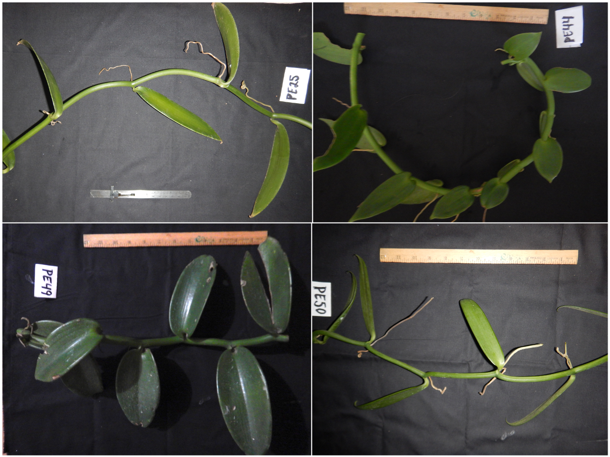
```

Throughout the project, these vanilla individuals will be referred to as:

- *PE25*  
- *PE44*  
- *PE49*  
- *PE50*

### Question, Hypothesis, and Methodology {#sciprocess}

Our overarching research question is:

> **To which species of *Vanilla* do the individuals presented in Figure \@ref(fig:van) belong?**

Based on the background information provided earlier, we will test the following **hypothesis**:

> The four individuals belong to the same species (*Vanilla planifolia*), and the observed phenotypic differences are due to phenotypic plasticity (responses to contrasting environmental conditions) rather than evolutionary divergence.

We will evaluate this hypothesis using the **phylogenetic species concept** [@wheeler1999phylogenetic], particularly the criterion of **monophyly**.

**Prediction:**  
If the hypothesis is correct, all four individuals will cluster together in a single, well-supported monophyletic clade with reference sequences of *V. planifolia*.

To test this prediction, we will compare ITS barcode sequences generated for our four samples with ITS sequences from related species available in GenBank.

### Methodological Overview

Your analyses will follow these main steps:

1. **Generate ITS barcode data** for the four target individuals using PCR and Sanger sequencing (raw data are provided).  
2. **Assemble a comparative ITS dataset** by retrieving reference sequences from GenBank using `R`.  
3. **Conduct similarity and phylogenetic analyses**  
   - Use BLAST to assess sequence similarity  
   - Infer evolutionary relationships using Maximum Likelihood phylogenetic analysis in RAxML (including bootstrap support)  
4. **Visualize and interpret phylogenetic trees** using `R` to evaluate whether the samples form a monophyletic group and to test the working hypothesis.

Finally, you will integrate evidence from sequence similarity, phylogenetic clustering, bootstrap support values, and taxonomic information from GenBank to determine the most likely species identity of your samples. See Section \@ref(report) for guidelines on how to present and interpret this evidence in your report.

---

## Data Structure and Workflow {#datastrworkflow}

The data for Mini-Report 3 are deposited on Google Drive in the [`DNA_barcoding`](https://drive.google.com/drive/folders/1iBMwP67FoSTMDX-EpXOlf8utP9k8tu8k?usp=drive_link) folder. 

This folder contains all data and working files required for your assignment. The directory is organized to reflect the typical workflow of a DNA barcoding project, moving from raw biological material to analyzed sequence data.

### 📁 Folder Structure

#### `01_Field_images`

Photographs of the sampled plants used in this project.

These images:

- Provide **morphological context** for the samples  
- Help connect **physical specimens** to the DNA sequences you will analyze  
- May be useful when discussing **species identity** in your report  

#### `02_Raw_ITS_data_ab1`

Raw **Sanger sequencing chromatogram files** (`.ab1` format).

These files:

- Contain the **original electropherogram data** generated from ITS PCR products  
- Must be **opened, inspected, and edited** using software such as **FinchTV**  
- Represent your **starting point** for sequence cleaning and validation  

🔬 **Your task in Part 1 begins here**

#### `03_Processed_ITS_data_FASTA`

This is where **you will save your cleaned DNA sequences**.

After processing the `.ab1` files, you should:

1. Trim low-quality ends  
2. Remove ambiguous base calls where possible  
3. Export the cleaned sequences in **FASTA format**

Each file in this folder should contain:

- A **clear sequence name** (including your sample ID)  
- The **edited ITS DNA sequence**

These sequences will be used later for:

- BLAST searches  
- Building datasets for phylogenetic analysis  

#### `04_Data_analyses`

This folder will contain files generated during downstream analyses.

Examples include:

- BLAST results  
- Alignment files  
- Phylogenetic trees  
- Any intermediate or final analysis outputs  

📊 Think of this as the folder for **results and derived data**, not raw data.

#### `PART2_Vanilla.R`

R script used in **Part 2** of the project.

You will use this script to:

- Retrieve DNA sequences from GenBank  
- Prepare datasets for phylogenetic analyses  

You do **not** need this file yet for Part 1, but keep it in this directory for later steps in Mini-Report 3.

### 🧬 Workflow Overview

This folder structure follows the logical progression of a DNA barcoding study:

1. **Specimen context** → `01_Field_images`  
2. **Raw sequence data** → `02_Raw_ITS_data_ab1`  
3. **Cleaned DNA sequences** → `03_Processed_ITS_data_FASTA`  
4. **Analyses and results** → `04_Data_analyses`

Understanding this workflow will help you:

- Keep your data organized  
- Maintain reproducibility  
- Clearly explain your methods in Mini-Report 3  

### ✅ Good Data Practices

- Do **not modify** files in `02_Raw_ITS_data_ab1`  
- Always keep an **original raw-data copy** untouched  
- Use **clear and consistent file names** when saving processed sequences  
- Keep analysis outputs inside `04_Data_analyses`

Good organization is part of good science.

If you are unsure where a file belongs, ask yourself:  
**Is this raw data, processed data, or analysis output?**


## Bioinformatics Part 1 {#part1}

### Aim

> Process and clean ITS DNA sequence electropherograms and infer species working hypothesis.

### Bioinformatics Tools

The bioinformatics tools used in part 1 are as follows:

1. `FinchTV`: A popular desktop software developed by Geospiza, Inc. for viewing trace data from Sanger DNA Sequencing. `FinchTV` is freely available and operates on Windows and Mac platforms. Start by downloading and installing the software on your computers at this URL: https://digitalworldbiology.com/FinchTV
2. `BLAST`: The Basic Local Alignment Search Tool [BLAST, @ALTSCHUL1990403] will be applied onto cleaned DNA sequences to:
    - Confirm that the DNA sequences correspond to the correct DNA region (here ITS region).
    - Validate that DNA sequences belong to the right taxon (here belonging to the genus *Vanilla*) and are therefore not contaminated.
    - Provide species working hypotheses using the distance-tree approach implemented on the online version of BLAST.

Although `BLAST` can be run locally, we will be using the web portal available here: https://blast.ncbi.nlm.nih.gov/Blast.cgi

### DNA Sequence Data Cleaning Procedure

When evaluating `.ab1` files (= raw DNA data from an [Applied Biosystems' Sequencing instrument](https://www.thermofisher.com/us/en/home/life-science/sequencing/sanger-sequencing/sanger-sequencing-technology-accessories.html) containing an electropherogram showing the Phred scores and the DNA base sequence), you should first see the electropherogram and come to a conclusion whether your data can be considered of good quality or not.

Good quality sequencing data/positions are characterized by:

- Well-defined peak resolution (bad resolution of the first 10-25 bases is acceptable; see Figure \@ref(fig:finchtv)). The Phred score is displayed at top of the window (see bars on Figure \@ref(fig:finchtv)).
- Uniform peak spacing.
- High signal-to-noise ratios.

Bad quality sequencing data/positions are characterized by:

- Presence of "N"s in the sequence. Indeed, when the base-calling software is unable to accurately identify a nucleotide, it will score it as "N" (meaning that it can be any base; see Figure \@ref(fig:finchtv)). In this tutorial, we will open files individually and search for peaks scored as "N"s. If we can confidently correct those peaks/positions (to either "A/T/C/G or any other IUPAC code; see below) then we will edit the sequence accordingly. To keep track of changes, it is standard procedure to identify edited peaks/positions by using lower cases letters (instead of capital letters as set by default). See below for more details on cases of base polymorphism.

We will be discussing this topic further during class.

```{r finchtv, echo=FALSE, fig.align="center", fig.cap="Screenshot of FinchTV app.", fig.show="asis", out.width = '100%'}
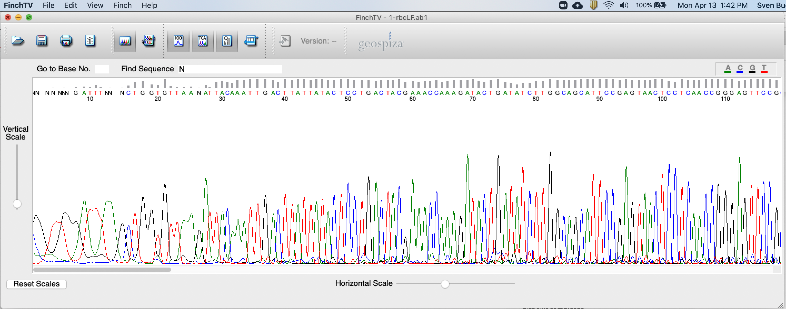
```

### IUPAC Codes

Nuclear DNA regions such as ITS could show evidence of recombination. This means that there could be polymorphism at a specific base [also know as single-nucleotide polymorphism or SNP; see @Poplin2018 for bioinformatics technics to identify SNPs based on NGS data]. The signature of recombination in an electropherogram would be recognized by the occurrence of "peak under peak" (Figure \@ref(fig:peakunderpeak)). The International Union of Pure and Applied Chemistry (IUPAC) has defined a standard representation of DNA bases by single characters that specify either a single base (e.g. G for guanine, A for adenine) or a set of bases (e.g. R for either G or A). UCSC uses these single character codes to represent multiple observed alleles of single-base polymorphisms (Table \@ref(tab:IUPAC)).

```{r peakunderpeak, echo=FALSE, fig.align="center", fig.cap="Screenshot of DNA sequence electropherogram showing signature of peak under peak suggesting recombination.", fig.show="asis", out.width = '20%'}
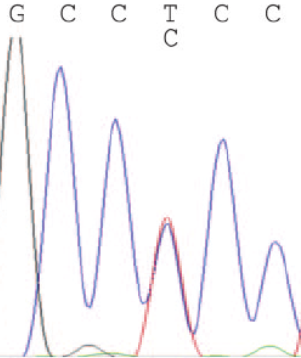
```

```{r IUPAC, echo=FALSE, warning=FALSE}
#library(bookdown)
# Load the tab delimited table
IUPAC <- read.csv(file="Images/IUPAC.txt", sep='\t')
colnames(IUPAC)[1] <- gsub("[.]", " ", colnames(IUPAC)[1])
knitr::kable(IUPAC, caption = "IUPAC codes used to score base polymorphism. This is especially useful when analyzing nuclear DNA regions.")
```

### Step-by-step Protocol

Here, we will be using `its25-ITSp4.ab1` as an example for the analysis. This file is located in `DNA_barcoding/02_Raw_ITS_data_ab1`.  

1. Download the [`DNA_barcoding/`](https://drive.google.com/drive/folders/1iBMwP67FoSTMDX-EpXOlf8utP9k8tu8k?usp=drive_link) folder onto your computers.
2. Launch `FinchTV`. To download it, click [here](https://digitalworldbiology.com/FinchTV).
3. Open `.ab1` file (one at a time) using the `File --> Open...` tab or by dragging your `.ab1` file in the main window. 
4. Make sure that the `Base Position Numbers`, `Base Calls` and `Quality Values` settings are ticked using the `View` tab (Figure \@ref(fig:finchtv)).
5. Trim the first 10-20 bp of the sequence. This is done by selecting bases using the `Shift` command and then pressing `Delete` (Figure \@ref(fig:finchtvtrim)).

```{r finchtvtrim, echo=FALSE, fig.align="center", fig.cap="Screenshot of FinchTV app showing trimming procedure.", fig.show="asis", out.width = '90%'}
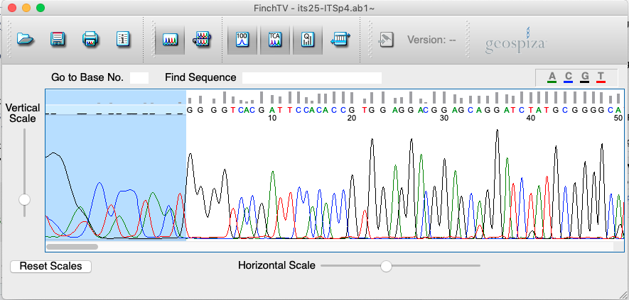
```

6. Scroll through the sequence and edit "N" peaks/positions by replacing those with lower cases "a/t/c/g". If you are unable to call the nucleotide, do not edit the position. In the example, position 10 was edited to "g" (Figure \@ref(fig:finchtedit)).

```{r finchtedit, echo=FALSE, fig.align="center", fig.cap="Screenshot of FinchTV app showing editing procedure.", fig.show="asis", out.width = '90%'}
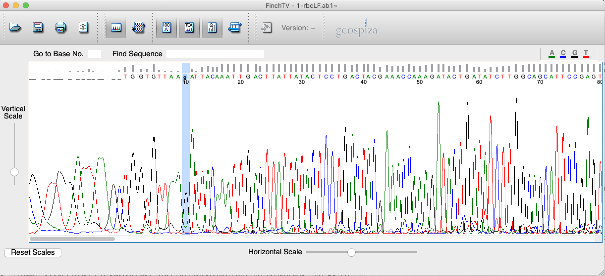
```


7. Peaks at the end of the sequences will become more rounded and harder to call. It is therefore standard procedure to trim the last 10-30 bp/positions. Please trim these bp following the procedure explained above. In the example, the quality drops around position 670 (see Figure \@ref(fig:finchtvtrimend)).

```{r finchtvtrimend, echo=FALSE, fig.align="center", fig.cap="Screenshot of FinchTV app showing trimming procedure at the end of the sequence.", fig.show="asis", out.width = '90%'}
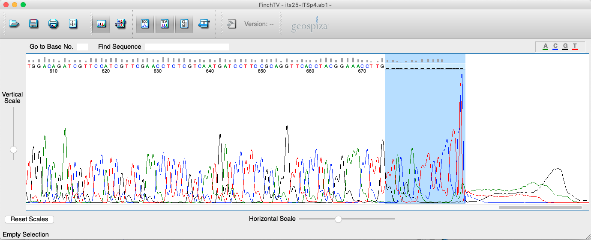
```

8. Save cleaned sequence in `FASTA` format in `03_Processed_ITS_data_FASTA`. Exporting the cleaned sequence is done by pressing `File -> Export -> DNA Sequence: FASTA`. Please do not rename file, leave it as proposed by `FinchTV`. The file is saved in interleaved FASTA format as shown in Figure \@ref(fig:fasta).

```{r fasta, echo=FALSE, fig.align="center", fig.cap="Screenshot of cleaned FASTA sequence as outputted by FinchTV.", fig.show="asis", out.width = '80%'}
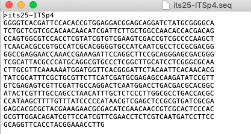
```

9. Open fasta file in a text editor and copy DNA sequence (including header starting with `>`; see Figure \@ref(fig:blast1)). 
10. Go on the BLAST website by clicking [here](https://blast.ncbi.nlm.nih.gov/Blast.cgi?PROGRAM=blastn&PAGE_TYPE=BlastSearch&LINK_LOC=blasthome) and copy your DNA sequence as shown in Figure \@ref(fig:blast1). Click on the `BLAST` button to start your query.

```{r blast1, eval=T, echo=FALSE, fig.align="center", fig.cap="Screenshot of BLAST form where you copy content of its25-ITSp4.seq", fig.show="asis", out.width = '90%'}
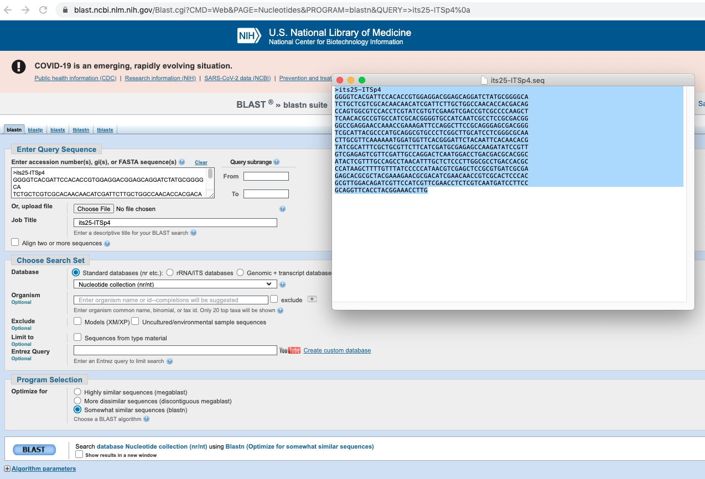
```

11. Inspect the BLAST output to make sure that the top hits are associated to *Vanilla* and refer to the right DNA region (Figure \@ref(fig:blastres)).

```{r blastres, eval=T, echo=FALSE, fig.align="center", fig.cap="Screenshot of BLAST search based on its25-ITSp4. Note that top hits are ITS sequences of Vanilla species.", fig.show="asis", out.width = '90%'}
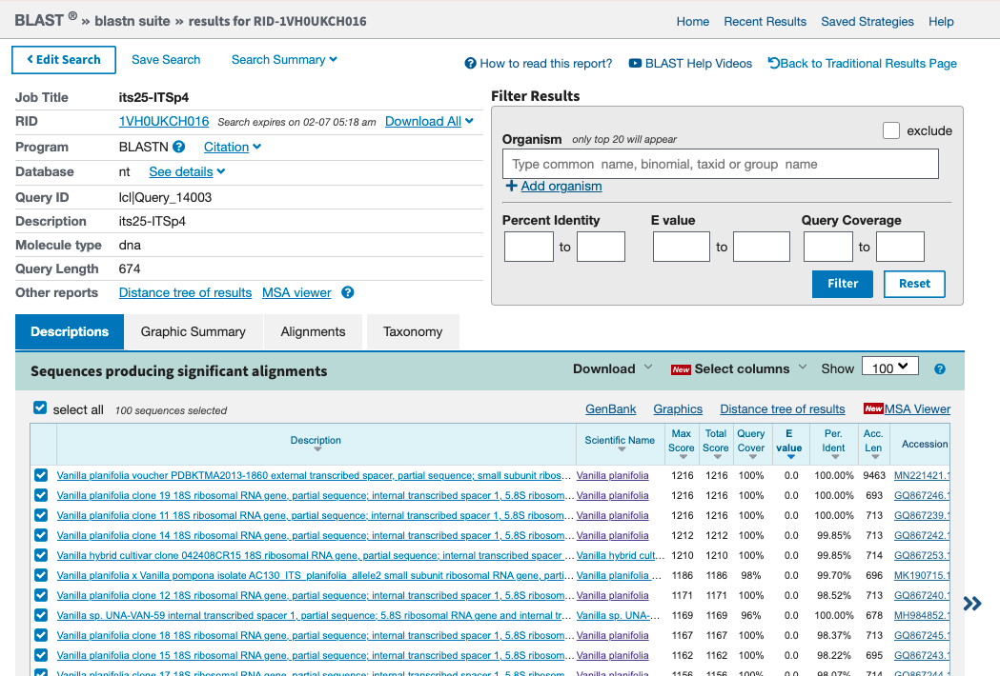
```

12. Click on the `Distance tree of results` link to perform phylogenetic distance analysis showing position of your sequence compared to sequences available on GenBank (see Figure \@ref(fig:blastres)). This will open a new window.

13. Expand tree to locate your DNA sequence by following procedure in Figure \@ref(fig:expandtree).

```{r expandtree, eval=T, echo=FALSE, fig.align="center", fig.cap="Procedure to expand tree to show position of your DNA sequence in phylogeny.", fig.show="asis", out.width = '90%'}
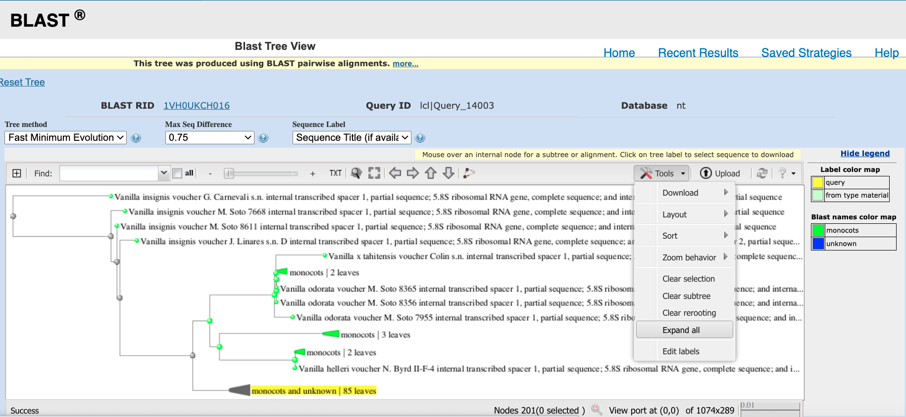
```

14. Use the Zoom toggle to locate your DNA sequence on the tree (see Figure \@ref(fig:DNAtree)).

```{r DNAtree, eval=T, echo=FALSE, fig.align="center", fig.cap="Position of your DNA sequence on tree.", fig.show="asis", out.width = '90%'}
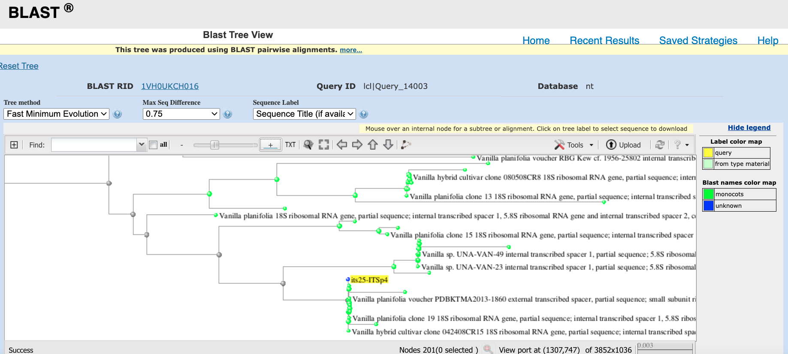
```

15. Open `Vanilla_samples_records.xlsx` and update `Species_BLAST` column with a species name (your first working hypothesis) and add the GenBank accession number of the most closely related DNA sequence deposited on GenBank. Don't forget to save the file.

16. Repeat this procedure until you analyzed all the `ab1` files.

## Bioinformatics Part 2 {#part2}

### Aim

> Retrieve DNA sequences and prepare data for analyses.

### Bioinformatics Tools

To execute Part 2, you need to install the following software and R packages on your computer:

- `R`: https://www.r-project.org
- `RStudio`: https://rstudio.com
    - An overview of RStudio environment is available [here](Images/RStudio_overview.pdf).
- `R` package: 
  - *rentrez* [@rentrez]: https://cran.r-project.org/web/packages/rentrez/index.html

If you don't know how to install an R package, don't worry, this topic is covered [here](#query).

#### R Tutorials

Please find below two documents providing a comprehensive introduction to R:

R for beginners (a tutorial by Emmanuel Paradis): https://cran.r-project.org/doc/contrib/Paradis-rdebuts_en.pdf
An introduction to R: https://cran.r-project.org/doc/manuals/r-release/R-intro.pdf

#### RStudio

RStudio is an **integrated development environment** (IDE) that allows you to interact with R more readily. RStudio is similar to the standard RGUI, but it is considerably more user friendly. It has more drop-down menus, windows with multiple tabs, and many customization options (see Figure \@ref(fig:IDE)). Detailed information on using RStudio can be found at at [RStudio’s website](https://support.rstudio.com/hc/en-us/sections/200107586-Using-RStudio).

```{r IDE, echo=FALSE, fig.cap="Snapshot of the RStudio environment showing the four windows and their content.", fig.show="asis", out.width = '100%'}
knitr::include_graphics("Images/IDE.png")
```

##### Editing and Executing Code in RStudio

Please consult this [RStudio article](https://support.rstudio.com/hc/en-us/articles/200484448-Editing-and-Executing-Code-in-the-RStudio-IDE) to learn more about procedures to edit and execute code in the RStudio environment.

**Tip**: To execute a line of code and send it to the Console you can press `Ctrl+Enter` on Windows or `Command+Enter` on Mac or use the Run toolbar button (see Figure \@ref(fig:IDE)).

#### Introduction to R Built-in Functions

In this course, we will be using built-in R functions that are implemented in packages.

Functions are useful when you want to perform a certain task multiple times. A function accepts input **arguments** and produces the output by executing valid R commands that are inside the function.

Arguments have associated **data types** that need to be entered by the user to execute the function and retrieve its output(s).

The basic R data types are as follows:
    
  - `numeric`: Numbers, written as either integers or decimals.
  - `integer`: Whole numbers without any decimal point.
  - `character` (a.k.a string): A sequence of characters (declared between "" or '')
  - `logical` (a.k.a. boolean): Binary values, TRUE or FALSE.
  - `vector`: Elements of a vector using subscripts (using this syntax `c(1,2,3)`).
  - `matrix`: A matrix from the given set of values (using this function `matrix(ncol = 2, nrow = 3)`).
  - `data.frame`: Data frames are data displayed in a format as a table. Data frames can have different types of data inside it. While the first column can be `character`, the second and third can be `numeric` or `logical`. However, each column should have the same type of data.

We store/save outputs of built-in functions in **variables**. `R` does not have a command for declaring a variable. A variable is created the moment you first assign a value to it. To assign a value to a variable, use the `<-` sign. For instance:

```{r echo = T, eval = T}
# Assign output of simple math to variable
x <- 2+2

# You can call variable as follow
x
```

To know the **class** of data stored in a variable, you can use the *class()* function as follows:

```{r echo = T, eval = T}
# What is the class of x
class(x)
```

Finally, you can retrieve the **documentation** associated with a built-in function by using the following syntax:

```{r echo = T, eval = T}
# Pull up documentation for class function
?class()
```

### Analytical Workflow 

To prepare for the Maximum Likelihood (ML) phylogenetic analysis conducted in [Part 3](#part3), you will implement the following analytical workflow:

1. **Expand taxon sampling** for phylogenetic analyses by downloading ITS DNA sequences of *Vanilla* species deposited in GenBank:  
    - Use functions from the *rentrez* `R` package [@rentrez] to retrieve DNA sequences and associated metadata.  
    - Build a table linking species taxonomy to GenBank accession numbers.  
    - Clean and curate the dataset, and export the results in `FASTA` and `csv` formats.  

2. **Format and merge your ITS sequences** generated in Part 1 into a single `FASTA` file:  
    - Create a list of all `.seq` files.  
    - Read each file and merge the sequences into a single object using a `for` loop.  
    - Export the merged sequences as a `FASTA` file.  

3. **Combine and prepare the full dataset for phylogenetic analysis:**  
    - Merge the reference sequences from GenBank with your sequences.  
    - Perform a multiple sequence alignment (MSA) to prepare the dataset for phylogenetic inference.

Detailed protocols for each step are provided in the sections below. These steps will prepare the complete, curated dataset required to infer evolutionary relationships and test your species hypothesis.

### Guided Bioinformatics Workflow

In this section, you will learn how to search [GenBank](https://www.ncbi.nlm.nih.gov/genbank/) for ITS sequences of *Vanilla* species using the *rentrez* `R` package [@rentrez], and how to merge these reference data with your own sequences generated in [Part 1](#part1).

These analyses will be conducted **collaboratively in class in small groups composed of both undergraduate and graduate students**. This group structure is designed to promote **peer-to-peer learning**, allowing students to support each other in developing bioinformatics skills, troubleshooting code, and interpreting results. By working together and discussing each step, all students will gain the practical and conceptual knowledge needed to independently perform similar analyses in future assignments.

During these sessions, you are expected to **actively participate**, **carefully review and run the code**, and **adapt it to retrieve and prepare the ITS sequences required for your analysis**. The workflow is organized into the following steps:

1. [Get familiar with the required R package and workflow structure](#introentrez)  
2. [Load packages and create a GenBank search query](#query)  
3. [Download DNA sequences from GenBank](#retrieveDNAseq)  
4. [Retrieve and examine sequence metadata](#fetchmetadata)  
5. [Clean and organize the dataset using metadata](#tidydata)  
6. [Export cleaned datasets in `FASTA` and `csv` formats](#writeresults)  
7. [Combine your `.seq` files into a single `FASTA` file](#mergepart1)  
8. [Merge all sequences and prepare the dataset for multiple sequence alignment](#mergeformsa)  

---

#### Get Familiar with the Required R Package and Workflow Structure {#introentrez}

##### Overview of the Approach

As a group, you will implement the following workflow to download (here referred to as "fetch") and prepare DNA sequence data from GenBank using the *rentrez* `R` package [@rentrez]. Each step will be explained in class, and you will execute and discuss the code together to ensure that everyone understands both the purpose and function of each command.

The following pseudo-code summarizes the process:

1. Build a GenBank query  
   - **Function:** *paste0()*  

2. Search GenBank using the query to retrieve unique IDs associated with target DNA sequences  
   - **Function:** *rentrez::entrez_search()*  

3. Fetch GenBank DNA sequences using unique IDs  
   - **Function:** *rentrez::entrez_fetch()*  

4. Link the GenBank database with other databases (e.g., Taxonomy) to retrieve unique IDs of additional data associated with the DNA sequences  
   - **Function:** *rentrez::entrez_link()*  

5. Fetch additional metadata associated with the sequences  
   - **Function:** *rentrez::entrez_fetch()*  

This structured approach will allow you to build a curated dataset suitable for downstream phylogenetic analyses.

##### Create an R Script

Before delving into the code, complete the following steps:

> **Important:** Before starting, make sure you have downloaded the `DNA_barcoding` folder from [Google Drive](https://drive.google.com/drive/folders/1iBMwP67FoSTMDX-EpXOlf8utP9k8tu8k?usp=drive_link) and saved it on your computer. All analyses for Mini-Report 3 will be conducted within this folder. You will also need to adjust the `setwd()` command provided in the code below so that it matches the location of this folder on your system.

1. Launch `RStudio`.  
2. Create a new `.R` script (`File > New File > R Script`).  
3. Save the `.R` script at the **root of your project folder** (`DNA_barcoding/`) using the following naming format:  

   `01_PART2_YOUR_NAME.R`

4. Open the script and update the `setwd()` command so that it points to the correct path of your `DNA_barcoding` folder on your computer (see the R code below).

> ⚠️ **Troubleshooting tip:**  
> The most common error at this stage is:  
> `Error in file(file, "r") : cannot open the connection`  
>
> This error almost always means that your **working directory is incorrect**.  
>
> To fix this:
> - Verify that the `DNA_barcoding` folder is on your computer  
> - Confirm that your `.R` script is saved inside this folder  
> - Carefully update the `setwd()` path so it exactly matches your folder location  

All the R code provided below will be copied into this script and executed **collaboratively during class sessions**, with time allocated for discussion, troubleshooting, and interpretation. The full R script is also available on [Google Drive](https://drive.google.com/drive/folders/1iBMwP67FoSTMDX-EpXOlf8utP9k8tu8k?usp=drive_link).

#### Load Packages and Build a GenBank Query {#query}

This R code uses *rentrez* functions to interact with [GenBank](https://www.ncbi.nlm.nih.gov/genbank/) and the nucleotide database to remotely retrieve data based on your query.

```{r query, eval=F}
###~~~
#Check if package is installed if not then install it
###~~~
if("rentrez" %in% rownames(installed.packages()) == FALSE){
  print("Install rentrez")
  install.packages("rentrez")
  }else{
    print("rentrez is installed!")
}

###~~~
#Load package
###~~~
library(rentrez)

###~~~
#Set working directory
###~~~
#Set working directory to path leading to DNA_barcoding folder
# WARNING: This path as to be adapted to match your computer
setwd("~/Documents/Class_Genomics&Bioinfo_Spring/DNA_barcoding/")

#Check that working directory is set correctly
getwd()

###~~~
#Build a query
###~~~

#Taxon
sp <- "Vanilla"

#DNA region: here ITS
DNA <- "internal transcribed spacer"

#Organism
org <- "Plants"

#Build query: sp AND DNA region
query <- paste0(sp," [All Fields] AND ", DNA," [All Fields] ", org, " [filter]")
```

##### Using Entrez Bollean Operators 

Boolean operators provide a way of generating precise queries that produce well-defined sets of results. The Boolean operators used in [Entrez](https://www.ncbi.nlm.nih.gov/books/NBK3837/) and how they work are as follows.

- **AND**: Finds documents that contain terms on both sides of the operator terms, the intersection of both searches.
- **OR**: Finds documents that contain either term, the union of both searches.
- **NOT**: Finds documents that contain the term on the left but not the term on the right of the operator, the subtraction of the right hand search from the one on the left.

Entrez requires the Boolean operator AND to be entered in uppercase. This is not required in all databases for the other two operators, but it is simplest to enter all of them in uppercase:

`promoters OR response elements NOT human AND mammals`

Entrez processes all Boolean operators in a left-to-right sequence. Enclosing individual concepts in parentheses changes this priority. The terms inside the parentheses are processed first as a unit and then incorporated into the overall strategy. For example, in the following search statement, the union of response element and promoter results is generated first and then is intersected with the result of the g1p3 search.

`g1p3 AND (response element OR promoter)`

#### Retrieve GenBank DNA Sequences {#retrieveDNAseq}

This code enables automatically retrieving DNA sequences based on our query.

```{r retrieve, eval=F}
###~~~
#Retrieve DNA accessions in GenBank
###~~~
GBresults <- rentrez::entrez_search(db = "nuccore", term = query, retmax = 50000)

#How may hits did we get
print(GBresults$count)
```

#### Fetch Sequences Meta-data {#fetchmetadata}

Even when you execute a query directly on the GenBank portal, there will always be sequences that do neither match your target taxon (here *Vanilla*) nor your target DNA region. In this context, it is paramount to retrieve meta-data associated to the DNA accessions (stored in `GBresults`) in order to clean-up your dataset prior to analyses (see next step).

For each DNA sequence the following meta-data are gathered using functions implemented in *rentrez*:

- GenBank DNA accession number.
- Taxonomy.
- Sequence definition line as displayed on GenBank.
- Sequence length (in bp).
- DNA sequence.

Please see the `R` code below for more details on the procedure to retrieve the meta-data. 

**Disclaimer:** The R code below might stop because you do not have an [API](https://en.wikipedia.org/wiki/API) key registered to NCBI and the system might time you out. If it is the case, you will have to edit the `for` loop to pursue downloading the data.

```{r fetch, eval=F}
###~~~
#Fetch meta-data associated to sequences
###~~~

#Use loop to automatically retrieve species, 
# seq definition line, seq length and DNA sequence associated 
# to each DNA accession

#Create empty matrix to be populated
OUT <- matrix(ncol = 5, nrow = length(GBresults$ids))
colnames(OUT) <- c("GenBankID", "Species", "Definition", "Seq_length", "Sequence")

#Add GenBank ID
OUT[,1] <- GBresults$ids
print("Processing sequences: fetching meta-data")
#Set a progress bar
pb <- txtProgressBar(min = 0, max = length(GBresults$ids), style = 3)
for(i in 1:length(GBresults$ids)){
  #Wait time to avoid being timed out by NCBI
  # but it still might happen because you don't have an API key
  Sys.sleep(5)
  
  #Print iteration number to assess progress
  # This info will help reset the loop if your are timed out
  print(paste("Iteration", i, "of", length(GBresults$ids), sep= ' '))
  
  #Download sequence
  seq <- entrez_fetch(db = 'nuccore', id = GBresults$ids[i], rettype = 'fasta', retmode = "text")
  
  #Extract definition line
  OUT[i,3] <- strsplit(seq, split = "\n")[[1]][1]
  
  #Infer seq length
  nbp <- strsplit(seq, split = "\n")
  OUT[i,4] <- as.numeric(length(strsplit(paste(nbp[[1]][2:length(nbp[[1]])], 
                                               collapse=''),"")[[1]]))
  
  #Extract sequence
  OUT[i,5] <- as.vector(paste(nbp[[1]][2:length(nbp[[1]])], collapse = '')[1])
  
  #Fetch taxon ID associated to GenBank accessions
  taxID <- entrez_link(dbfrom = 'nuccore', id = GBresults$ids[i], db = 'taxonomy')

  #Extract taxonomy: genus and species epithet
  tmp <- strsplit(
    strsplit(entrez_fetch(db = 'taxonomy', id = taxID$links, rettype = "native"), 
             split = '\n')[[1]][1]
    , split = ' ')
  
  OUT[i,2] <- paste(tmp[[1]][2:length(tmp[[1]])], collapse = ' ')
  
  # update progress bar
  setTxtProgressBar(pb, i)
}
close(pb)

SEQ <- as.data.frame(OUT)

###~~~
#Write raw data in 04_Data_analyses
###~~~
FileIDRawcsv <- paste(sp, DNA, gsub("-", "_", Sys.Date()), "Raw_GenBank.csv", sep = '_')
#Write FASTA file
write.table(SEQ, 
            paste("04_Data_analyses/CSV/", 
                  FileIDRawcsv, sep = ''), row.names = F, col.names = T, quote = T)
```

Let's have a look at the data downloaded from GenBank:

```{r GenBankquerytab, echo=F, eval=T}
###~~~
#Load Raw GB query csv file
###~~~
RawGBDat <- read.csv("~/Documents/Classes/Class_Genomics&Bioinfo_Spring/DNA_barcoding/04_Data_analyses/CSV/Instructor_files/Vanilla_internal transcribed spacer_2021_02_11_Raw_GenBank.csv", quote = "\"", sep=' ')

#How many DNA sequences did we download from GenBank?
print(paste0("GenBank query retrieved ", dim(RawGBDat)[1], " DNA sequences."))

#Snapshot of matrix
head(RawGBDat, n = 1)
```
##### Reload raw GB query in csv

If you need to restart coding from the previous point, please execute the code below, which will load the Raw GB data from the `CSV` file saved in `04_Data_analyses/CSV`.

To do so, do the following:

- Download the `csv` file produced by the instructor on Google Drive at this path: `DNA_barcoding/04_Data_analyses/CSV/Instructor_files/Vanilla_internal transcribed spacer_2024_02_08_Raw_GenBank.csv`
- Save the file under the right path in `DNA_barcoding`.

```{r reload, eval=F}
###~~~
#Load Raw GB query csv file
###~~~
#If you have saved the SEQ file and need to restart (from SEQ), execute this code
# --> Reload csv file from 04_Data_analyses/CSV/

#Adjust the file name based on your data
SEQfileName <- "Vanilla_internal transcribed spacer_2023_02_14_Raw_GenBank.csv"

#Load the csv in the environment
RawGBDat2 <- read.csv(paste0("04_Data_analyses/CSV/", SEQfileName), quote = "\"", sep = ' ')

#Change name of object to make it compatible with code
SEQ <- RawGBDat2
```

#### Question

> How many ITS DNA sequences where downloaded from GenBank? Write some R code to find out the answer and use the `SEQ` object as input.

#### Tidy the Dataset Based on Meta-data {#tidydata}

Here we apply filters to discard DNA sequences that are:

- Not belonging to the genus *Vanilla* OR to the target DNA barcode (here the ITS region). 
- Contaminated. Previous analysis showed that the *V. mexicana* ITS sequence is corrupted. We are therefore discarding it from our dataset. 
- Identified at genus level. Since these sequences cannot be used as reference to identify species and infer relationships with confidence.
- Either too short (< 500 bp) or too long (>= 1000 bp).

Finally, we are preparing/formatting data for the production of the `FASTA` file.

```{r cleanup, eval=F}
###~~~
#Tidy dataset
###~~~

##
#1. The search retrieved sequences that are NEITHER ITS, NOR Vanilla
##
# Use grep to search for internal (more used than ITS) in definition
# Use grep to search for Vanilla in species
gene <- SEQ[grep("internal", SEQ$Definition),]
gene <- gene[grep("Vanilla", gene$Species),]

##
#2. Previous analysis showed that the V. mexicana sequence is contaminated/corrupted.
##
# We are therefore discarding it from our dataset
gene <- gene[-which(gene$Species == "Vanilla mexicana"),]

##
#3. Discard DNA sequences identified at genus level
##
#Create vector with names of taxa in dataset
taxaVan <- unique(as.vector(gene$Species))

#Find DNA accessions identified at genus level
# and discard them
# 1. All species matching "sp."
spVan <- taxaVan[grep("sp.", taxaVan)]
# 2. Exclude those that have "subsp." since they are accurately identified
spVan <- spVan[-grep("subsp.", spVan)]
# 3. Subset gene to only keep DNA sequences identified at species level
gene <- subset(gene, !(gene$Species %in% spVan))

##
#4. Discard DNA sequences < 500 OR >= 1000 bp
##
gene <- gene[-which(as.numeric(as.vector(gene$Seq_length)) < 500 | as.numeric(as.vector(gene$Seq_length)) >= 1000),]

###~~~
#Prepare dataset for FASTA format
###~~~
# FASTA first line contains GenBank ID and species. 
# Want these fields to be separated by "_" 
# and need to include those in species field
gene$Species <- gsub(" ", "_", gene$Species)
```

#### Questions

Write and execute `R` code to answer the following questions based on your filtered dataset:

> **Q1.** How many DNA sequences were discarded during your filtering steps?

> **Q2.** How many *Vanilla* taxa (species) are included in your final sampling?

> **Q3.** Is your sampling biased toward specific taxa? If yes, which taxa are overrepresented?

#### Write Results in `FASTA` and `csv` Formats {#writeresults}

We are using `R` to generate a `FASTA` file with the DNA sequences from our GenBank query. To do that we are concatenating information from 3 columns in the `gene` object:
- `gene$GenBankID`: Contains unique GenBank ID for DNA sequence.
- `gene$Species`: Contains species taxonomy associated to sequence.
- `gene$Sequence`: Contains the DNA sequence.

```{r, eval=F}
###~~~
#Create FASTA
###~~~
FASTAGB <- paste(paste(">", as.vector(gene$GenBankID), "_", 
                         as.vector(gene$Species), sep = ""), 
                   as.vector(gene$Sequence), sep = '\n')

###~~~
#Write FASTA & CSV (incl. meta-data) files
###~~~

##File name FASTA
FileIDFASTA <- paste(sp, DNA, gsub("-", "_", Sys.Date()), "GenBank.fasta", sep='_')
#Write FASTA file in DNA_barcoding/04_Data_analyses/
write.table(FASTAGB, 
            paste("04_Data_analyses/FASTA/", 
                  FileIDFASTA, sep = ''), row.names = F, col.names = F, quote = F)

#File name CSV
FileIDcsv <- paste(sp, DNA, gsub("-", "_", Sys.Date()), "GenBank.csv", sep='_')
#Write CSV file
write.table(gene, 
            paste("04_Data_analyses/CSV/", 
                  FileIDcsv, sep=''), row.names = F, col.names = T, quote = T)
```

Let's have a look at the tidy data:

```{r GenBankquerytab2, echo=F, eval=T}
###~~~
#Load Raw GB query csv file
###~~~
RawGBDat2 <- read.csv("~/Documents/Classes/Class_Genomics&Bioinfo_Spring/DNA_barcoding/04_Data_analyses/CSV/Instructor_files/Vanilla_internal transcribed spacer_2021_02_11_GenBank.csv", quote = "\"", sep=' ')

#How many DNA sequences did we download from GenBank?
print(paste0("After cleaning ", dim(RawGBDat2)[1], " DNA sequences remain."))

#Snapshot of matrix
head(RawGBDat2, n = 1)
```

#### Format and Merge `.seq` Files Into a `FASTA` File {#mergepart1}

In this section, we are focusing on developing an `R` code to format and merge our clean sequences from Part 1 by using the following approach:

1. Establish a list of all `.seq` files in folder `03_Processed_ITS_data_FASTA/` using `list.files()`.
2. Open/read files individually using `readLines()`, 
3. Convert format of `FASTA` file from interleave to sequential.
4. Infer reverse complement DNA sequences to be formatted in the same manner as GenBank sequences. For more details on this protocol click [here](Images/Reverse_complement_DNA_seq.pdf). 
5. Merge individual `FASTA` objects using `rbind()`.
6. Write output `FASTA` object into file using `write.table()`. 

Please notice that steps 2 to 5 will take place within a `for` loop.

```{r mergeFASTA, eval=F}
###~~~
#List of .seq files
###~~~

#Please adapt path to your working directory/project
Files <- list.files("03_Processed_ITS_data_FASTA/", pattern = '.seq', full.names = T)

###~~~
#Format and merge all files into one file
###~~~

#This is done by using a loop
seqOUT <- NULL
for(i in 1:length(Files)){
  #Read FASTA
  tmp <- readLines(Files[i])
  #Extract and concatenate DNA sequence
  DNAseq <- paste(tmp[2:length(tmp)], collapse = '')
  #Infer complementary sequence
  DNAseqcomp <- unname(sapply(strsplit(DNAseq,"")[[1]], switch,  "A"="T", "T"="A","G"="C","C"="G"))
  #Infer reverse and complement sequence (and collapse into one element)
  DNAseqcomprev <- paste(rev(DNAseqcomp), collapse='')
  #Edit FASTA to have only one object/line (=sequential format)
  tmp <- paste(tmp[1], DNAseqcomprev, sep='\n')
  
  #Merge objects
  seqOUT <- rbind(seqOUT, tmp)
}

###~~~
#Write data
###~~~

#File name
FileIDfastaSeq <- paste(sp, DNA, gsub("-", "_", Sys.Date()), "msa_input.fasta", sep='_')
#Write file (= input for msa analysis)
write.table(seqOUT, file = 
              paste("04_Data_analyses/FASTA/", 
                    FileIDfastaSeq, sep = ''), col.names = F, row.names = F, quote = F)

```

Please check that the format of your output file is as expected using a text editor (see Figure \@ref(fig:fastaall)).

```{r fastaall, echo=FALSE, fig.align="center", fig.cap="Screenshot of merged FASTA file used as input for msa analysis.", fig.show="asis", out.width = '90%'}
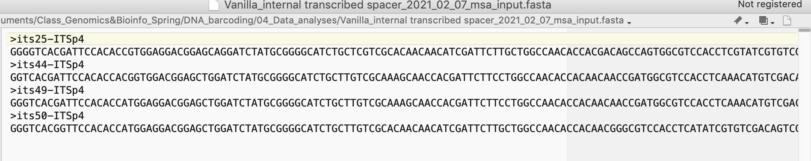
```

#### Merge Datasets to Perform Multiple Sequence Alignment {#mergeformsa}

Here, we are aiming at merging `FASTA` outputs to produce the input of the multiple sequence alignment ([part 3](#part3)). This step is pretty straightforward and involves using the *c()* function and writing the output.

The objects containg the GenBank DNA sequences and your DNA sequences are `FASTAGB` and `seqOUT`, respectively. 

```{r mergefasta, eval=F}
###~~~
#Start by merging datasets (GenBank and your newly produced seq.)
###~~~

#If your FASTA objects are still in R
# merge FASTA into one object
FASTAall <- c(FASTAGB, seqOUT)

#Else, you will have to load fasta files using readLines() before merging them

###~~~
#Write data
###~~~

#File name
FileIDfastaALL <- paste(sp, DNA, gsub("-", "_", Sys.Date()), "GenBank_seq_msa_input.fasta", sep='_')

#Write file (= input for msa analysis)
write.table(FASTAall, file = 
              paste("04_Data_analyses/FASTA/", 
                    FileIDfastaALL, sep=''), col.names = F, row.names = F, quote = F)
```

#### Question

> Why is `readLines()` more appropriate than `read.csv()` for opening a FASTA file? What does this tell you about the structure of FASTA files compared with `.csv` files?

## Bioinformatics Part 3 {#part3}

### Aim

> Conduct DNA multiple sequence alignment and phylogenetic inference.

### Bioinformatics Tools

To execute Part 3, you need to install the following software and R packages on your computer:

- `MEGA` [@kumar2018mega]: Please download the GUI version of the software associated to your operating system at this URL:
    - https://www.megasoftware.net/
- `FigTree` (a software to visualize and manipulate trees): https://github.com/rambaut/figtree/releases
- `R` package: *ape* [@ape].

If you don't remember how to install an R package, don't worry, this topic was covered [here](#query).

### Analytical Workflow 

To infer the ML phylogenetic analysis, the following workflow will be executed: implemented:

1. [Conduct the msa analysis using the `MUSCLE` algorithm [@edgar2004muscle]](#msa). 
  + This algorithm is implemented in `MEGA`. The input data for this analysis is `Vanilla_internal transcribed spacer_2021_02_09_GenBank_seq_msa_input.fasta`, which is stored in `04_Data_analyses/FASTA/`.
2. Check and manually edit msa. This will be done in `MEGA`.
3. Infer ML phylogenetic tree based on msa file. This will be done using the `RAxML` algorithm (available on a web platform).
4. Visualize phylogenetic tree and interpret results. 

### Conduct MSA Analysis {#msa}

#### Disclaimer

The analysis described below relies on `MEGA`; however you might be experiencing issues with the `.fasta` file outputted by this program (especially on Windows operating system). These issues might compromise downstream analyses, more specifically the RAxML inference and R code used to generate figures. Those issues are associated to changes in file encryption and changing formatting of samples names (i.e. replacing "_" by " "). In the event that it happens to you, please switch over and use the online `MUSCLE` platform available at this URL: https://www.ebi.ac.uk/Tools/msa/muscle/  

**WARNING:** When you submit your job on the portal, do not forget to select `Pearson/FASTA` as output file format in step 2. In addition, the output will only be made available in a window and you will have to copy and past the whole content in a new file using your favorite text editor. The file should be saved and named as detailed in the step 8 of the section below.  

#### Step-by-step Protocol 

To conduct a multiple sequence alignment in `MEGA` do the following:

1. Launch `MEGA`.
2. Load your input file (`Vanilla_internal transcribed spacer_2021_02_09_GenBank_seq_msa_input.fasta`) by clicking `File -> Open A File/Session...` and selecting the right file.
3. The program will ask you `How would you like...` and you will then click on the `Align` button. This will open a new window with your data (corresponding to an unaligned DNA matrix; see Figure \@ref(fig:unaligned)).

```{r unaligned, echo=FALSE, fig.align="center", fig.cap="Screenshot of DNA matrix in MEGA.", fig.show="asis", out.width = '100%'}
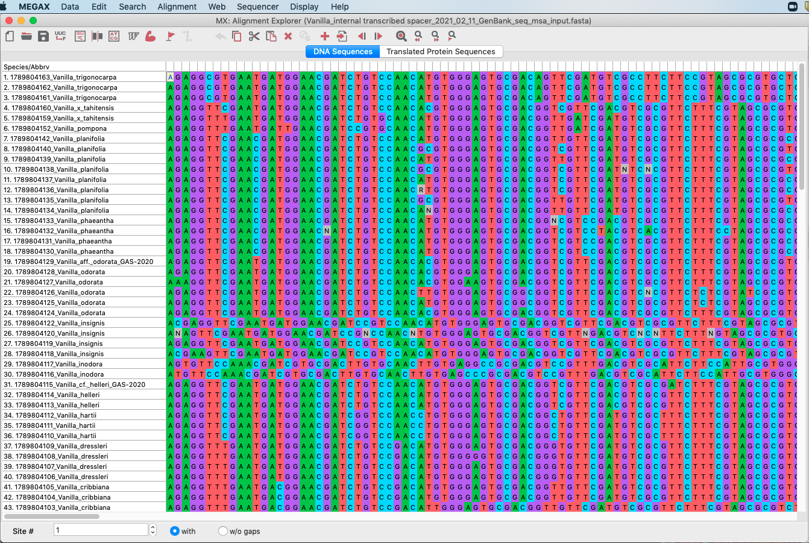
```

4.To start a `MUSCLE` analysis do has shown in Figure \@ref(fig:muscle) (`Alignment -> Align by MUSCLE`. A window will open saying `Nothing selected for alignment. Select all?`, click the `OK` button. Further details on the `MUSCLE` algorithm can be found in @edgar2004muscle.

```{r muscle, echo=FALSE, fig.align="center", fig.cap="Screenshot showing how to start a MUSCLE analysis in MEGA.", fig.show="asis", out.width = '100%'}
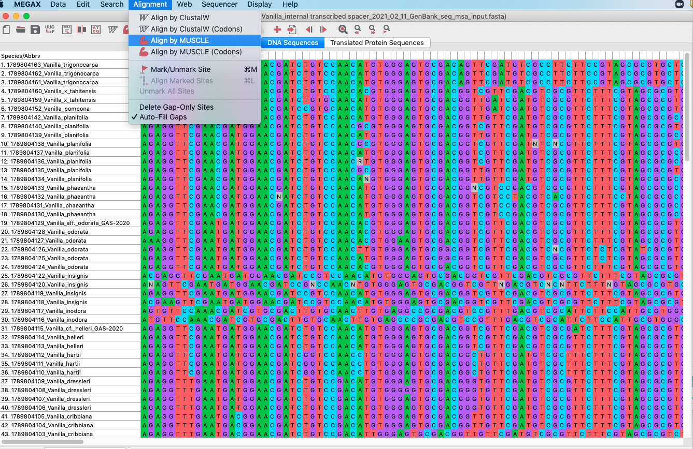
```

5. A window showing settings associated with the analysis will appear as shown on Figure \@ref(fig:muscleset). Please use the parameters set by default and click `OK` to start the analysis. The analysis should take ca. 5-10 minutes to complete.

```{r muscleset, echo=FALSE, fig.align="center", fig.cap="Screenshot showing MUSCLE settings in MEGA.", fig.show="asis", out.width = '100%'}
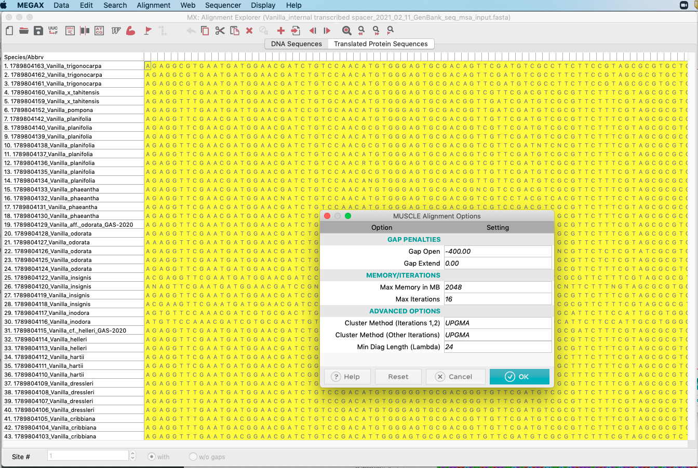
```

6. Once the analysis is completed, you will be able to inspect and edit the alignment. Please see Figure \@ref(fig:muscledone) for an example. Notice the gaps (`-`) that had to be incorporated to accommodate for differences in DNA sequences between samples. Your DNA sequences of *Vanilla* are at the bottom of the file.

```{r muscledone, echo=FALSE, fig.align="center", fig.cap="Screenshot showing MUSCLE alignment in MEGA.", fig.show="asis", out.width = '100%'}
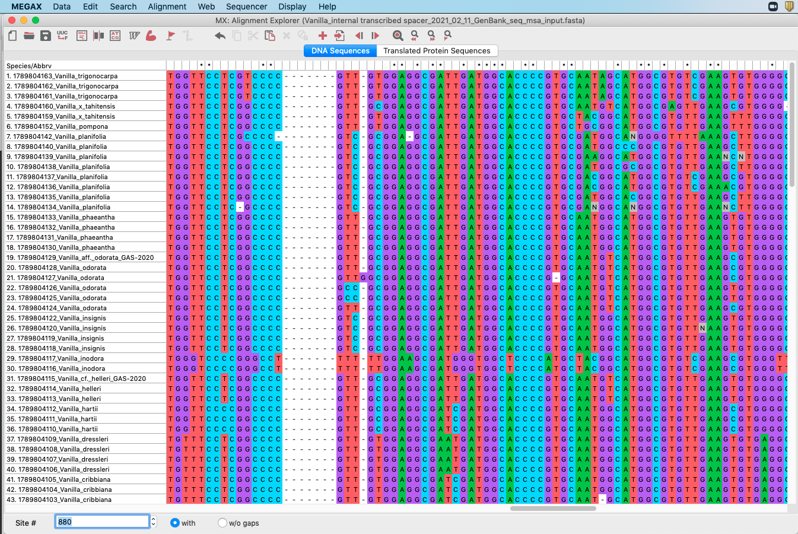
```

7. Save the analysis in `FASTA` format by clicking `Data -> Export Alignment -> FASTA Format`. This procedure is also shown in Figure \@ref(fig:muscleexport).

```{r muscleexport, echo=FALSE, fig.align="center", fig.cap="Screenshot showing how to export MUSCLE alignment into a FASTA format in MEGA.", fig.show="asis", out.width = '100%'}
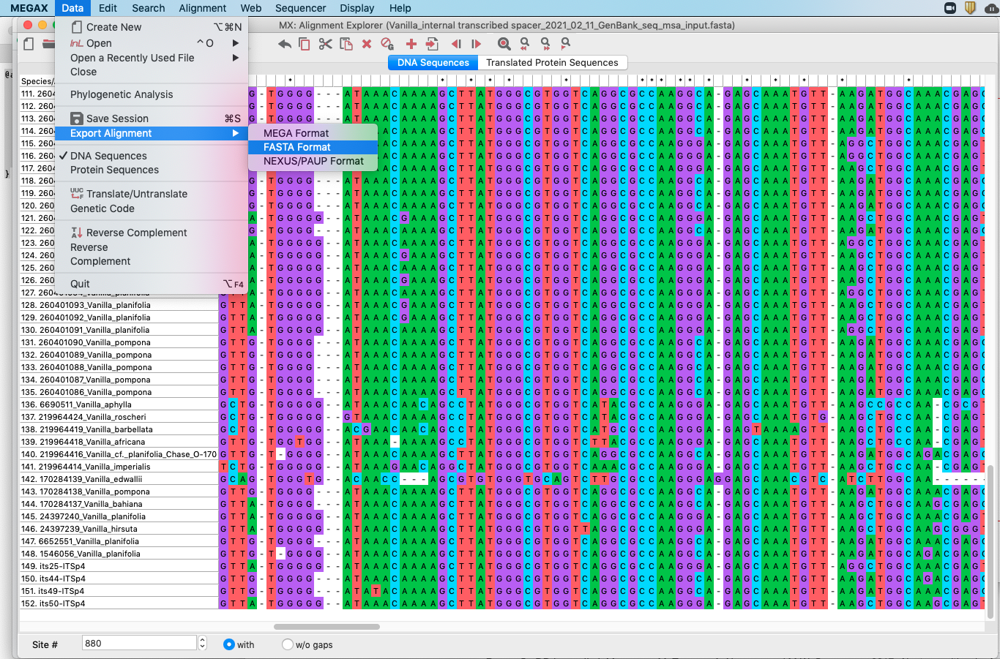
```

8. Save the file in `04_Data_analyses/FASTA/` and adjust file name as follows: `_GenBank_seq_msa_output.fasta`. This procedure is shown in Figure \@ref(fig:musclefile). Make sure to have your file extension set as `.fasta` otherwise you won't be able to load your file during the `RAxML` analysis.

```{r musclefile, echo=FALSE, fig.align="center", fig.cap="Screenshot showing how to save file in MEGA.", fig.show="asis", out.width = '100%'}
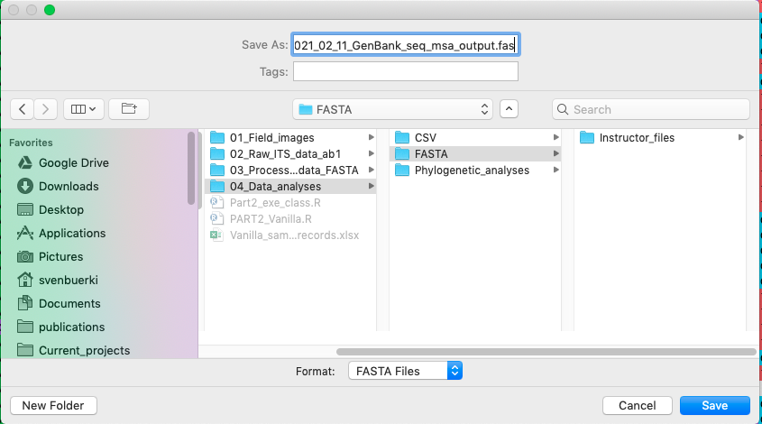
```

### Infer ML Phylogenetic Tree

The `RAxML` algorithm will be used to conduct the ML phylogenetic analysis and infer node statistical supports using the bootstrap procedure [@RaxML]. This algorithm has been implemented on a web service platform accessible at this URL:
    - https://raxml-ng.vital-it.ch/#/

**WARNING:** If the RAxML web service platform is down, the instructor will run the analysis locally (on a Linux computer). Please click [here](#RAxMLLoc) for more details on the procedure.

To perform the ML phylogenetic analysis:

1. Go on the [RAxML portal](https://raxml-ng.vital-it.ch/#/).
2. Select the output of the `MEGA` analysis (`*_GenBank_seq_msa_output.fasta`) stored in `04_Data_analyses/FASTA/` as input data.
3. For the rest of the settings use default parameters with the exception of the `Bootstrapping settings` (see below). Settings have to be set as shown in Figure \@ref(fig:RAxML).

```{r RAxML, echo=FALSE, fig.align="center", fig.cap="Screenshot showing Bootstrapping settings for the RAxML analysis.", fig.show="asis", out.width = '100%'}
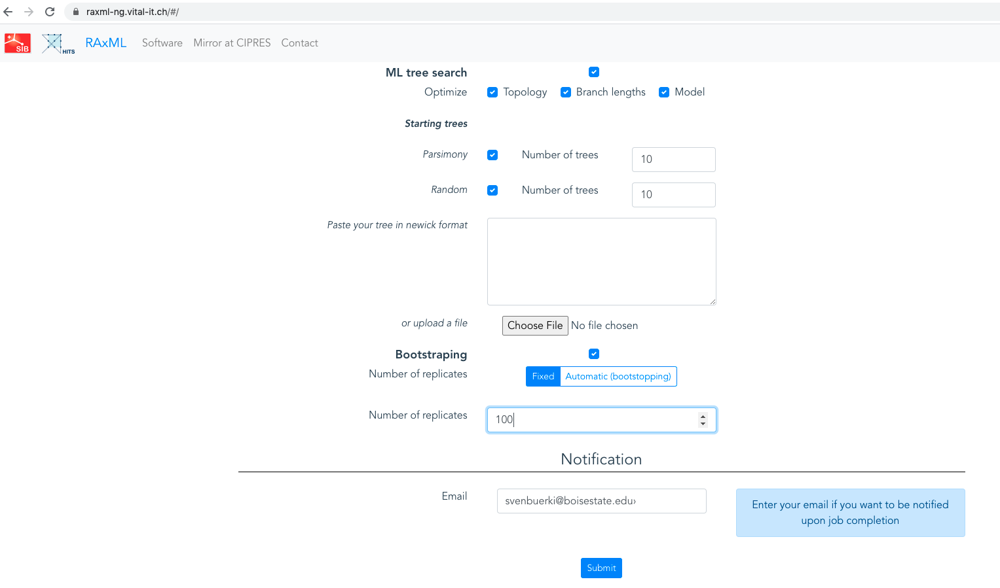
```

4. Finally, don't forget to provide your email before submitting the analysis. The analysis should take 1-5 hours to run. You will receive an email to download results or you can access results by using your unique URL. 

5. When your analysis is completed, download results (see Figure \@ref(fig:RAxMLresults)) and save it in `04_Data_analyses/Phylogenetic_analyses/`. 

```{r RAxMLresults, echo=FALSE, fig.align="center", fig.cap="Screenshot of RAxML portal showing results of your analysis. The best ML phylogenetic tree is also displayed.", fig.show="asis", out.width = '100%'}
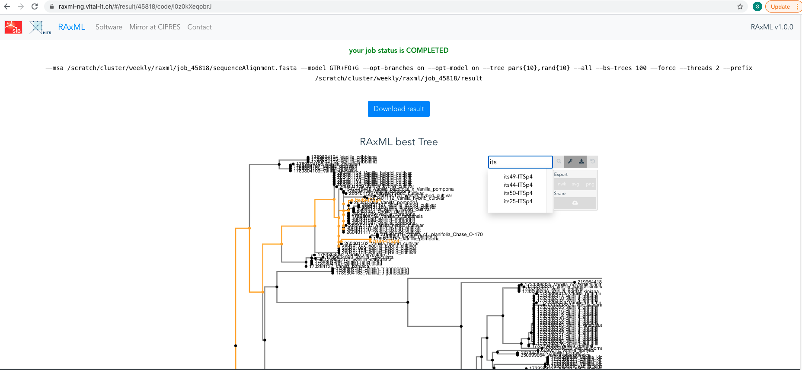
```

6. Unzip the file and inspect output files (use a text editor to open files). Descriptions of key files is provided here:
    - `raxmlArg.txt`: Contains RAxML command line used to conduct analysis.
    - `result.raxml.bestModel`: Contains estimated parameters for model used for ML analysis.
    - `result.raxml.bestTree`: Best ML tree in newick format.
    - `result.raxml.bootstraps`: Bootstrap trees in newick format.
    - `result.raxml.support`: Best ML tree (same tree than in `result.raxml.bestTree`) with node supports (inferred from data in `result.raxml.bootstraps`) in newick format.
    - `sequenceAlignment.fasta`: Your input aligned FASTA file. 
7. You can open `result.raxml.support` in `FigTree` to visualize it and locate the four samples of vanilla from Mexico. We will learn how to process phylogenetic trees in R in the next section.

### Run Phylogenetic Analysis Locally {#RAxMLLoc}

Unfortunately, the server running RAxML is currently down and students cannot use it for this assignment. To address this issue, the instructor is providing commands below to automatically align your FASTA file from [Part 2](#part2) and then perform the RAxML phylogenetic analysis. These analyses will be conducted on MacStudio computers as follows:

#### Remotely Connect to Computer

This is accomplished using the `ssh` (Secure Shell) protocol. Additional information about this protocol can be found [here](https://svenbuerki.github.io/Genomics-Bioinformatics/Tutorials.html), and understanding `ssh` will be essential for completing your [Lab report](https://svenbuerki.github.io/Genomics-Bioinformatics/Mining_draft_genome.html).

**To connect to MacStudio:**

```{bash, eval = F}
ssh buerkilab@XX.XX.XXX.XXX
```

#### Navigate to Project Folder

```{bash, eval = F}
# Navigate to project folder
cd /Users/buerkilab/Documents/Genomics_and_Bioinformatics/RAxML_analysis
```

#### Conduct Multiple Sequence Alignment

We are using MAFFT to align ITS sequences from [Part 2](#part2). 

```{bash, eval = F}
mafft --maxiterate 1000 --localpair "Vanilla_internal transcribed spacer_2026_02_17_GenBank_seq_msa_input.fasta" > "Vanilla_internal transcribed spacer_2026_02_17_GenBank_seq_msa_output.fasta"
```

##### Analysis Parameters

- `--maxiterate 1000`: Performs up to 1000 iterations of refinement to improve alignment accuracy. This iterative process helps optimize the alignment by repeatedly refining poorly aligned regions.

- `--localpair`: Uses a local pairwise alignment algorithm that is more accurate for sequences with similar lengths (like ITS sequences). This method:
  - Identifies homologous regions more precisely
  - Is particularly effective for conserved gene regions like ITS
  - Provides higher accuracy than the default global alignment method

**Why these settings for ITS sequences:**

- ITS (Internal Transcribed Spacer) regions contain both conserved and variable regions
- The `--localpair` method excels at aligning sequences with mixed conservation patterns
- High iteration count (`1000`) ensures optimal alignment quality for phylogenetic analysis
- These parameters balance accuracy with reasonable computation time

**Expected output:** The aligned sequences will be saved as `Vanilla_internal transcribed spacer_2026_02_17_GenBank_seq_msa_output.fasta` and will be used as input for the subsequent RAxML phylogenetic analysis.

#### Run RAxML Analysis

The maximum likelihood phylogenetic analysis (including bootstrap analyses to determine node supports) is performed using RAxML-NG with the following command:

```{bash, eval = F}
# Run 
raxml-ng --all --msa "Vanilla_internal transcribed spacer_2026_02_17_GenBank_seq_msa_output.fasta" --model GTR+G --prefix Vanilla_ML --seed 12345 --threads 20 --bs-trees 100 --outgroup 1789804116_Vanilla_inodora --force
```

##### Analysis Parameters

- `--all`: Performs both ML tree search and bootstrap analysis in a single run
- `--msa`: Specifies the input multiple sequence alignment file
- `--model GTR+G`: Uses the General Time Reversible substitution model with gamma-distributed rate variation among sites
- `--prefix Vanilla_ML`: Sets the prefix for all output files
- `--seed 12345`: Sets random seed for reproducible results
- `--threads 20`: Uses 20 CPU threads for parallel processing
- `--bs-trees 100`: Performs 100 bootstrap replicates for statistical support
- `--outgroup`: Specifies the outgroup taxon for rooting the tree
- `--force`: Forces analysis to proceed despite duplicate sequences in the dataset

##### Output Files

  - All 100 bootstrapped trees : `Vanilla_ML.raxml.bootstraps`
  - Best-scoring ML tree : `Vanilla_ML.raxml.bestTree`
  - Best-scoring ML tree with support values : `Vanilla_ML.raxml.support` **(FILE FOR NEXT ANALYSES)**
  - Best-scoring ML tree with support values as branch labels : `Vanilla_ML.raxml.support`
  - Analysis log and statistics : `Vanilla_ML.raxml.log`
  - All ML trees from different starting points : `Vanilla_ML.raxml.mlTrees`
  - Starting tree used for ML search : `Vanilla_ML.raxml.startTree`

**Note**: In RAxML-NG, the `.raxml.support` file contains the best ML tree with bootstrap support values displayed as standard node support values, which serves the same purpose as both the `RAxML_bipartitions` and `RAxML_bipartitionsBranchLabels` files from original RAxML (this is important if you did the analysis a shown above).

**Files on Google Drive**

The output files are available on Google Drive at this path:

`DNA_barcoding > 04_Data_analyses > Phylogenetic_analyses > RAxML_analysis`

Download the folder on your computer and save it under the same path.

### Visualize Phylogenetic Tree and Interpretion

#### Learning Outcomes

- Learn the newick syntax to represent phylogenetic trees
- Produce figures of phylogenetic trees using `R` functions implemented in the *ape* package 

#### Introduction to Newick Tree Format

The Newick Standard for representing trees in computer-readable form makes use of the **correspondence between trees and nested parentheses**. We owe this format to the British mathematician [Arthur Cayley](https://mathshistory.st-andrews.ac.uk/Biographies/Cayley/). Here we will be providing an overview of the Newick format using the R package *ape* [@ape].

To produce the "dummy" phylogenetic tree displayed in Figure \@ref(fig:intronewick), the following syntax should be applied:

```{r intronewick, eval=T, echo=F, fig.align="center", fig.cap="Rooted tree showing relationsip between 4 species.", fig.show="asis", out.width = '100%', warning=F, error=F}
###~~~
#Load package
###~~~
library(ape)

#First tree in Newick format
tr1 <- "(A._speciosa,(B._dimorpha,(C._elegans,D._viridis)));"
plot(read.tree(text=tr1))
```

##### Coding Your First Phylogenetic Tree

Before starting, create a new `R` script entitled `02_Part3_exercises.R` saved at the root of `DNA_barcoding`. 

```{r newick, eval=F, echo=T}
###~~~
#Check if package is installed if not then install it
###~~~

if("ape" %in% rownames(installed.packages()) == FALSE){
  print("Install ape")
  install.packages("ape")
  }else{
    print("ape is installed!")
}

###~~~
#Load package
###~~~
library(ape)

###~~~
#Set working directory
###~~~
#Set working directory to path leading to DNA_barcoding folder
# WARNING: This path as to be adapted to match your computer
setwd("~/Documents/Class_Genomics&Bioinfo_Spring/DNA_barcoding/")

#Check that working directory is set correctly
getwd()

###~~~
#Your first tree in Newick format
###~~~
tr1 <- "(A._speciosa,(B._dimorpha,(C._elegans,D._viridis)));"

###~~~
#Plot your tree with ape package
###~~~
plot(ape::read.tree(text=tr1))
```

Some considerations associated to the syntax:

- The tree ends with a semicolon (`;`). 
- The bottommost node in the tree is an interior node, not a tip. 
- Interior nodes are represented by a pair of matched parentheses (`()`). Between them are representations of the nodes that are immediately descended from that node, separated by commas (`,`). 
- Tips (or samples) are represented by their names. A name can be any string of printable characters except blanks, colons, semicolons, parentheses, and square brackets. 
- Because you may want to include a blank in a tip name, it is assumed that an underscore character (`_`) stands for a blank; any of these in a name will be converted to a blank when it is read in (see code above and Figure \@ref(fig:intronewick) for more details).

**Branch lengths** (representing e.g. molecular substitutions, which can be turned into time in a dated phylogenetic tree) can be incorporated into a tree by putting a real number, with or without decimal point, after a node and preceded by a colon (`:`). This represents the length of the branch immediately below that node. Thus, the above tree might have lengths represented as in Figure \@ref(fig:newickbrlens).

```{r newickbrlens, eval=T, echo=T, fig.align="center", fig.cap="Rooted tree showing relationsip between 4 species with branch lengths.", fig.show="asis", out.width = '100%'}
###~~~
#Tree in Newick format with branch lengths
###~~~
# Here we added branch length values using ":" and inserting value
tr2 <- "(A._speciosa:2.0,(B._dimorpha:4.2,(C._elegans:2.0,D._viridis:3.0):1):4.0);"

###~~~
#Plot your tree with ape package
###~~~
plot(ape::read.tree(text=tr2))
```

Now, we can finally add **node supports** (inferred using e.g. the bootstrap approach in the case of the vanilla Maximum Likelihood analysis conducted here) by simply adding values after each closing parenthesis. This is done as follows and displayed in Figure \@ref(fig:newickbrlensnode):

```{r newickbrlensnode, eval=T, echo=T, fig.align="center", fig.cap="Rooted tree showing relationsip between 4 species with branch lengths and node supports.", fig.show="asis", out.width = '100%'}
###~~~
#Tree in Newick format with branch lengths and node supports
###~~~
# Here we added branch lengths and bootstrap values
tr3 <- "(A._speciosa:2.0,(B._dimorpha:4.2,(C._elegans:2.0,D._viridis:3.0)60:1)90:4.0)100;"

###~~~
#Plot your tree with ape package
###~~~
# Note that to display node labels, we have to set show.node.label = TRUE 
plot(ape::read.tree(text=tr3), show.node.label = TRUE)
```

#### The `phylo` Class and Phylogenetic Trees in R

Here, we will be introducing the `phylo` class implemented in R packages dealing with phylogenetic analyses. To study this topic, we will be using the phylogenetic tree with branch lengths and node supports (see Figure \@ref(fig:newickbrlensnode)).  

```{r phyloclass, eval=T, echo=T}
###~~~
#Tree in Newick format with branch lengths and node supports
###~~~
tr3 <- "(A._speciosa:2.0,(B._dimorpha:4.2,(C._elegans:2.0,D._viridis:3.0)60:1)90:4.0)100;"

###~~~
#Create and load tree
###~~~
tr <- ape::read.tree(text=tr3)
tr

###~~~
#Check class
###~~~
class(tr)
```

`phylo` class objects (here `tr`) are lists allowing to access multiple attributes associated to the phylogenetic tree. Three of these lists are especially useful to us:

- `tr$tip.label`: Vector with tip labels.
- `tr$node.label`: Vector with node labels.
- `tr$edge.length`: Vector with branch lengths.

Here, are the details with our example:

```{r trattributes, echo=T, eval=T}
###~~~
#To access tip labels
###~~~
tr$tip.label

###~~~
#To access node labels
###~~~
tr$node.label

###~~~
#To access branch lengths
###~~~
tr$edge.length
```

#### Challenge

> Using this knowledge, draw and code a phylogenetic tree with 8 samples (tips) containing branch lengths and node supports

This challenge is done in small groups and each group will take turn to (*i*) draw their phylogenetic tree on the white board, and (*ii*) code it using the newick syntax.

**Tip:** To make sure that your phylogenetic tree is correct, code it and execute it in `R` using the *ape* functions shown above.  

#### Vanilla Phylogenetic Tree 

In this section, we will be analyzing the output of the RAxML analysis focusing on `Vanilla_ML.raxml.support`, which contains the phylogenetic tree with node supports (here obtained through the bootstrap method). The file is stored in `04_Data_analyses/Phylogenetic_analysis/RAxML_analysis`.   

Our analyses are divided into seven steps:

1. Load ITS tree using the *ape::read.tree()* function.
2. Discard bootstrap values < 50% since these nodes are not statistically supported. This is done by finding nodes matching this criterion (in `ITS$node.label`) and replacing their values by nothing (`""`).
3. Rename tips to facilitate reading. Since all accessions belong to same genus, we will replace "*Vanilla*" by "*V.*".
4. Root phylogenetic tree with outgroup taxon (using the *ape::root()* function). Analyses conducted by Paige [@Ellestad2022AJB] showed that *Vanilla inodora* (represented by the sample `1789804116_Vanilla_inodora`) is a suitable outgroup taxon.
5. Ladderize and plot phylogenetic tree (using *ape::ladderize()* and *ape::plot.phylo()* functions; see Figure \@ref(fig:Vantreeall)). We will also color in red the tips associated with your vanilla samples to improve readability.
6. Extract subtree containing our vanilla samples (using *ape::getMRCA()* and *ape::extract.clade()* functions) and plot tree (this time using the radial plotting mode; see Figure \@ref(fig:Vantreesub)). To better visualize your vanilla samples, we will plot a red circle next to their tips (using the *ape::tiplabels()* function) and rename them based on Figure \@ref(fig:van). 
7. Export phylogenetic tree from step 6 in `pdf` format.

##### Code to generate figures of the phylogenetic tree

Before starting, create a new `R` script entitled `03_Part3_PhyloFig.R` saved at the root of `DNA_barcoding`. 

```{r Vantreeall, fig.align="center", fig.cap="RaxML ITS rooted phylogenetic tree of species of Vanilla.", fig.show="asis", out.width = '100%'}
###~~~
#1. Load Vanilla RAxML ITS tree
###~~~
#Please adjust path based on your computer
ITS <- ape::read.tree(file="Data/04_Data_analyses/Phylogenetic_analyses/RAxML_analysis/Vanilla_ML.raxml.support")

#ITS <- ape::read.tree(file="Data/04_Data_analyses/Phylogenetic_analyses/RAxML_analysis/RAxML_bipartitions.Vanilla_ML.tre") # This is the file from last year

###~~~
#2. Discard bootstrap values < 50%
###~~~
#Find nodes with low statistical supports
ITS$node.label[which(as.numeric(ITS$node.label) < 50)]
#Replace/overwrite values by ""
ITS$node.label[which(as.numeric(ITS$node.label) < 50)] <- ""

###~~~
#3. Rename tips: Vanilla by V.
###~~~
#Replace/overwrite values
ITS$tip.label <- gsub("Vanilla", "V.", ITS$tip.label)

###~~~
#4. Root phylogenetic tree with outgroup taxon
###~~~
#Re-root tree with suitable sample
ITS <- ape::root(ITS, outgroup = "1789804116_V._inodora", resolve.root=T)
#This procedure add a node label "Root", which needs to be discarded.
ITS$node.label[which(ITS$node.label == "Root")] <- ""

###~~~
#5. Ladderize and plot tree by sorting nodes
###~~~
#Ladderize
ITS <- ape::ladderize(ITS)

#Color tips: your samples in red
tipcol <- rep("black", length(ITS$tip.label))
#Find which tips are your samples and replace color by red 
tipcol[grep("-ITSp4", ITS$tip.label)] <- "red"

#Plot
ape::plot.phylo(ITS, cex=.3, tip.color = tipcol, show.node.label = TRUE, align.tip.label = T, no.margin = TRUE)
```


```{r Vantreesub, fig.align="center", fig.cap="RAxML ITS phylogenetic tree with focus on clade containing all accessions of vanilla studied here.", fig.show="asis", out.width = '100%'}
###~~~
#6. Extract subtree and plot tree
###~~~
#Find node corresponding to MRCA of our vanilla samples
MRCAsamples <- ape::getMRCA(ITS, tip=ITS$tip.label[grep("-ITSp4", ITS$tip.label)])

#Extract subtree
VanITS <- ape::extract.clade(ITS, node=MRCAsamples)

#Rename vanilla samples using apply and switch as learned before
VanITS$tip.label[grep("-ITSp4", VanITS$tip.label)] <- unname(sapply(VanITS$tip.label[grep("-ITSp4", VanITS$tip.label)], switch,  "its25-ITSp4"="PE25", "its50-ITSp4"="PE50","its44-ITSp4"="PE44","its49-ITSp4"="PE49"))

#Color tips: your samples in red
tipcolVan <- rep("black", length(VanITS$tip.label))
#Find which tips are your samples and replace color by red 
# ^ means that the search has to begin with PE
tipcolVan[grep("^PE", VanITS$tip.label)] <- "red"

#Plot tree in radial mode
ape::plot.phylo(VanITS, cex = .4, use.edge.length = F, tip.color = tipcolVan, type = "radial", label.offset = 0.04, no.margin = TRUE)
#Add bootstrap supports
ape::nodelabels(text = VanITS$node.label, adj = c(0.5,0.5), frame = "none", cex = 0.5)
#Add circles next to your vanilla samples
ape::tiplabels(tip = grep("^PE", VanITS$tip.label), pch = 16, col = "red", offset = 0.02)
```

```{r}
###~~~
#7. Export tree from step 6 in pdf format 
###~~~
#Use the pdf function to create pdf
# Adjust path for your computer (= delete "Data/")
pdf("Data/04_Data_analyses/Phylogenetic_analyses/RAxML_analysis/VanSubTree.pdf")
#Plot tree in radial mode
ape::plot.phylo(VanITS, cex = .4, use.edge.length = F, tip.color = tipcolVan, type = "radial", label.offset = 0.04, no.margin = TRUE)
#Add bootstrap supports
ape::nodelabels(text = VanITS$node.label, adj = c(0.5,0.5), frame = "none", cex = 0.5)
#Add circles next to your vanilla samples
ape::tiplabels(tip = grep("^PE", VanITS$tip.label), pch = 16, col = "red", offset = 0.02)
#This function closes the pdf
dev.off()
```

### Discussion

Click on the button below to inspect the final *Vanilla* phylogenetic tree (in `pdf` format) and answer this scientific question:

>What species do the samples of vanilla analyzed here belong to (see Figure \@ref(fig:van)) and **why**?
>

**Note:** It is not sufficient to provide taxonomic names for the analyzed samples, you have to motivate why you are advocating for these names.

<button class="btn btn-primary" data-toggle="collapse" data-target="#VanSub">Vanilla subtree</button>
<div id="VanSub" class="collapse">    
<object data="Data/04_Data_analyses/Phylogenetic_analyses/RAxML_analysis/VanSubTree.pdf" width="750px" height="750px">
    <embed src="Data/04_Data_analyses/Phylogenetic_analyses/RAxML_analysis/VanSubTree.pdf">
    </embed>
</object>
</div>

## Writing your report {#report}

The instructor provides below information to complete the Mini-Report 3. All the material, data, code and references required to complete this report are provided here and are covered in class. In this context, students will have to focus on formatting their reports following guidelines presented here as well as making sure that their `R` code is working and ready to be shared. 

### Apply the IMRAD Format and Supply Code

Your reports will be structured and organized following the **IMMRAD** format: **I**ntroduction, **M**aterial & **M**ethods, **R**esults, and **D**iscussion. This format is widely used to report experimental research in many scientific disciplines. In addition, you will be complementing your reports with an **Abstract** (see below). Finally, since this research relies heavily on bioinformatics, students will complete their reports by supplying their commented `R` scripts. 

### Structure of Mini-Report 3

The instructor provides guidance on content for each section of your individual reports:

1. **Title & author**: Please supply a first page containing the title and author information.
2. **Abstract**: Provide a short text summarizing the i) objective(s), ii) methods (incl. sampling), iii) most important results and iv) major conclusions and significance of your research (maximum: 300 words).
3. **Introduction**: Summarize challenges associated to biodiversity research and benefit of DNA barcoding approach in tackling those issues (e.g. by rapidly identifying species, this approach supports species descriptions, monitoring and development of conservation strategies). Then, move on to talk about vanilla, your model organism, and provide the scientific question and hypothesis investigated in this report (see section \@ref(sciq)). Finally, finish this section with an overview of the applied methodology used to answer your questions.
4. **Material & Methods**: This section should be subdivided into four subsections. Subsections a. and b. are associated to wet-lab analyses, whereas subsections c. and d. correspond to bioinformatic analyses. Please, make sure to cite references supporting your methods and report used bioinformatic tools (incl. references) together with their applied settings. Finally, you can also refer to your `R` code for further details. The subsections are as follows:
    a. Sampling (see section \@ref(sciq)).
    b. DNA extraction and sequencing (see section \@ref(vanbarcode)).
    c. BLAST analysis.
    d. Phylogenetic inference.  
5. **Results**: Results should be presented in the same order as presented in the Material & Methods section. Tables, Figures and code are reported in this section (by directly embedding them in the text and providing captions). To speed-up the writing of this report, you don't have to report on results associated to Sampling (a.) and DNA extraction and sequencing (b.) subsections, but rather focus on the BLAST analysis (c.) and phylogenetic inference (d.) subsections.  
6. **Discussion**: In your discussion, we are expecting you to collate all the evidence presented in the study to answer your scientific questions. In this context, please subdivide this section into three subsections named as follows:
    a. To what species of vanilla do the individuals studied here belong to?
    b. How are those individuals related to each other?
    c. Conclusions and Perspectives. 
7. **References**: Add a references section containing full citations of references cited in the text. Students can pick their preferred citation format, but references need to be consistently edited in the same fashion.
8. **Appendix**: Your `R` code has to be provided as an Appendix either by directly coping your code in the main document under this section or by providing the name and location of the `R` script in the Appendix section (e.g. by providing a text similar to this: "All the R code associated to this research can be downloaded at this path."). 

### Submission and Deadline

Individual reports should be submitted in either Google Docs, Word or Rmarkdown formats (and if you decide to submit an additional file containing your R script, submit this file as an `.R` format). These files should be uploaded on the shared Google Drive in the `Mini_Report_3` folder in a subfolder entitled as follows: `Mini_Report_3_Surname`.

The deadline for your report submission is available [here](https://svenbuerki.github.io/Genomics-Bioinformatics/Timetable.html#2_Assignment_Deadlines). 


## Evaluation Rubrics (Total: 50 points) {#minireport3rubrics}

Students will be assessed on their ability to conduct DNA barcode–based species identification and phylogenetic inference and communicate their findings in a scientific report using a standard structure.

| Criteria | Description | Points |
|---|---|---|
| **Introduction & Scientific Context** | Clearly presents the biological background, research question, and hypothesis. Demonstrates understanding of DNA barcoding, phylogenetics, and species identification. | 8 |
| **Materials & Methods** | Clearly and accurately describes sequence processing, BLAST analyses, dataset assembly, alignment, and phylogenetic inference. Methods are complete, logical, and reproducible. | 10 |
| **Results** | Presents results clearly and objectively, including BLAST results, alignments, and phylogenetic trees. Figures and tables are properly labeled, referenced, and described in the text. | 12 |
| **Discussion & Biological Interpretation** | Interprets results correctly using phylogenetic evidence. Evaluates the hypothesis, explains species identity, and discusses biological meaning and limitations. | 12 |
| **Clarity, Organization & Writing Quality** | Report is well structured, clearly written, and follows scientific writing conventions. Terminology is used appropriately. | 4 |
| **References & Citation Quality** | Appropriate and consistent use of scientific references, including GenBank and relevant literature. | 4 |

**Total: 50 points**

---

### Formatting Penalties

Because formatting and adherence to scientific guidelines are essential professional skills:

- Up to **–10 points (20% of total score)** may be deducted for failure to follow formatting and submission guidelines.

Examples include:

- Missing required sections  
- Incorrect formatting (font, spacing, margins)  
- Missing or improperly labeled figures  
- Missing citations  
- Exceeding length limits  
- Incorrect file naming or submission location  

Penalty severity will reflect the extent of the issue.

---

### Late Submission Penalties

- Please see [Syllabus](https://svenbuerki.github.io/Genomics-Bioinformatics/index.html#184_Late_Work_Policy) for late work policy.

---

### Notes

- Reports must follow the required scientific structure:
  - Introduction  
  - Materials & Methods  
  - Results  
  - Discussion  
  - References  

- All figures must be referenced and interpreted in the text.
- All sources must be properly cited.

## Project Structure and Data

To support mastering the learning outcomes, we will be using a subset of a DNA dataset focusing on the [vanilla](#vanilla) spice (from the Orchidaceae family) published by @Ellestad2022AJB.

The data for this assignment are deposited on the shared [Google Drive](https://drive.google.com/drive/folders/1iBMwP67FoSTMDX-EpXOlf8utP9k8tu8k?usp=sharing) in a folder entitled `DNA_barcoding` (located in `Mini_Report_3`). All students enrolled in this class have been granted access to this folder. The folder is subdivided into four sub-folders (see Figure \@ref(fig:datastr)) and contains a master spreadsheet `Vanilla_samples_records.xlsx` at its root: 

- `01_Field_images`: `jpeg` images of samples.
- `02_Raw_ITS_data_ab1`: `.ab1` sequence electropherograms of ITS sequences. 
- `03_Processed_ITS_data_FASTA`: Folder where cleaned ITS sequences will be saved in `FASTA` format.
- `04_Data_analyses`: Folder where we will be saving outputs of analyses conducted in this project.
- `Vanilla_samples_records.xlsx` contains meta-data information about the samples. We will also update this file with information on species hypotheses.
- `PART2_Vanilla.R` is an R script containing code for the part 2 of this mini-report.

```{r datastr, echo=FALSE, fig.align="center", fig.cap="Screenshot of the DNA_barcoding folder showing data structure for this project.", fig.show="asis", out.width = '90%'}
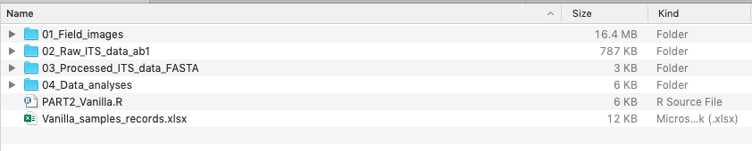
```

### Data Availability

The data availability statement associated with @Ellestad2022AJB is as follows: 

All sequence data for this project are available at the National Center for Biotechnology Information (NCBI) under GenBank ITS sequences ON525161–ON525228, GenBank *rbcL* sequences ON531917–ON531986, BioProject accession no. PRJNA841950, and BioSample accession nos. SAMN28632719–SAMN28632734. All raw sequence files are available from the NCBI SRA database, nos. SRR19374405–SRR193744012, SRR19374414, SRR19374417, and SRR19374418. DNA alignments are available at Zenodo: https://doi.org/10.5281/zenodo.6577744

# References