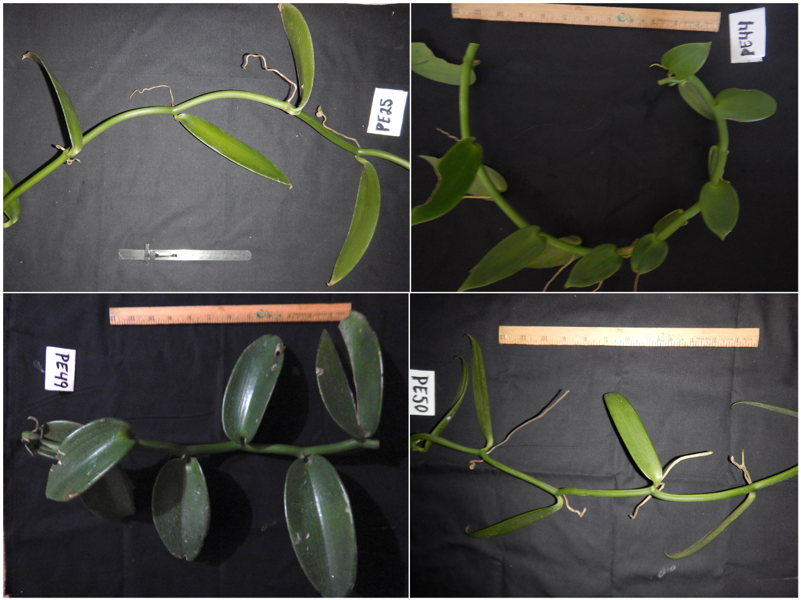

```{js logo-js, echo=FALSE}
$(document).ready(function() {
  $('#header').parent().prepend('<div id=\"logo\"></div>');
  $('#header').css('margin-right', '120px')
});
```

# Introduction

To further gain expertise in the field of genomics, students are producing three mini-reports on the following topics:

- [**Mini-Report 1**](#mini1): Sequencing technologies (25 points; this task is related to Chapter 2).
- [**Mini-Report 2**](#mini2): Molecular biology databases (25 points; this task is related to Chapter 3).
- [**Mini-Report 3**](#mini3): Species identifications based on DNA barcoding and phylogenetic inference (50 points). This report provides students with an introduction to methods applied in the laboratory sessions and prepare them to analyze NGS data.

Time will be allocated in class to work on these mini-reports, but the instructor expects students to complete those on their own time.

# Mini-report 1 -- Sequencing platforms & technologies {#mini1}

To have a full overview of available sequencing platforms, students are tasked to **produce individual mini-reports** on the following sequencing platforms and their associated technologies:

- **Sequencing platform 1:** Illumina.
- **Sequencing platform 2:** PacBio.
- **Sequencing platform 3:** Oxford Nanopore.

## Background information

Each student was assigned a sequencing platform to work on (please see [Google spreadsheet](https://docs.google.com/spreadsheets/d/1cRM1yasUfDa98ecyz_-RxUOw8cU4wkQx4O5Wxw3y4yU/edit?usp=sharing) for more information). 

The **individual assignment is mandatory and will be graded**. Please see this task as an opportunity to consolidate your knowledge on next-generation sequencing technologies and writing scientific reports.   

Time will be allocated in class on the 19th of January 2024 to allow students to work on their assignments. Reports are due on **the 2nd of February 2024** and should be uploaded on the shared [Google Drive](https://drive.google.com/drive/folders/1BFZFJeR8tW8N7QLfngqIVbjqEkDuIyWj?usp=sharing) in the `Mini_Report_1` folder.

## Structure of mini-reports {#structure}

Please structure your reports to ensure covering the following aspects:

- Introduce the sequencing technology (incl. library preparation and DNA requirements).
- Provide an overview of the available sequencing systems or platforms.
- Outline the research potential/applicability of the sequencing systems or platform. 
- Provide any additional information such as e.g. price, accessibility, technical support, that you feel are relevant to your sequencing platform. 

## Warning

For this assignment, students are not allowed to use AI to complete their work.

## Reporting format

Maximum **two pages**, single spaced, using either Arial 11 pt or Times New Roman 12 pt, and with all margins set to 1 inch. The two pages do not include a title page and a references section. 

The **title page** should include the following information: 

1. Name of the sequencing platform as title. 
2. Name of student contributing the report. 

The **references section** should contain full citations of all references cited in the text. Each reference cited in the References section should be clearly cited in the text to support transparency in your work and reproducible science. 

A **citation is a way of giving credit to individuals for their creative and intellectual works that you utilized to support your research**. It can also be used to locate particular sources and combat plagiarism. Typically, a citation can include the author's name, date, location of the publishing company, journal title, or DOI (Digital Object Identifier). **Citation styles dictate the information necessary for a citation and how the information is ordered, as well as punctuation and other formatting**. There are different citation styles (see Figure \@ref(fig:citationstyle)) and the instructor let you pick the one you like. However, please make sure to only use one citation style in your mini-report.  

```{r citationstyle, echo=FALSE, fig.cap="Example of citation styles for an article published in Plants.", out.width = '50%', fig.align='center'}

```

In the case of web resources, please provide the following information in your citation: author, title (of the web page), URL and accessed date. Here is an example:

Wetterstrand KA. DNA Sequencing Costs: Data from the NHGRI Genome Sequencing Program (GSP) Available at: www.genome.gov/sequencingcostsdata. Accessed 2023-01-16.


Please keep in mind that a figure can convey a lot more information than a long text! Your reports should follow the structure presented in section \@ref(structure). 

## Format to name document

**Name your report document following this pattern**: `Sequencing platform_Surname`.

## Resources

The instructor has provided `pdf` documents devoted to each sequencing platform below to support students in starting their assignments. Please see @Satam2023 for a review on this subject and @Marx2023 for more information on long-read sequencing.

In addition, please use information available from manufacturers' websites (see below), publications, online NGS training sites (e.g. EMBL-EBI Training), Google, YouTube and Wikipedia to prepare your reports and presentations. Do not forget to provide citations supporting your claims in your reports. I let you decide which reference style you want to use (look at your favorite journals for examples).

Here are a few additional online references to support your assignment:

- **An Overview of Next-Generation Sequencing**: https://www.technologynetworks.com/genomics/articles/an-overview-of-next-generation-sequencing-346532
- **Illumina official website**: https://www.illumina.com/
- **PacBio official website**: https://www.pacb.com/
- **Oxford Nanopore official website**: https://nanoporetech.com/


<button class="btn btn-primary" data-toggle="collapse" data-target="#Illumina">Data on Illumina</button>
<div id="Illumina" class="collapse">    
<object data="Images/Seq_1_Illumina.pdf" width="750px" height="750px">
    <embed src="Images/Seq_1_Illumina.pdf">
    </embed>
</object>
</div>

<button class="btn btn-primary" data-toggle="collapse" data-target="#PacBio">Data on PacBio</button>
<div id="PacBio" class="collapse">    
<object data="Images/Seq_2_PacBio.pdf" width="750px" height="750px">
    <embed src="Images/Seq_2_PacBio.pdf">
    </embed>
</object>
</div>

<button class="btn btn-primary" data-toggle="collapse" data-target="#Nanopore">Data on Nanopore</button>
<div id="Nanopore" class="collapse">    
<object data="Images/Seq_3_Oxford_Nanopore.pdf" width="750px" height="750px">
    <embed src="Images/Seq_3_Oxford_Nanopore.pdf">
    </embed>
</object>
</div>

# Mini-report 2 -- Molecular biology databases {#mini2}

To have a full overview of available molecular biology databases and assess their contributions to genome annotation, students are tasked to produce individual mini-reports on the following molecular databases:

- **Molecular database 1:** [Protein sequences databases](#prot) [e.g., @UniProt2014].
- **Molecular database 2:** [Gene ontology databases](#GO) [e.g., @GO2020].
- **Molecular database 3:** [Metabolic pathways databases](#KEGG) [e.g., @KEGG2022].

## Background information

Each student was assigned a molecular database to work on (please see [Google spreadsheet](https://docs.google.com/spreadsheets/d/1cRM1yasUfDa98ecyz_-RxUOw8cU4wkQx4O5Wxw3y4yU/edit?usp=sharing) for more information). 

This individual assignment is mandatory and will be graded. Please see this task as an opportunity to consolidate your knowledge on molecular databases and writing scientific reports.   

Time will be allocated in class on the 2nd of February 2024 to allow students to work on their assignments. Reports are due on **the 21st of February 2024** and should be uploaded on the shared [Google Drive](https://drive.google.com/drive/folders/1BFZFJeR8tW8N7QLfngqIVbjqEkDuIyWj?usp=sharing) in the `Mini_Report_2` folder.

## Structure of mini-reports {#structure2}

Please structure your reports to cover the following aspects:

- Provide a brief summary of the purpose/mission of your assigned molecular database to introduce its overarching goals and objectives.
- Provide an overview of the available databases falling under your major type of molecular biology data.
- Highlight potential contributions (and limitations) of these databases to support genome annotation.
- Provide an overview or survey of available bioinformatic tools and resources to query/access these databases and conduct analyses. 
- Complement reports with information relevant/specific to your data repositories. 

## Reporting format

Follow the same reporting format than with Mini-Report 1.

## Format to name document

**Name your report document following this pattern**: `Molecular database_Surname`.

## Resources

The instructor provided below short descriptions of each of the major types of molecular biology databases. Students are encouraged to use the information provided below to prime their research and start populating their reports. Please do not forget to provide citations and references in your reports following information provided in Mini-Report 1.

### Proteins sequences databases {#prot}

There are three major protein sequences databases:

- **PIR** (Protein Information Resource in Washington, USA): [http://pir.georgetown.edu](http://pir.georgetown.edu)
- **SWISS-PROT** (in Geneva, Switzerland): [http://www.uniprot.org/statistics/Swiss-Prot](http://www.uniprot.org/statistics/Swiss-Prot)
- **TrEMBL** (in Hinxton, UK): [http://www.uniprot.org/statistics/TrEMBL](http://www.uniprot.org/statistics/TrEMBL)  

In 2002, these three databases coordinated their efforts to form the **UniProt** consortium [@UniProt2014]. The partners in this enterprise share the database, but continue to offer separate information-retrieval tools for access. The UniProtKB database is available at this URL: [http://www.uniprot.org](http://www.uniprot.org). This latter database will be especially important to retrieve information on gene annotations (Chapters 6, 7) using the online tool available at this URL: [http://www.uniprot.org/uploadlists/](http://www.uniprot.org/uploadlists/). This will be done by specifically looking at Gene ontology (see [GeneOntology](#GO)).

### Gene ontology databases {#GO}

Gene Ontology [GO, @GO2020] ([http://www.geneontology.org](http://www.geneontology.org)): the framework for the model of biology. The GO defines concepts/classes used to describe gene function, and relationships between these concepts. It classifies functions along three aspects:

- **Cellular component:** This term describes a component of a cell that is part of a larger object, such as an anatomical structure (e.g. rough endoplasmic reticulum or nucleus) or a gene product group (e.g. ribosome, proteasome or a protein dimer).
- **Biological process:** A biological process term describes a series of events accomplished by one or more organized assemblies of molecular functions. Examples of broad biological process terms are "cellular physiological process" or "signal transduction". Examples of more specific terms are "pyrimidine metabolic process" or "alpha-glucoside transport". The general rule to assist in distinguishing between a biological process and a molecular function is that a process must have more than one distinct steps.
A biological process is not equivalent to a pathway. At present, the GO does not try to represent the dynamics or dependencies that would be required to fully describe a pathway.
- **Molecular function:** Molecular function terms are describing activities occurring at the molecular level, such as "catalytic activity" or "binding activity". GO molecular function terms represent activities rather than the entities (molecules or complexes) that perform the actions, and do not specify where, when, or in what context the action takes place. Molecular functions generally correspond to activities that can be performed by individual gene products, but some activities are performed by assembled complexes of gene products. Examples of broad functional terms are "catalytic activity" and "transporter activity"; examples of narrower functional terms are "adenylate cyclase activity" or "toll receptor binding".
It is easy to confuse a gene product name with its molecular function; for that reason GO molecular functions are often appended with the word "activity".

GO is also available for all the protein sequences deposited on the UniProt database. 
Other useful tool to perform gene annotations: \url{http://amigo.geneontology.org/amigo/search/annotation} 

### Metabolic pathways databases {#KEGG}

The Kyoto Encyclopedia of Genes and Genomes [KEGG, @KEGG2022] ([http://www.genome.jp/kegg/](http://www.genome.jp/kegg/)) collects individual genomes, gene products, and their functions, but its special strength lies in its integration of biochemical and genetic information. KEGG focuses on interactions: molecular assemblies, and metabolic and regulatory networks. KEGG organizes five data types into a comprehensive system:

- Catalogs of chemical compounds in living cells.
- Gene catalogs.
- Genome maps.
- Pathway maps.
- Orthologue tables.

The catalogs of chemical compounds and genes contain information about particular molecules or sequences. Genome maps integrate the genes themselves according to their chromosomal position. Pathway maps describe potential networks of molecular activities, both metabolic and regulatory. One enzyme in one organism would be referred to in KEGG in its orthologue tables, which link the enzyme to related ones in other organisms. This permits analysis of relationships between the metabolic pathways of different organisms. 

# Mini-report 3 -- Species identifications based on DNA barcoding and phylogenetic inference {#mini3}

## Learning outcomes

The following learning outcomes will be taught as part of this Mini-Report:

1. Process and clean DNA sequence electropherograms generated using the [Sanger sequencing approach](https://dnalc.cshl.edu/resources/animations/cycseq.html) (based on PCR amplifications).
2. Validate DNA sequence and provide species working hypothesis by conducting BLAST similarity DNA sequences analyses. This will be based on DNA sequences deposited on [GenBank](https://www.ncbi.nlm.nih.gov/genbank/) [@GenBankP].
3. Query GenBank and download DNA sequences for phylogenetic analyses. This will be done using `R` [@R] packages.
4. Produce DNA multiple sequence alignments (containing both your target DNA sequences and those from GenBank). This will be done using `MUSCLE` [@edgar2004muscle] implemented in `MEGA` [@kumar2018mega].
5. Infer phylogenetic analysis based on Maximum Likelihood criterion as implemented in RAxML [@Stamatakis2014]. This phylogenetic framework will be used to test and refine species working hypotheses using the phylogenetic species concept [@wheeler1999phylogenetic].
6. Visualize and interpret phylogenetic analysis using `R` [@R] packages.
7. Learn the terminology associated with DNA barcoding and phylogenetic analyses. Key definitions associated to the most used terms are available in the [Lexicon](Lexicon.html).

## Publications

This mini-report is mostly based on the following publication:

- @Ellestad2022AJB - **DNA barcoding and phylogenetics of Vanilla**

In each section, references are provided to help you master the material taught in this assignment.

## Schedule

This report is subdivided into four parts:

- [**Introduction:**](#IntroMR3) Provide introductions on key theoretical concepts, scientific questions, hypothesis (incl. prediction), methodology, data availability, and report structure and formatting. 
- [**Part 1:**](#part1) Process and clean ITS DNA sequence electropherograms and infer species working hypothesis.
- [**Part 2:**](#part2) DNA sequence retrieval and prepare data for analyses.
- [**Part 3:**](#part3) DNA multiple sequence alignment and phylogenetic inference.

Please see the [Timetable](https://svenbuerki.github.io/Genomics-Bioinformatics/index.html#21_Timetable) for more details on the schedule. 

## Introduction {#IntroMR3}

### How many species are there on Earth?

Projections of global biodiversity have ranged from 2 to 100 million species [@Larsen2017].

But these estimations are without accounting for cryptic species! See for instance @dentinger2014s for an example on porcini. In this study, the authors used DNA-sequencing to identify three species of mushroom contained within a commercial packet of dried Chinese porcini purchased in London. Surprisingly, all three have never been formally described by science and required new scientific names.

@Larsen2017 recently published a keystone paper where they predicted **1 to 6 billion species on Earth**! This prediction was based on an average of 6 cryptic species per described species.

Overall, data presented here demonstrate that **most species on this planet are either poorly known or pending description**. 

In this context, the fields of genetics/genomics (more specifically [DNA barcoding](#barcode)) and phylogenetics have the potential to contribute to:

- species identifications and naming (taxonomy).
- infer evolutionary frameworks allowing developing working hypotheses on species boundaries, relationships and their spatio-temporal histories (e.g. knowing how did species cope with past climatic conditions will provide insights into their adaptive capacity to forecasted conditions). 

Approaches combining these two objectives were applied across lineages. See for instance, an article describing a new species belonging to the soapberry family (Sapindaceae) endemic to Fiji [@buerki2017alectryon]. In this study, the phylogeny is used to confirm the new taxon and place it within a larger evolutionary and biogeographical framework. Finally, this evidence is coupled with occurrence data to infer a species extinction risk following IUCN guidelines.

### DNA barcoding: Species identification {#barcode}

The Consortium for the Barcode of Life ([CBOL](https://www.ibol.org/phase1/cbol/)) is an international initiative devoted to developing DNA barcoding as a global standard for the identification of biological species. CBOL has more than 130 Member Organizations from more than 40 countries [@CBOL].

**DNA barcoding** is a method of species identification using a short section of DNA from a specific gene or genes. The premise of DNA barcoding is that, by comparison with a reference library of such DNA sections, an individual DNA sequence can be used to uniquely identify an organism to species. This is analogous to a supermarket scanner using the familiar black stripes of the UPC barcode to identify an item in its stock against its reference database [@CBOL]. DNA barcodes are sometimes used in an effort to identify unknown species, parts of an organism, or simply to catalog as many taxa as possible, or to compare with traditional taxonomy in an effort to determine species boundaries. For more details on DNA barcodes applied to plants, please see section [below](#vanbarcode) dedicated to vanilla.

DNA barcoding has a wide range of applications from biodiversity surveys [e.g. @telfer2015biodiversity], illegal trade of wildlife [e.g. @gonccalves2015dna] to food security [e.g. @quinto2016dna]. The DNA barcoding approach has been reviewed by @deSalle2019. 

#### Procedure

A DNA barcoding approach is subdivided into four steps:

1. Isolate DNA from the target sample.
2. Amplify the target DNA barcode region using PCR.
3. Sequence the PCR products using either Sanger sequencing or NGS (mostly on Illumina platform).
4. Compare the resulting sequences against reference databases to find the matching species. Here, we will be using DNA sequences from [GenBank](https://www.ncbi.nlm.nih.gov/genbank/) as our reference [@GenBankP]. See Chapter 3 for more details on GenBank.

### Phylogenetic inference

As described in @Masters2017, **phylogenetic inference is the practice of reconstructing the evolutionary history of related species by grouping them in successively more inclusive sets based on shared ancestry**. Homologous characters in independent lineages are similar because they have been inherited from a common ancestor, and they alone should be used in phylogenetic reconstructions. Homoplasies are characters that appear similar, but have evolved from different ancestral states. They may mislead interpretations of evolutionary history. Both molecular and morphological datasets are subject to obfuscation by homoplasy. **Methods of phylogenetic inference aim to distinguish between homologous (signal) and homoplastic (noise) resemblance.** Molecular datasets tend to be very large and are analyzed using statistical techniques that fit the data to models of molecular evolution. These methods are not well suited to morphological data, and combined analyses including both kinds of data tend to obscure the morphological signal. Rates of molecular change may be used to estimate divergence ages.

In this mini-report, we will be focusing on inferring phylogenetic trees based on DNA sequences obtained through the DNA barcoding approach described [above](#barcode). 

#### Procedure

A phylogenetic analysis is subdivided into four steps:

1. Produce DNA sequences following steps 1 to 3 as described in [DNA barcoding section](#barcode).
2. Produce DNA multiple sequence alignments.
3. Test for best-fit model reflecting evolution of DNA region.
4. Infer phylogenetic tree, which is usually based either on Maximum Likelihood and/or Bayesian criteria.

## Introducing our model species: Vanilla {#vanilla}

Like porcini [@dentinger2014s], **vanilla** is one of our most beloved spice, but we still know very little about its biology, taxonomy and evolution [see @Ellestadinpress for a review]. As part of a study aiming at inferring domestication processes in the genus *Vanilla* and species adaptation to drought, fieldwork was conducted in Mexico by Paige Ellestad (an EEB Ph.D. student at BSU) and her in-country partners.

For her Ph.D. dissertation, Paige is applying a DNA barcoding approach coupled with phylogenetic inference (and ecological niche modeling) to answer the following questions:

> Q1: What species of vanilla are cultivated in Mexico?
>
> Q2: How are those species related and is there evidence of gene flow/hybridization?
>
> Q3: What level of genetic diversity is there among each species?

## Applied DNA barcodes for the vanilla project {#vanbarcode}

To answer these questions, she sampled >30 locations (mostly plantations, but also wild populations) representing >60 samples and sequenced two DNA barcode regions widely used in plants: one chloroplastic (the coding [*rbcL*](https://www.ncbi.nlm.nih.gov/gene/844754) region) and one nuclear ribosomal (the ITS region, which stands for for "Internal Transcribed Spacer"). These two DNA regions are traditionally used by researchers as DNA barcodes supporting species delimitation and identifications. Since you are already familiar with *rbcL* [see @Hollingsworth2009 for more details], we will be providing more details on the ITS region. The nuclear ribosomal ITS region includes part of 18S, ITS1, 5.8S, ITS2 and part of 26S [see Figure \@ref(fig:ITS), @Cheng2016]. This region is repeated in tandem 1000 of times and duplicated across chromosomes in order to produce ribosomes, which are key to produce proteins. This latter DNA region is shared across kingdoms and plant specific primers have to be used otherwise we may be at risk of amplifying this region for symbiotic organisms [e.g. fungi, see @Cheng2016].

```{r ITS, echo=FALSE, fig.align="center", fig.cap="Map of the ITS nuclear ribsomal region with primers (from Cheng et al, 2016).", fig.show="asis", out.width = '100%'}
knitr::include_graphics("Images/ITS.png")
```

DNA extractions of leaf material were conducted at BSU using the Qiagen Plant Mini kit followed by PCR amplifications using plant specific primers [for instance, the IT4p and ITS5p primers for the ITS region; see @Cheng2016]. Sequencing was outsourced to [GENEWIZ](https://www.genewiz.com) and performed using Sanger sequencing technology. PCR amplicons/fragments were only sequenced using forward primers. As per provider, we are expecting high quality DNA sequencing read lengths of up to ca. 1000 bases. The company also mentions that a typical read would provide 800 bases with Phred score of 20.

## Mini-Report 3 scientific questions {#sciq}

For this assignment, students will investigate the following question:

> Q1: To what species of vanilla do the individuals presented in Figure \@ref(fig:van) belong to?

To answer these questions, **we will be focusing on four samples/individuals of vanilla (see Figure \@ref(fig:van)) and their associated ITS sequence data as well as ITS sequences deposited on GenBank**. See the [scientific process section](#sciprocess) below for more details.

```{r van, echo=FALSE, fig.align="center", fig.cap="Images of the four samples of vanilla collected in Mexico studied in this project.", fig.show="asis", out.width = '100%'}

```

Throughout this project, we will be referring to these vanilla samples/individuals as follows (see Figure \@ref(fig:van)):

- *PE25*, *PE44*, *PE49* and *PE50*.

## Question, hypothesis, and methodology {#sciprocess}

Our overachieving question is as follows:

> To what species of vanilla do individuals presented in Figure \@ref(fig:van) belong to?

Based on evidence detailed above, our **hypothesis** is the following:

> Individuals belong to the same species (*V. planifolia*) and thr observed phenotypic variation is due to phenotypic plasticity (= exhibiting responses to contrasting climates). 

To test our hypothesis, we are applying the **phylogenetic species concept** [@wheeler1999phylogenetic] (mainly criterion of monophyly) using DNA barcoding data analyzed using a phylogenetic approach. If our hypothesis is correct, then we **predict** that all the individuals will form a monophyletic clade and fall with other samples belonging to *V. planifolia*.  

To test this hypothesis, we have generated ITS barcode data for individuals in Figure \@ref(fig:van) and aim at comparing them with data from GenBank (= reference data).

Our **analyses** will be done using the following methodology:

  1. Produce ITS barcodes for target individuals using PCR and Sanger sequencing (= raw data are provided on Google Drive).
  2. Assembly of reference ITS data available on GenBank using `R`.
  3. BLAST and RAxML Maximum Likelihood phylogenetic analyses (including bootstrap analysis to assess node supports) to identify species identity of target samples.
  4. Produce figures using `R` to test working hypothesis.
  
Finally, we will intersect evidence from all our analyses (especially phylogenetic clustering combined with node supports and taxonomy of ITS sequences from GenBank) to test our hypothesis and infer species identity of our target individuals. Please see section \@ref(report) for more details our the formatting of the report.

## Writing your report {#report}

The instructor provides below information to complete the Mini-Report 3. All the material, data, code and references required to complete this report are provided here and are covered in class. In this context, students will have to focus on formatting their reports following guidelines presented here as well as making sure that their `R` code is working and ready to be shared. 

### Apply the IMRAD format and supply R code

Your reports will be structured and organized following the **IMMRAD** format: **I**ntroduction, **M**aterial & **M**ethods, **R**esults, and **D**iscussion. This format is widely used to report experimental research in many scientific disciplines. In addition, you will be complementing your reports with an **Abstract** (see below). Finally, since this research relies heavily on bioinformatics, students will complete their reports by supplying their commented `R` scripts. 

### Structure of Mini-Report 3

The instructor provides guidance on content for each section of your individual reports:

1. **Title & author**: Please supply a first page containing the title and author information.
2. **Abstract**: Provide a short text summarizing the i) objective(s), ii) methods (incl. sampling), iii) most important results and iv) major conclusions and significance of your research (maximum: 300 words).
3. **Introduction**: Summarize challenges associated to biodiversity research and benefit of DNA barcoding approach in tackling those issues (e.g. by rapidly identifying species, this approach supports species descriptions, monitoring and development of conservation strategies). Then, move on to talk about vanilla, your model organism, and provide the scientific question and hypothesis investigated in this report (see section \@ref(sciq)). Finally, finish this section with an overview of the applied methodology used to answer your questions.
4. **Material & Methods**: This section should be subdivided into four subsections. Subsections a. and b. are associated to wet-lab analyses, whereas subsections c. and d. correspond to bioinformatic analyses. Please, make sure to cite references supporting your methods and report used bioinformatic tools (incl. references) together with their applied settings. Finally, you can also refer to your `R` code for further details. The subsections are as follows:
    a. Sampling (see section \@ref(sciq)).
    b. DNA extraction and sequencing (see section \@ref(vanbarcode)).
    c. BLAST analysis.
    d. Phylogenetic inference.  
5. **Results**: Results should be presented in the same order as presented in the Material & Methods section. Tables, Figures and code are reported in this section (by directly embedding them in the text and providing captions). To speed-up the writing of this report, you don't have to report on results associated to Sampling (a.) and DNA extraction and sequencing (b.) subsections, but rather focus on the BLAST analysis (c.) and phylogenetic inference (d.) subsections.  
6. **Discussion**: In your discussion, we are expecting you to collate all the evidence presented in the study to answer your scientific questions. In this context, please subdivide this section into three subsections named as follows:
    a. To what species of vanilla do the individuals studied here belong to?
    b. How are those individuals related to each other?
    c. Conclusions and Perspectives. 
7. **References**: Add a references section containing full citations of references cited in the text. Students can pick their preferred citation format, but references need to be consistently edited in the same fashion.
8. **Appendix**: Your `R` code has to be provided as an Appendix either by directly coping your code in the main document under this section or by providing the name and location of the `R` script in the Appendix section (e.g. by providing a text similar to this: "All the R code associated to this research can be downloaded at this path."). 

### Submission and deadline

Individual reports should be submitted in either Google Docs, Word or Rmarkdown formats (and if you decide to submit an additional file containing your R script, submit this file as an `.R` format). These files should be uploaded on the shared Google Drive in the `Mini_Report_3` folder in a subfolder entitled as follows: `Mini_Report_3_Surname`.

**Upload your reports on the shared Google drive by the 29th of March 2024 before 5 PM MT.** 

## Project structure and data

To support mastering the learning outcomes, we will be using a subset of a DNA dataset focusing on the [vanilla](#vanilla) spice (from the Orchidaceae family) published by @Ellestad2022AJB.

The data for this assignment are deposited on the shared [Google Drive](https://drive.google.com/drive/folders/1iBMwP67FoSTMDX-EpXOlf8utP9k8tu8k?usp=sharing) in a folder entitled `DNA_barcoding` (located in `Mini_Report_3`). All students enrolled in this class have been granted access to this folder. The folder is subdivided into four sub-folders (see Figure \@ref(fig:datastr)) and contains a master spreadsheet `Vanilla_samples_records.xlsx` at its root: 

- `01_Field_images`: `jpeg` images of samples.
- `02_Raw_ITS_data_ab1`: `.ab1` sequence electropherograms of ITS sequences. 
- `03_Processed_ITS_data_FASTA`: Folder where cleaned ITS sequences will be saved in `FASTA` format.
- `04_Data_analyses`: Folder where we will be saving outputs of analyses conducted in this project.
- `Vanilla_samples_records.xlsx` contains meta-data information about the samples. We will also update this file with information on species hypotheses.
- `PART2_Vanilla.R` is an R script containing code for the part 2 of this mini-report.

```{r datastr, echo=FALSE, fig.align="center", fig.cap="Screenshot of the DNA_barcoding folder showing data structure for this project.", fig.show="asis", out.width = '90%'}
knitr::include_graphics("Images/DNA_barcoding_str.png")
```

### Data availability

The data availability statement associated with @Ellestad2022AJB is as follows: 

All sequence data for this project are available at the National Center for Biotechnology Information (NCBI) under GenBank ITS sequences ON525161–ON525228, GenBank *rbcL* sequences ON531917–ON531986, BioProject accession no. PRJNA841950, and BioSample accession nos. SAMN28632719–SAMN28632734. All raw sequence files are available from the NCBI SRA database, nos. SRR19374405–SRR193744012, SRR19374414, SRR19374417, and SRR19374418. DNA alignments are available at Zenodo: https://doi.org/10.5281/zenodo.6577744

## Part 1 {#part1}

### Aim

> Process and clean ITS DNA sequence electropherograms and infer species working hypothesis.

### Bioinformatic tools

The bioinformatic tools used in part 1 are as follows:

1. `FinchTV`: A popular desktop software developed by Geospiza, Inc. for viewing trace data from Sanger DNA Sequencing. `FinchTV` is freely available and operates on Windows and Mac platforms. Start by downloading and installing the software on your computers at this URL: https://digitalworldbiology.com/FinchTV
2. `BLAST`: The Basic Local Alignment Search Tool [BLAST, @ALTSCHUL1990403] will be applied onto cleaned DNA sequences to:
    - Confirm that the DNA sequences correspond to the correct DNA region (here ITS region).
    - Validate that DNA sequences belong to the right taxon (here belonging to the genus *Vanilla*) and are therefore not contaminated.
    - Provide species working hypotheses using the distance-tree approach implemented on the online version of BLAST.

Although `BLAST` can be run locally, we will be using the web portal available here: https://blast.ncbi.nlm.nih.gov/Blast.cgi

### Overview of the DNA sequence data cleaning procedure

When evaluating `.ab1` files (= raw DNA data from an [Applied Biosystems' Sequencing instrument](https://www.thermofisher.com/us/en/home/life-science/sequencing/sanger-sequencing/sanger-sequencing-technology-accessories.html) containing an electropherogram showing the Phred scores and the DNA base sequence), you should first see the electropherogram and come to a conclusion whether your data can be considered of good quality or not.

Good quality sequencing data/positions are characterized by:

- Well-defined peak resolution (bad resolution of the first 10-25 bases is acceptable; see Figure \@ref(fig:finchtv)). The Phred score is displayed at top of the window (see bars on Figure \@ref(fig:finchtv)).
- Uniform peak spacing.
- High signal-to-noise ratios.

Bad quality sequencing data/positions are characterized by:

- Presence of "N"s in the sequence. Indeed, when the base-calling software is unable to accurately identify a nucleotide, it will score it as "N" (meaning that it can be any base; see Figure \@ref(fig:finchtv)). In this tutorial, we will open files individually and search for peaks scored as "N"s. If we can confidently correct those peaks/positions (to either "A/T/C/G or any other IUPAC code; see below) then we will edit the sequence accordingly. To keep track of changes, it is standard procedure to identify edited peaks/positions by using lower cases letters (instead of capital letters as set by default). See below for more details on cases of base polymorphism.

We will be discussing this topic further during class.

```{r finchtv, echo=FALSE, fig.align="center", fig.cap="Screenshot of FinchTV app.", fig.show="asis", out.width = '100%'}
knitr::include_graphics("Images/FinchTV_snapshot.png")
```

### IUPAC codes

Nuclear DNA regions such as ITS could show evidence of recombination. This means that there could be polymorphism at a specific base [also know as single-nucleotide polymorphism or SNP; see @Poplin2018 for bioinformatics technics to identify SNPs based on NGS data]. The signature of recombination in an electropherogram would be recognized by the occurrence of "peak under peak" (Figure \@ref(fig:peakunderpeak)). The International Union of Pure and Applied Chemistry (IUPAC) has defined a standard representation of DNA bases by single characters that specify either a single base (e.g. G for guanine, A for adenine) or a set of bases (e.g. R for either G or A). UCSC uses these single character codes to represent multiple observed alleles of single-base polymorphisms (Table \@ref(tab:IUPAC)).

```{r peakunderpeak, echo=FALSE, fig.align="center", fig.cap="Screenshot of DNA sequence electropherogram showing signature of peak under peak suggesting recombination.", fig.show="asis", out.width = '20%'}

```

```{r IUPAC, echo=FALSE, warning=FALSE}
#library(bookdown)
# Load the tab delimited table
IUPAC <- read.csv(file="Images/IUPAC.txt", sep='\t')
colnames(IUPAC)[1] <- gsub("[.]", " ", colnames(IUPAC)[1])
knitr::kable(IUPAC, caption = "IUPAC codes used to score base polymorphism. This is especially useful when analyzing nuclear DNA regions.")
```

### Step-by-step protocol

Here, we will be using `its25-ITSp4.ab1` as an example for the analysis. This file is located in `DNA_barcoding/02_Raw_ITS_data_ab1`.  

1. Copy the `DNA_barcoding/` folder onto your computers.
2. Launch `FinchTV`.
3. Open `.ab1` file (one at a time) using the `File --> Open...` tab or by dragging your `.ab1` file in the main window. 
4. Make sure that the `Base Position Numbers`, `Base Calls` and `Quality Values` settings are ticked using the `View` tab (Figure \@ref(fig:finchtv)).
5. Trim the first 10-20 bp of the sequence. This is done by selecting bases using the `Shift` command and then pressing `Delete` (Figure \@ref(fig:finchtvtrim)).

```{r finchtvtrim, echo=FALSE, fig.align="center", fig.cap="Screenshot of FinchTV app showing trimming procedure.", fig.show="asis", out.width = '90%'}

```

6. Scroll through the sequence and edit "N" peaks/positions by replacing those with lower cases "a/t/c/g". If you are unable to call the nucleotide, do not edit the position. In the example, position 10 was edited to "g" (Figure \@ref(fig:finchtedit)).

```{r finchtedit, echo=FALSE, fig.align="center", fig.cap="Screenshot of FinchTV app showing editing procedure.", fig.show="asis", out.width = '90%'}
knitr::include_graphics("Images/Edit_sequence.png")
```


7. Peaks at the end of the sequences will become more rounded and harder to call. It is therefore standard procedure to trim the last 10-30 bp/positions. Please trim these bp following the procedure explained above. In the example, the quality drops around position 670 (see Figure \@ref(fig:finchtvtrimend)).

```{r finchtvtrimend, echo=FALSE, fig.align="center", fig.cap="Screenshot of FinchTV app showing trimming procedure at the end of the sequence.", fig.show="asis", out.width = '90%'}

```

8. Save cleaned sequence in `FASTA` format in `03_Processed_ITS_data_FASTA`. Exporting the cleaned sequence is done by pressing `File -> Export -> DNA Sequence: FASTA`. Please do not rename file, leave it as proposed by `FinchTV`. The file is saved in interleaved FASTA format as shown in Figure \@ref(fig:fasta).

```{r fasta, echo=FALSE, fig.align="center", fig.cap="Screenshot of cleaned FASTA sequence as outputted by FinchTV.", fig.show="asis", out.width = '80%'}
knitr::include_graphics("Images/FASTA.png")
```

9. Open fasta file in a text editor and copy DNA sequence (including header starting with `>`; see Figure \@ref(fig:blast1)). 
10. Go on the BLAST website by clicking [here](https://blast.ncbi.nlm.nih.gov/Blast.cgi?PROGRAM=blastn&PAGE_TYPE=BlastSearch&LINK_LOC=blasthome) and copy your DNA sequence as shown in Figure \@ref(fig:blast1). Click on the `BLAST` button to start your query.

```{r blast1, eval=T, echo=FALSE, fig.align="center", fig.cap="Screenshot of BLAST form where you copy content of its25-ITSp4.seq", fig.show="asis", out.width = '90%'}

```

11. Inspect the BLAST output to make sure that the top hits are associated to *Vanilla* and refer to the right DNA region (Figure \@ref(fig:blastres)).

```{r blastres, eval=T, echo=FALSE, fig.align="center", fig.cap="Screenshot of BLAST search based on its25-ITSp4. Note that top hits are ITS sequences of Vanilla species.", fig.show="asis", out.width = '90%'}

```

12. Click on the `Distance tree of results` link to perform phylogenetic distance analysis showing position of your sequence compared to sequences available on GenBank (see Figure \@ref(fig:blastres)). This will open a new window.

13. Expand tree to locate your DNA sequence by following procedure in Figure \@ref(fig:expandtree).

```{r expandtree, eval=T, echo=FALSE, fig.align="center", fig.cap="Procedure to expand tree to show position of your DNA sequence in phylogeny.", fig.show="asis", out.width = '90%'}

```

14. Use the Zoom toggle to locate your DNA sequence on the tree (see Figure \@ref(fig:DNAtree)).

```{r DNAtree, eval=T, echo=FALSE, fig.align="center", fig.cap="Position of your DNA sequence on tree.", fig.show="asis", out.width = '90%'}
knitr::include_graphics("Images/DNAtree.png")
```

15. Open `Vanilla_samples_records.xlsx` and update `Species_BLAST` column with a species name (your first working hypothesis) and add the GenBank accession number of the most closely related DNA sequence deposited on GenBank. Don't forget to save the file.

16. Repeat this procedure until you analyzed all the `ab1` files.

## Part 2 {#part2}

### Aim

> DNA sequence retrieval and prepare data for analyses.

### Bioinformatic tools

To execute Part 2, you need to install the following software and R packages on your computer:

- `R`: https://www.r-project.org
- `RStudio`: https://rstudio.com
    - An overview of RStudio environment is available [here](Images/RStudio_overview.pdf).
- `R` package: 
  - *rentrez* [@rentrez]: https://cran.r-project.org/web/packages/rentrez/index.html

If you don't know how to install an R package, don't worry, this topic is covered [here](#query).

### R tutorials

Please find below two documents providing a comprehensive introduction to R:

R for beginners (a tutorial by Emmanuel Paradis): https://cran.r-project.org/doc/contrib/Paradis-rdebuts_en.pdf
An introduction to R: https://cran.r-project.org/doc/manuals/r-release/R-intro.pdf

### RStudio

RStudio is an **integrated development environment** (IDE) that allows you to interact with R more readily. RStudio is similar to the standard RGUI, but it is considerably more user friendly. It has more drop-down menus, windows with multiple tabs, and many customization options (see Figure \@ref(fig:IDE)). Detailed information on using RStudio can be found at at [RStudio’s website](https://support.rstudio.com/hc/en-us/sections/200107586-Using-RStudio).

```{r IDE, echo=FALSE, fig.cap="Snapshot of the RStudio environment showing the four windows and their content.", fig.show="asis", out.width = '100%'}
knitr::include_graphics("Images/IDE.png")
```

#### Editing and Executing Code in RStudio

Please consult this [RStudio article](https://support.rstudio.com/hc/en-us/articles/200484448-Editing-and-Executing-Code-in-the-RStudio-IDE) to learn more about procedures to edit and execute code in the RStudio environment.

**Tip**: To execute a line of code and send it to the Console you can press `Ctrl+Enter` on Windows or `Command+Enter` on Mac or use the Run toolbar button (see Figure \@ref(fig:IDE)).

### Introduction to R built-in functions

In this course, we will be using built-in R functions that are implemented in packages.

Functions are useful when you want to perform a certain task multiple times. A function accepts input **arguments** and produces the output by executing valid R commands that are inside the function.

Arguments have associated **data types** that need to be entered by the user to execute the function and retrieve its output(s).

The basic R data types are as follows:
    
  - `numeric`: Numbers, written as either integers or decimals.
  - `integer`: Whole numbers without any decimal point.
  - `character` (a.k.a string): A sequence of characters (declared between "" or '')
  - `logical` (a.k.a. boolean): Binary values, TRUE or FALSE.
  - `vector`: Elements of a vector using subscripts (using this syntax `c(1,2,3)`).
  - `matrix`: A matrix from the given set of values (using this function `matrix(ncol = 2, nrow = 3)`).
  - `data.frame`: Data frames are data displayed in a format as a table. Data frames can have different types of data inside it. While the first column can be `character`, the second and third can be `numeric` or `logical`. However, each column should have the same type of data.

We store/save outputs of built-in functions in **variables**. `R` does not have a command for declaring a variable. A variable is created the moment you first assign a value to it. To assign a value to a variable, use the `<-` sign. For instance:

```{r echo = T, eval = T}
# Assign output of simple math to variable
x <- 2+2

# You can call variable as follow
x
```

To know the **class** of data stored in a variable, you can use the *class()* function as follows:

```{r echo = T, eval = T}
# What is the class of x
class(x)
```

Finally, you can retrieve the **documentation** associated with a built-in function by using the following syntax:

```{r echo = T, eval = T}
# Pull up documentation for class function
?class()
```

### Analytical workflow 

To infer the ML phylogenetic analysis, the following workflow will be executed:

1. Expand sampling for phylogenetic analyses by downloading ITS DNA sequences of *Vanilla* species deposited on GenBank using the following approach: 
    - Use functions from the *rentrez* `R` package [@rentrez] to download DNA sequences and metadata. 
    - Build a table with species taxonomy associated to GenBank accessions. 
    - Clean the data and save outputs in `FASTA` and `csv` formats.
2. Format and merge individual `.seq` files from Part 1 into a `FASTA` object/file using the following approach: 
    - Create a list of all `.seq` files, open them individually and merge them into one object (ultimately saved as a file) using a `for` loop.
3. Merge `FASTA` objects/files from steps 1 and 2 to perform a multiple sequence alignment (msa).

Protocols associated to each step within the workflow are detailed below.

### Download and write DNA sequences and retrieve taxonomy

Here, we are demonstrating an approach to search GenBank for ITS sequences of *Vanilla* species using *rentrez* [@rentrez]. Students are tasked to study/examine and execute the code and finally adapt it to search for ITS sequences. The code is subdivided into the following steps:

1. Build a GenBank query. But prior to that we will load R package and set our working directory.
2. Retrieve DNA sequences matching query deposited on GenBank.
3. Fetch meta-data associated to sequences.
4. Tidy dataset based on meta-data.
5. Write results in `FASTA` and `csv` formats.

### Method to download data from Entrez

The following method (or pseudo-code) is applied to download (here referred to as "fetch") data from Entrez using *rentrez* [@rentrez]:

1. Build GenBank query
    - **Function:** *paste0()*
2. Search GenBank using query to retrieve unique IDs associated to target DNA sequences
    - **Function:** *rentrez::entrez_search()* 
3. Fetch GenBank DNA sequences using unique IDs
    - **Function:** *rentrez::entrez_fetch()*
4. Link GenBank database with other databases (e.g., Taxonomy) to retrieve unique IDs of additional data associated with DNA sequences
    - **Function:** *rentrez::entrez_link()*
5. Fetch additional data
    - **Function:** *rentrez::entrez_fetch()*

### Create an R script

Before delving into the code, do the following:

1. Launch `RStudio`.
2. Create a new `.R` script (`File > R Script`).
3. Save the `.R` script at the root of your project (`DNA_barcoding/`) with the following name `01_PART2.R`.

All the R code provided below will be copied into your newly saved `R` script and executed in class together.

### Build a GenBank query {#query}

This R code uses *rentrez* functions to interact with [GenBank](https://www.ncbi.nlm.nih.gov/genbank/) and the nucleotide database to remotely retrieve data based on your query.

```{r query, eval=F}
###~~~
#Check if package is installed if not then install it
###~~~
if("rentrez" %in% rownames(installed.packages()) == FALSE){
  print("Install rentrez")
  install.packages("rentrez")
  }else{
    print("rentrez is installed!")
}

###~~~
#Load package
###~~~
library(rentrez)

###~~~
#Set working directory
###~~~
#Set working directory to path leading to DNA_barcoding folder
# WARNING: This path as to be adapted to match your computer
setwd("~/Documents/Class_Genomics&Bioinfo_Spring/DNA_barcoding/")

#Check that working directory is set correctly
getwd()

###~~~
#Build a query
###~~~

#Taxon
sp <- "Vanilla"

#DNA region: here ITS
DNA <- "internal transcribed spacer"

#Organism
org <- "Plants"

#Build query: sp AND DNA region
query <- paste0(sp," [All Fields] AND ", DNA," [All Fields] ", org, " [filter]")
```

### Using Entrez bollean operators 

Boolean operators provide a way of generating precise queries that produce well-defined sets of results. The Boolean operators used in [Entrez](https://www.ncbi.nlm.nih.gov/books/NBK3837/) and how they work are as follows.

- **AND**: Finds documents that contain terms on both sides of the operator terms, the intersection of both searches.
- **OR**: Finds documents that contain either term, the union of both searches.
- **NOT**: Finds documents that contain the term on the left but not the term on the right of the operator, the subtraction of the right hand search from the one on the left.

Entrez requires the Boolean operator AND to be entered in uppercase. This is not required in all databases for the other two operators, but it is simplest to enter all of them in uppercase:

`promoters OR response elements NOT human AND mammals`

Entrez processes all Boolean operators in a left-to-right sequence. Enclosing individual concepts in parentheses changes this priority. The terms inside the parentheses are processed first as a unit and then incorporated into the overall strategy. For example, in the following search statement, the union of response element and promoter results is generated first and then is intersected with the result of the g1p3 search.

`g1p3 AND (response element OR promoter)`

### Retrieve GenBank DNA sequences matching query

```{r retrieve, eval=F}
###~~~
#Retrieve DNA accessions in GenBank
###~~~
GBresults <- rentrez::entrez_search(db = "nuccore", term = query, retmax = 50000)

#How may hits did we get
print(GBresults$count)
```

### Fetch meta-data associated to sequences

Even when you execute a query directly on the GenBank portal, there will always be sequences that do neither match your target taxon (here *Vanilla*) nor your target DNA region. In this context, it is paramount to retrieve meta-data associated to the DNA accessions (stored in `GBresults`) in order to clean-up your dataset prior to analyses (see next step).

For each DNA sequence the following meta-data are gathered using functions implemented in *rentrez*:

- GenBank DNA accession number.
- Taxonomy.
- Sequence definition line as displayed on GenBank.
- Sequence length (in bp).
- DNA sequence.

Please see the `R` code below for more details on the procedure to retrieve the meta-data. 

**Disclaimer:** The R code below might stop because you do not have an [API](https://en.wikipedia.org/wiki/API) key registered to NCBI and the system might time you out. If it is the case, you will have to edit the `for` loop to pursue downloading the data.

```{r fetch, eval=F}
###~~~
#Fetch meta-data associated to sequences
###~~~

#Use loop to automatically retrieve species, 
# seq definition line, seq length and DNA sequence associated 
# to each DNA accession

#Create empty matrix to be populated
OUT <- matrix(ncol = 5, nrow = length(GBresults$ids))
colnames(OUT) <- c("GenBankID", "Species", "Definition", "Seq_length", "Sequence")

#Add GenBank ID
OUT[,1] <- GBresults$ids
print("Processing sequences: fetching meta-data")
#Set a progress bar
pb <- txtProgressBar(min = 0, max = length(GBresults$ids), style = 3)
for(i in 1:length(GBresults$ids)){
  #Wait time to avoid being timed out by NCBI
  # but it still might happen because you don't have an API key
  Sys.sleep(5)
  
  #Print iteration number to assess progress
  # This info will help reset the loop if your are timed out
  print(paste("Iteration", i, "of", length(GBresults$ids), sep= ' '))
  
  #Download sequence
  seq <- entrez_fetch(db = 'nuccore', id = GBresults$ids[i], rettype = 'fasta', retmode = "text")
  
  #Extract definition line
  OUT[i,3] <- strsplit(seq, split = "\n")[[1]][1]
  
  #Infer seq length
  nbp <- strsplit(seq, split = "\n")
  OUT[i,4] <- as.numeric(length(strsplit(paste(nbp[[1]][2:length(nbp[[1]])], 
                                               collapse=''),"")[[1]]))
  
  #Extract sequence
  OUT[i,5] <- as.vector(paste(nbp[[1]][2:length(nbp[[1]])], collapse = '')[1])
  
  #Fetch taxon ID associated to GenBank accessions
  taxID <- entrez_link(dbfrom = 'nuccore', id = GBresults$ids[i], db = 'taxonomy')

  #Extract taxonomy: genus and species epithet
  tmp <- strsplit(
    strsplit(entrez_fetch(db = 'taxonomy', id = taxID$links, rettype = "native"), 
             split = '\n')[[1]][1]
    , split = ' ')
  
  OUT[i,2] <- paste(tmp[[1]][2:length(tmp[[1]])], collapse = ' ')
  
  # update progress bar
  setTxtProgressBar(pb, i)
}
close(pb)

SEQ <- as.data.frame(OUT)

###~~~
#Write raw data in 04_Data_analyses
###~~~
FileIDRawcsv <- paste(sp, DNA, gsub("-", "_", Sys.Date()), "Raw_GenBank.csv", sep = '_')
#Write FASTA file
write.table(SEQ, 
            paste("04_Data_analyses/CSV/", 
                  FileIDRawcsv, sep = ''), row.names = F, col.names = T, quote = T)
```

Let's have a look at the data downloaded from GenBank:

```{r GenBankquerytab, echo=F, eval=T}
###~~~
#Load Raw GB query csv file
###~~~
RawGBDat <- read.csv("~/Documents/Classes/Class_Genomics&Bioinfo_Spring/DNA_barcoding/04_Data_analyses/CSV/Instructor_files/Vanilla_internal transcribed spacer_2021_02_11_Raw_GenBank.csv", quote = "\"", sep=' ')

#How many DNA sequences did we download from GenBank?
print(paste0("GenBank query retrieved ", dim(RawGBDat)[1], " DNA sequences."))

#Snapshot of matrix
head(RawGBDat, n = 1)
```
### Reload raw GB query in csv

If you need to restart coding from the previous point, please execute the code below, which will load the Raw GB data from the `CSV` file saved in `04_Data_analyses/CSV`.

To do so, do the following:

- Download the `csv` file produced by the instructor on Google Drive at this path: `DNA_barcoding/04_Data_analyses/CSV/Instructor_files/Vanilla_internal transcribed spacer_2024_02_08_Raw_GenBank.csv`
- Save the file under the right path in `DNA_barcoding`.

```{r reload, eval=F}
###~~~
#Load Raw GB query csv file
###~~~
#If you have saved the SEQ file and need to restart (from SEQ), execute this code
# --> Reload csv file from 04_Data_analyses/CSV/

#Adjust the file name based on your data
SEQfileName <- "Vanilla_internal transcribed spacer_2023_02_14_Raw_GenBank.csv"

#Load the csv in the environment
RawGBDat2 <- read.csv(paste0("04_Data_analyses/CSV/", SEQfileName), quote = "\"", sep = ' ')

#Change name of object to make it compatible with code
SEQ <- RawGBDat2
```

#### Question

> Write code to determine how many DNA sequences where downloaded from GenBank?

To answer this question, use `SEQ` as input.

### Tidy dataset based on meta-data

Here we apply filters to discard DNA sequences that are:

- Not belonging to the genus *Vanilla* OR to the target DNA barcode (here the ITS region). 
- Contaminated. Previous analysis showed that the *V. mexicana* ITS sequence is corrupted. We are therefore discarding it from our dataset. 
- Identified at genus level. Since these sequences cannot be used as reference to identify species and infer relationships with confidence.
- Either too short (< 500 bp) or too long (>= 1000 bp).

Finally, we are preparing/formatting data for the production of the `FASTA` file.

```{r cleanup, eval=F}
###~~~
#Tidy dataset
###~~~

##
#1. The search retrieved sequences that are NEITHER ITS, NOR Vanilla
##
# Use grep to search for internal (more used than ITS) in definition
# Use grep to search for Vanilla in species
gene <- SEQ[grep("internal", SEQ$Definition),]
gene <- gene[grep("Vanilla", gene$Species),]

##
#2. Previous analysis showed that the V. mexicana sequence is contaminated/corrupted.
##
# We are therefore discarding it from our dataset
gene <- gene[-which(gene$Species == "Vanilla mexicana"),]

##
#3. Discard DNA sequences identified at genus level
##
#Create vector with names of taxa in dataset
taxaVan <- unique(as.vector(gene$Species))

#Find DNA accessions identified at genus level
# and discard them
# 1. All species matching "sp."
spVan <- taxaVan[grep("sp.", taxaVan)]
# 2. Exclude those that have "subsp." since they are accurately identified
spVan <- spVan[-grep("subsp.", spVan)]
# 3. Subset gene to only keep DNA sequences identified at species level
gene <- subset(gene, !(gene$Species %in% spVan))

##
#4. Discard DNA sequences < 500 OR >= 1000 bp
##
gene <- gene[-which(as.numeric(as.vector(gene$Seq_length)) < 500 | as.numeric(as.vector(gene$Seq_length)) >= 1000),]

###~~~
#Prepare dataset for FASTA format
###~~~
# FASTA first line contains GenBank ID and species. 
# Want these fields to be separated by "_" 
# and need to include those in species field
gene$Species <- gsub(" ", "_", gene$Species)
```

#### Questions

> Q1: Write code to tell us how many DNA sequences were discarded through your filtering analyses?

> Q2: Write code to determine how many taxa of Vanilla are in your sampling?

> Q3: Write code to determine if your samping skewed towards specific taxa? If yes, which ones? 

### Write results of query in a `FASTA` and `csv` formats 

We are using `R` to generate a `FASTA` file with the DNA sequences from our GenBank query. To do that we are concatenating information from 3 columns in the `gene` object:
- `gene$GenBankID`: Contains unique GenBank ID for DNA sequence.
- `gene$Species`: Contains species taxonomy associated to sequence.
- `gene$Sequence`: Contains the DNA sequence.

```{r, eval=F}
###~~~
#Create FASTA
###~~~
FASTAGB <- paste(paste(">", as.vector(gene$GenBankID), "_", 
                         as.vector(gene$Species), sep = ""), 
                   as.vector(gene$Sequence), sep = '\n')

###~~~
#Write FASTA & table with meta-data
###~~~

##File name FASTA
FileIDFASTA <- paste(sp, DNA, gsub("-", "_", Sys.Date()), "GenBank.fasta", sep='_')
#Write FASTA file in DNA_barcoding/04_Data_analyses/
write.table(FASTAGB, 
            paste("04_Data_analyses/FASTA/", 
                  FileIDFASTA, sep = ''), row.names = F, col.names = F, quote = F)

#File name CSV
FileIDcsv <- paste(sp, DNA, gsub("-", "_", Sys.Date()), "GenBank.csv", sep='_')
#Write CSV file
write.table(gene, 
            paste("04_Data_analyses/CSV/", 
                  FileIDcsv, sep=''), row.names = F, col.names = T, quote = T)
```

Let's have a look at the tidy data:

```{r GenBankquerytab2, echo=F, eval=T}
###~~~
#Load Raw GB query csv file
###~~~
RawGBDat2 <- read.csv("~/Documents/Classes/Class_Genomics&Bioinfo_Spring/DNA_barcoding/04_Data_analyses/CSV/Instructor_files/Vanilla_internal transcribed spacer_2021_02_11_GenBank.csv", quote = "\"", sep=' ')

#How many DNA sequences did we download from GenBank?
print(paste0("After cleaning ", dim(RawGBDat2)[1], " DNA sequences remain."))

#Snapshot of matrix
head(RawGBDat2, n = 1)
```

### Format and merge individual `.seq` files from Part 1 into a `FASTA` file

In this section, we are focusing on developing an `R` code to format and merge our clean sequences from Part 1 by using the following approach:

1. Establish a list of all `.seq` files in folder `03_Processed_ITS_data_FASTA/` using `list.files()`.
2. Open/read files individually using `readLines()`, 
3. Convert format of `FASTA` file from interleave to sequential.
4. Infer reverse complement DNA sequences to be formatted in the same manner as GenBank sequences. For more details on this protocol click [here](Images/Reverse_complement_DNA_seq.pdf). 
5. Merge individual `FASTA` objects using `rbind()`.
6. Write output `FASTA` object into file using `write.table()`. 

Please notice that steps 2 to 5 will take place within a `for` loop.

```{r mergeFASTA, eval=F}
###~~~
#List of .seq files
###~~~

#Please adapt path to your working directory/project
Files <- list.files("03_Processed_ITS_data_FASTA/", pattern = '.seq', full.names = T)

###~~~
#Format and merge all files into one file
###~~~

#This is done by using a loop
seqOUT <- NULL
for(i in 1:length(Files)){
  #Read FASTA
  tmp <- readLines(Files[i])
  #Extract and concatenate DNA sequence
  DNAseq <- paste(tmp[2:length(tmp)], collapse = '')
  #Infer complementary sequence
  DNAseqcomp <- unname(sapply(strsplit(DNAseq,"")[[1]], switch,  "A"="T", "T"="A","G"="C","C"="G"))
  #Infer reverse and complement sequence (and collapse into one element)
  DNAseqcomprev <- paste(rev(DNAseqcomp), collapse='')
  #Edit FASTA to have only one object/line (=sequential format)
  tmp <- paste(tmp[1], DNAseqcomprev, sep='\n')
  
  #Merge objects
  seqOUT <- rbind(seqOUT, tmp)
}

###~~~
#Write data
###~~~

#File name
FileIDfastaSeq <- paste(sp, DNA, gsub("-", "_", Sys.Date()), "msa_input.fasta", sep='_')
#Write file (= input for msa analysis)
write.table(seqOUT, file = 
              paste("04_Data_analyses/FASTA/", 
                    FileIDfastaSeq, sep = ''), col.names = F, row.names = F, quote = F)

```

Please check that the format of your output file is as expected using a text editor (see Figure \@ref(fig:fastaall)).

```{r fastaall, echo=FALSE, fig.align="center", fig.cap="Screenshot of merged FASTA file used as input for msa analysis.", fig.show="asis", out.width = '90%'}

```

### Merge `FASTA` objects/files to perform multiple sequence alignment

Here, we are aiming at merging `FASTA` outputs to produce the input of the multiple sequence alignment. This step is pretty straightforward and involves using the *c()* function and writing the output.

The objects containg the GenBank DNA sequences and your DNA sequences are `FASTAGB` and `seqOUT`, respectively. 

```{r mergefasta, eval=F}
###~~~
#Start by merging datasets (GenBank and your newly produced seq.)
###~~~

#If your FASTA objects are still in R
# merge FASTA into one object
FASTAall <- c(FASTAGB, seqOUT)

#Else, you will have to load fasta files using readLines() before merging them

###~~~
#Write data
###~~~

#File name
FileIDfastaALL <- paste(sp, DNA, gsub("-", "_", Sys.Date()), "GenBank_seq_msa_input.fasta", sep='_')

#Write file (= input for msa analysis)
write.table(FASTAall, file = 
              paste("04_Data_analyses/FASTA/", 
                    FileIDfastaALL, sep=''), col.names = F, row.names = F, quote = F)
```

## Part 3 {#part3}

### Aim

> DNA multiple sequence alignment and phylogenetic inference.

### Bioinformatic tools

To execute Part 3, you need to install the following software and R packages on your computer:

- `MEGA` [@kumar2018mega]: Please download the GUI version of the software associated to your operating system at this URL:
    - https://www.megasoftware.net/
- `FigTree` (a software to visualize and manipulate trees): https://github.com/rambaut/figtree/releases
- `R` package: *ape* [@ape].

If you don't remember how to install an R package, don't worry, this topic was covered [here](#query).

### Analytical workflow 

To infer the ML phylogenetic analysis, the following workflow will be executed: implemented:

1. Conduct the msa analysis using the `MUSCLE` algorithm [@edgar2004muscle]. This algorithm is implemented in `MEGA`. The input data for this analysis is `Vanilla_internal transcribed spacer_2021_02_09_GenBank_seq_msa_input.fasta`, which is stored in `04_Data_analyses/FASTA/`.
2. Check and manually edit msa. This will be done in `MEGA`.
3. Infer ML phylogenetic tree based on msa file. This will be done using the `RAxML` algorithm (available on a web platform).
4. Visualize phylogenetic tree and interpret results. 

### Conduct msa analysis

#### Disclaimer

The analysis described below relies on `MEGA`; however you might be experiencing issues with the `.fasta` file outputted by this program (especially on Windows operating system). These issues might compromise downstream analyses, more specifically the RAxML inference and R code used to generate figures. Those issues are associated to changes in file encryption and changing formatting of samples names (i.e. replacing "_" by " "). In the event that it happens to you, please switch over and use the online `MUSCLE` platform available at this URL: https://www.ebi.ac.uk/Tools/msa/muscle/  

**WARNING:** When you submit your job on the portal, do not forget to select `Pearson/FASTA` as output file format in step 2. In addition, the output will only be made available in a window and you will have to copy and past the whole content in a new file using your favorite text editor. The file should be saved and named as detailed in the step 8 of the section below.  


#### Step-by-step protocol 

To conduct a multiple sequence alignment in `MEGA` do the following:

1. Launch `MEGA`.
2. Load your input file (`Vanilla_internal transcribed spacer_2021_02_09_GenBank_seq_msa_input.fasta`) by clicking `File -> Open A File/Session...` and selecting the right file.
3. The program will ask you `How would you like...` and you will then click on the `Align` button. This will open a new window with your data (corresponding to an unaligned DNA matrix; see Figure \@ref(fig:unaligned)).

```{r unaligned, echo=FALSE, fig.align="center", fig.cap="Screenshot of DNA matrix in MEGA.", fig.show="asis", out.width = '100%'}
knitr::include_graphics("Images/UnalignedMEGA.png")
```

4.To start a `MUSCLE` analysis do has shown in Figure \@ref(fig:muscle) (`Alignment -> Align by MUSCLE`. A window will open saying `Nothing selected for alignment. Select all?`, click the `OK` button. Further details on the `MUSCLE` algorithm can be found in @edgar2004muscle.

```{r muscle, echo=FALSE, fig.align="center", fig.cap="Screenshot showing how to start a MUSCLE analysis in MEGA.", fig.show="asis", out.width = '100%'}
knitr::include_graphics("Images/MUSCLEMega.png")
```

5. A window showing settings associated with the analysis will appear as shown on Figure \@ref(fig:muscleset). Please use the parameters set by default and click `OK` to start the analysis. The analysis should take ca. 5-10 minutes to complete.

```{r muscleset, echo=FALSE, fig.align="center", fig.cap="Screenshot showing MUSCLE settings in MEGA.", fig.show="asis", out.width = '100%'}
knitr::include_graphics("Images/MUSCLEMega_settings.png")
```

6. Once the analysis is completed, you will be able to inspect and edit the alignment. Please see Figure \@ref(fig:muscledone) for an example. Notice the gaps (`-`) that had to be incorporated to accommodate for differences in DNA sequences between samples. Your DNA sequences of *Vanilla* are at the bottom of the file.

```{r muscledone, echo=FALSE, fig.align="center", fig.cap="Screenshot showing MUSCLE alignment in MEGA.", fig.show="asis", out.width = '100%'}
knitr::include_graphics("Images/MUSCLEMega_done.png")
```

7. Save the analysis in `FASTA` format by clicking `Data -> Export Alignment -> FASTA Format`. This procedure is also shown in Figure \@ref(fig:muscleexport).

```{r muscleexport, echo=FALSE, fig.align="center", fig.cap="Screenshot showing how to export MUSCLE alignment into a FASTA format in MEGA.", fig.show="asis", out.width = '100%'}
knitr::include_graphics("Images/MUSCLEMega_export.png")
```

8. Save the file in `04_Data_analyses/FASTA/` and adjust file name as follows: `_GenBank_seq_msa_output.fasta`. This procedure is shown in Figure \@ref(fig:musclefile). Make sure to have your file extension set as `.fasta` otherwise you won't be able to load your file during the `RAxML` analysis.

```{r musclefile, echo=FALSE, fig.align="center", fig.cap="Screenshot showing how to save file in MEGA.", fig.show="asis", out.width = '100%'}

```

### Infer ML phylogenetic tree based on msa file

The `RAxML` algorithm will be used to conduct the ML phylogenetic analysis and infer node statistical supports using the bootstrap procedure [@RaxML]. This algorithm has been implemented on a web service platform accessible at this URL:
    - https://raxml-ng.vital-it.ch/#/

To perform the ML phylogenetic analysis:

1. Go on the [RAxML portal](https://raxml-ng.vital-it.ch/#/).
2. Select the output of the `MEGA` analysis (`*_GenBank_seq_msa_output.fasta`) stored in `04_Data_analyses/FASTA/` as input data.
3. For the rest of the settings use default parameters with the exception of the `Bootstrapping settings` (see below). Settings have to be set as shown in Figure \@ref(fig:RAxML).

```{r RAxML, echo=FALSE, fig.align="center", fig.cap="Screenshot showing Bootstrapping settings for the RAxML analysis.", fig.show="asis", out.width = '100%'}

```

4. Finally, don't forget to provide your email before submitting the analysis. The analysis should take 1-5 hours to run. You will receive an email to download results or you can access results by using your unique URL. 

5. When your analysis is completed, download results (see Figure \@ref(fig:RAxMLresults)) and save it in `04_Data_analyses/Phylogenetic_analyses/`. 

```{r RAxMLresults, echo=FALSE, fig.align="center", fig.cap="Screenshot of RAxML portal showing results of your analysis. The best ML phylogenetic tree is also displayed.", fig.show="asis", out.width = '100%'}
knitr::include_graphics("Images/RAxML_results.png")
```

6. Unzip the file and inspect output files (use a text editor to open files). Descriptions of key files is provided here:
    - `raxmlArg.txt`: Contains RAxML command line used to conduct analysis.
    - `result.raxml.bestModel`: Contains estimated parameters for model used for ML analysis.
    - `result.raxml.bestTree`: Best ML tree in newick format.
    - `result.raxml.bootstraps`: Bootstrap trees in newick format.
    - `result.raxml.support`: Best ML tree (same tree than in `result.raxml.bestTree`) with node supports (inferred from data in `result.raxml.bootstraps`) in newick format.
    - `sequenceAlignment.fasta`: Your input aligned FASTA file. 
7. You can open `result.raxml.support` in `FigTree` to visualize it and locate the four samples of vanilla from Mexico. We will learn how to process phylogenetic trees in R in the next section.

### Visualize phylogenetic tree and interpret results

#### Introduction to Newick tree format

The Newick Standard for representing trees in computer-readable form makes use of the **correspondence between trees and nested parentheses**. We owe this format to the British mathematician [Arthur Cayley](https://mathshistory.st-andrews.ac.uk/Biographies/Cayley/). Here we will be providing an overview of the Newick format using the R package *ape* [@ape].

To produce the "dummy" phylogenetic tree displayed in Figure \@ref(fig:intronewick), the following syntax should be applied:

```{r intronewick, eval=T, echo=F, fig.align="center", fig.cap="Rooted tree showing relationsip between 4 species.", fig.show="asis", out.width = '100%', warning=F, error=F}
###~~~
#Load package
###~~~
library(ape)

#First tree in Newick format
tr1 <- "(A._speciosa,(B._dimorpha,(C._elegans,D._viridis)));"
plot(read.tree(text=tr1))
```

```{r newick, eval=F, echo=T}
###~~~
#Check if package is installed if not then install it
###~~~

if("ape" %in% rownames(installed.packages()) == FALSE){
  print("Install ape")
  install.packages("ape")
  }else{
    print("ape is installed!")
}

###~~~
#Load package
###~~~
library(ape)

###~~~
#Set working directory
###~~~
#Set working directory to path leading to DNA_barcoding folder
# WARNING: This path as to be adapted to match your computer
setwd("~/Documents/Class_Genomics&Bioinfo_Spring/DNA_barcoding/")

#Check that working directory is set correctly
getwd()

###~~~
#Your first tree in Newick format
###~~~
tr1 <- "(A._speciosa,(B._dimorpha,(C._elegans,D._viridis)));"

###~~~
#Plot your tree with ape package
###~~~
plot(ape::read.tree(text=tr1))
```

Some considerations associated to the syntax:

- The tree ends with a semicolon (`;`). 
- The bottommost node in the tree is an interior node, not a tip. 
- Interior nodes are represented by a pair of matched parentheses (`()`). Between them are representations of the nodes that are immediately descended from that node, separated by commas (`,`). 
- Tips (or samples) are represented by their names. A name can be any string of printable characters except blanks, colons, semicolons, parentheses, and square brackets. 
- Because you may want to include a blank in a tip name, it is assumed that an underscore character (`_`) stands for a blank; any of these in a name will be converted to a blank when it is read in (see code above and Figure \@ref(fig:intronewick) for more details).

**Branch lengths** (representing e.g. molecular substitutions, which can be turned into time in a dated phylogenetic tree) can be incorporated into a tree by putting a real number, with or without decimal point, after a node and preceded by a colon (`:`). This represents the length of the branch immediately below that node. Thus, the above tree might have lengths represented as in Figure \@ref(fig:newickbrlens).

```{r newickbrlens, eval=T, echo=T, fig.align="center", fig.cap="Rooted tree showing relationsip between 4 species with branch lengths.", fig.show="asis", out.width = '100%'}
###~~~
#Tree in Newick format with branch lengths
###~~~
# Here we added branch length values using ":" and inserting value
tr2 <- "(A._speciosa:2.0,(B._dimorpha:4.2,(C._elegans:2.0,D._viridis:3.0):1):4.0);"

###~~~
#Plot your tree with ape package
###~~~
plot(ape::read.tree(text=tr2))
```

Now, we can finally add **node supports** (inferred using e.g. the bootstrap approach in the case of the vanilla Maximum Likelihood analysis conducted here) by simply adding values after each closing parenthesis. This is done as follows and displayed in Figure \@ref(fig:newickbrlensnode):

```{r newickbrlensnode, eval=T, echo=T, fig.align="center", fig.cap="Rooted tree showing relationsip between 4 species with branch lengths and node supports.", fig.show="asis", out.width = '100%'}
###~~~
#Tree in Newick format with branch lengths and node supports
###~~~
# Here we added branch lengths and bootstrap values
tr3 <- "(A._speciosa:2.0,(B._dimorpha:4.2,(C._elegans:2.0,D._viridis:3.0)60:1)90:4.0)100;"

###~~~
#Plot your tree with ape package
###~~~
# Note that to display node labels, we have to set show.node.label = TRUE 
plot(ape::read.tree(text=tr3), show.node.label = TRUE)
```

#### `phylo` class and phylogenetic tree in R

Here, we will be introducing the `phylo` class implemented in R packages dealing with phylogenetic analyses. To study this topic, we will be using the phylogenetic tree with branch lengths and node supports (see Figure \@ref(fig:newickbrlensnode)).  

```{r phyloclass, eval=T, echo=T}
###~~~
#Tree in Newick format with branch lengths and node supports
###~~~
tr3 <- "(A._speciosa:2.0,(B._dimorpha:4.2,(C._elegans:2.0,D._viridis:3.0)60:1)90:4.0)100;"

###~~~
#Create and load tree
###~~~
tr <- ape::read.tree(text=tr3)
tr

###~~~
#Check class
###~~~
class(tr)
```

`phylo` class objects (here `tr`) are lists allowing to access multiple attributes associated to the phylogenetic tree. Three of these lists are especially useful to us:

- `tr$tip.label`: Vector with tip labels.
- `tr$node.label`: Vector with node labels.
- `tr$edge.length`: Vector with branch lengths.

Here, are the details with our example:

```{r trattributes, echo=T, eval=T}
###~~~
#To access tip labels
###~~~
tr$tip.label

###~~~
#To access node labels
###~~~
tr$node.label

###~~~
#To access branch lengths
###~~~
tr$edge.length
```

#### Vanilla phylogenetic tree 

In this section, we will be analyzing the output of the RAxML analysis focusing on `result.raxml.support`, which contains the phylogenetic tree with node supports (here obtained through the bootstrap method). The file is stored in `04_Data_analyses/Phylogenetic_analysis/result_raxml_45818`.   

Our analyses are divided into seven steps:

1. Load ITS tree using the *ape::read.tree()* function.
2. Discard bootstrap values < 50% since these nodes are not statistically supported. This is done by finding nodes matching this criterion (in `ITS$node.label`) and replacing their values by nothing (`""`).
3. Rename tips to facilitate reading. Since all accessions belong to same genus, we will replace "*Vanilla*" by "*V.*".
4. Root phylogenetic tree with outgroup taxon (using the *ape::root()* function). Analyses conducted by Paige [@Ellestad2022AJB] showed that *Vanilla inodora* (represented by the sample `1789804116_Vanilla_inodora`) is a suitable outgroup taxon.
5. Ladderize and plot phylogenetic tree (using *ape::ladderize()* and *ape::plot.phylo()* functions; see Figure \@ref(fig:Vantreeall)). We will also color in red the tips associated with your vanilla samples to improve readability.
6. Extract subtree containing our vanilla samples (using *ape::getMRCA()* and *ape::extract.clade()* functions) and plot tree (this time using the radial plotting mode; see Figure \@ref(fig:Vantreesub)). To better visualize your vanilla samples, we will plot a red circle next to their tips (using the *ape::tiplabels()* function) and rename them based on Figure \@ref(fig:van). 
7. Export phylogenetic tree from step 6 in `pdf` format.

```{r Vantreeall, fig.align="center", fig.cap="RaxML ITS rooted phylogenetic tree of species of Vanilla.", fig.show="asis", out.width = '100%'}
###~~~
#1. Load Vanilla RAxML ITS tree
###~~~
#Please adjust path based on your computer (= delete "Data/")
ITS <- ape::read.tree(file="Data/04_Data_analyses/Phylogenetic_analyses/result_raxml_45818/result.raxml.support")

###~~~
#2. Discard bootstrap values < 50%
###~~~
#Find nodes with low statistical supports
ITS$node.label[which(as.numeric(ITS$node.label) < 50)]
#Replace/overwrite values by ""
ITS$node.label[which(as.numeric(ITS$node.label) < 50)] <- ""

###~~~
#3. Rename tips: Vanilla by V.
###~~~
#Replace/overwrite values
ITS$tip.label <- gsub("Vanilla", "V.", ITS$tip.label)

###~~~
#4. Root phylogenetic tree with outgroup taxon
###~~~
#Re-root tree with suitable sample
ITS <- ape::root(ITS, outgroup = "1789804116_V._inodora", resolve.root=T)
#This procedure add a node label "Root", which needs to be discarded.
ITS$node.label[which(ITS$node.label == "Root")] <- ""

###~~~
#5. Ladderize and plot tree by sorting nodes
###~~~
#Ladderize
ITS <- ape::ladderize(ITS)

#Color tips: your samples in red
tipcol <- rep("black", length(ITS$tip.label))
#Find which tips are your samples and replace color by red 
tipcol[grep("-ITSp4", ITS$tip.label)] <- "red"

#Plot
ape::plot.phylo(ITS, cex=.3, tip.color = tipcol, show.node.label = TRUE, align.tip.label = T, no.margin = TRUE)
```


```{r Vantreesub, fig.align="center", fig.cap="RAxML ITS phylogenetic tree with focus on clade containing all accessions of vanilla studied here.", fig.show="asis", out.width = '100%'}
###~~~
#6. Extract subtree and plot tree
###~~~
#Find node corresponding to MRCA of our vanilla samples
MRCAsamples <- ape::getMRCA(ITS, tip=ITS$tip.label[grep("-ITSp4", ITS$tip.label)])

#Extract subtree
VanITS <- ape::extract.clade(ITS, node=MRCAsamples)

#Rename vanilla samples using apply and switch as learned before
VanITS$tip.label[grep("-ITSp4", VanITS$tip.label)] <- unname(sapply(VanITS$tip.label[grep("-ITSp4", VanITS$tip.label)], switch,  "its25-ITSp4"="PE25", "its50-ITSp4"="PE50","its44-ITSp4"="PE44","its49-ITSp4"="PE49"))

#Color tips: your samples in red
tipcolVan <- rep("black", length(VanITS$tip.label))
#Find which tips are your samples and replace color by red 
# ^ means that the search has to begin with PE
tipcolVan[grep("^PE", VanITS$tip.label)] <- "red"

#Plot tree in radial mode
ape::plot.phylo(VanITS, cex = .4, use.edge.length = F, tip.color = tipcolVan, type = "radial", label.offset = 0.04, no.margin = TRUE)
#Add bootstrap supports
ape::nodelabels(text = VanITS$node.label, adj = c(0.5,0.5), frame = "none", cex = 0.5)
#Add circles next to your vanilla samples
ape::tiplabels(tip = grep("^PE", VanITS$tip.label), pch = 16, col = "red", offset = 0.02)
```

```{r}
###~~~
#7. Export tree from step 6 in pdf format 
###~~~
#Use the pdf function to create pdf
# Adjust path for your computer (= delete "Data/")
pdf("Data/04_Data_analyses/Phylogenetic_analyses/result_raxml_45818/VanSubTree.pdf")
#Plot tree in radial mode
ape::plot.phylo(VanITS, cex = .4, use.edge.length = F, tip.color = tipcolVan, type = "radial", label.offset = 0.04, no.margin = TRUE)
#Add bootstrap supports
ape::nodelabels(text = VanITS$node.label, adj = c(0.5,0.5), frame = "none", cex = 0.5)
#Add circles next to your vanilla samples
ape::tiplabels(tip = grep("^PE", VanITS$tip.label), pch = 16, col = "red", offset = 0.02)
#This function closes the pdf
dev.off()
```

Click on the button below to inspect the *Vanilla* subtree in `pdf` format. Ask yourself this question:

>What species do the samples of vanilla analyzed here belong to (see Figure \@ref(fig:van))?
>

<button class="btn btn-primary" data-toggle="collapse" data-target="#VanSub">Vanilla subtree</button>
<div id="VanSub" class="collapse">    
<object data="Data/04_Data_analyses/Phylogenetic_analyses/result_raxml_45818/VanSubTree.pdf" width="750px" height="750px">
    <embed src="Data/04_Data_analyses/Phylogenetic_analyses/result_raxml_45818/VanSubTree.pdf">
    </embed>
</object>
</div>


# References