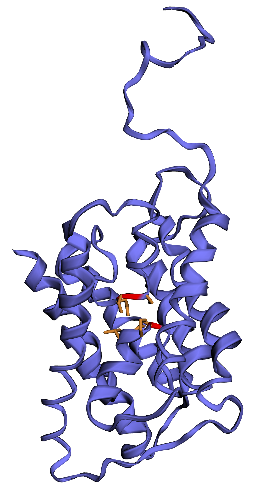
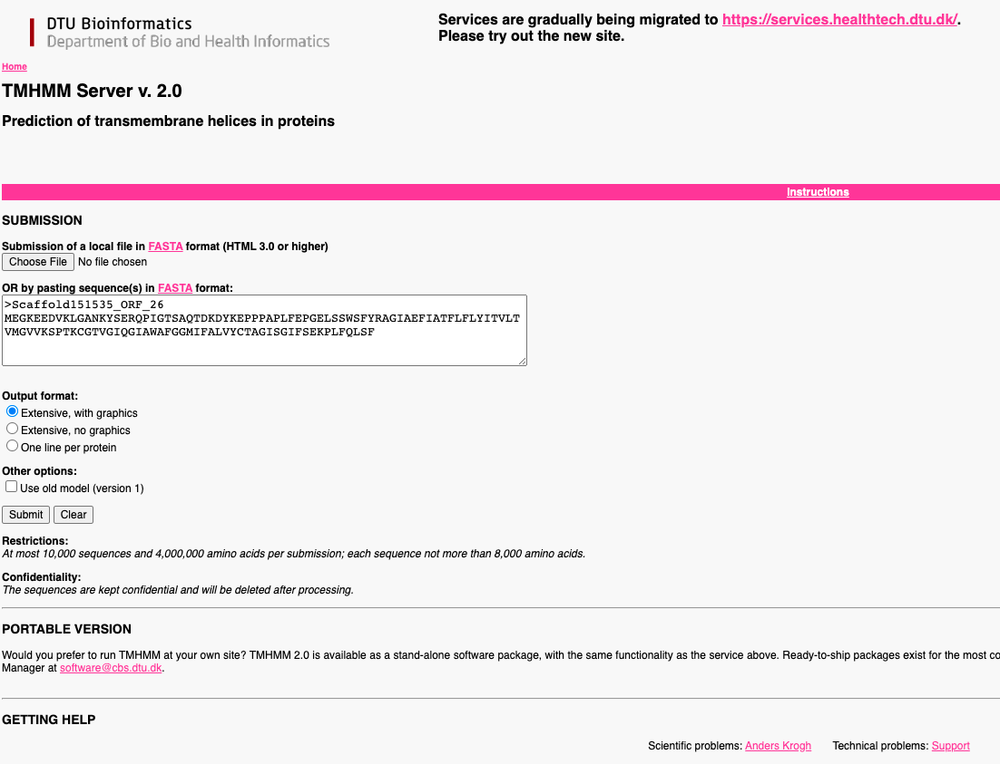
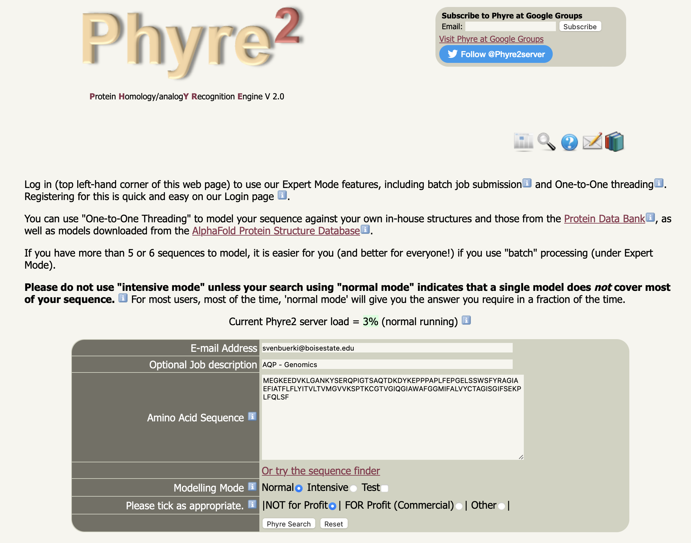
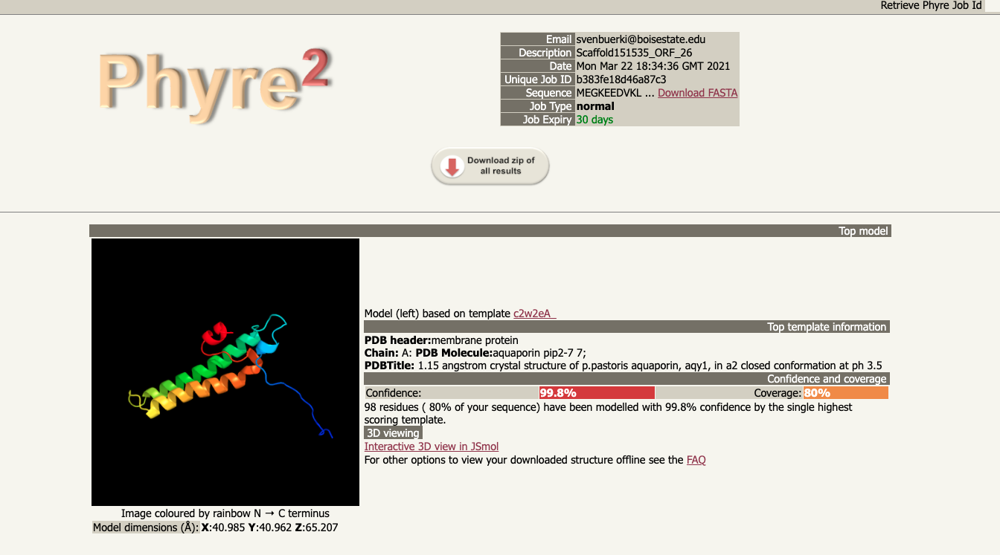

```{js logo-js, echo=FALSE}
$(document).ready(function() {
  $('#header').parent().prepend('<div id=\"logo\"></div>');
  $('#header').css('margin-right', '120px')
});
```

# Introduction {#intro}

This document supports analyses aiming at mining the sagebrush (*Artemisia tridentata* Nutt; Asteraceae) draft genome for **Aquaporin** (AQP) genes and it is based on data and analyses presented in @Melton2021. AQPs are multi-exon genes (see Figure \@ref(fig:multigene)) encoding for a large family of **proteins known to function in the transport of water and other molecules across cell membranes** [reviewed in @li2014plant]. 

```{r multigene, echo=FALSE, fig.cap="Flowchart showing the structure of a multi-exon gene and different resulting proteins. As a reminder, exons are pieces of coding DNA that encode proteins. Different exons code for different domains of a protein. The domains may be encoded by a single exon or multiple exons spliced together. In the case of multi-exon genes, the presence of exons and introns allows for greater molecular evolution through the process of exon shuffling and alternative splicing. Exon shuffling occurs when exons on sister chromosomes are exchanged during recombination. This allows for the formation of new genes. On the other hand, exons also allow for multiple proteins to be translated from the same gene through alternative splicing. This process allows the exons to be arranged in different combinations when the introns are removed/spliced. The different configurations can include the complete removal of an exon, the inclusion of part of an exon, or the inclusion of part of an intron. Alternative splicing can occur in the same location to produce different variants of a gene with a similar role, such as the human slo gene, or it can occur in different cell or tissue types, such as the mouse alpha-amylase gene. Alternative splicing, and defects in alternative splicing, can result in a number of diseases including cancer.", out.width = '80%', fig.pos= "h"}
knitr::include_graphics("Images/multi_exon_gene.png")
```

## AQP defining characteristics

The defining **characteristics of AQP proteins** include having:

  - **Six membrane-spanning alpha-helices**
  - **Two hydrophobic loops**
  - Each loop contains a conserved **asparagine-proline-alanine (NPA) motif** forming a barrel surrounding a central pore-like region that contains additional protein density (see Figure \@ref(fig:AQPex)) 
  
While the NPA motifs are generally highly conserved, there are some AQP genes that have undergone mutations of the alanine residue in the NPA motif [@ishibashi2006aquaporin]. 

## AQP subfamilies

AQPs in flowering plants comprise five subfamilies [@danielson2008unexpected]: 

1. NOD26-like intrinsic proteins (NIPs); 
2. plasma membrane intrinsic proteins (PIPs);
3. small basic intrinsic proteins (SIPs);
4. tonoplast intrinsic proteins (TIPs);
5. X intrinsic proteins (XIPs). 

Genes from each subfamily tend to move water or other substrate depending on their NPA motifs. Some AQPs, such as NIPs, have acquired a mutation in their NPA motif, such as alanine to leucine, which confer the ability to move substrates such as urea or ammonium [reviewed in @chaumont2005regulation]. 

```{r AQPex, echo=FALSE, fig.cap="Example of a 3D model of an Aquaporin protein recovered in the sagebrush genome. NPA motifs are shown by red/orange colors", fig.align='center', out.width = '50%', fig.pos= "h"}

```

# Learning outcomes

As part of this lab, students will gain the following learning outcomes:

1. Learn protocol to remotely access to a unix-based computer (see [Tutorials](Tutorials.html)).
2. Learn unix-based commands to organize projects and execute code (see [Tutorials](Tutorials.html)).
3. Provide introduction to running R code and developing your own R code (this topic was also partially covered in [Mini-Report 3](Mini_reports.html)).
4. Study protocols to mine Illumina *de novo* draft genome (at scaffold level) for target genes.
5. Predict and annotate genes recovered from genome mining process.
6. Reconstruct protein sequences of annotated genes.
7. Validate protein sequence and predict function. 

# Objectives and scientific question

Instructors teach students to conduct analyses by going over each module in class demonstrating the approach to mine genome for target gene and go over steps to assemble and validate protein product. Then, each group will be assigned a scaffold (from the *de novo* genome assembly) and they will have to conduct analyses presented in modules 2 to 4 on their own to answer the following question:

> What Aquaporin protein coding sequence is "hidden" in your assigned scaffold?

Very much the same as with the "Where's waldo?" children books, students will be able to make predictions to "find" their Aquaporin protein coding sequence based on material presented in the [Introduction](#intro) and further developed in modules [2](#mod2), [3](#mod3) and [4](#mod4). These material will allow students to design their analytical workflow covering the following major steps:

  1. Predict, annotate and identify AQP genes along scaffold.
  2. Reconstruct and validate AQP protein sequences.
  3. Predict AQP protein function (by intersecting evidence recovered from the previous steps).  

## Scaffolds assigned to groups

The `FASTA` file with scaffolds sequences can be downloaded [here](Data/Scaffolds_groups.fasta). The scaffolds assigned to each group are as followed:

- **Group 1**: Scaffold106379.
- **Group 2**: Scaffold254734.
- **Group 3**: Scaffold348135.

Let's complete the training first going by through each module and then students will be working in groups to replicate these analyses to their assigned scaffold.

# Group lab report (TOTAL: 150 points) {#report}

The instructor provides below information to complete the group report. All the material, data, code and references required to complete this report are provided here and are covered in class. In this context, students will have to focus on formatting their reports following guidelines presented here as well as making sure that their code is working and ready to be shared. Please DON'T FORGET TO PROVIDE REFERENCES FOR SOFTWARE/PACKAGES cited in the Material & Methods section.

## Apply the IMRAD format and supply data and code

Your group reports will be structured and organized following the **IMMRAD** format: **I**ntroduction, **M**aterial & **M**ethods, **R**esults, and **D**iscussion. This format is widely used to report experimental research in many scientific disciplines. In addition, you will be complementing your reports with an **Abstract**. Finally, since this research relies heavily on bioinformatics, students will complete their reports by supplying their data and commented code/scripts. Please see [Mini-Report 3](https://svenbuerki.github.io/Genomics-Bioinformatics/Mini_reports.html#46_Writing_your_report) for more details.

## Report deadline

Group reports should be uploaded on the shared Google Drive by **April 26th 2024** before 5 pm MT.

# Group lab oral presentation (TOTAL: 50 points)

Students will use their lab reports to prepare 10 minutes presentations (+ 5 minutes for questions) taking place on **April 26th 2024** (during class time).

The instructor expects each student to take part to the presentation and to be involved in answering questions.

Presentations will have to be deposited in advance onto a shared Google Drive folder or be sent to the instructor prior to the presentation.

# Analytical workflow

Overall, our analytical workflow is subdivided into 4 modules as follows:

- [**Module 1:**](#mod1) Set-up environment and identify scaffolds containing AQP genes
- [**Module 2:**](#mod2) Extract scaffolds identified in module 1 and find **O**pen **R**eading **F**rames
- [**Module 3:**](#mod3) Annotate ORFs and assemble AQP protein(s)
- [**Module 4:**](#mod4) Validate AQP protein sequences and infer their function(s)

# Project structure

## Where are the data located?

All the data associated to this project are located on your individual account in the `DraftGenomeMineR/` folder. This folder is located in `~/DraftGenomeMineR`. Your [account detail](https://docs.google.com/document/d/1t0DdQBes42Gzo8XWgc9JL2xEGjv1kbfoVE7Vznx6C9I/edit) are available here.

**Key files:**

- `Draft_Genome_Assembly.fasta`: Sagebrush draft genome assembly (at scaffold level).
- `FASTAs/PIP1_3.fa`: Reference containing *PIP1* gene (AA) for BLAST analysis. This data will be used to find Aquaporin genes in the draft genome.
- Scripts related to each module are located in `Lesson_Modules/`.

## How do I access the data and run analyses?

To access the data and run the analyses, please remotely connect to your dedicated computer using `ssh` protocol. Your credentials are available [here](https://docs.google.com/document/d/1t0DdQBes42Gzo8XWgc9JL2xEGjv1kbfoVE7Vznx6C9I/edit).

# Module 1 {#mod1}

## Objectives

This module is dedicated to presenting approach to set-up your working environment and then to identify scaffolds in the *de novo* genome assembly containing AQP genes (using BLAST).

## Remotely connect to computer

Start by using `ssh` protocol to connect to your Linux computer. This is done as follows (enter password when prompted to):

```{bash, eval=F}
#SSH with bio_11 as example
ssh bio_11@132.178.142.214
```

## Install `R` v.4.1.3

**!!WARNING: YOU DON'T HAVE TO INSTALL R!!**

The code used in this lab depends on a specific version of `R` (version 4.1.3 (2022-03-10) -- "One Push-Up") and it needs to be installed on your computer prior to starting the tutorial. This can be done by following the procedure described on these two websites:

- http://genomespot.blogspot.com/2020/06/installing-r-40-on-ubuntu-1804.html

- https://www.digitalocean.com/community/tutorials/how-to-install-r-on-ubuntu-18-04

**Disclaimer:** The right version of R was already installed on our lab computers, but if you wanted to execute this code on your personal computer please make sure you have the right version of `R`!

## Start R session and associated R script

### To do before starting

Before starting this tutorial, do the following:

- Remotely connect to your computer
- Start a new `tmux` session entitled "Lab" on your remote computer
- Navigate to `DraftGenomeMineR/` and start a new `R` session:

```{bash, eval=F}
#Navigate to DraftGenomeMineR/
cd DraftGenomeMineR/

#Start R session
R
```

- Create and save a new R file in RStudio entitled `Lab_mining_genome.R` on your personal computer

## R dependencies

**!!! DON'T EXECUTE THIS CODE !!** The instructor already installed the R packages on your computers, but the code below shows you how these packages were installed.

Some of the required packages cannot be installed with *install.packages()* and require the **BiocManager** R package to be installed. We are also installing some packing directly from GitHub repositories.

```{r eval=F, echo=T}
#Check if BiocManager is installed and if not install it
if (!require("BiocManager", quietly = TRUE))
    install.packages("BiocManager")
BiocManager::install()

#Install the other packages using BiocManager
install.packages("devtools")

library(devtools)
BiocManager::install("Biostrings")
BiocManager::install("ORFik")

#Install required packages for this tutorial
install_github("mhahsler/rBLAST")
install.packages("remotes")
remotes::install_github("GuillemSalazar/FastaUtils")
install.packages("ape")
install.packages("seqinr")
```

## Load R packages and user-defined functions

To conduct the analyses, you need to load R packages and source R user-defined functions. Please copy the following code in your R script and then execute it. 

### Bioinformatics

1. Create an object with all the required R packages and load them:

```{r, eval=F}
# This will make a list of packages that another function will use to make sure they are all installed and loaded.
list.of.packages <- c("ape",
                      "Biostrings",
                      "dplyr",
                      "FastaUtils",
                      "ORFik",
                      "readr",
                      "tidyr",
                      "rBLAST",
                      "seqinr",
                      "stringr")

# Use lapply to load all of the packages in the list.
lapply(list.of.packages, require, character.only = TRUE)
```

2. Load all the user-defined function located in `Functions/`:

```{r, eval=F}
# Load all of the functions written for DraftGenomeMineR     
files.sources <- list.files("Functions", full.names=T)
sapply(files.sources, source)
```

## Set environment for BLAST analysis

To be able to navigate between folders within our project, we will set an object entitled `project.folder`, which contains the path to the root of the project folder.

### Bioinformatics

To create this object, do as follows:

1. Create an object with working directory

```{r, eval=F}
#Copy the output of getwd() in the object as follows:
project.folder <- getwd()
```

Call `project.folder` in the Console to check that it is correct. It should return:
`"~/DraftGenomeMineR"`.

2. Set working directory to `project.folder` as follows:

```{r, eval=F}
#Set working directory
setwd(project.folder)
```

## Run the BLAST analysis

### Overview

In this section, you will perform a BLAST analysis to identify scaffolds containing AQP genes. For this analysis, you will need the following files:

- **Input:** 
    + `Draft_Genome_Assembly.fasta`: The file containing all the scaffolds (= draft genome)
    + `FASTAs/PIP1_3.fa`: The file containing an AQP protein sequence used to mine the draft genome 
- **Output:** 
    + `Unique_Filtered_Blast_Hit_Info.csv`: A CSV containing the results of the BLAST analysis (= which scaffold matches the AQP protein sequence)

### Bioinformatics

1. Set general parameters for the BLAST analysis:

```{r, eval=F}
# There are a few parameters that need to be set. 
# Let's create some R objects to store file paths and parameters for the BLAST search.

# We need a query (a fasta file of a gene you want to find in the draft genome), a draft genome assembly, BLAST databases, paths to other required folders (described in the README), and other parameters that can be used to filter results.
query.file.path <- "FASTAs/PIP1_3.fa"
genome.file.name <- "Draft_Genome_Assembly.fasta"
genome.path <- "FASTAs/Draft_Genome_Assembly.fasta"
blast.db.path <- "BlastDBs/Draft_Genome_Assembly.fasta"
AA.BlastDB.folder <- "AA_BlastDB/"
AA.ORF.folder <- "AA_ORFs/"
max.e <- 5E-50
perc.ident <- 90.000
query.type <- "AA"
blast.type <- "tblastn"
make.BlastDB <- T
BlastDB.type <- "nucl"
```

2. Read in the sagebrush draft genome assembly in `FASTA` format:

```{r, eval=F}
# Read in the genome assembly file
genome <- readLines(con = genome.path)
head(genome) # Print the top 6 lines of the fasta. There should be no spaces in what is printed. Each header should be on one line, followed by its entire scaffold on the next.
```

3. Make a BLAST database for query:

```{r, eval=F}
# Do you need to make a BLAST database or use an existing one?
if(make.BlastDB == TRUE){
  setwd("BlastDBs/")
  makeblastdb(file = genome.file.name, dbtype = BlastDB.type)
}
```

4. Read in the query file in `FASTA` format:

```{r, eval=F}
# Read in the query. What type of molecule is the query? DNA (or RNA) or amino acid sequences?
setwd(project.folder) # Previous lines changed the wd, so we need to go back to the project folder.
if (query.type == "DNA") {
  query <- readDNAStringSet(filepath = query.file.path,
                            format = "fasta")
} else {
  query <- readAAStringSet(filepath = query.file.path,
                           format = "fasta")
}
```

5. Perform BLAST analysis (`BLAST` needs to be installed on the computer):

```{r, eval=F}
# Now we have everything set up and can perform a BLAST search.
bl <- blast(db = blast.db.path, type = blast.type) # Create an object with the BLAST database and the type of BLAST search to perform.
cl <- predict(bl, query) # Perform the BLAST search
head(cl) # Look at the top BLAST hits
```

6. Filter output of BLAST analysis:

```{r, eval=F}
# We can now filter out bad BLAST hits using a few thresholds and parameters. This leaves us with only the best matches to our query.
# What parameters do you think would give you just the best candidates to be your gene of interest?
cl.filt <- subset(x = cl, Perc.Ident >= perc.ident & E <= max.e)
cl.filt.unique <- cl.filt[!duplicated(cl.filt[,c('SubjectID')]),] # SubjectID is the column that contains the scaffold names
cl.filt.unique
nrow(cl)
nrow(cl.filt)
nrow(cl.filt.unique)
blast.hits.to.extract <- subset(x = cl.filt.unique, SubjectID == cl.filt.unique[1,2])
```

7. Write output of BLAST analysis in `csv` file:

```{r, eval=F}
# We have evaluated the top BLAST hits and can see a clear best hit. Let's save this data so we can extract just that scaffold later.
write.csv(x = blast.hits.to.extract, file = "Unique_Filtered_Blast_Hit_Info.csv", row.names = F)
```

8. Quit R (using *quit()*) and inspect the content of `Unique_Filtered_Blast_Hit_Info.csv` using e.g. `vim`.

# Module 2 {#mod2}

## Objectives

In this module, we are conducting the following tasks:

- Setting up your working environment (as shown in [module 1](#mod1.))
- Extracting scaffold(s) identified in [module 1](#mod1) from the *de novo* draft genome assembly (in `FASTAs/Draft_Genome_Assembly.fasta`) and saving the output as a `FASTA` object/file.
- Finding ORFs along scaffold(s) using the user-defined function *findORFsTranslateDNA2AA()* and saving the output into a `FASTA` object/file. In molecular genetics, an **O**pen **R**eading **F**rame (ORF) is the part of a reading frame that has the ability to be translated. An ORF is a continuous stretch of codons that begins with a start codon (usually AUG) and ends at a stop codon (usually UAA, UAG or UGA). We will study the code implemented in *findORFsTranslateDNA2AA()* to fully understand the applied approach.
- Produce maps of recovered ORFs along scaffold(s). These `pdf` maps will be saved in `ORFs_map/`.

## Setting up your working environment

Before starting analyses in `R`, students have to complete these following tasks:

1. Remotely connect to their computers (using their individual accounts) with `ssh` protocol.
2. Navigate to project directory (`DraftGenomeMineR/`) using `cd`.
3. Create a new folder (`Output_FASTAs/`) using `mkdir` to store results of BLAST scaffold analysis.
4. Create a new folder (`ORFs_report/`) using `mkdir` to store results of ORFs analysis.
5. Start a new `R` session using `R-4` command.
6. Load R packages and user-defined functions.
7. Set working directory to `DraftGenomeMineR/`.

For an example of code, see below:

```{r, eval=F}
#1. ssh
ssh svenbuerki@132.178.142.214

#2. Navigate to DraftGenomeMineR/
cd DraftGenomeMineR/

#3. & 4. Create new folders to save files
# --> If these folders already exist then don't execute the following code 
mkdir Output_FASTAs/
mkdir ORFs_report/
  
#5. Start R session
R

#6. This will make a list of packages that another function will use to make sure they are all installed and loaded.
list.of.packages <- c("ape",
                      "Biostrings",
                      "dplyr",
                      "FastaUtils",
                      "ORFik",
                      "readr",
                      "tidyr",
                      "rBLAST",
                      "seqinr",
                      "stringr")

# Use lapply to load all of the packages in the list.
lapply(list.of.packages, require, character.only = TRUE)

# Load all of the functions written for DraftGenomeMineR     
files.sources <- list.files("Functions", full.names=T)
sapply(files.sources, source)

#7. Copy the output of getwd() in the object as follows:
project.folder <- getwd()

#Set wd
setwd(project.folder)
```

## Extract scaffold(s) in draft genome

### Overview

In this section, you will use the output of the BLAST analysis to extract the scaffold containing the AQP gene. For this analysis, you will need the following files:

- **Input:** 
    + `FASTAs/Draft_Genome_Assembly.fasta`: The file containing all the scaffolds (= draft genome)
    +  `Unique_Filtered_Blast_Hit_Info.csv`: A CSV containing the results of the BLAST analysis (= which scaffold matches the AQP protein sequence) 
- **Output:** 
    + `Output_FASTAs/Scaffold151535.fa`: A FASTA file with the scaffold containing the AQP gene

**!!NOTE: Don't forget to copy paste the code in your R script!!**

### Bioinformatics

1. In `R`, open `Unique_Filtered_Blast_Hit_Info.csv` containing results of BLAST analysis and extract name of target scaffold(s)

```{r, eval=F}
#Open BLAST file
cl.filt.unique <- read.csv(file = "Unique_Filtered_Blast_Hit_Info.csv") # Output of module 1

#Scaffold IDs
cl.filt.unique$SubjectID
```

2. Extract scaffold(s) sequences from draft genome file (`FASTAs/Draft_Genome_Assembly.fasta`)

```{r, eval=F}
#Open draft genome file
genome <- readLines("FASTAs/Draft_Genome_Assembly.fasta")

#Check formatting of file
head(genome)

#How many scaffolds?
Nscaff <- length(genome)/2

#Extract scaffolds in a loop

#Create data frame to store scaffold data
scaffold <- data.frame("scaffoldID" = character(length(cl.filt.unique$SubjectID)), "scaffoldSeq" = character(length(cl.filt.unique$SubjectID)))
#Start populating data frame
scaffold$scaffoldID <- cl.filt.unique$SubjectID

for(i in 1:nrow(scaffold)){
  # Find and Extract seq of each scaffold from draft genome FASTA file
  scaffold$scaffoldSeq[i] <- genome[match(paste0(">",scaffold$scaffoldID[i]), genome)+1]
}

#Convert into FASTA format
scaffoldFASTA <- apply(scaffold, 1, paste, collapse="\n")

#Save/export FASTA file
write.table(scaffoldFASTA, "Output_FASTAs/Scaffold151535.fa", row.names = F, col.names=F, quote = F)
```

## Find ORFs along scaffold(s)

### Overview

In this section, you will find ORFs along the scaffold containing the AQP gene. For this analysis, you will need the following files:

- **Input:** 
    + `Output_FASTAs/Scaffold151535.fa`: A FASTA file with the scaffold containing the AQP gene
- **Output:** 
    + `ORFs_report/Scaffold151535_ORFs.csv`: A CSV file with all predicted ORFs along scaffold
    + `AA_ORFs/Scaffold151535_ORFs.fa`: A FASTA file with AA sequences for all predicted ORFs (= input for module 3)
    + `ORFs_map/Scaffold151535_ORFs_annotated.pdf`: A PDF with the map of all recovered ORFs along the scaffold

**!!NOTE: Don't forget to copy paste the code in your R script!!**

### Bioinformatics

We will now find ORFs in scaffold(s) using *findORFsTranslateDNA2AA()*. This user-defined function (UDF) relies on functions from the *ORFik* R package. The output will be saved in `ORFs_report/`.

Let's first look at the structure of the *findORFsTranslateDNA2AA()* function to understand the applied approach:

```{r eval=F, echo=T}
##################################
#WARNING: DON'T EXECUTE THIS CODE#
##################################

#####~~~
#A UDF used to findORFs in scaffold file (FASTA format) and produce AA sequences as well as report
#####~~~
findORFsTranslateDNA2AA <- function(scaffold, scaffoldID, MinLen){
  #Extract scaffold sequence (and convert to right format)
  seqRaw <- scaffold[c(grep(paste(">", scaffoldID, sep=''), scaffold)+1)] 
  seqs <- DNAStringSet(seqRaw)
  
  #positive strands 
  pos <- ORFik::findORFs(seqs, startCodon = "ATG", minimumLength = MinLen) 
  
  #negative strands (DNAStringSet only if character) 
  neg <- ORFik::findORFs(reverseComplement(DNAStringSet(seqs)), startCodon = "ATG", minimumLength = MinLen) 
  pos <- relist(c(GRanges(pos,strand = "+"),GRanges(neg,strand = "-")),skeleton = merge(pos,neg))
  
  #Process output
  pos <- as.data.frame(pos)
  pos$scaffoldID <- rep(scaffoldID, nrow(pos))
  pos$ORFID <- paste("ORF_", seq(from=1, to=nrow(pos)), sep='')
  
  #Extract and write ORFs from seq and produce AA sequence
  for(i in 1:nrow(pos)){
    if(as.character(pos$strand[i]) == "+"){
      extSeq <- as.DNAbin(DNAStringSet(paste(strsplit(seqRaw, split='')[[1]][c(pos$start[i]:pos$end[i])], collapse = "")))
      AAseq <- paste(paste(">", pos$scaffoldID[i], "_", pos$ORFID[i], sep=''), paste(as.character(trans(extSeq, code = 1, codonstart = 1))[[1]], collapse = ''), sep='\n')
      write.table(AAseq, file = paste("AA_ORFs/", pos$scaffoldID[i], "_", pos$ORFID[i], ".fa", sep=''), col.names = F, row.names = F, quote = F)
    }
    if(as.character(pos$strand[i]) == "-"){
      revComp <- reverseComplement(DNAStringSet(seqs))
      
      extSeq <- as.DNAbin(DNAStringSet(paste(strsplit(as.vector(revComp), split='')[[1]][c(pos$start[i]:pos$end[i])], collapse = "")))
      AAseq <- paste(paste(">", pos$scaffoldID[i], "_", pos$ORFID[i], sep=''), paste(as.character(trans(extSeq, code = 1, codonstart = 1))[[1]], collapse = ''), sep='\n')
      write.table(AAseq, file = paste("AA_ORFs/", pos$scaffoldID[i], "_", pos$ORFID[i], ".fa", sep=''), col.names = F, row.names = F, quote = F)
    }
  }
  
  #Merge all ORFs for BLAST analysis
  system(paste("cat AA_ORFs/", pos$scaffoldID[i], "* > AA_ORFs/", pos$scaffoldID[i], "_ORFs.fa", sep=''))
  system(paste("rm AA_ORFs/", pos$scaffoldID[i], "_ORF_*", sep=""))
  #Save pos file
  write.csv(pos, file = paste("ORFs_report/",pos$scaffoldID[i], "_", "ORFs.csv", sep=''), col.names = T, row.names = F, quote = F)
} 
```

1. Now, we can apply *findORFsTranslateDNA2AA()* to our data:

```{r, eval=F}
# Open FASTA file with target scaffold
scaffold <- readLines("Output_FASTAs/Scaffold151535.fa")
scaffoldID <- grep(pattern = "^>", x = scaffold, value = T)
scaffoldID <- gsub(pattern = ">", replacement = "", x = scaffoldID)
# Apply UDF to find ORFs and translate these into AA
# --> we will use the AA sequences to conduct a BLAST analysis and identify ORFs coding for Aquaporin exons
tryCatch(
  {
    for(i in 1:length(scaffoldID)){
      findORFsTranslateDNA2AA(scaffold = scaffold, scaffoldID = scaffoldID[i], MinLen = 40)
    }
  })
```

2. We should now have ORFs reports and `FASTA` files of translated ORFs. Let's check these outputs.

```{r, eval=F}
# Open the CSV output of the UDF containing data on predicted ORFs and associated sequences 
orf.report <- read.csv("ORFs_report/Scaffold151535_ORFs.csv")

# How many ORFs were found?
nrow(orf.report) 

# What are the longest ORFs?
orf.report[order(-orf.report$width),] 

# Look at translated ORFs (=AA sequences)
translated.orfs <- readLines("AA_ORFs/Scaffold151535_ORFs.fa")
head(translated.orfs)
```

## Produce maps of recovered ORFs along scaffold(s)

Here, we are visualizing the ORFs recovered by our analysis along each scaffold by producing maps saved in `pdf` format in `ORFs_map/`. The code also checks if the folder `ORFs_map/` where files will be saved exists and if not creates it.  

### Bioinformatics

First study the code provided below and then execute it. Don't forget to copy and paste it in your R script.

```{r, eval=F}
###
#Build map of scaffold with ORFs
###

#Read scaffold FASTA file (line by line)
scaffold <- readLines("Output_FASTAs/Scaffold151535.fa")

#List all files with ORFs
ORFfiles <- list.files(path = "ORFs_report", pattern = ".csv", full.names = T)

#Check if folder where ORF maps will be saved exists
# if not then creates it
output_dir <- file.path(paste0(getwd(), "/ORFs_map/"))

if(dir.exists(output_dir)){
  print(paste0("Dir", output_dir, " already exists!"))
}else{
  print(paste0("Created ", output_dir))
  dir.create(output_dir)  
}

#Produce a map (in pdf format) for each scaffold
for(i in 1:length(ORFfiles)){
  print(ORFfiles[i])
  #Read file in
  ORF <- read.csv(ORFfiles[i])
  
  #Process FASTA scaffold sequence
  seq <- strsplit(scaffold[grep(paste(">", ORF$scaffoldID[1], sep=''), scaffold)+1], split='')
  
  #Separate ORFs by strand
  ORFplus <- subset(ORF, ORF$strand == "+")
  ORFneg <- subset(ORF, ORF$strand == "-")
  
  #Create plot
  pdf(paste("ORFs_map/", ORF$scaffoldID[1], "_ORFs_annotated.pdf", sep=''))
  
  #Initiate plot
  plot(x=1, y=1, xlim=c(0,length(seq[[1]])), ylim=c(0,2), type='n', bty="n", axes=F, xlab = "", ylab='')
  #Add title
  text(x=5, y=2, paste(ORF$scaffoldID[1], " (strand: + in grey and - in blue)", sep=''), adj=0, cex=.8)
    
  #Create a segment with length of scaffold
  segments(x0=0, x1=length(seq[[1]]), y0=1, y1=1, col='black', lwd=3)
    
  #Add ORFs: rectangles (grey: +, blue: -)
  rect(xleft=ORFplus$start, xright=ORFplus$end, ybottom=0.75, ytop=1.25, col='grey')
  rect(xleft=ORFneg$start, xright=ORFneg$end, ybottom=0.75, ytop=1.25, col='blue')
  text(x=(ORFneg$start + ORFneg$end)/2, y=0.7, paste(ORFneg$ORFID, " (", ORFneg$start, ":", ORFneg$end, ")", sep=''), srt=90, col='blue', adj=1, cex=0.4)
  text(x=(ORFplus$start + ORFplus$end)/2, y=1.3, paste(ORFplus$ORFID, " (", ORFplus$start, ":", ORFplus$end, ")", sep=''), srt=90, col='black', adj=0, cex=0.4)
    
  #Add x axis
  axis(side = 1)
  mtext("Sequence (bp)", pos = c(0,0.5), side=1, line=2, cex.lab=0.6,las=1)
  #Close pdf
  dev.off()
}
```

Figure \@ref(fig:scaffmap) shows the location of the predicted ORFs along `Scaffold151535` inferred by the code displayed above. 

```{r scaffmap, echo=FALSE, fig.cap="Map of predicted ORFs along scaffold151535.", out.width = '100%', fig.pos= "h"}
knitr::include_graphics("Images/Scaffold151535_ORFs_annotated.png")
```

# Module 3 {#mod3}

## Objectives

In this module, we are conducting the following tasks:

1. Annotate ORFs inferred in [module 2](#mod2) using online protein [BLAST](https://blast.ncbi.nlm.nih.gov/Blast.cgi?PROGRAM=blastp&PAGE_TYPE=BlastSearch&LINK_LOC=blasthome) tool. Students will use the output of the protein BLAST analysis to identify ORF(s) coding for Aquaporin genes.
2. Extract ORF(s) identified by protein BLAST analysis to reconstruct Aquaporin gene sequence. Students will provide DNA sequence of Aquaporin gene located on scaffold and its associated protein sequence. 

## Annotate ORFs using online protein BLAST tool

### Input file for protein BLAST analysis

The `FASTA` file `Scaffold151535_ORFs.fa` (see Figure \@ref(fig:scafAAseqFASTA)) containing AA sequences of ORFs identified in [module 2](#mod2) is available on the shared [Google Drive](https://drive.google.com/drive/folders/1d0TSt_M-wAVmNPPfMnXtxD8_fnfK7jQr?usp=sharing) or on [GitHub](Data/Scaffold151535_ORFs.fa).  

```{r scafAAseqFASTA, echo=FALSE, fig.cap="FASTA file containing all AA sequences for ORFs inferred along scaffold. See module 2 for more details.", out.width = '100%', fig.pos= "h"}
knitr::include_graphics("Images/Scaffolds_AA_seq_ORFs.png")
```

### Protein BLAST analysis

1. Students download input file on their personal computers and open it in their favorite text editor.
2. Go on the online protein [BLAST](https://blast.ncbi.nlm.nih.gov/Blast.cgi?PROGRAM=blastp&PAGE_TYPE=BlastSearch&LINK_LOC=blasthome) platform [described in @altschul1997gapped].
3. Copy content of `Scaffold151535_ORFs.fa` as shown in Figure \@ref(fig:protBLASTinput) and press `BLAST` button to send the query.
```{r protBLASTinput, echo=FALSE, fig.cap="Online protein BLAST form.", out.width = '100%', fig.pos= "h"}
knitr::include_graphics("Images/proteinBLASTinputform.png")
```
4. Inspect output of protein BLAST analysis and identified ORF(s) along scaffold coding for Aquaporin gene products (see Figure \@ref(fig:protBLASToutput)).
```{r protBLASToutput, echo=FALSE, fig.cap="Output of the protein BLAST analysis. Use the dropdown button to select each ORF and identify their gene products.", out.width = '100%', fig.pos= "h"}
knitr::include_graphics("Images/proteinBLASToutput.png")
```
5. What ORFs are coding for Aquaporin gene products?

### Questions

> How many ORFs on `Scaffold151535` are coding for AQP exons and which are they? 

> Based on the BLAST analysis and the ORFs map (Figure \@ref(fig:scaffmap)), do you predict that the Aquaporin gene sequence in `Scaffold151535` is complete or not? Please motivate your answer

## Extract ORF(s) identified by protein BLAST analysis to reconstruct Aquaporin gene sequence

Students are tasked to develop an R code producing the DNA sequence of Aquaporin gene located on identified scaffold and its associated protein sequence.

## A user-defined function to produce the protein sequence

Please find below a user defined function (UDF) to concatenate ORFs into a protein sequence in `FASTA` format. This function implements defensive programming aiming at providing the users with meaningful error messages to debug their code.

In this UDF, defensive programming has been implemented 2-ways:

1. The code **checks that the `FASTA` file declared in `fastaAA` exists** in the working directory (or in the provided path) and stops and return an error message pertaining to this issue if it doesn't.
2. The code **checks that all the ORFs declared in `ORFsToCat` exists in the FASTA file** (= declared in `fastaAA`) and stops and return an error message pertaining to this issue if they are not all present in the file. 

Finally, the UDF as a logical argument entitled `stopCodon` allowing to declare whether stop codons (represented by `*`) are present in the AA sequences (in your `FASTA` file). Here it is especially convenient since **the concatenated protein sequence should not contain stop codons for our subsequent analyses**. See UDF below for more details.

The function is provided below for you to inspect.

```{r eval = T, echo = T, warning = F}
###~~~~
#ORFs2protSeq - A UDF to produce a protein sequence from ORFs
# Arguments:
# - fastaAA: Name of Fasta file containing ORFs AA sequences
# - ORFsToCat: vector with names of ORFs to concatenate (as in FASTA file and including ">" and in the right order)
# - stopCodon: Logical (TRUE/FALSE) variable to state whether stop (*) codons are in the AA sequences
# Output:
# - An object with the concatenated protein sequence in FASTA format
ORFs2protSeq <- function(fastaAA, ORFsToCat, stopCodon){
  #Check if the FASTA file exists
  checkFile <- file.exists(fastaAA)
  if(checkFile == FALSE){
    #Stop the function and print error
    stop(call. = FALSE, paste(fastaAA, "does not exists! Please check that your working directory is set properly.", sep = " "))
  }else{
    #Open FASTA file
    fas <- readLines(fastaAA)
    #Find ORFs in Fasta file
    ToFind <- match(ORFsToCat, fas)
    #Check that all the ORFs were found in the Fasta
    checkORFs <- is.na(ToFind)
    if(length(which(checkORFs == TRUE)) > 0){
      #Stop the function and print error
      stop(call. = FALSE, paste(paste(ORFsToCat[which(checkORFs == TRUE)], collapse = " "), "couldn't be found in", fastaAA, " Please fix the error(s).", sep = " "))
    }else{
      print(paste("Producing protein sequence with", paste(ORFsToCat, collapse = ", "), sep = " "))
      #Cat ORFs into AA sequence
      protSeq <- paste(fas[ToFind+1], collapse = "")
      if(is.logical(stopCodon) == TRUE){
        #Discard stop codons from final sequence
        protSeq <- gsub("[*]", "", protSeq)  
      }
    }
    #Produce final protein sequence in FASTA format
    # header
    head <- paste(">Protein_sequence_from_", paste(gsub("[>]", "", ORFsToCat), collapse = "|"), sep= "")
    protSeqOUT <- paste(head, protSeq, sep = "\n")
    print(protSeqOUT)
  }
  return(protSeqOUT)
}
```

We apply the UDF *ORFs2protSeq* to `Scaffolds_groups.fasta` (= `fastaAA`). First, we will use an example where the `ORFsToCat` argument contains ORFs that are not found in the `FASTA` file to demonstrate how defensive programming was implemented in the UDF.

```{r eval = T, echo = T, error=TRUE, warning = F}
#Name of the FASTA file
fastaAA <- "Data/Scaffold151535_ORFs.fa"

#Fasta headers of the ORFs you want to concatenate
# Here some ORFs names are faulty
ORFsToCat <- c(">Scaffold151535_ORF_1tt", ">Scaffold151535_ORF_13c", ">Scaffold151535_ORF_2")

#Stop codon
stopCodon <- TRUE

#Apply UDF
ORFs2protSeq(fastaAA, ORFsToCat, stopCodon)
```
Second, we apply the UDF again, but with matching ORFs (= they are declared in the `FASTA` file).

```{r eval = T, echo = T, error=TRUE, warning = F}
#Name of the FASTA file
fastaAA <- "Data/Scaffold151535_ORFs.fa"

#Fasta headers of the ORFs you want to concatenate
# Here ORF names are accurate
ORFsToCat <- c(">Scaffold151535_ORF_1", ">Scaffold151535_ORF_13", ">Scaffold151535_ORF_2")

#Stop codon
stopCodon <- TRUE

#Apply UDF
ORFs2protSeq(fastaAA, ORFsToCat, stopCodon)
```

# Module 4 {#mod4}

## Objectives

The objectives of this module are to validate the AQP protein sequences obtained in [module 3](#mod3) and infer its function. This will be done by conducting the following analyses:

1. Prediction of protein transmembrane helices based on the approach implemented in [TMHMM](http://www.cbs.dtu.dk/services/TMHMM/) [@krogh2001predicting]. This approach relies on [Hidden Markov Models](https://www.sciencedirect.com/topics/biochemistry-genetics-and-molecular-biology/hidden-markov-model).
2. Identifying NPA motifs using R script relying on *Biostring* [@Biostrings] and *IRanges* [@IRanges] packages. 
3. Model 3D AQP protein using approach implemented in [Phyre^2^](http://www.sbg.bio.ic.ac.uk/~phyre2/html/page.cgi?id=index) and predict protein (therefore its function). The approach for protein modeling, prediction and analysis is presented in @kelley2015phyre2. 

### Predictions

To be valid, the AQP protein sequence should have: 

  1. Six transmembrane helices.
  2. Two hydrophobic loops.
  3. Two NPA motifs (one per loop).
  4. Mutations in the NPA motifs (at N or A positions) changes affinity with water and therefore suggests different substrate (i.e., this would be indicative of a change of function).

## Predictions of number of protein transmembrane helices (THM) (and outside loops)

To conduct this analysis (based on `>Scaffold151535_ORF_26`) do the following:

1. Go to the TMHMM website: https://services.healthtech.dtu.dk/service.php?TMHMM-2.0
2. Paste the `FASTA` AA sequence generated in [module 3](#mod3), here corresponding to `Scaffold151535_ORF_26` as shown in Figure \@ref(fig:TMHMMinput) and submit the analysis.
```{r TMHMMinput, echo=FALSE, fig.cap="Snapshot of TMHMM website showing how to submit job.", out.width = '100%', fig.pos= "h"}

```
3. Inspect the output of the TMHMM analysis (see Figure \@ref(fig:TMHMMoutput)). For AQP proteins, we are expecting:
    - Number of predicted TMHs (= **T**rans-**M**embrane **H**elix):  6.
    - Outside loops: 2.
```{r TMHMMoutput, echo=FALSE, fig.cap="Snapshot of TMHMM results.", out.width = '100%', fig.pos= "h"}
knitr::include_graphics("Images/TMHMM_results.png")
```

## Identifying the number of NPA motifs and type

In this section, we are identifying the location and type of NPA motif along the AQP protein sequence. The instructors provide a template of an R code (based on `Scaffold151535_ORF_26`) to conduct this task relying on the *Biostring* [@Biostrings] and *IRanges* [@IRanges] packages. These latter packages should already be installed on your computer, but if they are not then install and load them as follows:

```{r eval=F, echo=T}
#Install Biostrings and IRanges (deposited on Bioconductor)
BiocManager::install("Biostrings")
BiocManager::install("IRanges")

#Load the packages to check installation
pkgs <- c("Biostrings", "IRanges")
lapply(pkgs, require, character.only = TRUE)
```

Now that the `R` packages are installed and loaded we can carry on with our coding:

```{r, eval=T, ech = T}
##
#AA sequence
##
#User copy AA sequence in the object below
# Here, associated to Scaffold151535_ORF_26
AAseq <- "MEGKEEDVKLGANKYSERQPIGTSAQTDKDYKEPPPAPLFEPGELSSWSFYRAGIAEFIATFLFLYITVLTVMGVVKSPTKCGTVGIQGIAWAFGGMIFALVYCTAGISGIFSEKPLFQLSF*"

##
#Create a data.frame to store data on
# - N_NPA: Number of NPA motifs
# - NPA_motif: NPA motif
# - StartNPA: Starting position of NPA motif in AA seq
##
NPAdat <- data.frame("N_NPA" = numeric(length(AAseq)), "NPA_motif" = character(length(AAseq)), "StartNPA" = numeric(length(AAseq)))

#Start by matching to find NP motif and locations along sequence
tmp <- Biostrings::matchPattern(pattern = "NP", Biostrings::AAString(AAseq)) 
tmp <- as.data.frame(IRanges::ranges(tmp))
    
if(nrow(tmp) > 0){
  #Print that it found NP motif
  print("NP found")
  #There is an NP motif
  #N NP
  NPAdat$N_NPA <- nrow(tmp)
  #Infer motifs
  NPAdat$NPA_motif <- paste(paste(rep("NP", nrow(tmp)), strsplit(as.vector(AAseq), split='')[[1]][as.numeric(tmp[,2]+1)], sep = ''), collapse = '/')
  #Start motifs
  NPAdat$StartNPA <- paste(tmp[,1], collapse = '/')
  }else{
    #There isn't an NP motif, so we look for a PA motif
  tmp <- Biostrings::matchPattern(pattern = "PA", Biostrings::AAString(AAseq))
  tmp <- as.data.frame(IRanges::ranges(tmp))
      if(nrow(tmp) > 0){
      #Print that it found PA motif
      print("PA found")
      #N NP
      NPAdat$N_NPA <- nrow(tmp)
      #Infer motifs
      NPAdat$NPA_motif <- paste(paste(strsplit(as.vector(AAseq), split='')[[1]][as.numeric(tmp[,1]-1)], rep("PA", nrow(tmp)), sep = ''), collapse = '/')
      #Start motifs
      NPAdat$StartNPA <- paste(tmp[,1]-1, collapse = '/')
      }else{
        next
      }
}

print(paste("The following NPA motifs were found for AA sequence:", AAseq, sep=" "))
print(NPAdat)

##
#Write data out
##
# If you want to write the data, execute the following command (don't forget to adjust your path)
#write.csv(NPAdat, file='Scaffold151535_ORF_26_NPA_motifs.csv', row.names = F, quote = F)
```

### Question

> Based on your number of NPA motifs, how many hydrophobic loops does your Aquaporin protein contain?
>

## Model 3D AQP protein

To model 3D structure of AQP protein and predict its function do the following (here based on `>Scaffold151535_ORF_26`):

1. Go to Phyre^2^ website: http://www.sbg.bio.ic.ac.uk/~phyre2/html/page.cgi?id=index
2. Copy only the AA sequence (without the FASTA header) and fill the form as shown in Figure \@ref(fig:phyreinput). Once completed, please submit job by pressing `Phyre Search`. The job will take ca. 50 minutes to run.
```{r phyreinput, echo=FALSE, fig.cap="Snapshot of Phyre2 website used to model 3D structure of protein and predict its function.", out.width = '100%', fig.pos= "h"}

```
3. You will relieve an email when the analysis is completed. A link to the output of the Phyre^2^ analysis will send you to the report page as shown in Figure \@ref(fig:phyreoutput).
```{r phyreoutput, echo=FALSE, fig.cap="Results of Phyre2 analysis.", out.width = '100%', fig.pos= "h"}

```
4. Note that although the AQP protein sequence is not complete, the analysis still modeled it correctly and predicted that it belonged to the PIP subfamily (see Figure \@ref(fig:phyreoutput)). 

# Discussion and Conclusions

> Based on the analyses and data gathered in this lab, what are your thoughts and conclusions on the Aquaporin gene/protein located on `Scaffold151535`?

Examples of questions that we could ask ourselves to answer the above question are:

- How many Aquaporin exons were recovered and where are they located on the scaffold?
- How many TMHs and loops were inferred? 
- How many NPA motifs and types were inferred?
- What is the predicted protein and its function based on the modeling analysis conducted on the AA sequence?

Based on these latter evidence, **do you think that the Aquaporin protein sequence is complete?** The instructor invites you to consult @Melton2021 for more information allowing answering these questions and come to a conclusion.

# Your turn!

Each group is now working as a team to reproduce the analyses presented here on their assigned scaffold.

Good luck!

## Scaffolds assigned to groups

The `FASTA` file with scaffolds sequences can be downloaded [here](Data/Scaffolds_groups.fasta). The scaffolds assigned to each group are as followed:

- **Group 1**: Scaffold106379.
- **Group 2**: Scaffold254734.
- **Group 3**: Scaffold348135.

# References