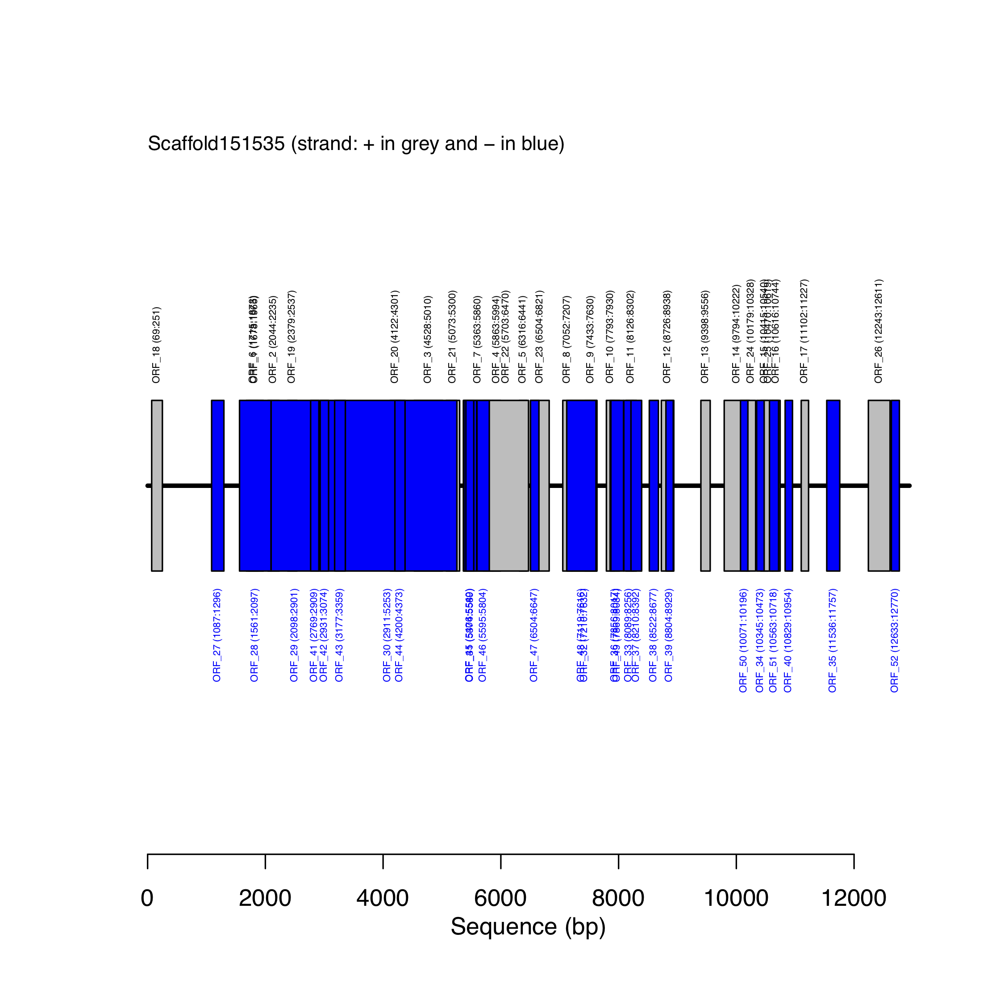
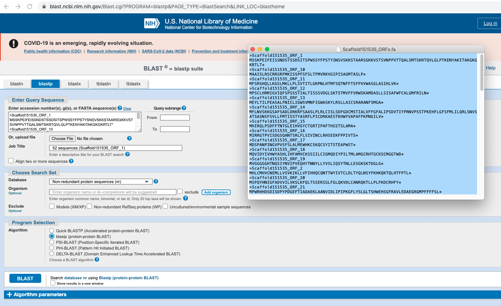

```{js logo-js, echo=FALSE}
$(document).ready(function() {
  $('#header').parent().prepend('<div id=\"logo\"></div>');
  $('#header').css('margin-right', '120px')
});
```

# Introduction

This webpage supports analyses aiming at mining the sagebrush draft genome for Aquaporin genes. Aquaporin genes are multi-exon genes (see Figure \@ref(fig:multigene)). As a reminder, exons are pieces of coding DNA that encode proteins. Different exons code for different domains of a protein. The domains may be encoded by a single exon or multiple exons spliced together. Ijn the case of multi-exon genes, the presence of exons and introns allows for greater molecular evolution through the process of exon shuffling and alternative splicing. Exon shuffling occurs when exons on sister chromosomes are exchanged during recombination. This allows for the formation of new genes. On the other hand, exons also allow for multiple proteins to be translated from the same gene through alternative splicing. This process allows the exons to be arranged in different combinations when the introns are removed/spliced (see Figure \@ref(fig:multigene)). The different configurations can include the complete removal of an exon, the inclusion of part of an exon, or the inclusion of part of an intron. Alternative splicing can occur in the same location to produce different variants of a gene with a similar role, such as the human *slo* gene, or it can occur in different cell or tissue types, such as the mouse *alpha-amylase* gene. Alternative splicing, and defects in alternative splicing, can result in a number of diseases including cancer.

The processes described above will have to be accounted for when students will be assembling protein sequences from their predicted Open Reading Frames (see modules 2 and 3).  

```{r multigene, echo=FALSE, fig.cap="Flowchart showing the structure of a multi-exon gene and different resulting proteins. See text for more details.", out.width = '80%', fig.pos= "h"}

```

## Analytical workflow

Overall, our analytical workflow is subdivided into 4 modules as follows:

- [**Module 1:**](#mod1) Set-up environment and conduct BLAST analysis.
- [**Module 2:**](#mod2) Extract scaffolds and find **O**pen **R**eading **F**rames.
- [**Module 3:**](#mod3) Annotate ORFs and assemble proteins.
- **Module 4:** Alignment and phylogenetic reconstruction.

## Project structure

### Where are the data located?

All the data associated to this project are located on your individual account in the `DraftGenomeMineR/` folder. This folder is located in `/home/bio_11/DraftGenomeMineR`. Please replace `bio_11` by your [account detail](https://docs.google.com/document/d/1t0DdQBes42Gzo8XWgc9JL2xEGjv1kbfoVE7Vznx6C9I/edit).

**Key files:**

- `Draft_Genome_Assembly.fasta`: Sagebrush draft genome assembly (at scaffold level).
- `FASTAs/PIP1_3.fa`: Reference containing *PIP1* gene (AA) for BLAST analysis. This data will be used to find Aquaporin genes in the draft genome.
- Scripts related to each module are located in `Lesson_Modules/`.

### How do I access the data and run analyses?

To access the data and run the analyses, please remotely connect to your dedicated computer using `ssh` protocol. Your credentials are available [here](https://docs.google.com/document/d/1t0DdQBes42Gzo8XWgc9JL2xEGjv1kbfoVE7Vznx6C9I/edit).

# Module 1: Set-up environment and conduct BLAST analysis {#mod1}

## Remotely connect to computer

Start by using `ssh` protocol to connect to your Linux computer. This is done as follows (enter password when prompted to):

```{bash, eval=F}
#SSH with bio_11 as example
ssh bio_11@132.178.142.214
```

## Copy project folder to remote computer

After downloading the `zip` file from our shared Google Drive to your personal computer, please copy this file to your Linux computer (on your personal account) as follows:

```{bash, eval=F}
#scp file: general syntax
scp file user@host:dir

#Example
scp DraftGenomeMineR.zip bio_11@132.178.142.214:/home/bio_11

#unzip file
unzip DraftGenomeMineR.zip
```

**Disclaimer:** This procedure only works if you have a unix-based computer. If you don't have a unix-based computer, please ask instructors to transfer this file for you to your account. However, students can `cp` this file by copying it from the `bioinformatics` account onto their Linux computer as follows:

```{r, echo=T, eval=F}
#Navigate where the zip file should reside (adjust path to your account ID)
cd /home/bio_11

#Copy the zip file (containing all data for project) on your Linux account
cp /home/bioinformatics/GenomeMining_Bioinformatics_2021/DraftGenomeMineR.zip .

#unzip file
unzip DraftGenomeMineR.zip
```

## Start R session

Navigate to `DraftGenomeMineR/` and start a new `R` session:

```{bash, eval=F}
#Navigate to DraftGenomeMineR/
cd DraftGenomeMineR/

#Start R session
R-4
```

## Load R packages and user-defined functions

Create an object with all the required R packages and load them:

```{r, eval=F}
# This will make a list of packages that another function will use to make sure they are all installed and loaded.
list.of.packages <- c("ape",
                      "Biostrings",
                      "dplyr",
                      "FastaUtils",
                      "ORFik",
                      "readr",
                      "tidyr",
                      "rBLAST",
                      "seqinr",
                      "stringr")

# Use lapply to load all of the packages in the list.
lapply(list.of.packages, require, character.only = TRUE)
```

Load all the user-defined function located in `Functions/`:

```{r, eval=F}
# Load all of the functions written for DraftGenomeMineR     
files.sources <- list.files("Functions", full.names=T)
sapply(files.sources, source)
```

## Setting environment for BLAST analysis

To be able to navigate between folders within our project, we will set a object entitled `project.folder`, which contains the path to the root of the folder.

To create this object, do as follows:

```{r, eval=F}
#Copy the output of getwd() in the object as follows:
project.folder <- getwd()
```

Call `project.folder` to check that it is right. It should be:
`"/home/bio_11/DraftGenomeMineR"` (with `bio_11` replaced by your account ID).

Set working directory to `project.folder` as follows:

```{r, eval=F}
setwd(project.folder)
```

## Running BLAST analysis

Set general parameters for the BLAST analysis:

```{r, eval=F}
# There are a few parameters that need to be set. Let's create some R objects to store file paths and parameters for the BLAST search.

# We need a query (a fasta file of a gene you want to find in the draft genome), a draft genome assembly, BLAST databases, paths to other required folders (described in the README), and other parameters that can be used to filter results.
query.file.path <- "FASTAs/PIP1_3.fa"
genome.file.name <- "Draft_Genome_Assembly.fasta"
genome.path <- "FASTAs/Draft_Genome_Assembly.fasta"
blast.db.path <- "BlastDBs/Draft_Genome_Assembly.fasta"
AA.BlastDB.folder <- "AA_BlastDB/"
AA.ORF.folder <- "AA_ORFs/"
max.e <- 5E-50
perc.ident <- 90.000
query.type <- "AA"
blast.type <- "tblastn"
make.BlastDB <- T
BlastDB.type <- "nucl"
```

Read in the sagebrush draft genome assembly in `FASTA` format:

```{r, eval=F}
# Read in the genome assembly file
genome <- readLines(con = genome.path)
head(genome) # Print the top 6 lines of the fasta. There should be no spaces in what is printed. Each header should be on one line, followed by its entire scaffold on the next.
```

Make a BLAST database for query:

```{r, eval=F}
# Do you need to make a BLAST database or use an existing one?
if(make.BlastDB == TRUE){
  setwd("BlastDBs/")
  makeblastdb(file = genome.file.name, dbtype = BlastDB.type)
}
```

Read in the query file in `FASTA` format:

```{r, eval=F}
# Read in the query. What type of molecule is the query? DNA (or RNA) or amino acid sequences?
setwd(project.folder) # Previous lines changed the wd, so we need to go back to the project folder.
if (query.type == "DNA") {
  query <- readDNAStringSet(filepath = query.file.path,
                            format = "fasta")
} else {
  query <- readAAStringSet(filepath = query.file.path,
                           format = "fasta")
}
```

Perform BLAST analysis (`BLAST` needs to be installed on the computer):

```{r, eval=F}
# Now we have everything set up and can perform a BLAST search.
bl <- blast(db = blast.db.path, type = blast.type) # Create an object with the BLAST database and the type of BLAST search to perform.
cl <- predict(bl, query) # Perform the BLAST search
head(cl) # Look at the top BLAST hits
```

Filter output of BLAST analysis:

```{r, eval=F}
# We can now filter out bad BLAST hits using a few thresholds and parameters. This leaves us with only the best matches to our query.
# What parameters do you think would give you just the best candidates to be your gene of interest?
cl.filt <- subset(x = cl, Perc.Ident >= perc.ident & E <= max.e)
cl.filt.unique <- cl.filt[!duplicated(cl.filt[,c('SubjectID')]),] # SubjectID is the column that contains the scaffold names
cl.filt.unique
nrow(cl)
nrow(cl.filt)
nrow(cl.filt.unique)
blast.hits.to.extract <- subset(x = cl.filt.unique, SubjectID == cl.filt.unique[1,2]) 
```

Write output of BLAST analysis in `csv` file:

```{r, eval=F}
# We have evaluated the top BLAST hits and can see a clear best hit. Let's save this data so we can extract just that scaffold later.
write.csv(x = blast.hits.to.extract, file = "Unique_Filtered_Blast_Hit_Info.csv", row.names = F)
```


# Module 2: Extract scaffolds and find Open Reading Frames {#mod2}

In this module, we are conducting the following tasks:

- Extracting scaffold(s) identified in [module 1](#mod1) from the draft genome assembly (in `FASTAs/Draft_Genome_Assembly.fasta`) and saving the output as a `FASTA` object/file.
- Finding ORFs along scaffold(s) using the user-defined function *findORFsTranslateDNA2AA()* and saving the output into a `FASTA` object/file. In molecular genetics, an **O**pen **R**eading **F**rame (ORF) is the part of a reading frame that has the ability to be translated. An ORF is a continuous stretch of codons that begins with a start codon (usually AUG) and ends at a stop codon (usually UAA, UAG or UGA). We will study the code implemented in *findORFsTranslateDNA2AA()* to fully understand the applied approach.
- Produce maps of recovered ORFs along scaffold(s). These `pdf` maps will be saved in `ORFs_map/`.

## Getting ready!

Before starting analyses in `R`, students have to complete these following tasks:

1. Remotely connect to their computers (using their individual accounts) with `ssh` protocol.
2. Navigate to project directory (`DraftGenomeMineR/`) using `cd`.
3. Create a new folder (`Output_FASTAs/`) using `mkdir` to store results of BLAST scaffold analysis.
4. Create a new folder (`ORFs_report/`) using `mkdir` to store results of ORFs analysis.
5. Start a new `R` session using `R-4` command.
6. Load R packages and user-defined functions.
7. Set working directory to `DraftGenomeMineR/`.

For an example of code, see below:

```{r, eval=F}
#1. ssh
ssh svenbuerki@132.178.142.214

#scp file
#scp DraftGenomeMineR.zip svenbuerki@132.178.142.214:/home/svenbuerki

#unzip file
#unzip DraftGenomeMineR.zip

#2. Navigate to DraftGenomeMineR/
cd DraftGenomeMineR/

#3. & 4. Create new folders 
mkdir Output_FASTAs/
mkdir ORFs_report/
  
#5. Start R session
R-4

#6. This will make a list of packages that another function will use to make sure they are all installed and loaded.
list.of.packages <- c("ape",
                      "Biostrings",
                      "dplyr",
                      "FastaUtils",
                      "ORFik",
                      "readr",
                      "tidyr",
                      "rBLAST",
                      "seqinr",
                      "stringr")

# Use lapply to load all of the packages in the list.
lapply(list.of.packages, require, character.only = TRUE)

# Load all of the functions written for DraftGenomeMineR     
files.sources <- list.files("Functions", full.names=T)
sapply(files.sources, source)

#7. Copy the output of getwd() in the object as follows:
project.folder <- getwd()

#Set wd
setwd(project.folder)
```

## Extracting scaffold(s) identified in module 1

Open `Unique_Filtered_Blast_Hit_Info.csv` containing results of BLAST analysis and extract name of target scaffold(s).

```{r, eval=F}
#Open BLAST file
cl.filt.unique <- read.csv(file = "Unique_Filtered_Blast_Hit_Info.csv") # Output of module 1

#Scaffold IDs
cl.filt.unique$SubjectID
```

Extract scaffold(s) sequences from draft genome file (`FASTAs/Draft_Genome_Assembly.fasta`).

```{r, eval=F}
#Open draft genome file
genome <- readLines("FASTAs/Draft_Genome_Assembly.fasta")

#Check formatting of file
head(genome)

#How many scaffolds?
Nscaff <- length(genome)/2

#Extract scaffolds in a loop

#Create data frame to store scaffold data
scaffold <- data.frame("scaffoldID" = character(length(cl.filt.unique$SubjectID)), "scaffoldSeq" = character(length(cl.filt.unique$SubjectID)))
#Start populating data frame
scaffold$scaffoldID <- cl.filt.unique$SubjectID

for(i in 1:nrow(scaffold)){
  # Find and Extract seq of each scaffold from draft genome FASTA file
  scaffold$scaffoldSeq[i] <- genome[match(paste0(">",scaffold$scaffoldID[i]), genome)+1]
}

#Convert into FASTA format
scaffoldFASTA <- apply(scaffold, 1, paste, collapse="\n")

#Save/export FASTA file
write.table(scaffoldFASTA, "Output_FASTAs/Scaffold151535.fa", row.names = F, col.names=F, quote = F)
```

## Finding ORFs along scaffold(s)

We will now find ORFs in scaffold(s) using *findORFsTranslateDNA2AA()*. This user-defined function relies on the *ORFik* R package. The output will be saved in `ORFs_report/`.

```{r, eval=F}
scaffold <- readLines("Output_FASTAs/Scaffold151535.fa")
scaffoldID <- grep(pattern = "^>", x = scaffold, value = T)
scaffoldID <- gsub(pattern = ">", replacement = "", x = scaffoldID)
tryCatch(
  {
    for(i in 1:length(scaffoldID)){
      findORFsTranslateDNA2AA(scaffold = scaffold, scaffoldID = scaffoldID[i], MinLen = 40)
    }
  })
```

We should now have ORFs reports and `FASTA` files of translated ORFs. Let's check these outputs.

```{r, eval=F}
orf.report <- read.csv("ORFs_report/Scaffold151535_ORFs.csv")

#How many ORFs were found?
nrow(orf.report) 

#What are the longest ORFs?
orf.report[order(-orf.report$width),] 

#Look at translated ORFs (=AA sequences)
translated.orfs <- readLines("AA_ORFs/Scaffold151535_ORFs.fa")
head(translated.orfs)
```


## Produce maps of recovered ORFs along scaffold(s)

Here, we are visualizing the ORFs recovered by our analysis along each scaffold by producing maps saved in `pdf` format in `ORFs_map/`. The code also checks if the folder `ORFs_map/` where files will be saved exists and if not creates it.  

```{r, eval=F}
###
#Build map of scaffold with ORFs
###

#Read scaffold FASTA file (line by line)
scaffold <- readLines("Output_FASTAs/Scaffold151535.fa")

#List all files with ORFs
ORFfiles <- list.files(path = "ORFs_report", pattern = ".csv", full.names = T)

#Check if folder where ORF maps will be saved exists
# if not then creates it
output_dir <- file.path(paste0(getwd(), "/ORFs_map/"))

if(dir.exists(output_dir)){
  print(paste0("Dir", output_dir, " already exists!"))
}else{
  print(paste0("Created ", output_dir))
  dir.create(output_dir)  
}

#Produce a map (in pdf format) for each scaffold
for(i in 1:length(ORFfiles)){
  print(ORFfiles[i])
  #Read file in
  ORF <- read.csv(ORFfiles[i])
  
  #Process FASTA scaffold sequence
  seq <- strsplit(scaffold[grep(paste(">", ORF$scaffoldID[1], sep=''), scaffold)+1], split='')
  
  #Separate ORFs by strand
  ORFplus <- subset(ORF, ORF$strand == "+")
  ORFneg <- subset(ORF, ORF$strand == "-")
  
  #Create plot
  pdf(paste("ORFs_map/", ORF$scaffoldID[1], "_ORFs_annotated.pdf", sep=''))
  
  #Initiate plot
  plot(x=1, y=1, xlim=c(0,length(seq[[1]])), ylim=c(0,2), type='n', bty="n", axes=F, xlab = "", ylab='')
  #Add title
  text(x=5, y=2, paste(ORF$scaffoldID[1], " (strand: + in grey and - in blue)", sep=''), adj=0, cex=.8)
    
  #Create a segment with length of scaffold
  segments(x0=0, x1=length(seq[[1]]), y0=1, y1=1, col='black', lwd=3)
    
  #Add ORFs: rectangles (grey: +, blue: -)
  rect(xleft=ORFplus$start, xright=ORFplus$end, ybottom=0.75, ytop=1.25, col='grey')
  rect(xleft=ORFneg$start, xright=ORFneg$end, ybottom=0.75, ytop=1.25, col='blue')
  text(x=(ORFneg$start + ORFneg$end)/2, y=0.7, paste(ORFneg$ORFID, " (", ORFneg$start, ":", ORFneg$end, ")", sep=''), srt=90, col='blue', adj=1, cex=0.4)
  text(x=(ORFplus$start + ORFplus$end)/2, y=1.3, paste(ORFplus$ORFID, " (", ORFplus$start, ":", ORFplus$end, ")", sep=''), srt=90, col='black', adj=0, cex=0.4)
    
  #Add x axis
  axis(side = 1)
  mtext("Sequence (bp)", pos = c(0,0.5), side=1, line=2, cex.lab=0.6,las=1)
  #Close pdf
  dev.off()
}
```
Figure \@ref(fig:scaffmap) shows the location of predicted ORFs along `Scaffold151535` inferred by the code displayed above. 

```{r scaffmap, echo=FALSE, fig.cap="Map of predicted ORFs along scaffold151535.", out.width = '100%', fig.pos= "h"}

```

# Module 3: Annotate ORFs and assemble proteins {#mod3}

## Objectives

In this module, students are working to:

1. Annotate ORFs inferred in [module 2](#mod2) using online protein [BLAST](https://blast.ncbi.nlm.nih.gov/Blast.cgi?PROGRAM=blastp&PAGE_TYPE=BlastSearch&LINK_LOC=blasthome) tool. Students will use the output of the protein BLAST analysis to identify ORF(s) coding for Aquaporin genes.
2. Extract ORF(s) identified by protein BLAST analysis to reconstruct Aquaporin gene sequence. Students will provide DNA sequence of Aquaporin gene located on scaffold and its associated protein sequence. 

## Annotate ORFs using online protein BLAST tool

### Input file for protein BLAST analysis

The `FASTA` file `Scaffold151535_ORFs.fa` (see Figure \@ref(fig:scafAAseqFASTA)) containing AA sequences of ORFs identified in [module 2](#mod2) is available on the shared Google Drive [here](https://drive.google.com/drive/folders/1d0TSt_M-wAVmNPPfMnXtxD8_fnfK7jQr?usp=sharing).  

```{r scafAAseqFASTA, echo=FALSE, fig.cap="FASTA file containing all AA sequences for ORFs inferred along scaffold. See module 2 for more details.", out.width = '100%', fig.pos= "h"}
knitr::include_graphics("Images/Scaffolds_AA_seq_ORFs.png")
```

### Protein BLAST analysis

1. Students download input file on their personal computers and open it in their favorite text editor.
2. Go on the online protein [BLAST](https://blast.ncbi.nlm.nih.gov/Blast.cgi?PROGRAM=blastp&PAGE_TYPE=BlastSearch&LINK_LOC=blasthome) platform.
3. Copy content of `Scaffold151535_ORFs.fa` as shown in Figure \@ref(fig:protBLASTinput) and press `BLAST` button to send the query.
```{r protBLASTinput, echo=FALSE, fig.cap="Online protein BLAST form.", out.width = '100%', fig.pos= "h"}

```
4. Inspect output of protein BLAST analysis and identified ORF(s) along scaffold coding for Aquaporin gene products (see \@ref(fig:protBLASToutput)).
```{r protBLASToutput, echo=FALSE, fig.cap="Output of the protein BLAST analysis. Use the dropdown button to select each ORF and identify their gene products.", out.width = '100%', fig.pos= "h"}
knitr::include_graphics("Images/proteinBLASToutput.png")
```
5. What ORFs are coding for Aquaporin gene products?

## Extract ORF(s) identified by protein BLAST analysis to reconstruct Aquaporin gene sequence

Students are tasked to develop an R code producing the DNA sequence of Aquaporin gene located on identified scaffold and its associated protein sequence.

# Module 4: Alignment and phylogenetic reconstruction

# References