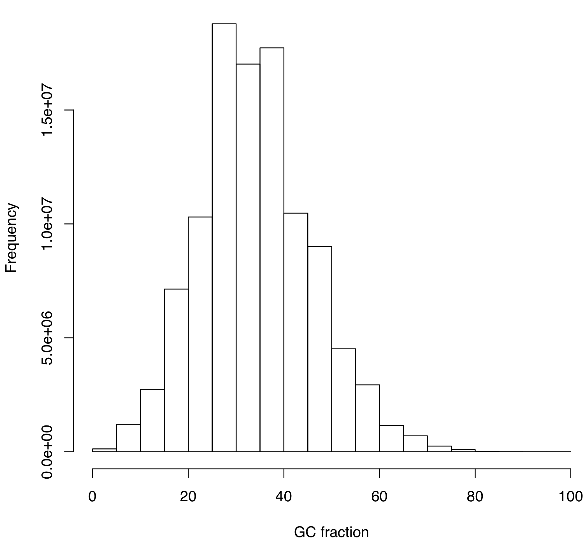

```{js logo-js, echo=FALSE}
$(document).ready(function() {
  $('#header').parent().prepend('<div id=\"logo\"></div>');
  $('#header').css('margin-right', '120px')
});
```

# Introduction

For students interested in getting some extra credits, the instructor provides two opportunities to score a total of 30 extra credits. Students are able to allocate these extra credits to any of their tests (by sending an email to the instructor with credits allocation). These two non-mandatory assignments have strict deadlines. This means that the instructor will consider that if students have not turned-in their assignment on time that they are not interested in getting extra credits. To facilitate students' time management, credits allocated to each question is provided. These opportunities should provide students with the ability to claim extra credits (and therefore improve their overall grade) while also learning about several aspects of genome assembly and annotation. As usual, students can work in groups, but they have to submit individual assignments.

# Deadline & submission information

Upload your non-mandatory assignment on the shared Google drive (in `Non_mandatory_assignment_2/`) by the **23rd of April before 5 pm**. Name your document following this pattern: `Non_mandatory_assignment_2_Surname`. If students are not naming their document appropriately, the instructor will penalize them by discarding 1 extra credit (therefore starting at a maximum of 14 credits instead of 15). 

# Questions

This extra assignment scores a total of 15 extra credits. Students answer the following four questions in a document and upload it onto the shared Google Drive as described above.

**Question 1 (TOTAL: 3 credits):**  What is a k-mer? Provide a detailed definition of this term, especially tailored to genomics (i.e. genome assembly).

**Question 2 (TOTAL: 4 credits):** Write all possible 3-mers for the following DNA sequence: `AATTGGCCG` (2 credits).

- How many 3-mers did you come up with? (1 credit)
- Provide the equation that can be applied to calculate the total number of possible k-mers (*n*) based on the length of a DNA sequence (*L*) and the k-mer size (*k*). (1 credit)

**Question 3 (TOTAL: 5 credits):** Adapt the DNA sequence provided in question 2 to simulate one PCR error and write all possible 3-mers. Please make sure to explain your thinking. (2 credits).

- How many 3-mers were impacted by this single PCR error? (1 credit)
- What is the effect of PCR-errors on k-mers counting and ultimately *de novo* genome assembly? (2 credits) 

**Question 4 (TOTAL: 3 credits):** What is the name of the plot shown in Figure \@ref(fig:plot)? You can also provide a sentence describing the plot if you do not remember its specific name. (1 credit)  

```{r plot, echo=FALSE, fig.cap="What is this plot all about?", out.width = '50%', fig.pos= "h"}

```

- What is the purpose of producing this plot? (1 credit)
- Which procedure was used to generate this plot? (1 credit)


