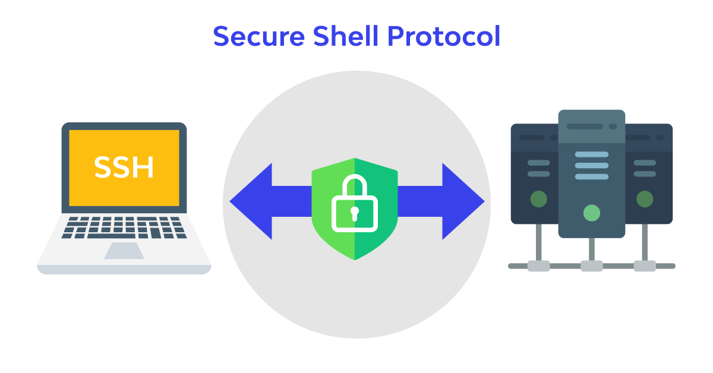
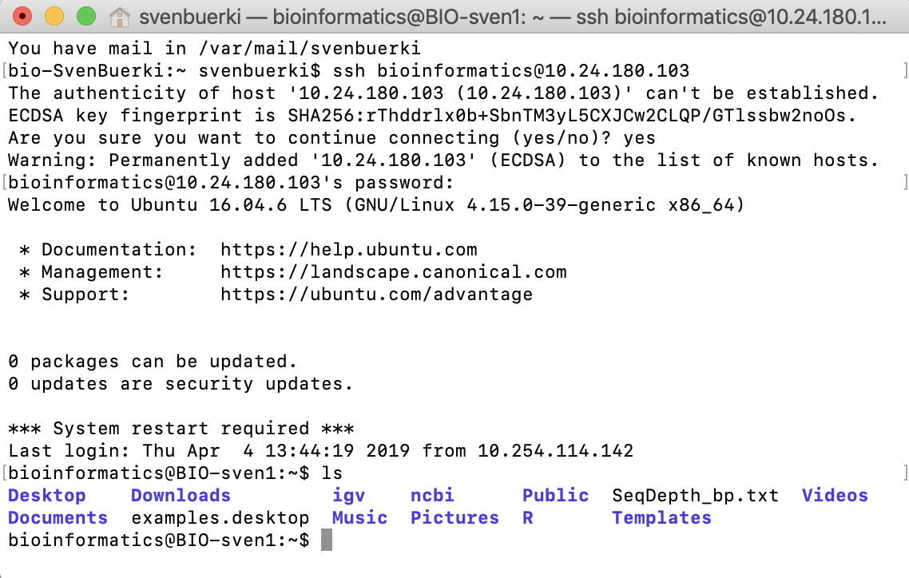
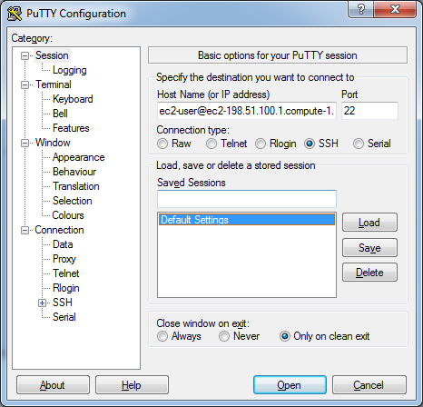
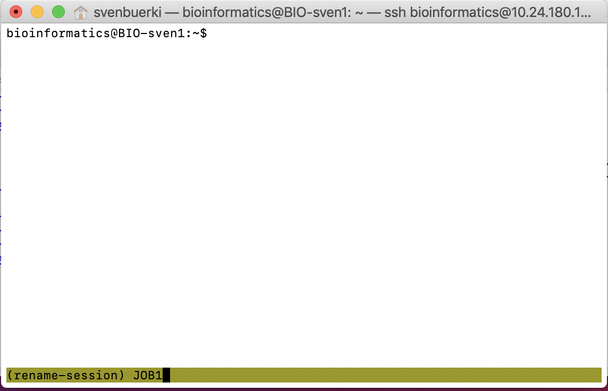
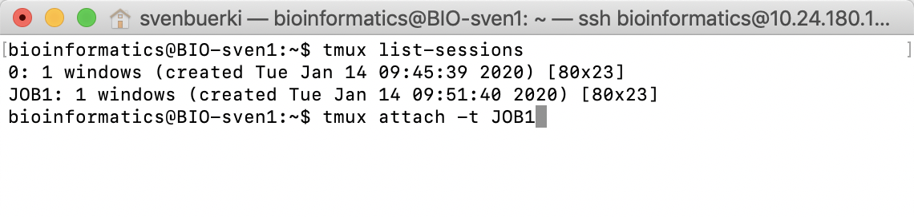
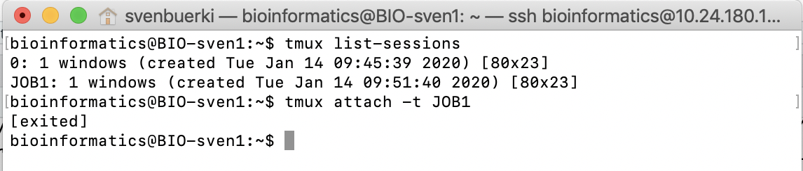

```{js logo-js, echo=FALSE}
$(document).ready(function() {
  $('#header').parent().prepend('<div id=\"logo\"></div>');
  $('#header').css('margin-right', '120px')
});
```

```{r packages, echo=FALSE, warning=FALSE, include=FALSE}
library(knitr)
library(rmarkdown)
library(bookdown)
#library(distill)
library(knitcitations)
library(formatR)
library(devtools)
library(kfigr)
library(dplyr)
library(kableExtra)
library(tufte)

#Generate BibTex citation file for all R packages used to produce report
knitr::write_bib(.packages(), file = 'packages.bib')
```

# Group accounts and IP addresses

Details on lab groups, Linux computer accounts and IP addresses are summarized in this [Google document](https://docs.google.com/document/d/1t0DdQBes42Gzo8XWgc9JL2xEGjv1kbfoVE7Vznx6C9I/edit?usp=sharing).

# Remotely accessing Linux computers

To remotely access your assigned computer you need to know:

i) your user ID and password (see [Google document](https://docs.google.com/document/d/1t0DdQBes42Gzo8XWgc9JL2xEGjv1kbfoVE7Vznx6C9I/edit?usp=sharing)).
ii) the IP address of the computer you want to connect to. If you want to remotely access the lab computers from a Windows machine, please read the protocol described [below](#Putty) before going any further into this document.
iii) If you are accessing the Linux computers outside of BSU campus, you will need to use the VPN protocol.

## What is an IP address?

An **I**nternet **P**rotocol address is a numerical label such as 192.0.2.1 that is connected to a computer network that uses the Internet Protocol for communication. An IP address serves two main functions: network interface identification and location addressing.

## How to find the IP address of your computer

The procedure summarized here allows retrieving the computer IP address on the Ubuntu operating system (16.04 LTS; Figure \@ref(fig:IP)):

1. Open the `System Settings` app located on the left side bar of the desktop.
2. Select the `Network` tab located under the Hardware section.
3. Select the second `Wired` tab (related to WiFi connection) located on the left side of the window.
4. The computer IP address is found under the `IPv4 Address` argument located on the left side of the window.


```{r IP, echo=FALSE, fig.align="center", fig.cap="Screenshot of Ubuntu desktop showing how to retrieve IP address.", fig.show="asis", out.width = '100%'}
knitr::include_graphics("Images/IP_Ubuntu.png")
```

### Command lines to get IP address

On a Linux OS, you can get the IP address of the computer by typing tyhe following commands in a Terminal:

```{bash eval=F, echo=T}
#Get IP address
# Option 1
hostname -I | awk '{print $1}'
# Option 2
ip a
# Option 3 (also works on Mac)
ifconfig -a
```


## The ssh protocol

The ssh protocol (also referred to as **S**ecure **Sh**ell) is a method for secure remote login from one computer to another (Figure \@ref(fig:sshFig)). It provides several alternative options for strong authentication, and it protects communications security and integrity with strong encryption.

```{r sshFig, echo=FALSE, fig.align="center", fig.cap="Overview of ssh protocol. Credit: https://www.wallarm.com/what/what-is-ssh-protocol", fig.show="asis", out.width = '80%'}

```

Once you have gathered all required information (i.e., IP address and username) and installed [Putty](#Putty) if you have a Windows opertaing system, please open a `Terminal` or command prompt window and type the following command to remotely access your account using the ssh protocol (see Figure \@ref(fig:ssh)):

```{bash eval=F}
# General command
$ ssh USER_ID@IP

# Remotely access computer from Group Z 
# You will also have to enter your password when prompted
$ ssh bioinformatics@132.178.143.53
```

```{r ssh, echo=FALSE, fig.align="center", fig.cap="Screenshot of Terminal showing commands to remotely access computer of group 3.", fig.show="asis", out.width = '80%'}

```

## Install Putty on Windows to ssh {#Putty}

Putty is one of the best software used on Windows to remotely access computers. Download the program at this URL http://www.putty.org and follow instructions to install it on your computer.

When you launch Putty, a configuration window will pop up and you will enter i) your credentials (e.g. `user@IP`) in the `Host Name (or IP address)` box, ii) set the `Port` to 22 and iii) make sure the connection type is set to `ssh` (Figure \@ref(fig:Putty)). The full documentation for this software is available [here](https://the.earth.li/~sgtatham/putty/0.76/htmldoc/). 

```{r Putty, echo=FALSE, fig.align="center", fig.cap="Screenshot of Putty Configuration window to establish ssh connection.", fig.show="asis", out.width = '60%'}

```


# Running bioinformatic analyses - `tmux`

Some of the analyses that we will be conducting in this course will take several days to be completed. In this case, it is paramount to run those analyses in a safe environment. By safe, we mean making sure that analyses will not be inadvertently cut either by yourself or by other users (and trust me it happens!). In this section, we will be reviewing protocols implemented in `tmux` to run and access multiple parallel terminal sessions. 

`tmux` is an open-source terminal multiplexer for Unix-like operating systems. It allows multiple terminal sessions to be accessed simultaneously in a single window. It is useful for running more than one command-line program at the same time. As long as the user knows the unique ID of their `tmux` session, the `tmux` session will be accessible by anybody and remain open after closing your `ssh` connection. For those reasons, **the `tmux` protocol is very useful when multiple users are sharing the same account and/or want to work remotely**.

This software is installed by default on the Linux operating system, but it can also be installed on Mac OS using the following command:

```{bash eval=F}
$ brew install tmux
```

## How to create, exit, rename, list, access & terminate tmux sessions

To **create** a new `tmux` session using the `Terminal` type:

```{bash eval=F}
$ tmux
```

To **exit** the 'tmux` session (after executing your job) type the following combination of keystrokes:
```{bash eval=F}
Ctrl+b and d
```

At this point, you could safely log off of your remote session (by typing `exit` in the Terminal), while knowing that your analysis would keep running safely inside the `tmux` session.

To **access** a `tmux` session and check the status of your analysis, do it as follows:
```{bash eval=F}
$ tmux attach
```

The command executed above implies that there is only one `tmux` session running on your computer. If you intend to **run multiple side-by-side sessions, you should name each session** using the following command:

```{bash eval=F}
# Create the session
$ tmux 

# Rename the session for future access (type this combination of keystrokes)
Ctrl+b and $
```

One you have executed the commands, you will be able to **rename your session** as wished (Figure \@ref(fig:tmuxrename)).

```{r tmuxrename, echo=FALSE, fig.align="center", fig.cap="Screenshot of Terminal showing procedure to rename a tmux session (here JOB1).", fig.show="asis", out.width = '80%'}

```

You can also **create a new session and directly name it** as follows:

```{bash eval=F}
#General command
$ tmux new -s session_name

#Example 
$ tmux new -s JOB2
```

You can get a **list of all running `tmux` sessions** by using the following command (\@ref(fig:tmuxsession)):

```{bash eval=F}
$ tmux list-sessions 
```

```{r tmuxsession, echo=FALSE, fig.align="center", fig.cap="Screenshot of Terminal showing tmux command to access a specific session, here JOB1.", fig.show="asis", out.width = '80%'}

```

To access a `tmux` session type the following command (Figure \@ref(fig:tmuxsession)):
```{bash eval=F}
#General command
$ tmux attach -t ID_Session 
#To access JOB1 do
$ tmux attach -t JOB1
```

You can **terminate** a `tmux` session by accessing it using commands provided above and then type the inline `exit` command. This will bring you back to the main Terminal and show that your `tmux` session was terminated as shown in Figure \@ref(fig:tmuxterm).

```{r tmuxterm, echo=FALSE, fig.align="center", fig.cap="Screenshot of Terminal showing tmux command to access a specific session (here JOB1) and the result after terminating the session (using the exit command).", fig.show="asis", out.width = '80%'}

```

Finally, you can also **kill a session** without accession to it as follows:

```{bash eval=F}
#General command
$ tmux kill-session -t ID_Session

#To kill JOB2 do
$ tmux kill-session -t JOB2
```

## Exercises

Please do the following short exercises on your assigned computers (see \autoref{tab:tab_grp}) to get accustomed with the material presented in this document.

1. Retrieve your computer's IP address.
2. Remotely connect to another computer in the computer room using `ssh` protocol.
3. Create a new `tmux` session and rename it `Bio1`. 
4. Access the `Bio1 tmux` session.
5. Terminate the `Bio1 tmux` session and confirm that it has been properly terminated (using a learned `tmux` command).

# Linux Commands Cheat Sheet

Please find below common linux commands. These commands will help you navigate in the Terminal and support your bioinformatic analyses.

## <a name="file-system"></a>File System

`ls` — list items in current directory.  
`ls -l` — list items in current directory and show in long format to see permissions, size, and modification date.  
`ls -a` — list all items in current directory, including hidden files.  
`ls -F` — list all items in current directory and show directories with a slash and executable with a star.  
`ls dir` — list all items in directory dir.  
`cd dir` — change directory to dir.  
`cd ..` — go up one directory.  
`cd /` — go to the root directory.  
`cd ~` — go to to your home directory.  
`cd -` — go to the last directory you were just in.  
`pwd` — show present working directory.  
`mkdir dir` — make new directory called dir.  
`rm file` — remove file.  
`rm -r dir` — remove directory dir recursively.  
`cp file1 file2` — copy file1 to file2.  
`cp -r dir1 dir2` — copy directory dir1 to dir2 recursively.  
`mv file1 file2` — move (rename) file1 to file2.  
`mv file1 ~/file1` — move file1 from the current directory to user's home directory.  
`cat file` — output the contents of file.  
`less file` — view file with page navigation.  
`head file` — output the first 10 lines of file.  
`tail file` — output the last 10 lines of file.  
`tail -f file` — output the contents of file as it grows, starting with the last 10 lines.  
`vim file` — edit file using vim text editor.  

## <a name="system"></a>System

`shutdown` — shut down machine.  
`reboot` — restart machine.  
`exit` — exit terminal session.  
`date` — show the current date and time.  
`whoami` — who you are logged in as.  
`man` command — show the manual for command.  
`df` — show disk usage.  Use `df -h` to have in human readable format.
`du` — show directory space usage.  
`free` — show memory and swap usage.  
`whereis app` — show possible locations of app.  
`which app` — show which app will be run by default.  

## Process Management

`ps` — display your currently active processes.  
`top` — display all running processes.  
`htop` - display all running processes and CPU usage.
`kill PID` — kill process id PID. Use `top` to identify PID.  
`kill -9 PID` — force kill process id PID.  

## Permissions

`ls -l` — list items in current directory and show permissions.  
`chmod ugo file` — change permissions of file to ugo - \verb|u| is the user's permissions, \verb|g| is the group's permissions, and \verb|o| is everyone else's permissions. The values of \verb|u|, \verb|g|, and \verb|o| can be any number between 0 and 7.  

* 7 — full permissions.
* 6 — read and write only.
* 5 — read and execute only.
* 4 — read only.
* 3 — write and execute only.
* 2 — write only.
* 1 — execute only.
* 0 — no permissions.

Examples of `chmod` settings: 

- `chmod 600 file` — you can read and write - good for files.
- `chmod 700 file` — you can read, write, and execute - good for scripts.
- `chmod 644 file` — you can read and write, and everyone else can only read - good for web pages.
- `chmod 755 file` — you can read, write, and execute, and everyone else can read and execute - good for programs that you want to share.  

## Networking

`wget file` — download a file. It can also be a file deposited on a website.  
`curl file` — download a file.  
`scp user@host:file dir` — secure copy a file from remote server to the dir directory on your machine.  
`scp file user@host:dir` — secure copy a file from your machine to the dir directory on a remote server.  
`scp -r user@host:dir dir` — secure copy the directory dir from remote server to the directory dir on your machine.  
`ssh user@host` — connect to host (IP address) as user.  
`ping host` — ping host and output results.  
`whois domain` — get information for domain.  
`lsof -i tcp:1337` — list all processes running on port 1337.  

## Searching

`grep pattern files` — search for pattern in files.  
`grep -r pattern dir` — search recursively for pattern in dir.  
`grep -rn pattern dir` — search recursively for pattern in dir and show the line number found.  
`grep -r pattern dir --include='*.ext` — search recursively for pattern in dir and only search in files with .ext extension.  
`find file` — find all instances of file in real system.  
`locate file` — find all instances of file using indexed database built from the updatedb command. Much faster than find.  
`sed -i 's/day/night/g' file` — find all occurrences of day in a file and replace them with night - s means substitute and g means global - sed also supports regular expressions.  

## Compression

`tar cf file.tar files` — create a tar named file.tar containing files.  
`tar xf file.tar` — extract the files from file.tar.  
`tar czf file.tar.gz files` — create a tar with Gzip compression.  
`tar xzf file.tar.gz` — extract a tar using Gzip.  
`gzip file` — compresses file and renames it to file.gz.  
`gzip -d file.gz` — decompresses file.gz back to file.  

