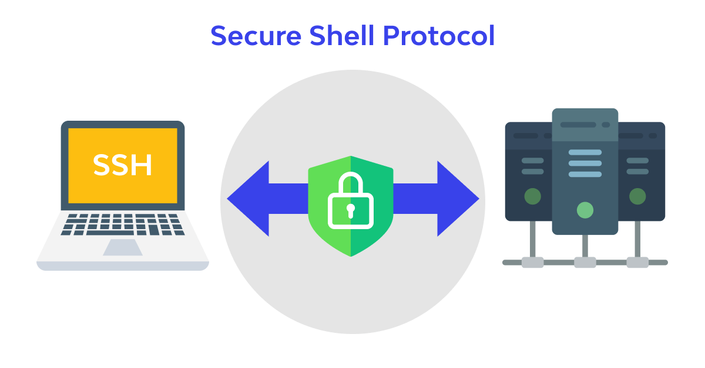
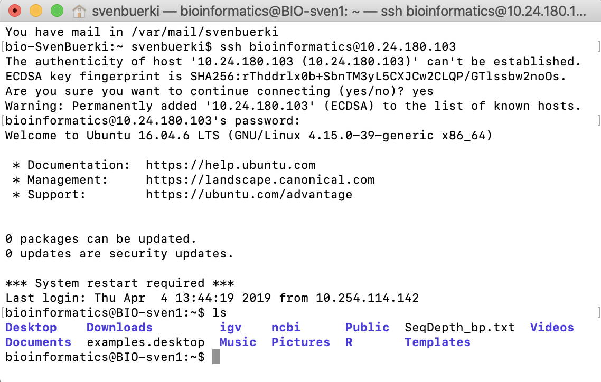
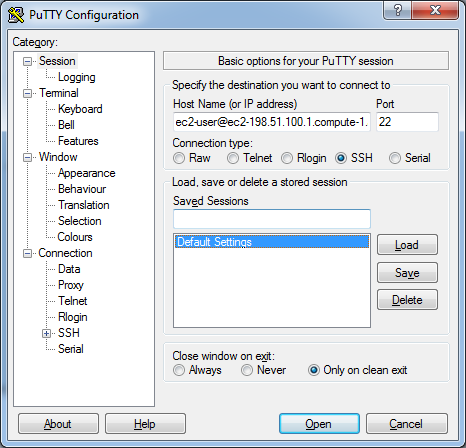

```{js logo-js, echo=FALSE}
$(document).ready(function() {
  $('#header').parent().prepend('<div id=\"logo\"></div>');
  $('#header').css('margin-right', '120px')
});
```

```{r packages, echo=FALSE, warning=FALSE, include=FALSE}
library(knitr)
library(rmarkdown)
library(bookdown)
library(knitcitations)
library(formatR)
library(devtools)
library(kfigr)
library(dplyr)
library(kableExtra)
library(tufte)

knitr::write_bib(.packages(), file = 'packages.bib')
```

# Introduction

This webpage provides tutorials introducing **remote computing and command-line tools commonly used in genomics and bioinformatics**.
The tutorials focus on practical workflows using Linux computers running the [Ubuntu](https://en.wikipedia.org/wiki/Ubuntu) distribution.

The material presented here is especially relevant for:

* The [Lab assignment](https://svenbuerki.github.io/Genomics-Bioinformatics/Mining_draft_genome.html)
* [Chapter 4](https://svenbuerki.github.io/Genomics-Bioinformatics/Chapters.html#6_Chapter_4)


These tutorials will help you develop the computational skills required to **connect to remote computers, manage long analyses, and navigate the command-line environment used in genomics research**.

# Learning Outcomes

After completing these tutorials, you will be able to:

1. Remotely access Linux computers using the `ssh` protocol.
2. Safely run long analyses (aka computer jobs) using `tmux` sessions.
3. Use common **Bash command-line tools** to organize files and perform genomics analyses.

## Workflow

These tutorials are organized to guide you through the essential steps required to work on remote Linux systems and perform genomics analyses using the command line.

The material is structured into the following sections:

1. [**Remotely access Linux computers**](#remote)
   In this section, you will learn how to connect to remote computers using the `ssh` protocol and understand the basic concepts required for secure remote access.

2. [**Safely run computer jobs**](#runjob)
   This section introduces the `tmux` tool, which allows you to run and manage long computational jobs in persistent terminal sessions.

3. [**Bash command-line reference**](#lcmd)
   This section provides a practical overview of commonly used Bash commands for navigating the file system, managing files, and supporting genomics analyses.

4. [**Group Exercises: Building a Shared Bioinformatics Workflow**](#grpactexe)
   This section provides group activities to help you apply and reinforce the skills learned throughout these tutorials.

# Groups {#grpaccounts}

## Group Organization and Structure

Each group is composed of **5 to 6 students**, with a mix of undergraduate and graduate students to promote peer learning and knowledge exchange.

Each group is divided into **two subgroups (A and B)**. Both subgroups will perform the **same analyses in parallel**, working independently at first.

This structure is designed to:

* Encourage **fact-checking** by comparing results between subgroups
* Improve **accuracy and reproducibility**
* Build **confidence** in computational results through independent validation

## Group Accounts

Each group has been assigned **two accounts**:

* **One account for Subgroup A**
* **One account for Subgroup B**

Each subgroup must use its assigned account to complete the group activities.

You will access the Linux systems using the `ssh` protocol. Details on your [account information](https://docs.google.com/document/d/1t0DdQBes42Gzo8XWgc9JL2xEGjv1kbfoVE7Vznx6C9I/edit) are available here.

## Group Collaboration Guidelines

* Each subgroup works **independently** using its assigned account
* Analyses are conducted **in parallel** by Subgroup A and Subgroup B
* All accounts within a group share the same computational resources
* Coordinate within your subgroup to avoid conflicts when running intensive jobs
* After completing tasks, **compare results between subgroups** to verify accuracy
* Discuss and resolve any discrepancies before moving forward

### Technical Notes

* All accounts use the same password for simplicity
* Accounts have access to the bioinformatics software required for the course
* File permissions allow collaboration within each account environment
* Contact the instructor if you experience connection issues


# Remotely Access Computers {#remote}

To remotely access your assigned Linux computer accounts using the `ssh` protocol, you need the following information:

1. Your **user ID and password** (see the [Google document](https://docs.google.com/document/d/1t0DdQBes42Gzo8XWgc9JL2xEGjv1kbfoVE7Vznx6C9I/edit?usp=sharing)).
2. The **IP address** of the computer you want to connect to.

If you want to remotely access the lab computers from a Windows machine, please read the protocol described [below](#Putty) before continuing.

**Important:** If you are accessing the Linux computers **outside of the BSU campus network**, you will need to connect through the **BSU VPN**.

## What is an IP Address?

An **Internet Protocol (IP) address** is a numerical label assigned to each device connected to a computer network that uses the Internet Protocol for communication.

An IP address serves two main functions:

1. **Network interface identification**
2. **Location addressing**

## How to Find the IP Address?

The procedure summarized here shows how to retrieve a computer’s IP address on the Ubuntu operating system (Figure \@ref(fig:IP)):

1. Open the `System Settings` application from the desktop sidebar.
2. Select the `Network` tab located under the **Hardware** section.
3. Select the `Wired` tab.
4. The computer’s IP address appears under the **IPv4 Address** field.

```{r IP, echo=FALSE, fig.align="center", fig.cap="Screenshot of Ubuntu desktop showing how to retrieve the IP address.", fig.show="asis", out.width = '100%'}
knitr::include_graphics("Images/IP_Ubuntu.png")
```

### Command Lines to Get the IP Address

You can also retrieve the IP address from the command line by typing the following commands in a Terminal:

```{bash eval=F, echo=T}
# Get IP address
hostname -I | awk '{print $1}'
ip a
ifconfig -a
```

## The `ssh` Protocol

The **Secure Shell (`ssh`) protocol** is a method used for secure remote login from one computer to another (Figure \@ref(fig:sshFig)).
It protects communication using strong encryption and allows users to remotely execute commands on another machine.

```{r sshFig, echo=FALSE, fig.align="center", fig.cap="Overview of ssh protocol.", fig.show="asis", out.width = '80%'}

```

Once you have gathered the required information (IP address and username), open a **Terminal** and type:

```{bash eval=F}
# General command
ssh USER_ID@IP

# Example
ssh bioinformatics@132.178.143.53
```

```{r ssh, echo=FALSE, fig.align="center", fig.cap="Example of an ssh connection from a Terminal.", fig.show="asis", out.width = '80%'}

```

## Install Putty on Windows {#Putty}

If you are using Windows, you can use **Putty** to establish SSH connections.

Download the software here:
[http://www.putty.org](http://www.putty.org)

When launching Putty (Figure \@ref(fig:Putty)):

1. Enter `user@IP` in the **Host Name** field.
2. Set **Port** to `22`.
3. Select **SSH** as the connection type.

```{r Putty, echo=FALSE, fig.align="center", fig.cap="Putty configuration window.", fig.show="asis", out.width = '60%'}

```

# Safely Run Computer Jobs {#runjob}

Some analyses performed in genomics can take **several hours or even days** to complete.
To avoid interrupting these analyses, it is important to run them in a **persistent terminal environment**.

The tool we will use for this purpose is **`tmux`**, which allows multiple terminal sessions to run simultaneously.

## The `tmux` protocol

`tmux` is a **terminal multiplexer** for Unix-like systems.
It allows users to create multiple independent terminal sessions within a single window.

Key advantages:

* Run long analyses safely
* Disconnect from a remote computer without stopping jobs
* Manage multiple command-line tasks simultaneously

### Install `tmux` on Mac

```{bash eval=F}
brew install tmux
```

## How to Operate `tmux` Sessions

### Create a New Session

```{bash eval=F}
tmux
```

### Detach from a Session

Press:

```
Ctrl+b then d
```

### Reattach to a Session

```{bash eval=F}
tmux attach
```

### Create and Name a Session

```{bash eval=F}
tmux new -s JOB1
```

### List Sessions

```{bash eval=F}
tmux list-sessions
```

### Attach to a Specific Session

```{bash eval=F}
tmux attach -t JOB1
```

### Kill a Session

```{bash eval=F}
tmux kill-session -t JOB1
```

**Warning:** Killing a session will terminate any running analysis.

# Bash Command-Line Reference {#lcmd}

Below is a collection of common **Bash commands** used to navigate the file system and manage computational analyses.

## File System

- `ls` — list files in a directory  
- `cd` — change directory  
- `pwd` — print working directory  
- `mkdir` — create a directory  
- `rm` — remove a file  
- `cp` — copy files  
- `mv` — move or rename files  
- `cat` — display file contents  
- `less` — view files page by page  
- `head` — show the first lines of a file  
- `tail` — show the last lines of a file  

## System

- `whoami` — display current user
- `date` — display date and time
- `exit` — exit terminal
- `df -h` — disk usage
- `free` — memory usage

## Process Management

- `ps` — list active processes
- `top` — show running processes
- `htop` — interactive process viewer
- `kill PID` — terminate process

## Networking

- `ssh user@host` — connect to remote host
- `scp` — transfer files between machines
- `wget` — download files
- `curl` — download files

## Searching

- `grep` — search text patterns
- `find` — locate files
- `sed` — text substitution

## Compression

- `tar` — archive files
- `gzip` — compress files

# 🤝 Group Exercises: Building a Shared Bioinformatics Workflow {#grpactexe}

## Learning Outcomes

These exercises reinforce:

* Remote computing skills (`ssh`)
* Linux navigation and file management
* Safe job execution using `tmux`
* **Collaborative bioinformatics workflows**

---

## Activity Overview

In this **50-minute** group activity, you will work in groups of **5–6 students**, divided into **two subgroups (A and B)**, to build and manage a shared bioinformatics workspace on a remote Linux system.

Through this activity, you will:

* Practice connecting to a remote system using `ssh`
* Navigate and manage files using essential Linux commands
* Collaboratively create and organize a shared working directory
* Create, verify, and delete files within a shared environment
* Use `tmux` to safely run and manage persistent computational jobs
* Develop communication and coordination skills required in real-world bioinformatics workflows

This activity is designed to simulate how bioinformatics teams collaborate on shared computing infrastructure. You will experience the importance of clear communication, careful file management, and responsible use of shared resources.

By the end of this session, you will be prepared to confidently work on remote systems, manage your own analysis environment, and collaborate effectively on computational genomics projects.

---

## Materials

- [**Your Computer Accounts**](#grpaccounts)
- [**How to Remotely access Linux computers**](#remote)
- [**Ho to Safely run computer jobs**](#runjob)
- [**Bash command-line reference**](#lcmd)

---

## Instructions

These exercises are designed to simulate real-world bioinformatics collaboration.

You will work in:

* **3 groups** (5–6 students each)
* Each group has:
  * **2 accounts**
  * **1 per subgroup (A and B)**

⚠️ **Important:**

* Only **ONE terminal session per subgroup**
* You must **coordinate, communicate, and trust each other**
* Mistakes affect everyone — just like in real research

---

## Phase 1 — Establishing Access (Trust & Communication) <span style="color:gray;">(15 minutes)</span>

**Goal:** Successfully access your shared system

### Tasks

1. Connect to the remote server using `ssh`. See [here](#grpaccounts) for account details. Once you have gathered the required information (IP address and username), open a **Terminal** and type (see here if you use [Putty](#Putty)):

```{bash eval=F}
# General command
ssh USER_ID@IP

# Example
ssh bio_40@132.178.143.53
```

2. Confirm your identity and current directory:

```{bash, eval=FALSE}
# Retrieve your username
whoami

# Retrieve your current path
pwd
```

3. Exit the `ssh` connection:

```{bash, eval=FALSE}
exit
```

👉 **Deliverable:**
Shared notes describing the login procedure

---

## Phase 2 — Shared Workspace Construction (Coordination) <span style="color:gray;">(15 minutes)</span>

**Goal:** Build a common working directory

### Tasks

1. Connect to the remote server using `ssh`

2. Navigate to your home directory

```{bash, eval=FALSE}
cd ~
```

3. Create a new folder:

```{bash, eval=FALSE}
mkdir Tutorial_genomics
```

4. Verify the directory structure:

```{bash, eval=FALSE}
# Basic listing
ls

# Detailed listing
ls -lh
```

5. Create and remove a test file inside the folder:

```{bash, eval=FALSE}
# Move into the directory
cd Tutorial_genomics

# Create a test file
touch test_file.txt

# Verify it exists
ls -lh

# Remove the file
rm test_file.txt

# Confirm deletion
ls
```

6. Exit the `ssh` connection

👉 **Discussion:**

* What are the differences between `ls` and `ls -lh`?
* Why does directory structure matter in genomics pipelines?
* Why is it important to verify file creation and deletion?

---

## Phase 3 — Safe Job Execution (Shared Responsibility) <span style="color:gray;">(15 minutes)</span>

**Goal:** Run persistent jobs safely using `tmux`

### Tasks

1. Connect to the remote server using `ssh`

2. Start a `tmux` session:

```{bash, eval=FALSE}
tmux new -s GENOMICS_JOB
```

3. Run a dummy job:

```{bash, eval=FALSE}
sleep 300
```

4. Detach from the session:

```
Ctrl + b, then d
```

5. Reattach to the session:

```{bash, eval=FALSE}
tmux attach -t GENOMICS_JOB
```

6. Exit the `ssh` connection 

👉 **Discussion:**

* Why is `tmux` essential in genomics workflows?
* What could happen if a long job is run without it?

---

## Phase 4 — Reflection (Building Trust) <span style="color:gray;">(5 minutes)</span>

### Group Discussion

1. What worked well in your collaboration?
2. Where did communication break down?
3. Did you trust the other subgroup?
4. What would happen in a real research project?
