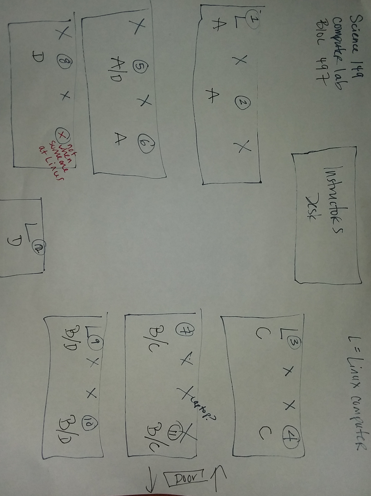

```{js logo-js, echo=FALSE}
$(document).ready(function() {
  $('#header').parent().prepend('<div id=\"logo\"></div>');
  $('#header').css('margin-right', '120px')
});
```

```{r packages, echo=FALSE, warning=FALSE, include=FALSE}
library(knitr)
library(rmarkdown)
library(bookdown)
#library(distill)
library(knitcitations)
library(formatR)
library(devtools)
library(kfigr)
library(dplyr)
library(kableExtra)
library(tufte)

#Generate BibTex citation file for all R packages used to produce report
knitr::write_bib(.packages(), file = 'packages.bib')
```

<div style="text-align: right"> [Download pdf version](index.pdf) </div>
<div style="text-align: right"> [Raw data on GitHub](https://github.com/svenbuerki/Genomics-Bioinformatics) </div>

# Instructor

-   Name: Sven Buerki
-   Office: Science building, office 114 (ground floor).
-   Email: [svenbuerki\@boisestate.edu](mailto:svenbuerki@boisestate.edu){.email}
-   Office hours: By appointment.

# Our class ethos

> Everyone here is smart; distinguish yourself by being kind.
>
> `r tufte::quote_footer('Kindness in Science is an inclusive approach that fosters diversity, 	respect, wellbeing & openness leading to better science outcomes.')`

```{r kindness, echo=FALSE, fig.align='right', out.width = '40%', fig.pos= "h"}
knitr::include_graphics("Images/Kindness.png")
```

# Course delivery type

To accommodate physical distancing and other safety measures necessitated by the coronavirus pandemic, the university is making changes to its Spring 2021 course schedule. 

> This course applies a hybrid teaching mode, which means that it will mostly be taught remotely; however we will have opportunities to meet in-person for computing laboratory sessions (see [Timetable](#timetable)). 

This means that courses meet virtually via technology (here Zoom) at scheduled class meeting times and will also meet in-person for bioinformatic analyses (mostly on Fridays, but bioinformatic tutorials are scheduled for [Chapter 4](#timetable)). 

To respect social distancing in the computer laboratory (see class location [here](#class)), students will be divided into four groups (or pods) to work on bioinformatic analyses. Each bioinformatic class session will be split in half and two groups will be attending at the same time. This will give opportunities for students to meet and learn computing skills on the Linux boxes. Groups will be defined during the first two weeks of the semester. Please see the [In-person groups](#logistic) section below for more details.

## What technology do you need?

Here are some key points for remote teaching:

-   You will need reliable access to a computer with an internet connection and a webcam.
-   You will need to install a suite of software on your computer ([Zoom](https://boisestate.zoom.us), [R](https://cran.r-project.org), [RStudio](https://www.rstudio.com)). Please see [the computing tools of reproducible science](#software) section below for more details.
-   More information on Zoom provided by BSU is available [here](https://www.boisestate.edu/oit-learning/video/zoom/).
-   VPN access using [Cisco AnyConnect Secure Mobility Client](https://www.cisco.com/c/en/us/support/security/anyconnect-secure-mobility-client-v4-x/model.html#~tab-downloads). This software will facilitate remote access to Linux boxes for bioinformatic analyses. Students using Windows operating systems will have to download Putty or a similar software to remotely access Linux computer using `ssh` protocol. Putty can be downloaded at this URL <http://www.putty.org> (follow instructions to install it on your computer).
-   If you have concerns about access to technology needed for your courses this fall, the [Help Desk](https://www.boisestate.edu/oit/assistance/) is the place to begin to discuss your needs. The instructor would also gladly help you with any technology needs.

# Class schedule

## Meeting days & times

-   **Lecture sessions:** Wednesdays from 9:00-10:30 AM.
-   **Laboratory sessions:** Fridays from 9:00-10:50 AM.

Since Zoom meetings can be more tiring, a 5 min. break will be taken at 10 AM during each class.  

Please see section \@ref(timetable) for tentative timetable for this course. The teaching mode associated to each class is also provided to improve communication.


## Zoom information

Class will take place remotely using the [Zoom](https://boisestate.zoom.us) platform.
A fully-licensed Zoom account is available to all faculty, staff, and students at Boise State.
Zoom is a great tool for conducting remote meetings that allows you to see and hear one another, chat, share your computer screen, and more.
In our case, we will be taking advantage of the remote control feature allowing users to take control of another participant's screen in a meeting.
This is especially useful to help working on and debugging R code.
Please see the following Zoom webpages for more details on:

-   Remote support session: <https://support.zoom.us/hc/en-us/articles/208072316-Remote-Support-Session>
-   Requesting or giving remote control: <https://support.zoom.us/hc/en-us/articles/201362673-Requesting-or-giving-remote-control#heading=h.bdhzh38o7ljq>

Details to join the Zoom meetings and find URLs of class recordings are provided [here](https://docs.google.com/document/d/1y79tlH-shdh68kUuYv6A9ZGmqyj5mwB2opmGR3V6A78/edit?usp=sharing). Students will be granted access to this document prior to the start of the semester.

**Please join Zoom calls ON TIME**. The instructor will start Zoom calls 5 min. prior to the start of class. This will allow admitting people and making sure that we respect our schedule.

## Class location {#class}

We are scheduling in-person laboratory classes to use the Linux computers. These sessions will take place in the Science building in the computer laboratory: **SCNC149**. **The COVID capacity of this room is 11 students + instructor.**

### Class rules and seating chart

The following rules apply for in-person classes:

1. Wear masks and maintain physical distancing.
2. Scan the QR code located at entrance of classroom. Since there is only one QR code, the instructor will keep a record of stations where students seated in class (see Figure \@ref(fig:seatingchart)). 
3. Use sanitizing wipes to clean surfaces (desk and keyboard) at beginning and end of class.

```{r seatingchart, echo=FALSE, fig.cap="Laboratory seating chart for SCNC149.", fig.align='center', out.width = '80%'}

```

**Why is it important for students to scan their QR codes every class period?**

The information that is gathered is the foundation for contact tracing. With QR code information, the tracers can focus on a small number of students in seats adjacent to a student who tests positive.  Without QR code info, the contact tracers must deal with the entire class, making what is already a challenging task even more difficult.

### In-person groups {#logistic}

Due to room COVID capacity, students will be split into 4 groups (or pods): A, B, C and D. Each group will be composed of 4 to 5 students. **Groups A (4 students) and B (4 students)** will attend in-person classes from **9:00 to 9:50 am** and **groups C (4 students) and D (5 students)** between **10:00 to 10:50 am**. The gap between in-person sessions will allow for group rotation and sanitizing of work stations.

Information on:

  - Group compositions and seating positions are available on our shared [Google Drive](https://docs.google.com/spreadsheets/d/1cRM1yasUfDa98ecyz_-RxUOw8cU4wkQx4O5Wxw3y4yU/edit?usp=sharing). 
  - Individual Linux accounts (log-in and IP addresses) are available [here](https://docs.google.com/document/d/1t0DdQBes42Gzo8XWgc9JL2xEGjv1kbfoVE7Vznx6C9I/edit?usp=sharing).

# Course goal and description

The goal of this course is to provide students with the theoretical and applied knowledge in genomics and bioinformatics to sequence, assemble and annotate genomes, especially for non-model organisms (see Figure \@ref(fig:flowchart)).

```{r flowchart, echo=FALSE, fig.cap="Overview of the structure of the course. See text for more details.", out.width = '100%', fig.pos= "h"}
knitr::include_graphics("Images/Flowchart_course_crop.png")
```

A suite of unix-based open source software will be used to perform genomic analyses (see Figure \@ref(fig:BioinfoWorkflow)). In addition to learning how to execute programs, students will also be taught procedures to install them therefore gaining critical expertise for their career. Finally, students will produce scientific reports and present their results.
Reports together with documents provided by the instructor will provide students with a framework allowing them to analyze their own genomic data.

```{r BioinfoWorkflow, echo=FALSE, fig.cap="Overview of an example of an approach applied to produce a draft genome assembly. In this course, students will become accustomed with such approach and master some specific key steps.", out.width = '100%'}
knitr::include_graphics("Images/Workflow_Bioinformatics.png")
```

# Course format

This course provides a mixture of classic lectures together with more applied, hands-on bioinformatic tutorials (conducted both during lecture and lab sessions). Tutorials are designed to support students in mastering theoretical genomic concepts through their implementations in bioinformatic protocols. As mentioned above, the genomic field heavily relies on bioinformatic expertise, especially related to unix-based software.

We will be working on computers running the Ubuntu Linux operating system.
This operating system is widely used in genomics. Using these computers will provide opportunities for students to become familiar with `bash/shell`, `Python` and `R`. Finally, lecture sessions will also serve as a platform to: 
    i) work on graded mini-reports. 
    ii) study genomic literature through a journal club (see below). 

While reading scientific papers, we will be focusing on mastering methodological concepts allowing students to assess the quality and reproducibility of published genomic studies.

# Content of the course

The course is subdivided into nine chapters segregated between lecture and laboratory sessions as follows (see Figure \@ref(fig:flowchart)):

**Lecture sessions:**

- **Chapter 1**: DNA & RNA.
- **Chapter 2**: Next-generation sequencing.
- **Chapter 3**: Genome databases.
- **Chapter 4**: Genome assembly.
- **Chapter 5**: Transcriptome assembly.
- **Chapter 6**: Structural annotation.
- **Chapter 8**: Comparative genomics.

**Laboratory sessions:**

- **Chapter 9**: Applied bioinformatics.

# Course learning outcomes

Please find below a non-exhaustive list of learning outcomes associated to the chapters presented above (Figure \@ref(fig:flowchart)):

**Chapter 1: DNA & RNA**

-   Understand the differences between "Genetics" and "Genomics".
-   Know the basic dogma that DNA is transcribed to RNA, which is translated to protein.
-   Appreciate the diversity of genome organization in organelles, prokaryotes and eukaryotes.
-   Appreciate that organelle genomes have forged eukaryotic chromosomes and that this has to be accounted for in designing genome assembly projects.
-   Appreciate that eukaryotic genomes contain extensive repetitive regions of several different kinds.
-   Appreciate the diversity of published genomes and their differences in the level of completeness.
-   Understand the importance of computer science and bioinformatics in producing the raw sequence data and assembly genomes.
-   Understand the challenges in sequencing a genome.

**Chapter 2: Next-generation sequencing**

-   Learn the next-generation sequencing (NGS) jargon underpinning genome assembly and annotation.
-   Understand the general principle of genome sequencing (wet-lab) and assembly (bioinformatics workflow) (see Figure \@ref(fig:BioinfoWorkflow)).
-   Be familiar and know the limitations of the following NGS platforms:
    -   Illumina.
    -   PacBio.
    -   Oxford Nanopore.
-   Be accustomed to handle NGS data output, especially FASTA and FASTQ files.
-   Learn protocols to quantify the quality of the nucleobases generated by NGS platforms using Phred quality score.

**Chapter 3: Genome databases**

-   Understand the importance of computer science and bioinformatics in:
    -   Producing raw data.
    -   Creating databases in molecular biology.
    -   Archiving and careful curation of the data.
    -   Distributing them via the Internet.
    -   Creating information-retrieval tools to allow effective mining of the data for research application.
-   Gain knowledge on major molecular biology databases, which are key to the assembly and annotation of genomes:
    -   Nucleic acid sequences databases.
    -   Protein sequences databases.
    -   Gene ontology databases.
    -   Metabolic pathways databases.
    -   Specialized annotated genome portals.
-   Learn protocols to query genomic information and remotely download files from GenBank.

**Chapter 4: Genome assembly**

-   Understand key steps involved in producing a genome assembly and best strategies to get there.
-   Be able to perform reads quality checks as follows:
    -   Read quality assessments.
        -   Read trimming.
        -   Contaminant screening.
        -   k-mer counting.
        -   Genome size estimation.
        -   Read error correction.
-   Understand the use of de Bruijn graphs for *de novo* genome assembly.
-   Gain an overview of current genome assemblers and their specificity.
-   Study the benefit of long reads in closing gaps and correcting draft genome assemblies.

**Chapter 5: Transcriptome assembly**

-   Learn about the types of RNA molecules in cell.
-   Study the link between the transcriptome and proteome via the genetic code.
-   Understand key steps involved in producing a transcriptome assembly and best strategies to get there. We will mostly compare referenced-based vs. *de novo* strategies, but also look at the "combined strategy".
-   Gain an overview of current transcriptome assemblers and their specificity.

**Chapter 6: Structural annotation**

-   Learn what we exactly mean by the term "genome annotation".
-   Understand key steps involved in genome annotation and best strategies to get there.
-   Be familiar with the following key stages of the structural genome annotation process:
    -   Repeat identification.
    -   Evidence alignment.
    -   *Ab initio* gene prediction.
    -   Evidence-driven gene prediction.
    -   Introduction to available structural annotation software.

**Chapter 7: Functional annotation**

-   Be aware of the challenges to obtain accurate data on gene functions.
-   Study and compare available pipelines to perform automated annotations of genomes.
-   Review approaches to assess annotation quality.
-   Be familiar with functional annotation software.
-   Overview of the procedure to submit annotated genomes to public databases.

**Chapter 8: Comparative genomics**

-   Learn to read and present a scientific paper reporting new genomic or transcriptomic data.
-   Complement expertise by reading and discussing scientific publications during the mini journal club sessions (see below for more details).

**Chapter 9: Applied Bioinformatics** (corresponding to material taught during laboratory sessions)
In this chapter, we will be using data produced by the sagebrush [GEM3](https://www.idahogem3.org) project to learn protocols to: 

- Clean Illumina reads.
- Assemble draft genome.
- Mine scaffolds in an Illumina draft genome containing target genes.
- Validate mining by locating Open Reading Frames (ORFs), reconstructing protein sequences and inferring gene phylogenetic trees.
- Annotate validated genes.

Please see section \@ref(timetable) for tentative timetable associated to these chapters.

# Pre-requisite

**BIOL 310 GENETICS (3-0-3)(F,S,SU).** A study of the principles of genetics as they relate to living organisms.
PREREQ: BIOL 191-192 or BIOL 191 and BIOL 320.
PRE/COREQ: CHEM 301 or 307.

# Sharing teaching material

Teaching material will be shared with students on GitHub and Google drive. Google drive will mostly be used to share sensitive material (e.g. IP addresses and passwords of lab computers, Zoom details and recordings), post publications and to allow students sharing their assignments.

The URL to the shared Google drive is (the instructor will grant you access to this folder prior to the start of the semester): 

- https://drive.google.com/drive/folders/1BFZFJeR8tW8N7QLfngqIVbjqEkDuIyWj?usp=sharing

# Publications, textbooks & websites supporting this course

The reading material at the basis of this class is composed of a mixture of publications and chapters from four textbooks [@Brown2017; @Lesk2017; @Dale2012; @deSalle2013].
The instructor has copies of these textbooks and students are welcome to consult them at anytime.

A list of references used in this course is provided [here](References.html).

In addition, there is also a plethora of website devoted to genomic and transcriptomic data.
Please find a selection below:

-   [Next-generation sequencing online course](https://www.ebi.ac.uk/training/online/course/ebi-next-generation-sequencing-practical-course).
-   [Genomics and comparative genomics website](https://www.integratedbreeding.net/courses/genomics-and-comparative-genomics/www.generationcp.org/genomics/index390e.html?page=1131).

# Bioinformatic tools

Although we will be using software installed on the Linux computers, the instructor is advising students to install the following programs on their personal computers:

- The **R** statistical language that will allow you to gather data and analyze it.
- The **LaTeX** and **Markdown** markup languages that you can use to create documents (slideshows, articles, books, webpages) for presenting your findings.
- The *knitr* and *rmarkdown* **packages** for R and other tools, including **command-line shell programs** like GNU Make and Git version control, for dynamically tiding your data gathering, analysis, and presentation documents together so that they can be easily reproduced.
- **RStudio**, a program that brings all of these tools together in one place.

## Installing the main software

As shown above, **R** and **RStudio** are at the core of this course and will have to be installed on your computers. This can be easily done by downloading the software from the following websites:

- **R**: https://www.r-project.org
- **RStudio**: https://www.rstudio.com/products/rstudio/download/

There is a preview release of RStudio including a new visual Markdown editing mode, which is handy when you are using this program extensively. You can download it [here](https://rstudio.github.io/visual-markdown-editing/#/), but this version might not be as stable as the other version made available on the main webpage (see above). 

The download webpages for these software have comprehensive information on how to install them, so please refer to those pages for more information.

## Installing Markup languages

If you are planning to create `LaTeX` documents, you will need to install a `Tex` distribution. Please refer to this website for more details: https://www.latex-project.org/get/

If you want to create Markdown documents you can separately install the *rmarkdown* package in R (see [below](#Rpack) for more details).

## <a name="Rpack"></a>Installing R packages

We will be using a number of R packages especially designed to support reproducible research. Many of those packages are not included in the default `R` installation and will need to be installed separately. 
To install key packages used in class, copy the following code and paste it into your R console:

```{r eval=FALSE, tidy=TRUE}
install.packages(c("brew", "countrycode", "devtools", "dplyr", "ggplot2", "googleVis", "knitr", "rmarkdown", "tidyr", "xtable"))
```

Once you enter this code, you may be asked to select a CRAN "mirror" to download the packages from. Simply select the mirror closest to you.

Finally, it is highly likely that we will have to install additional packages. In this case, you can simply install it by using the same R function `install.packages()` or by using RStudio as follows: Select "Tools" -> "Install Packages ..." and then type the name of the package in the window (make sure to tick the "Install dependencies" box).

## <a name="Cheat"></a>RStudio Cheat Sheets

RStudio provides a suite of cheat sheets that can be accessed by going to the "Help" menu and selecting "Cheatsheets". 

Five cheat sheets are especially relevant to chapters taught in this course:

  - *RStudio IDE : Cheat sheet*
  - *Data Manipulation with dplyr, tidyr*
  - *Data Visualization with ggplot2*
  - *R Markdown Cheat Sheet*
  - *R Markdown Reference Guide*

## R tutorials

Please find below two documents providing a comprehensive introduction to R:

- R for beginners (a tutorial by Emmanuel Paradis): https://cran.r-project.org/doc/contrib/Paradis-rdebuts_en.pdf
- An introduction to R: https://cran.r-project.org/doc/manuals/r-release/R-intro.pdf

# Journal club

The aim of the journal club is to train students to read scientific publications related to genomic data.
Journal clubs will also provide opportunities for students to learn how to present their scientific publications.

Students are expected to have read the scientific publications before coming to class.
The instructor will start by briefly summarizing the methodology and main outcomes of the study and the rest of the class will be devoted to general discussion (please come with some questions and have a critical, but positive mid set).

Please find below the list of publications that we will discuss in class (see section \@ref(timetable) for information on dates):

-   **Publication 1:** @Li2009 published a draft genome of the giant panda and screened for genes responsible for the detoxification of cyanide produced by bamboos.
-   **Publication 2:** @Ming2015 published the draft genome of the pineapple and investigated the origin of CAM photosynthesis in this lineage.

If you are not familiar with approaches to read scientific publications, please come and seek advice.
For undergraduate students, there is a class BIOL 306 that you could take next semester.
Please find below the details of this class:

**BIOL 306 COMMUNICATION IN THE BIOLOGICAL SCIENCES (3-0-3)(F,S)(CID)** Development of written and oral communication skills necessary for future careers in the biological sciences.
Skills include summarizing and evaluating scientific research, and communicating scientific information to targeted audiences.
PREREQ: BIOL 304 and ENGL 101, 102.

# Grading information

## Tests conducted during the class

-   3 mini-reports (2x 25 points and 1x 50 points, TOTAL: 100 points).
-   1 individual oral publication presentation (50 points).
-   1 lab report (150 points).
-   1 lab presentation (50 points).

Exams are summing to a total of **350 points** and grading will follow the scale presented in Table \@ref(tab:mygrade). Please see section \@ref(timetable) for information on dates when exams are due.

```{r mygrade, echo=FALSE}
library(bookdown)
#
grades <- data.frame("Percentage" = c("100-98","97.9-93", "92.9-90", "89.9-88", "87.9-83", "82.9-80", "79.9-78", "77.9-73", "72.9-70", "69.9-68", "67.9-60", "59.9-0"), Grade = c("A+","A","A-","B+","B","B-","C+","C","C-","D+","D","F"))
knitr::kable(grades, caption = "Grading scale applied in this course.") %>%
  kable_styling(bootstrap_options = c("striped", "hover", "condensed"))
```

## Mini-reports (TOTAL: 100 points)

To further gain expertise in this field, students will be producing three mini-reports on the following topics (see Figure \@ref(fig:flowchart)):

- **Mini-Report 1**: Sequencing technologies (25 points; this task is related to Chapter 2).
- **Mini-Report 2**: Molecular biology databases (25 points; this task is related to Chapter 3).
- **Mini-Report 3**: Apply a coupled DNA barcoding and phylogenetic approach to identify species and infer their evolutionary history (50 points). This report provides students with an introduction to methods applied in the laboratory sessions and expertise to select their comparative article ([Chapter 8](#chap8)).

Time will be allocated in class to work on these mini-reports, but the instructor expects students to complete those on their own time.

Click [here](Mini_reports.html) to access the Mini Reports webpage. 

## Individual oral publication presentation (TOTAL: 50 points) {#chap8}

Each student will have to present a scientific publication at the end of the semester related to material presented in Chapter 8.
Time will be allocated to select a paper and work on presentations, but the instructor strongly advise students to start this endeavor sooner.
**The presentation should not exceed 4 minutes (plus 2 minutes for questions) and contain a maximum of 5 slides.**

## Lab report (TOTAL: 150 points)

### Research topic

Students will be working in groups (see [In-person groups](#logistic) for more details) to produce a report associated to the following research question:

- What Aquaporin genes are encoded in the sagebrush genome (*Artemisia tridentata*) and what are their functions?

### Details on reporting

Lab reports will be formal documents written in the form of scientific manuscripts (Introduction, Material & Methods, Results, Discussion and References sections).

The instructor does not fix a minimum number of words or pages, but urges students to be succinct and avoid redundancy.

Please make sure that you present all evidence allowing an external reviewer to replicate your analyses. In order to achieve this goal and support reproducible science, students will have to provide associated data and code underpinning their research. The instructor will provide guidance on these protocols during lab sessions.

Please note that if students are working in group then each student should contribute equally to the project. If participation is not judge adequate within a group, then the instructor will grade students individually.

## Lab presentation (TOTAL: 50 points)

Students will use their lab reports to prepare 10 minutes presentations (+ 5 minutes for questions) taking place during the final weeks of the semester.

The instructor expects each student to take part to the presentation and to be involved in answering questions.

Presentations will have to be deposited in advance onto a shared Google drive folder or be sent to the instructor prior to the presentation.

## Extra credits

For students interested in getting some extra credits, the instructor will provide two opportunities to score a total of 30 extra credits. Students will be able to allocate these extra credits to any of their tests (by sending an email to the instructor with credits allocation). These two non-mandatory assignments have strict deadlines (see [Timetable](#timetable)). This means that the instructor will consider that if students have not turned-in their assignment on time that they are not interested in getting extra credits. To facilitate students' time management, credits allocated to each question will be provided. These opportunities should provide students with the ability to claim extra credits (and therefore improve their overall grade) while also learning about several aspects of genome assembly and annotation. As usual, students can work in groups, but they have to submit individual assignments.

The non-mandatory assignments can be accessed here:

- [Non-mandatory assignment 1](Non_mandatory_assignment_1.html).
- Non-mandatory assignment 2.

# Late work policy

The instructor expects students to deliver their assignments on time and set enough time aside to work on their projects (see above for more details).
However, if you have any issues preventing completion of your work on time, please contact the instructor as soon as possible to find common solutions.

# Engagement expectations

The remote teaching mode of this course makes it harder for the instructor to take attendance.
The instructor is expecting students to attend classes (please join on time and for the full duration of the class) and actively engage by asking questions and giving feedback on teaching material and course content.
This course was designed to help students implementing a reproducible approach to their thesis projects.
If you are judging that additional content should be covered in class, please contact the instructor.
The instructor will do his very best to obtain information or seek support from colleagues to cover the requested material.
Finally, the instructor is aware that COVID could potentially impact yourselves and your families.
In the case that you have any issues attending class, please contact the instructor by email ([svenbuerki\@boisestate.edu](mailto:svenbuerki@boisestate.edu){.email}) asap and see below for more details.

# What you can expect of me

The instructor will be prepared for class, on time and not leave early.
He will also be respectful of you and your opinions.
Overall, the instructor wants to foster a kind and respectful class environment where all students can express themselves and share their opinions.
This means that meaningful and constructive dialogue is encouraged in this class and it requires a degree of mutual respect, willingness to listen, and tolerance of opposing points of view.
Respect for individual differences and alternative viewpoints will be maintained at all times in this class.
One's words and use of language should be temperate and within acceptable bounds of civility and decency.
Finally, the instructor will reply to emails and grade tests as soon as possible (and provide positive criticism) to allow students mastering the material presented in class.

# This course was designed with you in mind

The instructor has developed this course to provide a welcoming environment and effective, equitable learning experience for all students.
If you encounter barriers in this course, please bring them to my attention so that I may work to address them.

## This class's community is inclusive

Students in this class represent a rich variety of backgrounds and perspectives.
The Biological Sciences department is committed to providing an atmosphere for learning that respects diversity and creates inclusive environments in our courses.
While working together to build this community, we ask all members to:

-   Share their unique experiences, values, and beliefs, if comfortable doing so.
-   Listen deeply to one another.
-   Honor the uniqueness of their peers.
-   Appreciate the opportunity we have to learn from each other in this community.
-   Use this opportunity together to discuss ways in which we can create an inclusive environment in this course and across the campus community.
-   Recognize opportunities to invite a community member to exhibit more inclusive, equitable speech or behavior---and then also invite them into further conversation. We also expect community members to respond with gratitude and to take a moment of reflection when they receive such an invitation, rather than react immediately from defensiveness.
-   Keep confidential any discussions that the community has of a personal (or professional) nature, unless the speaker has given explicit permission to share what they have said.
-   Respect the right of students to be addressed and referred to by the names and pronouns that correspond to their gender identities, including the use of non-binary pronouns.

## We use each other's preferred names and pronouns

Please let the instructor know of your preferred or adopted name and gender pronoun(s), and he will make those changes to his own records and address you that way in all cases.

To change to a preferred name so that it displays on all BSU sites, including Blackboard and the course roster, contact the Registrar's Office at (208) 426-4249.
Note that only a legal name change can alter your name on BSU official and legal documents (e.g., your transcript).

## This course is accessible to students with disabilities

The instructor recognizes that navigating your education and life can often be more difficult if you have disabilities.
I want you to achieve at your highest capacity in this class.
If you have a disability, the instructor needs to know if you encounter inequitable opportunities in this course related to: - Accessing and understanding course materials.
- Engaging with course materials and other students in the course.
- Demonstrating your skills and knowledge on assignments and exams.

If you have a documented disability, you may be eligible for accommodations in all of your courses.
To learn more, make an appointment with the university's [Educational Access Center](https://www.boisestate.edu/eac/).

## For students responsible for children

The instructor recognizes the unique challenges that can arise for students who are also parents or guardians of children.
If you have any specific needs related to this topic, please contact the instructor asap.

# Academic integrity

To create a welcoming, engaging, and effective learning environment, the instructor expects all of us to exhibit behavior that reflects Boise State's [Statement of Shared Values](https://www.boisestate.edu/president/values/statement-of-shared-values/).
The Shared Values emphasize academic excellence, caring, citizenship, fairness, respect, responsibility, and trustworthiness.
In keeping with these values, the instructor expects students in this course to uphold the standards outlined in the Boise State University [Student Code of Conduct](https://www.boisestate.edu/policy/student-affairs/code-of-conduct/).

# Student well-being

If you are struggling for any reason (COVID, relationship, family, or life's stresses) and believe these may impact your performance in the course, the instructor is encouraging you to contact the Dean of Students at (208) 426-1527 or email [deanofstudents\@boisestate.edu](mailto:deanofstudents@boisestate.edu){.email} for support.
Additionally, if you are comfortable doing so, please reach out to me and I will provide any resources or accommodations that I can.
If you notice a significant change in your mood, sleep, feelings of hopelessness or a lack of self worth, consider connecting immediately with Counseling Services (1529 Belmont Street, Norco Building) at (208) 426-1459 or email [healthservices\@boisestate.edu](mailto:healthservices@boisestate.edu){.email}.

## What do you need?

The university has many resources designed to support you as a learner and human being.
Among these are:

-   [Albertsons Library](https://library.boisestate.edu/) provides a treasure trove of physical and electronic resources.

    -   As you enter the library, straight ahead you'll find the Reference Desk, where librarians can help you find the information and resources you need.
    -   The Circulation Desk lets students borrow various technologies.
    -   The MakerLab on the second floor offers tools for student use, and there are friendly staff in the MakerLab to help you learn how.

-   The [Writing Center](https://www.boisestate.edu/writingcenter/) offers individual consultations tailored to your needs, including making sense of writing assignment instructions, brainstorming, crafting a thesis, organizing an essay, revisions, citations, and more.

-   [Counseling Services](https://www.boisestate.edu/healthservices/counseling) helps you tap into your strengths and find resources to deal more effectively with concerns that impact your pursuit of personal and academic goals. It emphasizes prevention and early detection and provides a broad spectrum of short-term counseling, consultative, evaluative, teaching, and training functions. Counseling staff consists of licensed counselors, psychologists, and closely supervised trainees/post-graduate interns.

-   The [Gender Equity Center](https://www.boisestate.edu/genderequity/) provides specialized, brief, no-cost, confidential support for campus members affected by:

    -   Identity-related harassment.
    -   Sexual harassment, sexual assault, unhealthy relationships, and stalking.
    -   Life experiences related to gender, sexual orientation, and allyship.
    -   Life transitions and crisis.
    -   Personal, financial, or academic roadblocks.

-   [Multicultural Student Services](https://www.boisestate.edu/mss/) works with all students interested in equity and social justice, students from different cultures, countries and ethnicities. The staff understands cultural differences and perspectives, and knows what it's like living in a dominant culture. The training and the programs Multicultural Student Services provides can help you navigate through political correctness and into respectful dialogue. This center also provides:

    -   Support and guidance for planning cultural festivals and events.
    -   In-center tutoring and studying lounge.
    -   Volunteer opportunities.
    -   Mentoring and Training.
    -   Programs and events.

-   Food assistance: If you are hungry and cannot afford to purchase food, the campus has some resources to help you. You can visit the [campus food pantry](https://www.boisestate.edu/deanofstudents/student-support/food-help/food-pantry/) or [get free meals in the campus dining hall](https://www.boisestate.edu/deanofstudents/student-support/food-help/meal-assistance/).

# Timetable {#timetable}

A tentative timetable for the Spring semester 2021 is presented in Table \@ref(tab:timetab).

```{r timetab, echo=FALSE}
###~~~
# Build a data frame with all dates from beginning to end of Fall semester
###~~~
#From <- "2021/01/11"
#To <- "2021/04/30"
dates <- data.frame(seq.Date(from=as.Date("2021/01/11"), to=as.Date("2021/04/30"), by="day"))
#Assign a name to the col (allows using $)
colnames(dates) <- "Date"

###~~~
# Find weekdays associated to dates
###~~~
#Add a col to dataframe with weekday
dates$Weekday <- weekdays(dates$Date)

###~~~
# Classes only take place on Wed and Fri. So, extract dates matching class weekdays
###~~~
#Subset dates based on selected weekdays
datesclass <- subset(dates, dates$Weekday %in% c("Wednesday", "Friday"))

###~~~
# Add week ID (from 1 to 16) to object from step 4
###~~~
#Create weekID vector and add it in front of dataframe
datesclass <- data.frame(WeekID = sort(rep(seq(from=1, to=16, by=1), 2)), datesclass)

###~~~
# Exclude dates falling during holiday break
###~~~
#Establish vector of dates related to holidays
#From <- "2021/04/12"
#To <- "2021/04/16"
holiday <- seq.Date(from=as.Date("2021/04/12"), to=as.Date("2021/04/16"), by="day")

#Find and exclude holidays
datesclass <- datesclass[-which(datesclass$Date %in% holiday),]

###~~~
#Read in csv with topics and tasks
###~~~
topic <- read.csv("Data/topics_classes.csv") 

###~~~
#Produce final timetable
###~~~

timetable <- data.frame(datesclass, topic)
#Some editing to better print table in pdf doc
timetable <- as.matrix(timetable)
rownames(timetable) <- rep("", nrow(timetable))
colnames(timetable)[5] <- "Task / Deadline"
colnames(timetable)[6] <- "Teaching mode"
###~~~
#Plot timetable in doc
###~~~

knitr::kable(timetable,  caption = "Tentative timetable for the Genomics and Bioinformatics course during the Spring semester 2021. Teaching mode is also provided to facilitate communication.") %>%
  kable_styling(bootstrap_options = c("striped", "hover", "condensed"))

#PDF
#landscape(knitr::kable(timetable, caption = "Tentative timetable for the Genomics and Bioinformatics course during the Spring semester 2021. Teaching mode is also provided to facilitate communication.", booktabs = T, "latex") %>% kable_styling(latex_options = c("striped","scale_down"))
#          )
```


# References

<div id="refs"></div>

# Appendix 1 {.appendix}

Citations of all R packages used to generate this report. 

```{r generateBibliography, eval = T, results="asis", cache = F, echo=F, warning = FALSE, message=FALSE}
library("knitcitations")
cleanbib()
options("citation_format" = "pandoc")
read.bibtex(file = "packages.bib")
``` 
